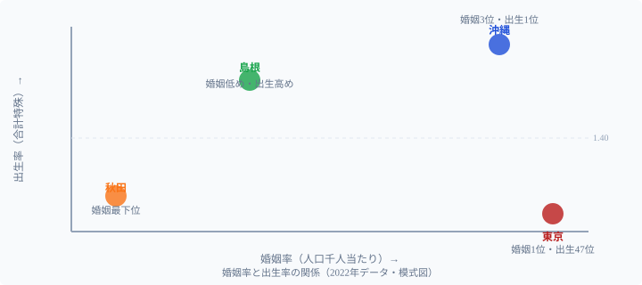

「少子化の原因は未婚化・晩婚化」とよく言われます。ですが47都道府県のデータを見ると、その関係はシンプルではありません。

**東京都は婚姻率1位（5.36）なのに合計特殊出生率は47位（1.04）**。対照的に**沖縄県は婚姻率3位で出生率1位（1.70）**。同じ「婚姻が多い」地域なのに出生率が真逆になる。「結婚が多い＝子どもが多い」という等式は、日本では成り立っていません。

また、生涯未婚率が男性3割に迫る時代に、**秋田県の未婚率は全国最低（22.8%）**です。これは「秋田は結婚が多い」ことを意味するのか、それとも別の構造があるのか。

婚姻率・未婚率・平均初婚年齢・合計特殊出生率の4指標を組み合わせて、地域ごとに異なる婚姻の実態を読み解きます。

## 婚姻率ランキング──「結婚が多い県」「少ない県」

<data-source url="https://www.e-stat.go.jp/" label="e-Stat 人口動態統計"></data-source>

**婚姻率1位は東京都**（5.36、人口千人当たり）。2位大阪府（4.60）を大きく引き離し、3位に愛知県と沖縄県が同率（4.46）で並び、上位には大都市を抱える府県が集中しています。

**最下位は秋田県**（2.63）。岩手県（2.97）、青森県（3.04）と東北勢が下位を占め、トップの東京と秋田では約2倍の差があります。

上位に都市部が集中する理由は**若年人口の集中**にあります。結婚適齢期の20〜30代が東京・大阪・愛知に流入することで婚姻件数が押し上げられます。逆に若者の流出が続く東北地方では、そもそも「結婚する世代」が減っています。

<source-link href="/ranking/marriages-per-total-population">婚姻率ランキング全47県</source-link>

## 未婚率マップ──「秋田の未婚率最低」が意味すること

15歳以上人口に占める未婚者の割合を見ると、**東京都が32.7%で全国最高**。続いて沖縄県31.5%、神奈川県29.4%、京都府29.3%、大阪府29.2%の順です。

注目すべきは**沖縄の2位**です。沖縄は婚姻率3位と「結婚する人は多い」にもかかわらず、未婚率も高い。これは10〜20代前半の若年未婚者が多いことと、事実婚・離婚後の再婚が多い独特の家族形成パターンが背景にあります。

一方、未婚率が最も低いのは**秋田県（22.8%）**ですが、これは注意が必要です。

> [!WARNING]
> 秋田の未婚率22.8%（全国最低）を「秋田は結婚しやすい県」と解釈するのは誤りです。秋田は高齢化が全国最速で進んでおり、**既婚の高齢者が人口に占める割合が大きいため未婚率が下がっている**だけです。婚姻率は全国最下位（2.63）であり、「結婚が多い」わけではありません。同じ「未婚率が低い」でも、構造的背景は「若者が結婚している」か「高齢者が人口の多数を占めている」かで全く異なります。

## 東京は婚姻率1位なのに出生率47位の理由

婚姻率と合計特殊出生率を散布図で見ると、**両者の相関は弱い**ことがわかります。特に東京の逆説が鮮明です。

**東京は婚姻率1位だが出生率は47位（1.04）**。若者が集まり結婚は多く「起きている」ものの、高い生活コスト・長時間労働・待機児童問題などが出産のハードルとなり、結婚しても子どもを持たない（または持てない）夫婦が多い構造があります。

対照的に**沖縄は婚姻率3位で出生率1位（1.70）**。地域コミュニティの子育て支援、親族ネットワークの厚さ、文化的に子どもを歓迎する風土が、結婚から出産への移行を後押ししています。

散布図の**右下（婚姻率が高いのに出生率が低い）**に位置するのが東京・大阪・神奈川。**左上（婚姻率は低いが出生率は高め）**には島根・鳥取などがあり、結婚した夫婦は多くの子どもを持つ「少婚多産」型の地域です。

<source-link href="/ranking/crude-birth-rate">出生率ランキング全47県</source-link>

## 初婚年齢ランキング──晩婚化の「震源地」はどこか

平均初婚年齢（妻）のランキングでは、**東京都の30.7歳が最も高く**、初めて30歳を超えた唯一の都道府県です。神奈川県（30.2歳）、京都府（30.0歳）と大都市圏で晩婚が進行しています。

**最も若いのは山口県（28.7歳）**。岡山県と香川県が28.9歳で続きます。東京と山口では**2歳の差**があります。わずか2歳と思うかもしれませんが、初婚年齢の1歳の差は出産可能期間の短縮に直結し、出生率に大きな影響を与えます。

> [!TIP]
> 平均初婚年齢は「その年に結婚した人の年齢の平均」であり、結婚しない人は含まれません。「初婚年齢が若い＝結婚しやすい地域」とは必ずしも言えず、そもそも晩婚の選択をした人は統計に含まれないことに注意が必要です。

九州の各県は初婚年齢が比較的若く（29歳前後）、出生率も高い傾向があります。佐賀（29.0歳・出生率1.53）、宮崎（29.2歳・出生率1.63）は早めの結婚と高い出生率が両立しています。

> [!NOTE]
> 初婚年齢が若い上位県（山口・岡山・香川など）が必ずしも出生率上位ではない点にも注意が必要です。早く結婚しても、経済的な事情や地域の産業構造が出産を左右するため、「早婚＝多産」とは限りません。結婚のタイミングと出産数は別の要因によって決まります。

<source-link href="/ranking/average-age-of-first-marriage-wife">平均初婚年齢（妻）ランキング</source-link>

## 「結婚しやすい県」の4タイプ

4指標を組み合わせると、都道府県は大きく4つのタイプに分類できます。

**都市集中型（東京・大阪・愛知）**: 婚姻率は高いですが晩婚で出生率が低い県です。若者が集まるため婚姻件数は多いものの、生活コストの高さが出産を抑制します。東京は婚姻率1位・出生率47位という両極端です。

**地方バランス型（沖縄・宮崎・佐賀・島根）**: 婚姻率は中位以上で出生率も高い県です。初婚年齢が比較的若く、地域コミュニティの子育て支援が厚いのが特徴です。「結婚しやすく、産みやすい」環境が整っています。

**過疎化進行型（秋田・岩手・青森・山形）**: 婚姻率・出生率ともに低い県です。若年人口の流出で「結婚相手がいない」構造的問題を抱えています。未婚率が低く見えるのは高齢者比率が高いだけで、「婚姻率最下位」という現実が示す通り深刻な状況です。

**ベッドタウン型（埼玉・千葉・神奈川）**: 婚姻率・出生率ともに中位ですが晩婚傾向が強い県です。東京への通勤圏として若い世帯が流入しますが、住宅費や通勤時間が出産の障壁となっています。

## まとめ

4指標から見えた構造的発見：

1. **東京の逆説**: 婚姻率1位（5.36）なのに出生率47位（1.04）──結婚はするが子どもを持てない都市構造（[東京都のプロフィール](/areas/13000)）
2. **沖縄の一貫性**: 婚姻率3位・出生率1位（1.70）──コミュニティと文化が結婚から出産への移行を支援（[沖縄県のプロフィール](/areas/47000)）
3. **秋田の誤読**: 未婚率最低（22.8%）は「結婚が多い」のではなく「高齢者が多い」から──婚姻率は全国最下位（[秋田県のプロフィール](/areas/05000)）
4. **相関の弱さ**: 婚姻率が高くても出生率が高くなるとは限らない──「結婚政策＝少子化対策」は過度な単純化

少子化対策を考える際、「婚姻率を上げれば出生率が上がる」という単純な等式は成り立ちません。東京の逆説が示すように、**結婚後に子どもを産み育てられる環境**（生活コスト・育児支援・働き方）の整備が、婚姻率と同等かそれ以上に重要です。生活コストとの関係は[物価が最も高い県、安い県](/blog/price-index-high-low-prefecture)、人口動態の全体像は[人口カテゴリのランキング一覧](/category/population)も合わせて読むと、婚姻・出産を取り巻く構造が立体的に見えてきます。

## データ出典

- 厚生労働省「人口動態統計」(婚姻率・初婚年齢：2022年度)
- 総務省「国勢調査」(未婚率：2020年)
- [e-Stat 政府統計の総合窓口](https://www.e-stat.go.jp/)
