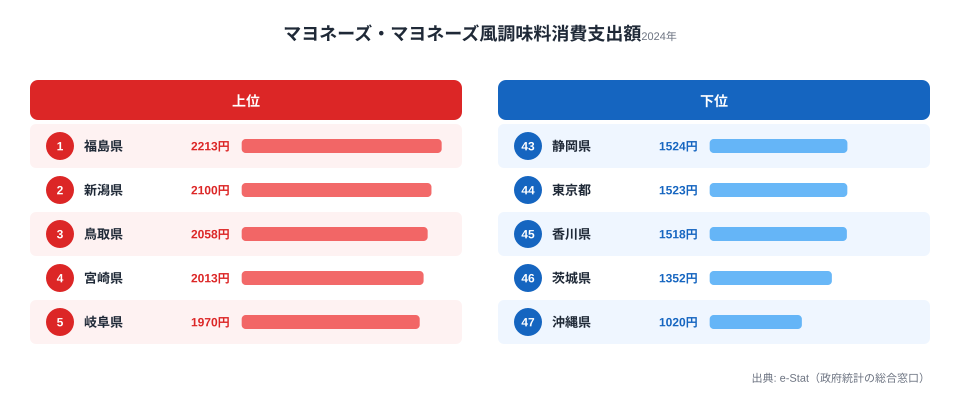

「マヨラー」という言葉があります。マヨネーズを何にでもかけずにはいられない人を指す俗語です。では「マヨラー県」となると、どこを思い浮かべるでしょうか。脂っこい料理のイメージから大阪あたりを連想する人もいれば、外食の多そうな東京を挙げる人もいるかもしれません。

ところが実際のデータは、その直感をきれいに裏切ります。2024年の家計調査で見えてきたのは、東京・大阪・神奈川といった大都市がそろって下位に沈み、代わりに福島・新潟・鳥取といった東北や地方が上位を占めるという、意外な「マヨネーズの地図」でした。

身近な調味料ひとつの支出額が、なぜこれほど地域でばらつくのでしょうか。本記事では、総務省「家計調査」の数字をもとに、マヨネーズ支出が映し出す自炊文化の地域差を読み解いていきます。

## 全体像：上位と下位で見えてくる「都市 vs 地方」の構図

まず全体像をつかみましょう。マヨネーズ消費支出額がもっとも多いのは福島県の2,213円です。一方でもっとも少ないのは沖縄県の1,020円で、両者の差はおよそ2.2倍にのぼります。

注目すべきは、その分布の偏り方です。上位には東北・北陸・山陰・九州といった地方圏が並び、下位には東京都・神奈川県・埼玉県といった南関東の大都市が固まっています。「人口が多く、食にお金をかけていそうな都市部ほどマヨネーズ支出も多い」という素朴な予想は、まったく成り立っていません。

> [!NOTE]
> 本データは総務省統計局「家計調査」（2024年）。調査対象は各都道府県庁所在市の二人以上世帯における年間消費支出額（円）です。世帯あたりの「購入金額」であり、一人あたりの消費量ではない点に注意してください。

下のチャートで、上位・下位の顔ぶれを一覧で確認できます。

<source-link href="/ranking/mayonnaise-consumption-expenditure">マヨネーズ消費支出額ランキングの全47都道府県データを見る</source-link>

カテゴリ全体での位置づけが気になる人は、[家計・経済カテゴリの一覧](/category/economy)もあわせて眺めると、食品支出の地域差の傾向がつかみやすくなります。

## 上位グループ：福島・新潟・鳥取が映す「自炊が日常」の地域

上位を具体的に見てみましょう。1位は福島県の2,213円、2位は新潟県の2,100円、3位は鳥取県の2,058円と続きます。4位には宮崎県（2,013円）、5位には岐阜県（1,970円）が入り、6位の福岡県（1,969円）まで2,000円前後の高水準が並びます。

地域で見ると、東北・甲信越・山陰・九州・東海・北陸と、いわゆる地方圏が満遍なく顔を出しているのが特徴です。特定の地方だけが突出しているのではなく、「大都市圏以外」が広く上位を占めている、と捉えるのが正確でしょう。

7位には石川県（1,886円）が続き、上位は北陸まで広がります。トップに立った福島県のプロフィールは[福島県のエリアページ](/areas/07000)で確認できます。農業が盛んで自家野菜を使った料理が日常に根づいた地域では、サラダや和え物にマヨネーズを使う頻度が高く、それが支出額に反映されている可能性があります。

> [!TIP]
> マヨネーズ支出が高い地域は、納豆など他の「家庭の食卓に欠かせない食品」でも支出が高い傾向があります。あわせて[納豆消費支出ランキング](/ranking/natto-consumption-expenditure)を見比べると、自炊文化圏の輪郭がよりはっきりします。

## 大都市が下位に沈む構造：東京・大阪はどこにいるのか

では、大都市はどこにいるのでしょうか。東京都は44位（1,523円）、神奈川県は40位（1,599円）、埼玉県は41位（1,596円）と、南関東の三都県がそろって下位40番台に沈んでいます。大阪府も28位（1,741円）と、上位とは言い難い位置です。

ここに、マヨネーズ支出の地域差を生む最大の構造が見えてきます。外食・テイクアウト・中食（惣菜やコンビニ弁当）の比率が高い都市部では、家庭でサラダや料理を作る機会そのものが減ります。マヨネーズは「自宅の冷蔵庫に常備して使う調味料」であり、自炊が減ればその購入額も自然と下がるのです。

> [!WARNING]
> 同じ南関東でも、千葉県は31位（1,717円）と東京・神奈川・埼玉より一段高い位置にいます。都市部=低支出と単純に決めつけず、ベッドタウンの度合いや世帯構成の違いも考慮する必要があります。家計調査は県庁所在市が対象でサンプル数も限られるため、年による順位の変動にも注意してください。

下位の顔ぶれを並べると、その傾向はさらに鮮明になります。43位の静岡県（1,524円）、44位の東京都（1,523円）、45位の香川県（1,518円）、46位の茨城県（1,352円）と続き、最下位は沖縄県（1,020円）です。

最下位の沖縄県（1,020円）は、上位とは食文化そのものが異なります。沖縄料理はチャンプルーや煮物など、マヨネーズを使わない調理が中心で、調味料の構成が本土と大きく違います。これは「都市だから低い」のとは別の、独自の食文化に根ざした低支出だと考えられます。沖縄の暮らしの背景は[沖縄県のエリアページ](/areas/47000)からも垣間見えてきます。

<source-link href="/ranking/mayonnaise-consumption-expenditure">下位を含む全47都道府県のマヨネーズ消費支出額ランキングを見る</source-link>

## なぜ自炊文化で差が出るのか：マヨネーズという「家庭調味料」の宿命

ここまで見てきた構造を整理すると、マヨネーズ支出の地域差は「味の好み」よりも「調理スタイル」で説明できます。

第一に、マヨネーズは外食店で消費されても家計の「食料」支出には計上されにくい点です。レストランやテイクアウトで使われるマヨネーズは店側のコストであり、世帯の購入金額には現れません。ですから外食依存度の高い都市部ほど、家計上のマヨネーズ支出は低く出ます。

第二に、自炊が日常の地域では、サラダ・和え物・お好み焼き・たこ焼き・フライの付け合わせなど、マヨネーズの出番が圧倒的に多くなります。家庭で一から料理する頻度が高いほど、ボトル単位での購入が増え、支出額が積み上がっていきます。

> [!NOTE]
> 「[仮説]」として、上位の福島・新潟・鳥取に共通するのは農業就業率の高さと自家消費の文化です。ただし本データだけでは因果を断定できないため、自炊率や外食支出との相関は別データでの検証が必要です。

つまりマヨネーズ支出は、各家庭が「どれだけ自分の台所で料理をしているか」を映す、ささやかな鏡なのです。1位の福島と最下位の沖縄、その間に並ぶ45県の順位は、味覚ランキングというより「台所の稼働率ランキング」に近いと言えます。同じ調味料カテゴリの傾向は[家計・経済カテゴリ](/category/economy)からも追えます。

## データ出典

- 総務省「家計調査」（二人以上の世帯・品目別支出金額） 2024年（e-Stat 経由でデータ整備）

調査対象は各都道府県庁所在市の二人以上世帯で、値は年間消費支出額（円）です。家計調査はサンプル数が限られるため、単年の順位は変動しうる点にご留意ください。

## まとめ

- マヨネーズ消費支出の1位は福島県（2,213円）、最下位は沖縄県（1,020円）で、その差はおよそ2.2倍
- 上位は福島・新潟・鳥取・宮崎・岐阜・福岡など、東北や地方圏が広く占める
- 一方で東京都は44位、神奈川県40位、埼玉県41位と、南関東の大都市がそろって下位に沈む
- 背景にあるのは「味の好み」ではなく自炊か外食かという調理スタイルの違い
- マヨネーズ支出は各家庭の「台所の稼働率」を映す指標とも読める

関連する食文化データとして、[納豆消費支出ランキングの記事](/blog/natto-consumption-expenditure)もあわせて読むと、地域ごとの食卓の輪郭がより立体的に見えてきます。
