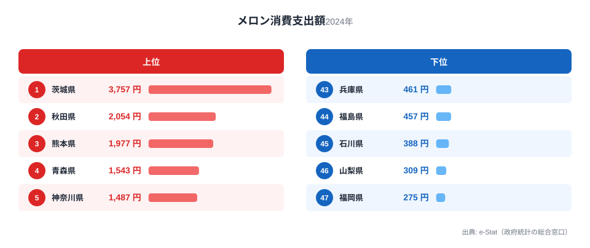
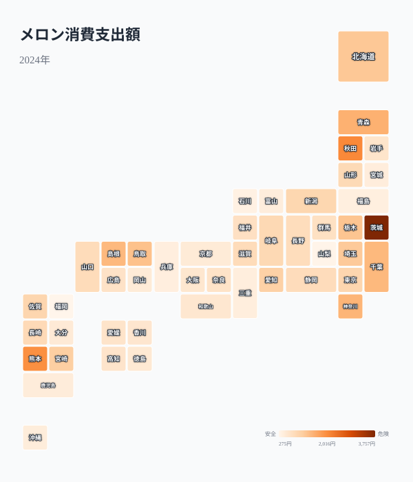

「メロンを一番食べているのはどこの県か」と聞かれたら、贈答文化が根付く都市部を思い浮かべる人が多いかもしれません。ですが総務省の家計調査（2024年、二人以上世帯・都道府県庁所在市)を見ると、答えは明快です。1位は茨城県で年間3,757円、最下位は福岡県で275円。その差は実に13.7倍にのぼります。

メロンは高級果実の代名詞として贈答用のイメージが強い一方、産地では日常的に食べられている果物でもあります。この記事では、消費額の全国分布から「産地=消費地」という単純な構図と、そこから外れる県の存在を確認していきます。

> [!NOTE]
> この統計は総務省「家計調査」の品目別支出金額（二人以上の世帯、都道府県庁所在市および政令指定都市が対象）です。県全体ではなく県庁所在市等の家計を代表値として扱う調査のため、県内の産地・消費実態と数値が完全に一致するとは限りません。

## メロン消費額トップ5とワースト5

<source-link href="/ranking/melon-consumption-expenditure">メロン消費支出額ランキングをもっと見る</source-link>

1位の[茨城県](/areas/08000)は3,757円で、全国平均を大きく上回ります。茨城県は農林水産省の統計でメロンの都道府県別収穫量が全国1位の「メロン王国」で、鉾田市を中心とした産地が県内に広く分布しています。産地であることがそのまま家計の消費支出に直結している典型例といえるでしょう。

2位は[秋田県](/areas/05000)（2,054円）、3位は[熊本県](/areas/43000)（1,977円）です。熊本県も肥後グリーンなどのブランドメロンで知られる主要産地であり、ここでも「産地=消費地」の構図が確認できます。一方で2位の秋田県は大きな産地というイメージが薄く、東北勢が青森県（4位・1,543円）も含めて上位に複数入っている点は、産地要因だけでは説明しきれない地域の食文化・嗜好の存在を示唆します。米どころとして知られる秋田県ですが、家計調査の他の果物・農産物品目でも消費支出が全国平均を上回る傾向が見られ、県民の食への支出配分に特徴があるとみられます。

下位を見ると、[福岡県](/areas/40000)（275円）、[山梨県](/areas/19000)（309円）、石川県（388円）が並びます。山梨県はぶどう・桃という看板果実を持つ産地であり、家計の果物予算がそちらに向きやすい可能性があります。福岡県は九州の中心都市でありながら最下位という結果は、後述する九州勢全体の傾向と重なります。

メロンのような嗜好性の高い果物の消費額は、家計全体の消費支出の水準や食への支出配分とも関わりが深いテーマです。都道府県別の[家計消費支出ランキング](/category/economy)を見ると、地域ごとの生活コストや消費構造の違いがより広く確認できます。

## 地図で見る全国分布

<source-link href="/ranking/melon-consumption-expenditure">メロン消費支出額ランキングをもっと見る</source-link>

地図で見ると、消費額の濃淡は東日本に偏っていることがわかります。茨城県を中心に、秋田県・青森県・神奈川県・千葉県といった東日本の県が濃い色で並ぶ一方、西日本は熊本県・島根県・鳥取県といった一部の産地県を除いて薄い色が目立ちます。単純な「東高西低」ではなく、産地県が点在する形で消費額を押し上げている構図が視覚的に確認できます。

## 産地と消費地はどこまで一致するか

メロンの主要産地としてよく名前が挙がるのは、茨城県（鉾田市など）、北海道（夕張市）、熊本県（肥後グリーン）です。このうち茨城（1位）と熊本（3位）は消費額でも上位に入っており、産地が家計消費を押し上げている構図が見えます。

対照的に、夕張メロンで全国的に知名度の高い[北海道](/areas/01000)は10位（1,231円）にとどまります。夕張メロンは高級贈答品としてのブランドが強く、地元での日常消費というより県外への出荷・贈答向けに重心があると考えられます。ブランド力の高さと地元消費量は必ずしも比例しないことが、このランキングから読み取れます。

> [!TIP]
> 「産地=消費地」という見立ては、生産量ランキングと消費額ランキングを重ねて初めて検証できます。茨城・熊本のように両方で上位に入る県がある一方、北海道のように生産では有名でも消費では中位にとどまる県もあり、ブランド果実は「作る場所」と「食べる場所」が分離しやすい典型です。

## 九州勢が軒並み下位に沈む理由

下位10県の地域分布を見ると、九州勢が福岡県・鹿児島県・大分県の3県を含み目立ちます。熊本県という有力産地を抱えながら、同じ九州の他県では消費額が伸びていません。これは県境を越えた地域の一体感よりも、各県の果物消費全体における嗜好の違い（九州は柑橘類やびわなど他の果物の産地・消費文化が強い地域が多い）が影響している可能性があります。

北陸勢（福井県24位、富山県40位、石川県45位）も総じて下位寄りです。北陸は米どころとして知られる一方、果物消費全体の支出額が他地域と比べて低い傾向が家計調査の他品目でも見られます。メロン単品の嗜好というより、地域の果物消費構造全体を反映した結果と考えるのが妥当でしょう。

> [!WARNING]
> 家計調査は都道府県庁所在市等の代表値であり、県内の農村部・産地近郊の消費実態を直接示すものではありません。茨城県の数値も「県庁所在地である水戸市の家計」を指しており、県全体の平均消費とは異なる可能性がある点に注意してください。

## まとめ

- 1位は茨城県3,757円、最下位は福岡県275円で13.7倍の開き
- 2位秋田県2,054円、3位熊本県1,977円で、いずれも産地または東北の果物消費が盛んな地域
- 生産量日本一の茨城・有力産地の熊本は消費額でも上位、「産地=消費地」の構図が一部で成立
- 夕張メロンで有名な北海道は10位にとどまり、ブランド産地と地元消費量は必ずしも一致しない
- 九州・北陸は熊本を除き軒並み下位で、地域全体の果物消費構造の違いが背景にあるとみられる

## データ出典

総務省統計局「家計調査」（2024年、二人以上の世帯、品目別支出金額）を基に、政府統計の総合窓口（e-Stat）経由で集計。
