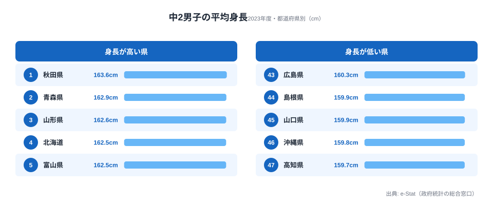

「同じ14歳なのに、住む県によって平均身長が数cmも違う」──そう聞くと、何かの間違いではと思うかもしれません。けれど2023年度の学校保健統計調査が示す中学2年男子の平均身長を並べると、はっきりとした地域差が浮かび上がります。

全国平均は161.06cm。ところが1位の秋田県は163.6cm、最下位の高知県は159.7cm。その差は3.9cmにのぼります。1cmや2cmではなく、クラスに並んだときに目で見て分かる開きです。

さらに不思議なのは、上位がきれいに「北日本」へ偏っていること。なぜ北へ行くほど背が高くなるのか。この記事では、ランキングの全体像を確認したうえで、その「東西の謎」を栄養・遺伝・気候の3つの仮説から読み解きます。

> [!NOTE]
> データは文部科学省「学校保健統計調査」(2023年度) の都道府県別・中学2年男子の平均身長。e-Stat 経由で整備した値を使用しています。学校での測定値を集計したもので、対象は公立を中心とした抽出標本です。

## 全体像:全国平均161.06cm、上下で3.9cmの開き

まず全体を俯瞰します。中学2年男子の平均身長は、最も高い秋田県(163.6cm)から最も低い高知県(159.7cm)まで分布し、その幅は3.9cmです。

上位を見ると、秋田・青森・山形という北東北3県が並び、そこへ北海道・富山(ともに162.5cm)、新潟(162.3cm)と、日本海側・北日本の県が続きます。一方で下位には高知・沖縄・山口・島根といった西日本・南国の県が集まります。

全国の中央付近(160〜161cm前後)には関東や近畿の大都市県が密集します。東京は161.4cm、大阪・福岡は161.0cm、愛知は160.3cm。人口が多く栄養環境も整っているはずの大都市が、必ずしも上位に来ていない点が最初の意外なポイントです。

<source-link href="/ranking/average-height-middle-school-second-grade-male">中学2年男子 平均身長ランキングの全47県を見る</source-link>

## 東北が上位・南国が下位:地図に重なる地域パターン

冒頭で触れた通り、上位は北東北（秋田163.6cm・青森162.9cm・山形162.6cm）と北海道・富山（ともに162.5cm）・新潟（162.3cm）が占め、下位には島根159.9cm・山口159.9cm・沖縄159.8cm・高知159.7cmと西日本・南国が並びます。「北で高く、南西で低い」という南北・東西の勾配が、平均身長という意外な指標に現れているのです。

> [!TIP]
> 同じ「身長の地域差」は子ども全体でも観測されています。年齢帯をまたいだ傾向は別記事で詳しく扱っているので、あわせて確認すると地域パターンの一貫性が見えてきます。

<source-link href="/ranking/average-height-middle-school-second-grade-male">上位・下位を含む都道府県別ランキングを開く</source-link>

関連して、子どもの身長の地域差を年齢横断で見た [子どもの身長の地域差](/blog/child-height-regional-gap) や、[男女別の身長差](/blog/prefectural-height-male-female-gap) も参考になります。

## なぜ東北が高いのか:栄養・遺伝・気候の3仮説

では、なぜ北日本が一貫して高いのでしょうか。身長は単一の要因では決まりませんが、よく挙げられる説明を3つ整理します。いずれも確定した因果ではなく、検証が必要な仮説です。

**[仮説1] 栄養・食習慣** 北日本・日本海側はコメや魚介、乳製品の摂取が比較的多いとされ、成長期のたんぱく質・カルシウム供給が身長に効くという見方があります。ただし大都市も栄養環境は整っており、東京(161.4cm)が中位にとどまる点は単純な「栄養が良い=高い」では説明しきれません。

**[仮説2] 遺伝・集団的背景** 地域ごとの遺伝的背景の違いが平均身長に反映されている可能性も指摘されます。秋田・青森が長年上位に位置する安定性は、短期の生活習慣だけでは説明しにくく、遺伝的要因を示唆する材料とされます。一方で、遺伝だけでは戦後の全国的な身長の伸びは説明できません。

**[仮説3] 気候・体格適応** 寒冷地ほど体格が大きくなりやすいという生態学的な傾向(ベルクマンの法則に類する考え方)を当てはめる見方もあります。北日本が高く南国の沖縄・高知が低い南北勾配は、この説と整合的に見えます。ただし都市化や生活様式の影響を分離できておらず、相関を因果と取り違えないよう注意が必要です。

> [!WARNING]
> 上の3説はいずれも仮説であり、本ランキングのデータだけでは因果を断定できません。**検証には、世帯所得・食事調査・縦断的な成長データとの突き合わせが必要**です。「東北の子は背が高い体質」といった一般化や、3.9cmという平均差を個人の優劣に結びつける読み方は避けてください。

**[暫定結論] 3仮説のうち、現時点で証拠と最も整合するのは「遺伝・集団的背景（仮説2）」と「気候・体格適応（仮説3）」の組み合わせです。** 秋田・青森が複数年にわたり安定して上位を保つ長期的な傾向は、短期の食習慣変化だけでは説明しにくいものです。ベルクマン則に類する気候要因も南北勾配と整合します。一方、栄養（仮説1）は東京が中位にとどまる点で説明力が弱いといえます。もっとも、三仮説を実証的に検証するには「都道府県別の食事調査データと身長の相関」「同一家系の転居前後の追跡データ」が必要であり、現データでは断定できません。次に見るべきデータとして、[子どもの身長の地域差](/blog/child-height-regional-gap)での年齢横断データが参考になります。

身長の背景にある所得・生活環境を考えるうえでは、[教育・スポーツ分野のデータ一覧](/category/educationsports)や、上位の[秋田県のプロフィール](/areas/05000)・下位の[高知県のプロフィール](/areas/39000)を合わせて見ると、地域差を多面的に捉えられます。

## 差は何cmか:3.9cmをどう受け止めるか

最後に、この「3.9cm」という差の大きさをどう解釈すべきかを確認します。

1位の秋田(163.6cm)と最下位の高知(159.7cm)の差は3.9cm。これは集団の**平均値**の差であって、個人差はこれよりはるかに大きいことを忘れてはいけません。どの県にも背の高い子も低い子もおり、平均が3.9cm違うことは「高知の中学生は秋田より背が低い」を意味しません。

それでも、47都道府県という大きな集団の平均がここまで規則的に北高・南低へ並ぶこと自体は、偶然では片づけにくい現象です。平均という鈍い指標にすら地域構造が刻まれている、という点に注目する価値があります。

> [!NOTE]
> 全国平均は161.06cm。上位県と下位県は、この全国平均からそれぞれ±2cm前後の範囲に収まっています。突出した外れ値があるわけではなく、なだらかな勾配として地域差が現れているのが特徴です。

## まとめ:北高・南低の勾配が示すもの

- **1位は秋田の163.6cm**、青森162.9cm・山形162.6cmと北東北が上位を独占。
- **最下位は高知の159.7cm**、沖縄159.8cm・山口159.9cmと西日本・南国が下位に集中。
- 上下の差は**3.9cm**、全国平均は161.06cm。突出値ではなく北高・南低のなだらかな勾配。
- 東京161.4cm・大阪161.0cmなど**大都市は中位**で、「栄養が良い=高い」では説明しきれません。
- 3仮説のうち現時点で最も整合するのは**遺伝・集団的背景と気候適応の組み合わせ**です。栄養単独では東京が中位にとどまる点が説明しにくく、平均差を個人の優劣に結びつけない読み方が重要です。

## データ出典

- 文部科学省「学校保健統計調査」(2023年度) — 都道府県別・中学2年男子の平均身長
- e-Stat (政府統計の総合窓口) 経由で整備。出典の二次利用は CC BY 4.0 に準拠
