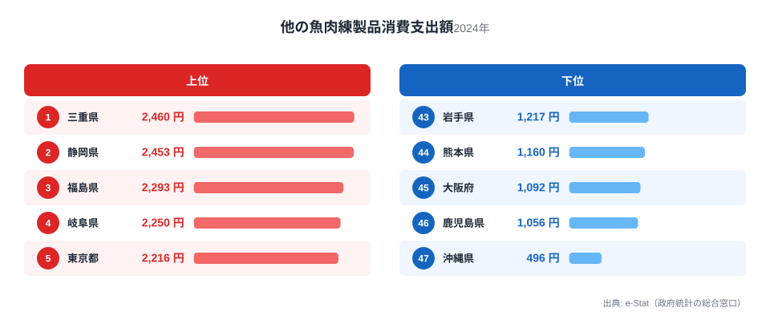
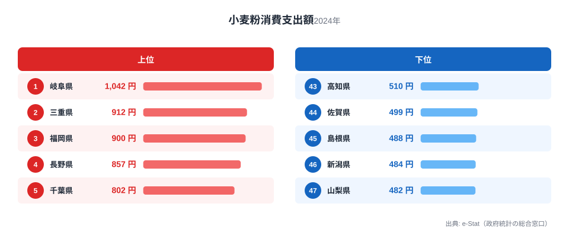
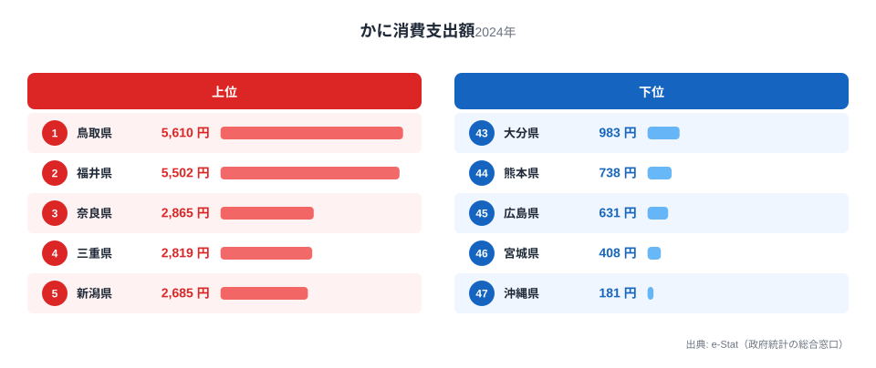
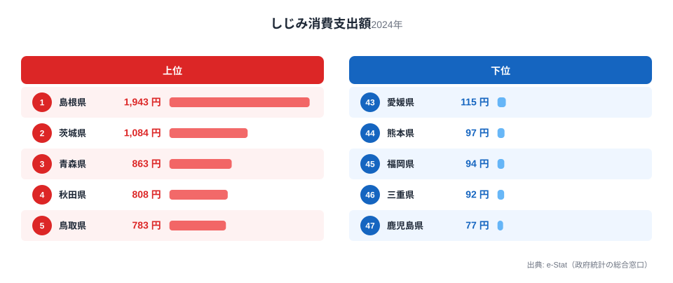
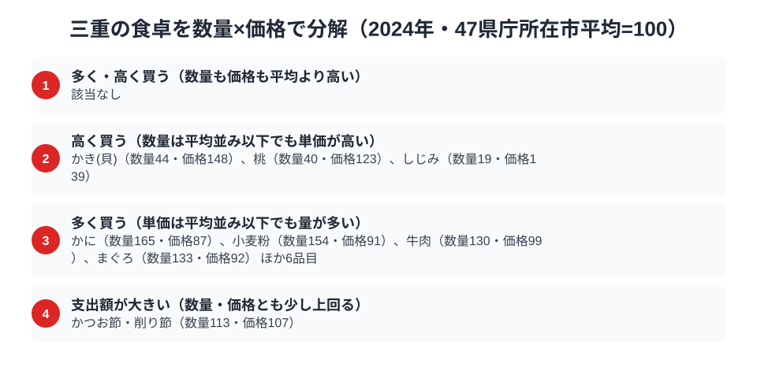

[三重県の地域プロフィール](/areas/24000)を数字で覗くと、海の幸を練り込んだ加工品と、うどん文化を支える粉ものが際立って浮かび上がります。総務省「家計調査」の品目別支出データによると、三重県庁所在市（津市）の二人以上世帯は他の魚肉練製品（ちくわ・はんぺんなど）の消費支出額で全国1位を記録し、小麦粉も全国2位、かにも4位という結果でした。家計消費のデータは[経済カテゴリ一覧](/category/economy)からも横断的に確認できます。

一方で、同じ貝でも「しじみ」の消費支出額は46位とほぼ最下位に沈みます。海に面し漁業が盛んな県でありながら、なぜ淡水の貝だけがこれほど支出されないのでしょうか。この記事では4つの品目データから三重の食卓の輪郭を描き、海と粉が交差する食文化の理由を探ります。

> [!NOTE]
> 本記事のデータは総務省「家計調査（品目別支出額）」2024年、都道府県庁所在市（三重県は津市）における二人以上世帯の1世帯あたり年間支出額です。全国順位は47都道府県庁所在市の比較によるものであり、県内他地域の消費実態とは異なる場合があります。

## 他の魚肉練製品 — 全国1位2,460円、伊勢志摩の練り物文化

<source-link href="/ranking/other-fish-paste-consumption-expenditure">他の魚肉練製品消費支出額ランキングをもっと見る</source-link>

三重県は他の魚肉練製品（ちくわ・はんぺん・さつま揚げなど、かまぼこ以外の練り製品を指す品目）の消費支出額で全国1位、2,460円を記録しました。2位の静岡県は2,453円で、三重とのわずか7円差は事実上の首位争いです。3位の福島県は2,293円、4位の岐阜県は2,250円と続き、いずれも沿岸部から内陸まで幅広い県が並びます。

三重が上位に来る背景には、伊勢志摩沿岸の練り物文化があります。松阪市や伊勢市周辺では地元の漁港で水揚げされたエソやグチなどの白身魚をすり身にした練り製品が日常的に食卓に上る土地柄で、スーパーの練り物コーナーの品揃えも豊富です。おでんや煮物の具材として通年で消費される点も、支出額を押し上げる要因と考えられます。最下位の沖縄県は496円で、三重との開きは約5.0倍でした。

## 小麦粉 — 全国2位912円、伊勢うどんを支える粉文化

<source-link href="/ranking/wheat-flour-consumption-expenditure">小麦粉消費支出額ランキングをもっと見る</source-link>

小麦粉の消費支出額でも三重県は912円で全国2位につけました。1位は隣県の岐阜県で1,042円、3位の福岡県は900円、4位の長野県は857円と続きます。三重・岐阜という中部圏の隣接県が上位を占める形です。

三重には郷土料理「伊勢うどん」があり、極太麺を柔らかく茹でてたまり醤油ベースのタレで食べる独自のうどん文化が根付いています。家庭で麺を打つ習慣や、粉物の惣菜・お好み焼き類を作る頻度が高い地域性が、小麦粉の家庭消費を押し上げている可能性があります。最下位の山梨県は482円で、三重との差は約1.9倍にとどまり、他の食品ほど格差は大きくありませんが、粉文化圏としての三重の輪郭がうかがえます。

## かに — 全国4位2,819円、鳥取・福井には及ばず

<source-link href="/ranking/crab-consumption-expenditure">かに消費支出額ランキングをもっと見る</source-link>

かにの消費支出額は三重県が2,819円で全国4位でした。上位は日本海側のズワイガニ産地が独占しており、1位の鳥取県は5,610円、2位の福井県は5,502円と、三重の2倍近い支出額を記録しています。3位の奈良県は2,865円で、三重とのわずか46円差でした。

三重は鳥取・福井のような日本海側のブランドがに産地ではありませんが、志摩半島の答志島などで水揚げされる地がになど、太平洋側でもかに食文化は根付いています。上位2県が突出する一方、三重・奈良を含む3位以下は僅差の混戦で、地域ブランドの強さがそのまま支出額の差になっている構図が見えます。最下位の沖縄県は181円で、鳥取との格差は31.0倍でした。

## しじみ — 46位92円、海の県が淡水の貝で沈む理由

<source-link href="/ranking/freshwater-clam-consumption-expenditure">しじみ消費支出額ランキングをもっと見る</source-link>

海産物では上位に立つ三重県ですが、しじみの消費支出額は92円で46位とほぼ最下位です。1位は宍道湖のしじみ漁で知られる島根県で1,943円、三重の約21.1倍にのぼります。2位の茨城県は1,084円、3位の青森県は863円と、いずれも汽水湖や大河川の産地が上位を占めています。

しじみは宍道湖（島根）、涸沼（茨城）、十三湖（青森）のように特定の汽水湖・河口域に漁場が集中する食材です。三重県内には伊勢湾や英虞湾など内湾はあるものの、しじみ漁が地場産業として定着した大規模な産地がありません。三重の食卓が「伊勢志摩の海の幸」に強く寄っているのは事実ですが、それは外洋・内湾の魚介類が中心であり、汽水域特有の貝類文化とは別の系統にあることが、この最下位という結果から読み取れます。

> [!WARNING]
> ここで扱う数値は消費「支出額」であり、消費「量」ではありません。地元で自家消費・贈答される練り製品やかにが多い場合、支出額には反映されず実際の食文化の厚みが過小評価されている可能性があります。また、個別の品目として集計されない伊勢うどんや松阪牛は、本記事の家計調査品目には含まれていません。

## 三重の食卓を貫くもの

三重の4品目を並べると、1つの軸が浮かび上がります。それは「海の恵みを加工して日常に取り込む力」と「粉もの文化の強さ」という2つの顔です。他の魚肉練製品とかにが示すのは、伊勢志摩沿岸で獲れる魚介を練り物や鍋物として食卓に頻繁に取り入れる習慣です。一方で小麦粉の高順位は、伊勢うどんに代表される粉食文化の存在を裏付けています。

同じ「食卓を貫く軸」を持つ県として、[鳥取の食卓](/blog/tottori-food-culture)はかに・梨がいずれも全国上位という単一産地の強さで貫かれており、三重の「海の加工品＋粉もの」という二重の軸とは対照的です。また[小麦粉の消費量の地図](/blog/wheat-flour-consumption-food-culture-gap)では、うどん県のイメージだけでは説明できない粉文化圏の広がりが指摘されており、三重もその一角を占めています。

しじみだけが際立って低いのは、この2つの軸のどちらにも当てはまらない食材だからです。海産の加工品でも粉ものでもない汽水域の食材は、三重の食文化の外側に位置していると考えられます。

> [!TIP]
> 三重のように「海の幸」と「粉もの」という異なる系統の品目が両方上位に来る県は珍しく、単一の名産（かに・りんごなど）に依存する県より食文化の幅が広いと読めます。1つの県を見るときは、上位品目が同じ系統（魚介・農産物・粉物など）に偏っているか、複数系統にまたがっているかを確認すると、その土地の食生活の多様性が見えてきます。

## 数量×価格で分解する津市の食卓 — 「多く買う」と「高く買う」は別物

<source-link href="/ranking/beef-consumption-quantity">牛肉消費量ランキングをもっと見る</source-link>

ここまでの4品目は支出額の順位で語ってきましたが、支出額だけを見ていると、その県が「たくさん買っている」のか「一つひとつを高く買っている」のかを区別できません。家計調査には品目ごとに数量のデータもあり、支出額を数量で割れば単価にあたる価格指数が出ます。47県庁所在市の平均をどちらも100とすると、三重が支出額で上位に来た品目の多くは、価格指数よりも数量指数のほうがはるかに高い「多く買う」タイプでした。かには数量指数165・価格指数87、小麦粉は数量154・価格91で、いずれも先に見た支出額の順位を押し上げているのは単価の高さではなく購入量の多さです。先に見た小麦粉の全国2位も、伊勢うどんの粉もの文化を裏付ける一方で、その中身は割高な小麦粉を選んでいるのではなく、単純に消費量が多いことで説明できます。牛肉消費量は数量指数130・価格指数99、まぐろは数量133・価格92、ぶりは数量131・価格93と同じ並びで、三重は魚介・肉・粉のいずれも単価が特別高いわけではなく、よく食べる県だと読み解けます。

一方で、数量は平均以下なのに価格指数だけが高い「高く買う」タイプの品目もあります。かき（貝）は数量指数44と少ないのに価格指数148、桃は数量40・価格123、そしてしじみは数量19・価格139でした。数量が少ないのに単価だけが高いという組み合わせは、その地域でまとまった量が手に入りにくい食材を、購入する際には割高な品種やブランド品で補っている可能性を示します。しじみが46位という最下位級の支出額に沈んでいたのは単に消費量が少ないからですが、それだけでなく数量指数以上に価格指数が高いことも見逃せません。先に「汽水域特有の貝類文化とは別の系統にある」と読んだしじみの弱さは、量と価格の両面から二重に説明できるわけです。三重の家庭は、希少な淡水の貝を少量ながら割高な価格で買っている構図が浮かび上がり、他の海産物のように地元産で量をまかなえる品目とは対照的な位置づけにあります。

かつお節・削り節は数量指数113・価格指数107とどちらも小幅に平均を上回り、支出指数は120.5と「支出額が大きい」タイプに分類されます。数量か価格のどちらか一方だけが突出するのではなく、両方が少しずつ平均を上回った結果として支出額の順位が押し上げられている品目です。かつお節はだしを取る調味料として和食全般に日常的に使われるため、極端に量を消費するわけでも極端に高いものを選ぶわけでもなく、日々の積み重ねが支出額に表れていると考えられます。三重で目立って支出額が大きい品目のうち、この「支出額大」タイプに当てはまるのはかつお節・削り節だけで、他の大半は「多く買う」に分類されました。三重の食卓を数量と価格に分解すると、海の幸や粉ものは買う量の多さが支出を押し上げ、しじみのような希少品は量は少なくても単価の高さが順位を作っていることが見えてきます。同じ支出額の高さでも、品目ごとに成り立ちがまったく違うのです。

> [!TIP]
> 支出額の順位だけを見ていると、その県が「たくさん食べている」のか「高いものを買っている」のかが分かりません。かにや小麦粉のように支出額と数量指数がそろって高い品目は「量で稼ぐ」タイプ、しじみやかき（貝）のように数量指数は平均以下でも価格指数だけが高い品目は「単価で押し上げる」タイプです。ある県の食文化を読むときは、支出額の順位表だけでなく、数量と価格のどちらが効いているのかを確かめると、見え方が変わってきます。

> [!NOTE]
> ここでの指数は家計調査の全国値ではなく、47都道府県庁所在市の単純平均を100とした相対値です。また価格指数は「支出額÷数量」から算出した実勢の購入単価の比較であり、同じ品目でも買っている品種やブランドの違いが反映されるため、純粋な物価水準の差とは限りません。数値は二人以上世帯・津市（三重県庁所在市）の年間値に基づきます。

## まとめ

- 他の魚肉練製品は全国1位2,460円。2位の静岡県は2,453円で僅差の首位
- 小麦粉は全国2位912円。1位の隣県・岐阜県は1,042円で中部圏の粉食文化圏を形成
- かには全国4位2,819円。1位の鳥取県5,610円・2位の福井県5,502円という日本海側ブランド産地には及ばず
- しじみは46位92円。1位の島根県1,943円の約21.1倍差で、汽水湖産地を持たない三重の弱点が浮き彫りに

## データ出典

総務省統計局「家計調査（品目別）」2024年、都道府県庁所在市（三重県：津市）二人以上世帯の1世帯あたり年間支出額。e-Stat（政府統計の総合窓口）経由で取得したデータをもとに集計しています。
