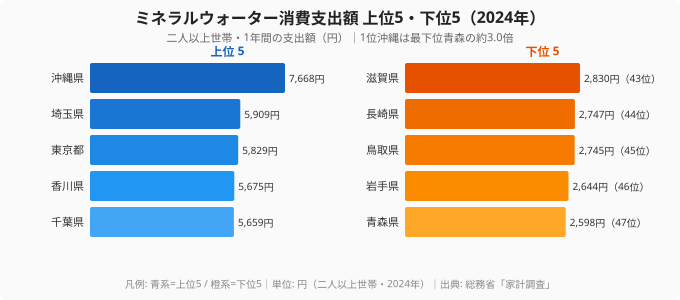

「水道水をそのまま飲むか、ペットボトルの水を買うか」——この日常の小さな選択は、住んでいる県によって大きく違います。2024年の家計調査によると、二人以上世帯が1年間に使うミネラルウォーター消費支出額は、トップの沖縄県で**7,668円**、最下位の青森県で**2,598円**でした。その差は**約3.0倍（正確には2.95倍）**にのぼります。

「西日本が多いのでは?」と問われそうなテーマですが、データを開けてみると話はそう単純ではありません。確かに沖縄・香川・徳島・宮崎といった西日本・南九州の県が上位に並びます。ですが、それと交互に**埼玉・東京・千葉・栃木という関東ベルトが上位を占めている**のです。逆に下位は東北（青森・岩手・秋田）と山陰（鳥取・島根）に固まっています。つまり「東西」ではなく、「水へのお金の使い方」を分ける別の構造が隠れています。家計の費目としては小さくても、その背景は[消費者物価地域差指数](https://stats47.jp/ranking/consumer-price-regional-difference-index)のような地域の生活コストとも無関係ではありません。

この記事では、47都道府県のミネラルウォーター支出を上位・下位の両面から並べ、どんな地域パターンが見えるのかを読み解いていきます。家計のなかでは小さな費目ですが、気候・水質・都市化という地域の性格が凝縮されており、自分の県の「水との付き合い方」を映す鏡になります。

> [!NOTE]
> このランキングは総務省「家計調査」をもとにした、都道府県庁所在市の二人以上世帯における1年間（2024年）のミネラルウォーター消費支出額（円）です。世帯あたりの金額であり、1人あたりの額や飲用量そのものではありません。世帯人数や単価の差も金額に含まれるため、「飲んでいる量の順位」と読み替えないよう注意してください。

## ミネラルウォーター支出が多い県と少ない県（上位5・下位5）

まず上位5県と下位5県を1枚の図で見比べてみましょう。左のカードが支出の多い上位5県、右のカードが少ない下位5県です。

突出しているのが沖縄県です。7,668円は2位の埼玉県（5,909円）よりも約1,759円多く、ほかの県とは頭ひとつ抜けた水準にあります。亜熱帯の気候で水分補給の需要が大きいこと、そして硬度の高い地下水が多く「飲み水は買うもの」という習慣が根づいていることが背景にあると考えられます。離島では水の確保にコストがかかる事情も重なります。

一方で目を引くのが、上位の顔ぶれに埼玉・東京・千葉・栃木という関東勢が並んでいる点です。**人口が多く可処分所得も高い大都市圏では、宅配水やペットボトルの常備が広がりやすい**ためでしょう。可処分所得や生活余力の地域差は[1世帯あたり貯蓄額](https://stats47.jp/ranking/household-savings-amount)などにも表れます。香川（4位）・徳島（7位）といった四国勢が混じることも含め、上位は「暑い・水を買う地域」と「都市圏で買い置きする地域」という、性質の異なる2つのグループが同居しています。

対する下位5県は、最下位の青森県（2,598円）・岩手県（2,644円）という東北勢に、山陰の鳥取県（2,745円・45位）、九州の長崎県（2,747円・44位）、そして近畿の滋賀県（2,830円・43位）が並びます。東北・山陰だけでなく、九州や近畿の県も最下位ゾーンに混じっている点が目を引きます。左右のカードに並ぶバーの長さの差が、そのまま「水にお金を使う県」と「使わない県」の落差を表しています。地域ごとの偏りについては、次の章で構造的に掘り下げます。

<source-link href="/ranking/mineral-water-consumption-expenditure">ミネラルウォーター消費支出額ランキングをもっと見る</source-link>

## 下位グループに東北・山陰が集まる理由

下位ゾーンをもう少し広げて見ると、偏りはさらに明確になります。最下位の青森（47位）・岩手（46位）に加えて、秋田県も40位（3,132円）と、**東北勢が軒並み下位に沈んでいます**。さらに鳥取（45位）・島根（42位）の山陰がそこに重なります。寒冷地で夏の暑さによる需要が小さいうえ、白神山地や中国山地の伏流水など、蛇口やくみ置きの水で十分にまかなえる環境が広がる地域です。

ここで効いてくるのが「水に困っていない」という逆説です。支出が少ないことは「水が手に入りにくい」のではなく、むしろ「買わなくても良質な水がある」裏返しと読めます。水道水のおいしさが地域差として語られることの多い東北・山陰が下位に並ぶのは、この見立てと整合します。支出の少なさをそのまま「水を飲まない」「節約志向」とだけ受け取ると、地域の実態を読み違えてしまいます。

> [!TIP]
> ランキングを「多い＝豊か / 少ない＝貧しい」と読むと外します。ミネラルウォーター支出が少ない県の多くは、地下水・湧水に恵まれ蛇口の水で足りる地域です。支出額は所得の多寡よりも、気候（暑さ）・水質・買い置き習慣の組み合わせを映していると考えて読むのが実態に近いといえます。

「西日本が多い」という見立てに対して、長崎県が44位という事実も示唆的です。九州でも長崎は最下位グループにいる一方、同じ南九州の宮崎は8位、沖縄は1位と上位に並びます。**九州・西日本の内部ですら大きく割れている**ことから、東西や地方ブロックだけでは説明しきれないことがわかります。地方を一括りにせず、県ごとの気候と水環境を見る必要があります。

<source-link href="/ranking/mineral-water-consumption-expenditure">最下位までの全47都道府県の順位を見る</source-link>

## 支出を押し上げる「暑さ」と「都市」の二重構造

上位・下位を並べて浮かび上がるのは、ミネラルウォーター支出を押し上げる要因が1つではないという構造です。整理すると、次の3点が見えてきます。

**沖縄の突出は別格です。** トップの沖縄7,668円は、2位の埼玉（5,909円）に約1.3倍の差をつけています。気候・水質・離島ゆえの飲料事情が重なり、ほかの県とは違う水準にあります。沖縄を1つの説明軸で語ることはできず、複数の要因が同時に働いている県だと考えられます。

**上位は「南国・四国」と「関東ベルト」の混成です。** 沖縄・香川（4位）・徳島（7位）・宮崎（8位）といった温暖な西日本〜四国勢と、埼玉（2位）・東京（3位）・千葉（5位）・栃木（6位）の関東勢が交互に並びます。前者は「暑さによる水分補給の需要」、後者は「都市圏の購買習慣と所得」という、異なる説明軸が同居していると考えられます。同じ高支出でも、その理由は地域によって違うのです。

**下位は東北・山陰にきれいに集中しています。** 青森（47位）・岩手（46位）・秋田（40位）の東北、鳥取（45位）・島根（42位）の山陰が最下位ゾーンを占めます。寒冷で水分補給の需要が比較的小さく、かつ水源に恵まれた地域が「買わない」選択に向かいやすい、という見方と整合します。

> [!WARNING]
> ここで挙げた「気候」「水質」「所得」「習慣」はあくまで **[仮説]** です。家計調査の支出額だけでは因果は特定できません。たとえば購入単価の差や、調査年ごとの変動（過去には2011年に埼玉県が7,920円まで跳ねた年もあります）も金額に影響します。確定的な原因とせず、傾向の読み解きとして受け取ってください。検証には飲用量や購入単価の別データとの突き合わせが必要です。

「なぜ西日本が多いのか?」という最初の問いに戻ると、より正確には**「暑い地域と大都市圏で多く、寒冷で水源豊かな地域で少ない」**といえます。東西の軸ではなく、気候と都市化の二重構造で見るのが実態に近いのです。あなたの県が上位・下位どちらにあっても、その背景には「暑さ」「水質」「買い置き習慣」のいずれかが効いていると読み解けます。

## まとめ

- **トップは沖縄県（7,668円）** で、2位の埼玉県（5,909円）を大きく引き離して突出しています。
- **最下位は青森県（2,598円）** で、トップとの差は**約3.0倍（2.95倍）**でした。
- 上位は沖縄・香川・徳島・宮崎などの温暖な西日本に、埼玉・東京・千葉・栃木の関東ベルトが混在しています。
- 下位は青森・岩手・秋田の東北、鳥取・島根の山陰に集中し、長崎（44位）のように九州内でも大きく割れています。
- 支出を左右するのは「東西」ではなく、**暑さ（需要）・都市化（習慣と所得）・水源環境**の組み合わせと読めます。
- 食まわりの地域差をさらに見たい方は、[食料費支出のランキング](https://stats47.jp/ranking/food-consumption-expenditure)も合わせてご覧ください。

## データ出典

総務省統計局「家計調査」（2024年）。都道府県庁所在市の二人以上世帯における1年間のミネラルウォーター消費支出額を、政府統計ポータル e-Stat 経由で整備・集計しています。
