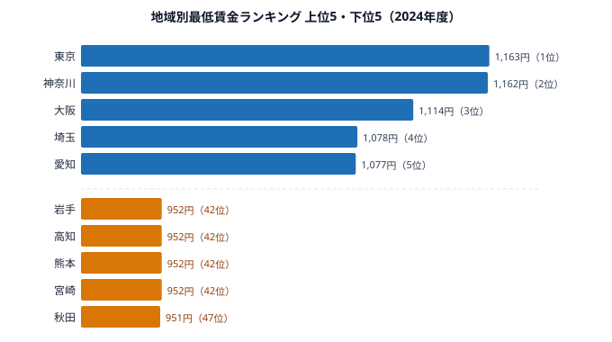
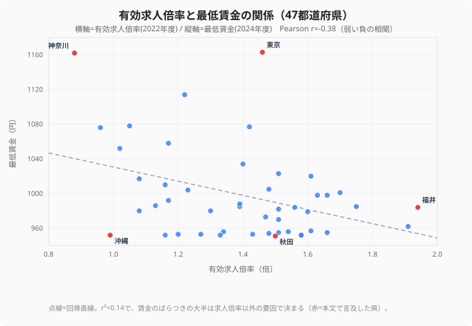

「人手が足りないなら賃金が上がるはず」──その素朴な期待を、47都道府県のデータは静かに揺さぶります。**有効求人倍率がトップの[福井県](/areas/18000)**（1.94倍）は、最低賃金では全国中位の984円（2024年度）にとどまっています。逆に**求人倍率が全国で最も低い神奈川県**（0.88倍）は、最低賃金1,162円で全国2位です。人手不足の度合いと賃金の高さが、少なくともこの両端では逆を向いているのです。

2025年度の改定では、全47都道府県が初めて時給1,000円を突破しました。東京1,226円、秋田1,023円。ですが「全員が1,000円台」になったことは、本当に格差の解消を意味するのでしょうか。この記事では、最低賃金ランキングと有効求人倍率を重ねて、地方の賃金が上がりにくい構造をデータで読み解いていきます。

## 最低賃金ランキング──2024年度の全体像

<data-source label="厚生労働省「地域別最低賃金の全国一覧」" year="2024年度"></data-source>

上位は三大都市圏が独占しています。**1位の[東京都](/areas/13000)**（1,163円）と**2位の神奈川県**（1,162円）はわずか1円差で拮抗し、3位の大阪府（1,114円）、4位の埼玉県（1,078円）、5位の愛知県（1,077円）が続きます。最低賃金は中央最低賃金審議会の目安をもとに、各地方の生計費・賃金・企業の支払い能力を踏まえて決まります。人口と企業が集中し、家賃や物価が高い大都市圏ほど「生計費」の項目が押し上げられるため、上位がこの顔ぶれになるのは構造的な必然と言えます。

下位は地方圏が並びます。**47位の[秋田県](/areas/05000)**（951円）を底に、岩手・高知・熊本・宮崎・沖縄の5県が952円で横一線に並びます。1位の東京と47位の秋田の差は212円。フルタイム月額（時給×160時間）に換算すると**約34,000円**もの開きです。同じ時間だけ働いても、住む県が違うだけで月給がこれだけ変わるという現実が、この1枚の図に表れています。下位県に共通するのは、賃金水準を支える大企業の本社や高付加価値産業の集積が薄く、中小・零細企業の比率が高いという産業構造です。

> [!NOTE]
> 地域別最低賃金は中央最低賃金審議会が示す「目安ランク（A〜C）」を出発点に、各都道府県の地方審議会が最終決定します。生計費・賃金・企業の支払い能力の3要素を勘案する仕組みのため、単純に「人手が足りない順」「物価が高い順」には並びません。

<source-link href="/ranking/minimum-wage-by-region">地域別最低賃金ランキングをもっと見る</source-link>

## 2025年度改定──全県1,000円時代の到来

過去最大の引き上げ幅となった2025年度改定では、東京が1,163円から**1,226円**（+63円）、秋田が951円から**1,023円**（+72円）になりました。注目すべき点が2つあります。

第一に、**下位の秋田の引き上げ幅（+72円）が、上位の東京（+63円）を上回った**ことです。これによって東京と秋田の差は212円から203円へ、9円だけ縮まりました。引き上げ「率」で見ても、下位県のほうが高い伸びを記録しています。

第二に、**全県1,000円突破**という象徴的な達成です。2024年度時点で1,000円未満だった31県が、一気にゼロになりました。「最低賃金1,000円」は長く政策目標として語られてきた数字であり、これがすべての都道府県で実現した意味は小さくありません。

ただし、格差の「率」で見ると1.22倍から1.20倍への微減にすぎません。フルタイム月額（160時間）換算では、なお**月32,000円以上の差**が残っています。政府が掲げる「全国加重平均1,500円」という目標には、まだ長い道のりがあるのが実情です。

> [!WARNING]
> 引き上げ幅が下位県で大きいからといって、格差が急速に縮むわけではありません。元の水準が低い県は同じ「率」で上げても「額」の伸びが小さく、絶対額の差はゆっくりとしか縮まりません。「全県1,000円突破」という見出しは到達点ではなく、あくまでスタートラインだと読むのが正確です。

<ad-slot></ad-slot>

## 人手不足と賃金は逆を向くのか──47県の散布図で検証

最低賃金の高低は、労働力の需給をどう反映しているのでしょうか。有効求人倍率（仕事を探す人1人あたりの求人数）と最低賃金を、47都道府県すべてで重ねてみます。

<data-source label="厚生労働省「職業安定業務統計」" year="2022年度"></data-source>

横軸に有効求人倍率、縦軸に最低賃金を取った散布図がこれです。点は右下がりにゆるく流れているものの、きれいな直線にはほど遠く、ばらつきの大きい雲のように散らばっています。実際に相関係数を計算すると**Pearson r＝−0.38（r²＝0.14）**で、これは「弱い負の相関」にすぎません。決定係数r²が0.14ということは、**最低賃金のばらつきのうち、求人倍率で説明できるのは約14%だけ**で、残り86%は別の要因で決まっているという意味です。

それでも全体の傾きが負である事実は重要です。「人手が足りない県ほど賃金が高い」という需給の常識が正しければ傾きは正になるはずなのに、現実は弱いながらも逆を向いています。両端を見ると傾向はさらにはっきりします。**有効求人倍率がトップの福井県**（1.94倍）は最低賃金が中位の984円（24位）、**求人倍率が全国で最も低い神奈川県**（0.88倍）は最低賃金2位の1,162円。ただし福井・神奈川はあくまで両端の目立つ例であり、中央付近の県は求人倍率1.4〜1.6倍に密集しながら賃金が951円から1,077円まで大きく振れています。**「人手不足だから賃金が低い」と一本の法則で言い切れるほど関係は強くありません。**

なぜ強い相関にならないのか。賃金を押し下げ・押し上げる力が、求人倍率とは別に複数働いているからです。主な層は3つあります。

1. **生計費の規定力**：大都市圏は家賃や物価が高いため、生活に必要な最低限の水準として最低賃金も高く設定されます。賃金は「労働の価値」だけでなく「生活に必要なコスト」を映す鏡でもあります。
2. **産業の支払い能力**：地方では中小企業の割合が高く、企業側が賃金を払う余力が限られます。人手が足りなくても「払いたくても払えない」構造が横たわっています。
3. **労働力の流入と流出**：賃金が高い大都市に労働力が集まるため、都市部の求人倍率はかえって相対的に下がります。逆に地方は働き手の流出によって求人倍率が高止まりします。

つまり「求人倍率が高い＝賃金が高い」という等式は成立しません。とはいえ「求人倍率が低い＝賃金が高い」と裏返しに断定するのも誤りで、r²＝0.14が示すとおり、賃金を本当に左右しているのは生計費・産業の支払い能力・企業規模といった、求人倍率の外側にある変数です。求人倍率は賃金の主役ではなく、せいぜい弱い脇役だと捉えるのが、この散布図の正直な読み方です。

> [!WARNING]
> この弱い負の相関は「相関であって因果ではない」点に注意が必要です。求人倍率も最低賃金も、背後にある都市化率・産業構造・人口流出という共通要因に引っ張られて動いています。「求人倍率を下げれば賃金が上がる」といった因果関係を読み取ることはできず、両者はともに地域の構造を映す結果にすぎません。

> [!TIP]
> 地方移住や転職で「どの県が稼げるか」を見極めたいときは、求人倍率と最低賃金を別々に確認するのが安全です。求人倍率が高い＝採用されやすい、とは言えても、求人倍率が高い＝賃金が高い、とは言えません。福井のように「仕事は見つかりやすいが賃金は中位」という県は珍しくありませんが、これは法則ではなくばらつきの一例として読んでください。

<source-link href="/ranking/active-job-opening-ratio">有効求人倍率ランキングをもっと見る</source-link>

<ad-slot></ad-slot>

## 初任給との接近──賃金底上げの最前線

最低賃金の引き上げは、新卒採用の市場にも構造変化を起こしています。

<data-source label="厚生労働省「賃金構造基本統計調査」" year="2023年"></data-source>

最低賃金の月額換算（時給×160時間）と高卒初任給を比べると、沖縄県ではほぼ接近しています。沖縄の高卒初任給164.9千円に対し、2025年度最低賃金の月額換算は約163千円。**高卒採用で「最低賃金＋α」を提示しなければ人材を確保できない**状態になっています。

この構造は沖縄だけの話ではありません。賃金水準が低い県では、多くの企業が初任給を最低賃金に近い水準に設定しています。そのため最低賃金の引き上げは、こうした企業に対して「強制的な初任給の底上げ」として機能します。法律で下限が上がれば、その下限近くに初任給を置いていた企業は、否応なく初任給も引き上げざるを得なくなるのです。

> [!NOTE]
> 大卒初任給で秋田が上位に来る年があるのは、賃金構造基本統計調査が回答企業の構成に影響されるためです。同調査は回答した企業の顔ぶれによって特定年の順位が変動することがあり、必ずしも県全体の賃金水準の高さを示すものではありません。年単位の初任給ランキングは「振れ」を含むものとして読む必要があります。

> [!WARNING]
> 最低賃金の月額換算は「時給×月160時間（週40時間×4週）」という前提での計算です。実際のパート・アルバイトは月の労働時間がこれより短いことが多く、実効的な月収は換算値より低くなる場合があります。月額換算は県間の比較のための目安であって、実際の手取りそのものではない点に注意してください。

## 全国1,500円への道──何が変わればいいか

政府が掲げる「全国加重平均1,500円」を達成するには、現在の約1,055円から4割以上の引き上げが必要になります。2025年度の引き上げ率が約5.5%だったことを踏まえると、同じペースが続いても単純計算で7〜8年はかかる水準です。

最大の課題は、地方の「産業の支払い能力」にあります。最低賃金を法律で引き上げても、企業がそれに見合う利益を生み出せなければ、廃業や雇用削減につながりかねません。地方の製造業・農業・介護業などの生産性向上が、賃金引き上げを実質的に支える前提条件になります。賃金の数字だけを動かしても、それを支える稼ぐ力が伴わなければ持続しないのです。

> [!TIP]
> 最低賃金と有効求人倍率の弱い負の傾向（r＝−0.38）は、あくまで全体をならした傾きにすぎません。愛知県のように高い求人倍率と高い最低賃金を両立している県もあれば、両端の福井・神奈川のように傾きを強く引っ張る県もあります。r²が0.14と小さい以上、「人手不足の県は賃金が低い」と単純化せず、県ごとの産業の中身まで見るのが読み解くコツです。

## まとめ

- 2025年度の改定で、全47都道府県が初めて時給1,000円を突破しました。
- ただし東京1,226円と秋田1,023円の203円差は、フルタイム月額で3万円以上の格差を意味します。
- 有効求人倍率と最低賃金の相関はr＝−0.38（r²＝0.14）の弱い負にとどまり、「人手不足だから賃金が低い」と一本の法則で言い切れる強さはありません。
- それでも傾きが負を向く事実は、「需給で賃金が決まる」という単純な市場原理が成り立たないことを示し、賃金は産業の支払い能力・生計費・労働力移動という求人倍率の外側の変数で決まっています。
- 全県1,000円突破はゴールではなくスタートラインであり、1,500円目標には地方の産業生産性向上という根本的な処方箋が欠かせません。

## データ出典

- 厚生労働省「地域別最低賃金の全国一覧」（2024年度・2025年度）
- 厚生労働省「職業安定業務統計」（2022年度）
- 厚生労働省「賃金構造基本統計調査」（2023年）
