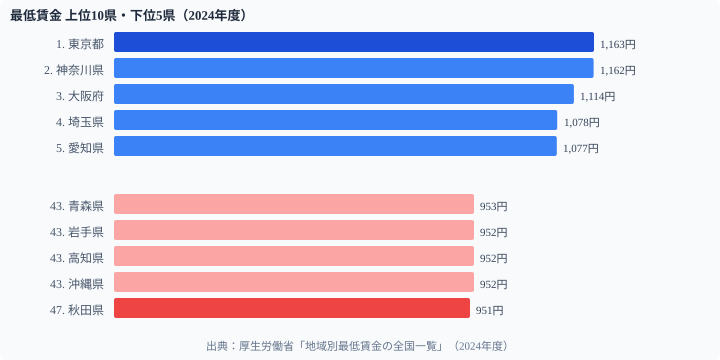

「人手が足りないなら賃金が上がるはず」──そのはずが、データは逆のことを示している。**有効求人倍率1位の[福井県](/areas/18000)**（1.94倍）は、最低賃金では全国中位の984円（2024年度）にとどまる。逆に**求人倍率が最も低い神奈川県**（0.88倍）は1,162円で全国2位だ。

2025年度の改定で全47都道府県が初めて時給1,000円を突破した。東京1,226円・秋田1,023円。しかし「全員1,000円」は格差解消を意味するのか。データで読み解く。

## 最低賃金ランキング──2024年度の全体像

<data-source label="厚生労働省「地域別最低賃金の全国一覧」" year="2024年度"></data-source>

**1位の[東京都](/areas/13000)**（1,163円）と**2位の神奈川県**（1,162円）がわずか1円差で拮抗。3位の大阪府（1,114円）、4位の埼玉県（1,078円）、5位の愛知県（1,077円）と三大都市圏が上位を占める。

**47位の秋田県**（951円）を筆頭に、岩手・高知・熊本・宮崎・沖縄が952円で並ぶ。1位と47位の差は212円、フルタイム月額（160時間）換算で**約34,000円**の差だ。

> [!NOTE]
> 上記ランキングは2024年度データです。2025年度改定では東京1,226円・秋田1,023円となり、全47県が初めて1,000円を突破しました。以下の分析では2024年度DBデータをベースに、2025年度の変化にも言及します。

## 2025年度改定──全県1,000円時代の到来

過去最大の引き上げ幅となった2025年度改定。東京1,163円→**1,226円**（+63円）、秋田951円→**1,023円**（+72円）。注目すべき点は2つある。

第一に、**下位県の引き上げ幅（+72円）が上位県（+63円）を上回った**こと。格差は212円から203円へ9円縮小した。

第二に、**全県1,000円突破**という象徴的達成だ。2024年度時点で1,000円未満だった31県が一気にゼロになった。

ただし格差の「率」で見ると1.22倍から1.20倍への微減にすぎない。フルタイム月額（160時間）換算で**月32,000円以上の差**が依然として残る。政府の「全国加重平均1,500円」目標には、まだ長い道のりがある。

<ad-slot></ad-slot>

## 人手不足なのに賃金が低い──労働市場の逆説

最低賃金の高低は労働力の需給をどう反映するのか。有効求人倍率との関係を見ると、直感に反する結果が浮かぶ。

<data-source label="厚生労働省「職業安定業務統計」" year="2022年度"></data-source>

**有効求人倍率1位の福井県**（1.94倍）は、最低賃金で中位の984円にとどまる。逆に**求人倍率最下位の神奈川県**（0.88倍）は最低賃金2位の1,162円だ。

この逆説の構造は3層からなる。

1. **生活コストの規定力**：大都市圏は生活費が高いため最低賃金も高く設定される。賃金は「労働の価値」だけでなく「生活に必要な最低限」を反映する
2. **産業の支払い能力**：地方では中小企業の割合が高く、企業側の賃金支払い能力が限られる。人手不足でも「払えない」構造がある
3. **労働力の流入と流出**：賃金が高い大都市に労働力が集中するため、都市の求人倍率は相対的に下がる

> [!TIP]
> 「求人倍率が高い＝賃金が高い」という等式は地方では成立しない。賃金は需給だけでなく、産業構造・生活コスト・企業規模の3変数で決まる。地方移住を検討する際は、求人倍率と最低賃金を別々に確認することが重要だ。

[有効求人倍率ランキング](/ranking/active-job-opening-ratio)

<ad-slot></ad-slot>

## 初任給との接近──賃金底上げの最前線

最低賃金の引き上げは、採用市場に構造変化を起こしている。

<data-source label="厚生労働省「賃金構造基本統計調査」" year="2023年"></data-source>

最低賃金の月額換算（時給×160時間）と高卒初任給を比べると、沖縄県ではほぼ接近している。沖縄の高卒初任給164.9千円に対し、2025年度最低賃金の月額換算は約163千円。**高卒採用で「最低賃金+α」を提示しなければ人材を確保できない**状態だ。

この構造は沖縄だけでない。賃金水準が低い県では多くの企業が初任給を最低賃金に近い水準に設定している。最低賃金の引き上げは、こうした企業に対して「強制的な初任給底上げ」として機能する。

> [!NOTE]
> 大卒初任給で秋田が1位（267.7千円）なのは、サンプル企業の構成による影響が大きい。賃金構造基本統計調査は回答企業の構成により、特定年の順位が変動することがある。県全体の賃金水準の高さを示すものではない。

> [!WARNING]
> 最低賃金の月額換算は時給×月160時間（週40時間×4週）の計算。実際のパート・アルバイトは月労働時間が異なるため、実効的な月収はこれより低くなる場合がある。

## 全国1,500円への道──何が変わればいいか

政府が掲げる「全国加重平均1,500円」の達成には、現在の1,055円から約42%の引き上げが必要だ。2025年度の引き上げ幅が約5.5%だったことを考えると、単純計算で7〜8年はかかる水準だ。

課題は地方の「産業の支払い能力」にある。最低賃金を法律で引き上げても、企業が利益を生み出せなければ廃業・雇用削減につながる。地方の製造業・農業・介護業の生産性向上が、賃金引き上げの実質的な前提条件だ。

> [!NOTE]
> 有効求人倍率と最低賃金の逆相関は全体的な傾向。愛知県のように高い求人倍率と高い最低賃金を両立している県もある。産業構造・企業規模・都市化率など複合的な要因が絡む。

## まとめ

2025年度の最低賃金改定で全47都道府県が1,000円を突破した。象徴的な達成だが、東京1,226円・秋田1,023円の203円差はフルタイム月額で3万円以上の格差を意味する。

最も示唆的なのは有効求人倍率との逆相関だ。人手不足の地方ほど最低賃金が低いという構造は、「需給で賃金が決まる」という単純な市場原理では説明できない。産業の支払い能力・生活コスト・労働力移動の3変数が絡んだ構造問題だ。

全県1,000円突破は「スタートライン」であって「ゴール」ではない。政府目標の1,500円達成には、地方の産業生産性向上という根本的な処方箋が必要だ。

## データ出典

- 厚生労働省「地域別最低賃金の全国一覧」（2024年度・2025年度）
- 厚生労働省「職業安定業務統計」（2022年度）
- 厚生労働省「賃金構造基本統計調査」（2023年）
