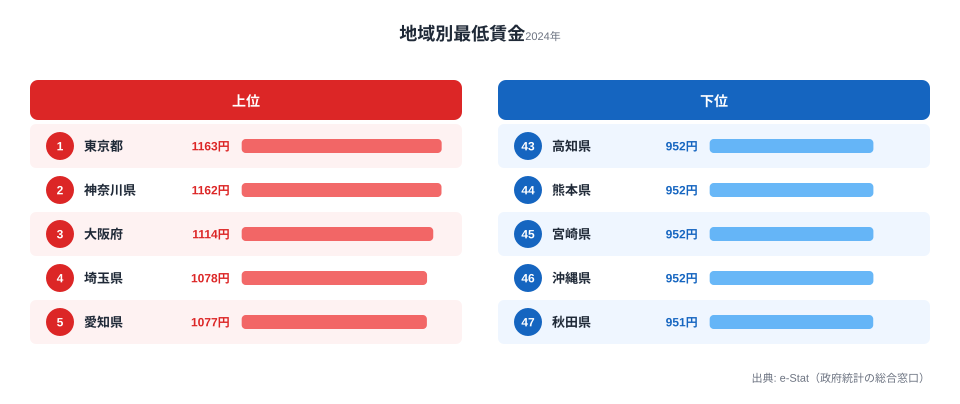
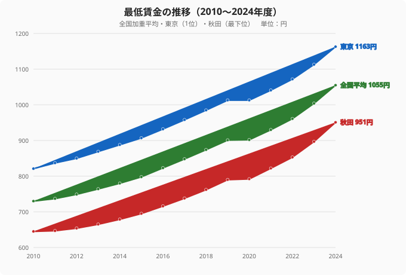

「最低賃金はもう全国どこでも1000円を超えた」──ニュースの見出しを眺めていると、そんな印象を受ける。だが、47都道府県の地域別最低賃金を実際に並べてみると、その印象は半分しか正しくない。

2024年度（令和6年度）の地域別最低賃金で、時間額1000円を突破したのは**わずか16県**。残りの**31県は1000円に届いていない**。全国加重平均は1055円なのに、過半数の県が平均以下――。最低賃金は「全国一律のニュース」ではなく、住む県によって時給が大きく変わる「地域の数字」なのだ。

最高は[東京都](/areas/13000)の1163円、最低は[秋田県](/areas/05000)の951円。その差は212円、倍率にして1.22倍。1日8時間・月22日働けば、同じ仕事でも月額で約3.7万円、年額で約44万円の開きになる。この記事では、47都道府県の最低賃金を可視化し、「1000円の壁」の正体と、過去15年で格差がむしろ拡大してきた構造を読み解く。

> [!NOTE]
> 地域別最低賃金は、各都道府県の地方最低賃金審議会の答申を受けて毎年10月ごろに改定される時間額。パート・アルバイトを含むすべての労働者に適用される下限額で、産業別最低賃金とは別物。本記事の数値は総務省「社会・人口統計体系（都道府県データ）」が整理した2024年度（令和6年度）の確定値。

## 最低賃金ランキング2024：トップ16県だけが1000円を超えた

まず2024年度の上位10県と下位10県を見てみよう。

上位は三大都市圏が完全に独占している。1位東京1163円と2位神奈川1162円はわずか1円差で、首都圏が頭ひとつ抜けた構図だ。3位大阪1114円、4位埼玉1078円、5位愛知1077円と続き、トップ10は東京・神奈川・大阪・埼玉・愛知・千葉・京都・兵庫・静岡・三重――すべて人口の多い都市部、もしくは大都市圏に隣接する県で占められている。

注目すべきは「1000円の壁」の位置だ。16位の岐阜県が1001円でかろうじて壁を越え、17位の富山県は998円。たった3円の差で、1000円突破県と未達県が分かれている。つまり**最低賃金1000円は「全国標準」ではなく、上位3分の1の県だけが到達した到達点**なのだ。

<source-link href="/ranking/minimum-wage-by-region">地域別最低賃金ランキングの全47都道府県を見る</source-link>

## 下位グループの異常な「密集」：951〜953円に9県がひしめく

下位グループには、上位とはまったく異なる構造がある。最下位の秋田951円から数えて、**951〜953円のわずか2円幅に9県が密集**しているのだ。

青森・長崎・鹿児島が953円、岩手・高知・熊本・宮崎・沖縄が952円、そして秋田が951円。北東北（青森・岩手・秋田）と南九州・沖縄（長崎・熊本・宮崎・鹿児島・沖縄）、それに四国の高知という、いずれも大都市から遠い地域がほぼ横一線に並ぶ。

なぜ下位がこれほど団子状態になるのか。最低賃金は、その年の引き上げ目安額（中央最低賃金審議会が示すランク別の目安）を下敷きに各県が答申するため、経済力が低い県は「目安どおりに最低限引き上げる」横並びの動きになりやすい。結果として、最も賃金水準が低い県群は、全国の引き上げ機運に押し上げられながらも、ほぼ同額のまま底辺で並走することになる。

> [!WARNING]
> 最低賃金の絶対額の低さが、ただちに「暮らしにくさ」を意味するわけではない点には注意が必要だ。下位に並ぶ地方県は家賃や物価が都市部より低い傾向があり、名目の時給差がそのまま生活水準の差にはならない。一方で、近隣の県との数円差であっても、県境をまたいだ通勤・求人競争では人材の流出入に影響する。最低賃金は「絶対水準」と「近隣との相対差」の両面で読む必要がある。

<source-link href="/ranking/active-job-opening-ratio">有効求人倍率の都道府県ランキングで人手不足の地域差を見る</source-link>

## 15年の推移：格差は縮まるどころか拡大していた

「最低賃金は毎年上がっている」のは事実だ。だが、上がり方は地域で均一ではなかった。全国加重平均・東京・秋田（最下位）の3本の推移を重ねてみる。

2010年度から2024年度までの15年間で、東京は821円→1163円（+342円）、秋田は645円→951円（+306円）に上昇した。全国加重平均も730円→1055円（+325円）と着実に伸びている。引き上げ自体は全国で進んだ。

ところが**上位と下位の差額はむしろ広がっている**。2010年度の東京と秋田の差は176円だったが、2024年度には212円に拡大した。引き上げ幅が「率」ではなく「目安額」ベースで決まり、もともと水準の高い東京の方が額として大きく上がってきたためだ。倍率で見れば1.27倍から1.22倍へとわずかに縮小しているものの、**労働者が実際に手にする「金額の差」は15年で36円分広がった**ことになる。

> [!TIP]
> 最低賃金を読むときは「倍率」と「差額」を分けて見るとよい。倍率は縮小傾向（格差が相対的に縮まっている）に見える一方、差額は拡大傾向（金額の開きは広がっている）。どちらを重視するかで「格差は縮んだ/広がった」の評価は逆転する。生活実感に直結するのは差額（金額）の方だ。

[仮説] 下位県が1000円に到達するには、現在の年間引き上げ幅（直近は1県あたりおおむね年50円前後）が続けば数年を要する。秋田が951円から1000円に届くには、単純計算で約49円分＝直近ペースで1年強かかる見込みだが、これは過去の引き上げ幅の延長による試算であり、今後の審議会答申や経済情勢で変動する。検証は毎年10月の各県答申（厚生労働省公表）で行う必要がある。

<source-link href="/ranking/starting-salary-highschool">高卒初任給の都道府県ランキングで初任給と最低賃金の関係を見る</source-link>

## なぜこの構造になるのか：最低賃金は「都市の集積」を映す鏡

上位を都市部が独占し、下位を地方が横並びで占める――この構造は偶然ではない。最低賃金は、その地域の企業の支払い能力、物価、労働需給を反映して決まる。

- **都市部（上位）**：企業密度が高く、人手不足が深刻で、生活コスト（特に家賃）も高い。賃金を上げないと人が集まらず、最低賃金も高めに設定される。
- **地方（下位）**：第一次・第二次産業の比率が相対的に高く、企業の支払い能力に上限がある。物価が低いぶん名目額は抑えられ、引き上げも目安額に沿った最小限になりやすい。

つまり最低賃金ランキングは、産業の集積度・人口密度・物価という複数の地域差が凝縮された「鏡」だと言える。1000円を超えた16県の顔ぶれ（東京・神奈川・大阪・埼玉・愛知・千葉・京都・兵庫・静岡・三重・広島・滋賀・北海道・茨城・栃木・岐阜）が、大都市圏とその周辺、地方中枢都市を抱える県にほぼ一致するのは、その表れだ。

## まとめ：1000円突破は「通過点」、本当の課題は底上げの速度

- **1位は東京都1163円、最下位は秋田県951円**。差は212円、倍率1.22倍。
- 2024年度に**1000円を突破したのは47県中わずか16県**。全国加重平均1055円に対し、31県が平均未満。
- **下位9県は951〜953円のわずか2円幅に密集**。北東北・南九州・沖縄・四国の県が底辺で横並び。
- 16位岐阜1001円と17位富山998円の**3円差が「1000円の壁」**を分けている。
- 過去15年で引き上げは全国で進んだが、東京と秋田の**差額は176円→212円に拡大**。倍率は縮小、差額は拡大という逆転現象。

最低賃金1000円は、もはやニュースの見出しが示すような「全国標準」ではなく、上位3分の1の県だけが到達した到達点だ。残る31県、とりわけ底辺で団子状態の下位グループがどのスピードで追いつくのか――最低賃金の物語の主役は、トップの数字ではなく「底上げの速度」にある。

### データ出典

総務省統計局「社会・人口統計体系（都道府県データ 基礎データ／F 労働）」より、地域別最低賃金（項目コード F6501、e-Stat 統計表ID 0000010106）の2024年度（令和6年度）確定値および2010〜2024年度の時系列を集計。データは e-Stat（政府統計の総合窓口）API 経由で取得・整備した。

本記事の対象データ: [関連カテゴリ](/category/laborwage)
