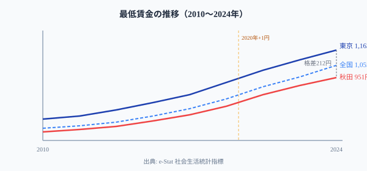

「地方の最低賃金は東京より上昇率が高い」──これは事実です。2010〜2024年で[秋田県](/areas/05000)は+48.1%、[東京都](/areas/13000)は+41.7%。

しかし同じ期間に東京と最低県の差は**179円から212円へと拡大**しました。

なぜ上昇率が高い地方で絶対格差が広がるのか。この逆説が日本の地方経済が抱える構造問題を映し出しています。

> [!NOTE]
> 本記事の「地域別最低賃金」は各都道府県の地域別最低賃金額（時間額）です。特定産業の「特定最低賃金」は含みません。所定内給与額は賃金構造基本統計調査に基づく月額（千円単位）です。

## 上昇率が高いのに格差が拡大する逆説

<!-- 最低賃金の推移折れ線グラフ -->

<data-source url="https://www.e-stat.go.jp/dbview?sid=0000010106" label="e-Stat 社会生活統計指標"></data-source>

逆説の理由はシンプルです。

2010年時点で東京は820円、秋田は641円。秋田が同じ「10%上昇」でも、元の金額が異なるため絶対額の増分は異なります。元の金額が高い東京のほうが「10%の絶対額」が大きい。

つまり**上昇率を揃えても、絶対格差は拡大する**のが数学的な必然です。絶対格差を縮めるには地方の上昇率が東京より「はるかに」高くなければなりません。

> [!TIP]
> 政府は「2020年代に全国加重平均1,500円」を目標に掲げています。2024年の1,055円から達成するには、毎年**+70〜80円**の引き上げが必要です。2024年の引き上げ幅は+51円でしたので、ペースを大きく加速する必要があります。

## 最低賃金ランキング──東京と秋田の212円差

**1位は東京都の1,163円**、2位の[神奈川県](/areas/14000)（1,162円）との差はわずか1円。大阪府・埼玉県・愛知県と続き、三大都市圏が上位を占めます。

**47位は秋田県の951円**。岩手・高知・熊本・宮崎・沖縄が952円で同率42位に並びます。下位10県のうち8県が東北・九州に集中しており、地理的な偏りが明確です。

マップで俯瞰すると、**関東・東海・近畿の太平洋ベルト**が高い水準（1,000円超16都道府県）。東北・南九州・四国は薄い色が目立ちます。

> [!WARNING]
> 最低賃金の「ランク制」は2023年度に事実上廃止され、全国一律の目安が示されるようになりました。ただし最終的な決定は各地方の審議会に委ねられるため、地域差は残ります。「全国一律1,500円」を法律で強制することが地方経済に与える影響については、賛否両論があります。

<source-link href="/ranking/minimum-wage-by-region">最低賃金ランキングで全47都道府県の順位を確認する</source-link>

## 最低賃金 × 実賃金の相関──因果の方向に注意

最低賃金と男性所定内給与額の散布図には**明確な正の相関**が確認できます。最低賃金が高い都道府県ほど、実際の給与水準も高い傾向です。

しかしこの相関は「最低賃金を上げれば実賃金が上がる」ことを直接意味しません。大都市圏では企業の支払い能力が高いから最低賃金も実賃金も高いのであり、**因果の方向は逆**です。

地方で急激に最低賃金を引き上げた場合、中小企業の経営を圧迫するリスクも指摘されています。この点が「全国一律引き上げ」に対する地方中小企業からの懸念の根拠です。

## コロナ禍の例外──2020年に+1円にとどまった年

14年の推移で唯一の例外が**2020年**です。コロナ禍の影響で最低賃金の引き上げは前年比わずか**+1円**（901→902円）にとどまりました。飲食・宿泊業など最低賃金近傍で働く労働者を多く抱える産業が壊滅的な打撃を受けたため、引き上げを自制したものです。

翌2021年以降は再び大幅引き上げに転じ（+28円、+31円、+43円、+51円）、コロナによる停滞は一時的でした。

> [!NOTE]
> 近年の急加速の背景には「賃金引き上げによる経済の好循環」を重視する政府の方針転換があります。2024年の+51円は過去最大幅の引き上げです。ただし中小企業の体力には地域差があり、急激な引き上げは地方経済に過大な負担を与えるリスクがあります。

## まとめ──「床」と「天井」の間で揺れる地方経済

最低賃金は「床」（最低ライン）であり、実際の給与を決めるのは地域経済の生産性です。

| 視点 | 現状 |
|---|---|
| 絶対格差 | 2010年179円 → 2024年212円（拡大） |
| 上昇率 | 地方 > 東京（秋田48% vs 東京42%） |
| 全国平均 | 2023年に初めて1,000円突破 |
| 目標1,500円 | 毎年+70円必要（2024年の+51円より速いペース） |

引き上げと同時に、地方の産業高度化や女性の就業環境の改善がなければ、数字の上での格差縮小は実感を伴わないものになります。最低賃金の引き上げは必要条件ですが、地方経済の生産性向上なしには十分条件にはなりません。

## データ出典

- e-Stat 社会生活統計指標（労働）statsDataId: 0000010106
- 厚生労働省「地域別最低賃金の全国一覧」2024年度
