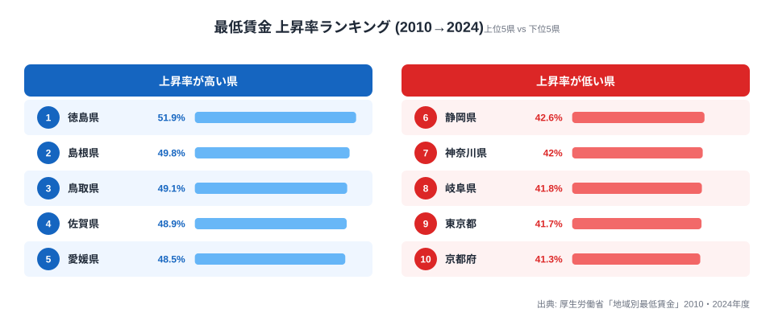

最低賃金の格差を語るとき、多くの記事は **絶対額** (東京 1,163 円 vs 秋田 951 円、差 212 円) を取り上げます。姉妹記事 [最低賃金 212 円差の地域経済](https://stats47.jp/blog/minimum-wage-gap-regional-economy) でもこの「広がる絶対差」を扱いました。

しかし、もう一つの見方があります。それが **「14 年間でどれだけ上がったか」 = 上昇率** です。2010 → 2024 年の 14 年間で各都道府県の最低賃金がどれだけ伸びたかを並べると、絶対額とはまったく **逆の順位** が現れます。

上昇率の 1 位は **徳島県 (+51.94%)**、最下位は **京都府 (+41.26%)** です。絶対額で全国トップの東京は、上昇率では 46 位に沈みます。「金額のランキング」と「伸びのランキング」がここまで食い違う指標は珍しく、その背景には政府の段階的な引き上げ政策があります。この記事では、なぜ地方が上昇率で逆転するのかを 47 都道府県のデータで読み解きます。

> [!NOTE]
> 「上昇率」は単独の統計指標ではなく、本記事が計算した派生値です。算定式は「(2024 年度の時間額 − 2010 年度の時間額) ÷ 2010 年度の時間額 × 100」で、出典はいずれも厚生労働省「地域別最低賃金」の各年度時間額です。2024 年度の額は [最低賃金ランキング](https://stats47.jp/ranking/minimum-wage-by-region) の公開値と全県一致することを確認しています。

## 上昇率の上位5県と下位5県

まず、14 年間の上昇率が高い県と低い県を上位 5・下位 5 で並べます。

<source-link href="/ranking/minimum-wage-by-region">最低賃金ランキング (2024 年度・絶対額) をもっと見る</source-link>

上位 5 県は、上昇率の高い順に次のとおりです。

- 1 位 **徳島県 +51.94%** (645 → 980 円)
- 2 位 **島根県 +49.84%** (642 → 962 円)
- 3 位 **鳥取県 +49.07%** (642 → 957 円)
- 4 位 **佐賀県 +48.91%** (642 → 956 円)
- 5 位 **愛媛県 +48.45%** (644 → 956 円)

1 位の徳島は全国で唯一 50% を超えた県で、2010 年の 645 円から 2024 年の 980 円まで **+335 円** 伸びました。2 〜 5 位には島根・鳥取の山陰、佐賀の九州、愛媛の四国が並びます。上位 10 位までを地域別に見ると **8 県が九州・四国**、残る 2 県も中国地方 (島根・鳥取) で、すべて非大都市圏です。

これらの県には明確な共通点があります。**いずれも 2010 年時点で 645 円以下** だったことです。元の金額が全国でも最低水準だったため、後述する政府の底上げ政策の効果が上昇率という形で最も大きく表れました。スタート地点が低い県ほど、同じ金額の引き上げでも伸び率は大きく出る、というのが第一の読みどころです。

## 下位グループ ── なぜ大都市は伸びが小さいのか

一方、上昇率が最も低かったのは下位 5 県で、低い順に次のとおりです。

- 47 位 **京都府 +41.26%** (749 → 1,058 円)
- 46 位 **東京都 +41.66%** (821 → 1,163 円)
- 45 位 **岐阜県 +41.78%** (706 → 1,001 円)
- 44 位 **神奈川県 +42.05%** (818 → 1,162 円)
- 43 位 **静岡県 +42.62%** (725 → 1,034 円)

最下位は京都府で、東京都・神奈川県という大都市圏がすぐ上に続きます。**絶対額 1 位の東京が、上昇率では 46 位** という逆転がここに表れています。下位グループに共通するのは、2010 年時点ですでに時間額が高かった点です。京都は 749 円、東京は 821 円、神奈川は 818 円と、上位県の 645 円前後を大きく上回っていました。

分母となる元の金額が大きいため、後から金額を積み上げても上昇率の伸びしろは小さくなります。上昇率 1 位の徳島と最下位の京都の差は **10.68 ポイント**。絶対額では東京と秋田で 212 円・1.22 倍の開きがあるのに対し、上昇率の差は 10 ポイント強にとどまります。最低賃金法の「目安制度」によって全国で足並みをそろえて引き上げが行われるため、上昇率の散らばり自体は絶対額ほど大きくならない、という構造も読み取れます。

> [!TIP]
> 「上昇率が低い = 賃上げが進んでいない」とは限りません。下位 5 県のうち東京・神奈川・京都は 2024 年度の絶対額で全国上位に位置します。伸びしろが小さく見えるのは、出発点がもともと高かったからです。地域の待遇を評価するときは、上昇率と絶対額の両方を必ずセットで見るのが安全です。

## 発見 ──「絶対額は東京1強、上昇率は地方優位」のパラドックス

ここまでで、同じ最低賃金データから 2 つの正反対のランキングが生まれることが分かりました。整理すると次のようになります。

- **2024 年 絶対額**: 1 位 東京 1,163 円 / 47 位 秋田 951 円 → 212 円差・1.22 倍
- **2010→2024 上昇率**: 1 位 徳島 +51.94% / 47 位 京都 +41.26% → 10.68 ポイント差

姉妹記事で扱った「**絶対額の格差はむしろ拡大**」(2010 年 179 円差 → 2024 年 212 円差) は事実です。それでいて **上昇率では地方が逆転している** ──これが本記事の核心的な発見です。

なぜこのねじれが起きるのでしょうか。答えは **元の金額が違うため、ほぼ同じ金額を引き上げても上昇率は変わる** という算数にあります。

- 東京都 821 円 → +342 円 = +41.66%
- 徳島県 645 円 → +335 円 = +51.94%

引き上げ額はほぼ同じ (+335 〜 +342 円) なのに、分母が 645 円か 821 円かで上昇率に 10 ポイントの差が出ます。これが「絶対額は拡大、上昇率は地方優位」というパラドックスの正体で、2 つのランキングは矛盾しているのではなく、同じデータの裏表になっているのです。

政府は 2016 年以降、地方の引き上げ幅を大都市以上に厚くする目安を出してきました。徳島の +335 円のうち、2010 〜 2015 年の引き上げは +66 円、2016 〜 2024 年は +269 円と、**後半 9 年で全体の約 80% を稼いだ** 計算になります。地方の上昇率が高い背景には、この政策的な誘導が効いていると考えられます。

> [!WARNING]
> 本記事の上昇率は 2010 年度と 2024 年度の 2 時点だけを結んだ値で、途中の年ごとの上下動は表していません。また「全国加重平均 1,500 円」という政府目標は今後も引き上げを続ける前提なので、出発点が低い地方県の上昇率はこの先さらに伸びる可能性があります。順位は固定的なものではなく、毎年の改定で入れ替わり得る点に注意してください。

## まとめ

- 上昇率 1 位は **徳島県 (+51.94%)**、最下位は **京都府 (+41.26%)** で **10.68 ポイント差**
- 上位 10 県はすべて **九州・四国・中国地方** で占められ、地方優位の構図
- 絶対額 1 位の **東京は上昇率 46 位**、2 位の **神奈川は 44 位** と逆転が発生
- 「絶対額の格差拡大」と「上昇率は地方優位」は **同じデータの裏表** で、分母が違うために生じるパラドックス
- 政府の「地方厚め」目安制度が、出発点の低かった地方県の上昇率を押し上げた

絶対額と上昇率を併せて見ると、最低賃金をめぐる「都市 vs 地方」の構図はひとつの数字では語れないことが分かります。実際の暮らしへの影響を知りたい方は、姉妹記事 [最低賃金 212 円差の地域経済](https://stats47.jp/blog/minimum-wage-gap-regional-economy) や [物価上昇率ランキング](https://stats47.jp/ranking/cpi-change-rate-total) と合わせて、実質的な購買力の差まで踏み込んで読んでみてください。

## データ出典

- 厚生労働省「地域別最低賃金」(2010 〜 2024 年度・各都道府県時間額)
- e-Stat 経由で整備。上昇率は本記事が 2 時点の時間額から算定した派生値です
