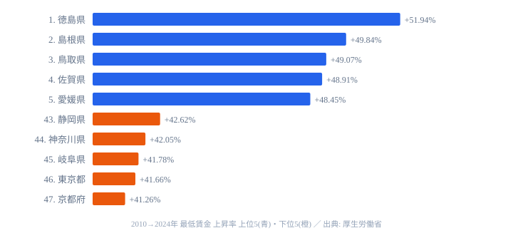

最低賃金の格差を語るとき、多くの記事は **絶対額** (東京 1,163 円 vs 秋田 951 円、差 212 円) を取り上げます。姉妹記事 [最低賃金 212 円差の地域経済](https://stats47.jp/blog/minimum-wage-gap-regional-economy) でも、この「広がる絶対差」を扱いました。

しかし、もう一つの見方があります。**「14 年間でどれだけ上がったか」 = 上昇率** です。2010 → 2024 年の 14 年間で各都道府県の最低賃金がどれだけ伸びたかを並べると、絶対額とはまったく逆の順位が現れます。最も伸びたのは徳島県で **+51.94%**、続いて島根県 **+49.84%**、鳥取県 **+49.07%**。上位は地方県が独占し、東京・神奈川・京都は下位グループに沈みます。額では圧倒的に強い東京が、なぜ「伸び率」では負けるのか。その答えを 47 都道府県すべてで検証します。

> [!NOTE]
> ここでいう上昇率は、各都道府県の地域別最低賃金 (時間額) について「2024 年度の額 ÷ 2010 年度の額 − 1」で算出したものです。最低賃金は中央最低賃金審議会の「目安」を踏まえて毎年改定されるため、年ごとの引き上げ幅の積み重ねが 14 年分の伸び率になります。

## 上昇率の高い県 ── 九州・四国・中国が独占

伸び率の上位 5 県は、徳島 (+51.94%)、島根 (+49.84%)、鳥取 (+49.07%)、佐賀 (+48.91%)、愛媛 (+48.45%) です。下位 5 県は逆に、静岡 (+42.62%)、神奈川 (+42.05%)、岐阜 (+41.78%)、東京 (+41.66%)、京都 (+41.26%) と続きます。

1 位の徳島県は、全国で唯一 50% を超えた県です。2010 年の 645 円から 2024 年の 980 円まで、14 年で **+335 円** 伸びました。続く島根・鳥取の中国地方、そして佐賀・愛媛・長崎・鹿児島・大分・高知・宮崎といった九州・四国の各県が上位に並びます。実際、上昇率トップ 10 のうち 8 県が九州・四国、残る 2 県も中国地方 (島根・鳥取) で占められ、伸び率の高さは完全に西日本の地方県に偏っています。

この偏りには明快な共通点があります。上位の県はいずれも **2010 年時点で 645 円以下** の低い水準から出発していました。元の金額が低かった県ほど、政府が掲げる「全国加重平均 1,500 円」へ向けた段階的な底上げの恩恵を大きく受け、伸び率が跳ね上がる構図です。逆に言えば、伸び率の高さは「もともと安かった」ことの裏返しでもあり、額そのものが上位に来たわけではない点に注意が必要です。2024 年度の額そのものの順位は [最低賃金ランキング](https://stats47.jp/ranking/minimum-wage-by-region) で確認できます。

> [!TIP]
> 上昇率は「出発点の低さ」を強く反映します。同じ +300 円でも、645 円が出発点なら +47%、821 円が出発点なら +37% と見え方が変わります。伸び率ランキングを読むときは、必ず「2010 年時点の額」とセットで見ると誤読を防げます。

<source-link href="/ranking/minimum-wage-by-region">最低賃金ランキング (2024年度の絶対額) をもっと見る</source-link>

## 下位グループ ── 額のトップ層がそのまま伸び率の下位に

伸び率の下位グループは、京都 (+41.26%)、東京 (+41.66%)、岐阜 (+41.78%)、神奈川 (+42.05%)、静岡 (+42.62%) という顔ぶれです。最下位の京都府は 749 円から 1,058 円へ +41.26%、46 位の東京都は 821 円から 1,163 円へ +41.66% でした。

ここで起きているのが本記事の核心、**絶対額 1 位の東京が上昇率では 46 位** という逆転です。額のトップ層 (東京・神奈川) が、そのまま伸び率の下位に並んでいます。出発点の額がもともと高かったぶん、同じような金額を上乗せしても分母が大きく、伸び率としては小さく見えるためです。

上昇率 1 位の徳島と最下位の京都の差は **10.68 ポイント**。最低賃金法による目安制度で全国に引き上げが行われるため、絶対額の差ほど上昇率の差は開きません。それでも 10 ポイントの開きは無視できず、元の金額が高かった県ほど伸び率の余地が小さいという構造がはっきり読み取れます。

> [!WARNING]
> 上昇率が低い = 賃上げが遅れている、と単純に読むのは危険です。東京・神奈川は出発点の額が高く、2024 年時点でも額そのものは全国トップクラスです。順位の向きが額と上昇率で逆転するため、「伸び率下位」を「水準が低い」と取り違えないでください。

## 真因 ── 額は1強でも伸び率は逆転する分母のしくみ

絶対額と上昇率を並べると、ねじれの正体が見えてきます。絶対額では 1 位の東京 1,163 円と 47 位の秋田 951 円の差が 212 円・約 1.22 倍。一方、上昇率では 1 位の徳島 +51.94% と最下位の京都 +41.26% の差が 10.68 ポイントです。姉妹記事で扱った「絶対額の格差はむしろ拡大した」(2010 年 179 円差 → 2024 年 212 円差) は事実ですが、上昇率では地方が逆転しているのが、ここで新たに見える発見です。

なぜこのねじれが起きるのでしょうか。鍵は **元の金額 = 分母の違い** にあります。東京都は 821 円から +342 円で +41.66%、徳島県は 645 円から +335 円で +51.94% でした。上乗せ額はほぼ同じ +335 〜 +342 円なのに、分母が違うために上昇率には 10 ポイントもの差が生まれます。これが「絶対額は拡大、上昇率は地方優位」というパラドックスの正体です。額の伸び (円) と率の伸び (%) は、似て非なる指標なのです。

さらに、この逆転は政策によって後押しされてきました。政府は 2016 年以降、地方の引き上げ幅を大都市以上に厚くする目安を出しています。徳島の +335 円のうち、2010 〜 2015 年は +66 円、2016 〜 2024 年は +269 円で、後半 9 年だけで全体の約 80% を稼ぎました。地方の上昇率が高い背景には、こうした政策的な誘導が確かに働いています。見かけ上の「地方優位」は、出発点の低さと政策誘導という二つの要因が重なって生まれたものであり、相関 (地方ほど伸びる) がそのまま因果ではない点も押さえておきたいところです。

<source-link href="/ranking/cpi-change-rate-total">物価上昇率ランキング (実質賃金との対比) をもっと見る</source-link>

## まとめ

- 上昇率の最上位は **徳島県 (+51.94%)**、最下位は **京都府 (+41.26%)** で、その差は **10.68 ポイント** です
- 上昇率の上位 10 県はすべて **九州・四国・中国地方** で占められ、伸び率は西日本の地方に偏っています
- 絶対額で 1 位の **東京は上昇率では 46 位**、2 位の **神奈川も 44 位** と、額と伸び率で順位が逆転します
- 「絶対額の格差拡大」と「上昇率は地方優位」は **同じデータの裏表** で、出発点 (分母) の違いから生じるパラドックスです
- 政府の「地方厚め」の目安制度が、地方の上昇率を押し上げた構造も無視できません

賃金まわりの他の指標は [賃金・労働カテゴリ](https://stats47.jp/category/laborwage) からも横断的に比較できます。額の絶対差については姉妹記事 [最低賃金 212 円差の地域経済](https://stats47.jp/blog/minimum-wage-gap-regional-economy) を併せてご覧ください。

## データ出典

- 厚生労働省「地域別最低賃金」(2010 〜 2024 年度・各都道府県時間額)
- e-Stat 経由で整備
