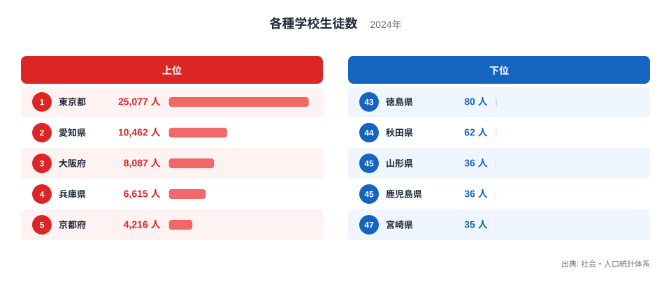
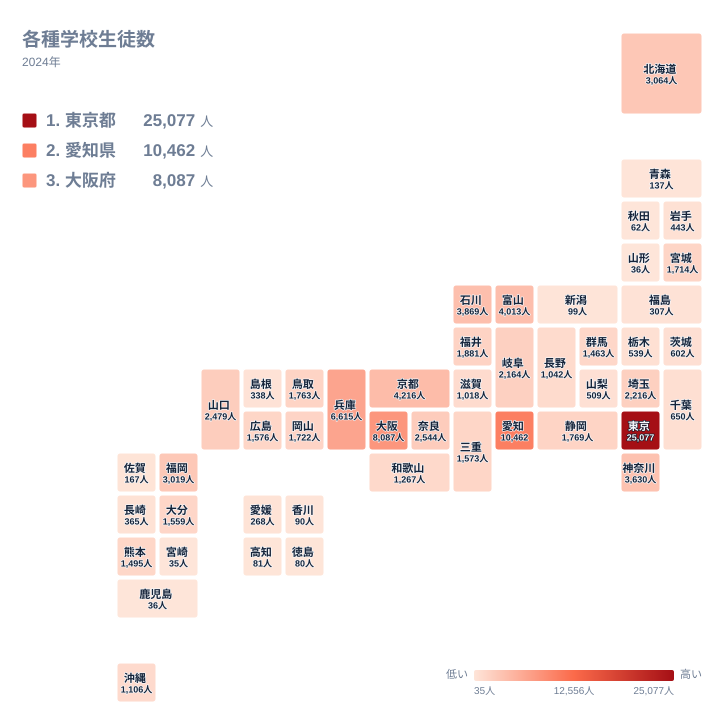

## 各種学校とは何を数えた指標か

各種学校とは、学校教育法にもとづく学校のうち、専修学校が満たすべき修業年限や授業時数などの基準には届かない教育施設を指します。自動車教習所や外国人学校、和裁や着付けといった技芸を教える学校が代表的な例です。小中高や大学のような一般的な学校制度とは別枠で扱われるため、日ごろ目にする機会は多くありませんが、統計としては都道府県ごとに生徒数が集計されています。

2024年の社会・人口統計体系によると、各種学校に通う生徒の数は都道府県ごとに大きく異なります。最も多い東京都は25,077人で、最も少ない宮崎県はわずか35人にとどまります。この差はおよそ716倍にのぼり、都道府県の人口比では説明しきれないほどの開きです。以下では上位と下位の顔ぶれを確認しながら、なぜこれほど大きな差が生まれるのかを都市機能と産業構造の観点から見ていきます。

## 上位5県と下位5県を比べる

<source-link href="/ranking/miscellaneous-school-students">各種学校生徒数ランキングをもっと見る</source-link>

上位5県は東京都が25,077人で1位、愛知県が10,462人で2位、大阪府が8,087人で3位、兵庫県が6,615人で4位、京都府が4,216人で5位という順になっています。いずれも人口が多く都市機能が集積した都府県で、東京都は2位の愛知県の2倍以上の生徒数を抱えており、単独で突出した規模になっています。人口が多い地域ほど、専門的な技芸を教える学校や外国人学校を必要とする人の絶対数も増えやすいため、都市部に生徒が集中する構図が見えてきます。

一方、下位5県は徳島県が80人で43位、秋田県が62人で44位、山形県が36人で45位、鹿児島県が36人で46位、宮崎県が35人で47位という結果です。この5県は四国、東北、九州とそれぞれ異なる地方に位置しており、特定の地方だけが低いというわけではありません。共通しているのは、各種学校に区分される教育施設そのものが県内にほとんど立地していない、あるいは在籍している生徒が少人数にとどまっているという点です。人口規模が中程度の県であっても、各種学校の運営や誘致が進んでいなければ、この指標では低い値になります。

上位と下位の差が716倍にも広がっている背景には、単純な人口比では説明できない要因があると考えられます。[仮説] 各種学校には自動車教習所のように一定の人口があれば需要が生まれる施設と、外国人学校や特定の技芸学校のように立地が都市部に偏りやすい施設が混在しているため、都市機能の集積度によって差が増幅されている可能性があります。ただし、この統計だけでは学校の種類別内訳までは分からないため、あくまで仮説にとどまります。

## 地理的な分布で見る全国のばらつき

タイルマップで全国を見渡すと、東京都を中心とした関東地方と、愛知県・大阪府・兵庫県・京都府を含む中京圏から近畿圏にかけて濃い色が集まっていることが分かります。これらの地域は人口が集中しているだけでなく、専門学校や職業教育のための施設が多く立地してきた地域でもあると考えられます[仮説]。[仮説] 大都市圏では多様な職業ニーズに応じた小規模な教育施設が生まれやすく、その一部が各種学校として分類されている可能性があります。

一方で、東北地方や四国地方、九州地方の多くの県では色が薄く、生徒数が少ないことが視覚的にも確認できます。ただし、後述するように富山県や石川県のように都市圏から離れていても比較的高い数値を示す県もあり、地理的な近さだけで説明できる分布ではありません。人口の多さに加えて、その地域にどのような各種学校が根付いてきたかという歴史的な経緯が影響していると考えられます。

## 発見: 人口規模だけでは説明できない県の存在

全国順位を細かく見ていくと、上位10県の中に富山県と石川県が入っていることが目を引きます。富山県は4,013人で6位、石川県は3,869人で7位となっており、これは神奈川県の3,630人や北海道の3,064人を上回る数値です。富山県と石川県はいずれも三大都市圏に含まれない地方ですが、上位県の中に食い込んでいます。[仮説] 富山県や石川県には高岡漆器や輪島塗、九谷焼といった伝統工芸の産地があり、こうした技芸を継承するための教育施設が各種学校として計上されている可能性がありますが、この統計だけでは業種別の内訳が分からないため、検証には別のデータが必要です。

もうひとつの発見は、下位5県が特定の地方に偏っていないという点です。徳島県は四国、秋田県と山形県は東北、鹿児島県と宮崎県は九州にそれぞれ位置しており、地方単位でまとめて説明できる分布ではありません。むしろ、県ごとに各種学校がどれだけ立地してきたかという個別の事情が、順位を大きく左右していると見るほうが自然です。

## まとめ

- 1位は東京都で25,077人、47位は宮崎県で35人となっており、その差はおよそ716倍です。
- 上位5県は東京都、愛知県、大阪府、兵庫県、京都府で、いずれも人口が集中する都府県です。
- 下位5県は徳島県、秋田県、山形県、鹿児島県、宮崎県で、四国・東北・九州と地方が分散しています。
- 富山県と石川県は三大都市圏の外にありながら上位10県に入る特異な位置づけです。
- この指標は実数であり、人口規模の違いを調整していない点に注意が必要です。

各種学校生徒数の詳しい数値は、[同じカテゴリの統計一覧](/category/educationsports)から他の教育指標とあわせて確認できます。上位県のくわしい姿を知りたい方は、[東京都のデータ](/areas/13000)や[愛知県のデータ](/areas/23000)もあわせてご覧ください。

> [!NOTE]
> 各種学校は学校教育法第134条に規定される学校で、専修学校の要件である修業年限や授業時数の基準を満たさない教育施設を指します。自動車教習所や外国人学校、和裁・着付けなどの技芸学校が代表例です。ここでの数値はこれらの学校に在籍する生徒の実数であり、人口当たりに換算した比率ではありません。

> [!WARNING]
> 各種学校生徒数は学校の種類別内訳を含まない合計値です。自動車教習所が多いのか外国人学校が多いのかは、この数値だけでは判別できません。また各種学校は開校・閉校による変動が大きく、年によって数値が大きく動きやすい点にも注意が必要です。

> [!TIP]
> この指標は都道府県の人口規模を調整していない実数です。人口の多い都府県ほど数値が大きくなりやすいため、単純な順位だけでなく、各都道府県の人口規模とあわせて見ると、地域ごとの学校密度の違いがより見えてきます。

## データ出典

出典: 社会・人口統計体系（2024年）
