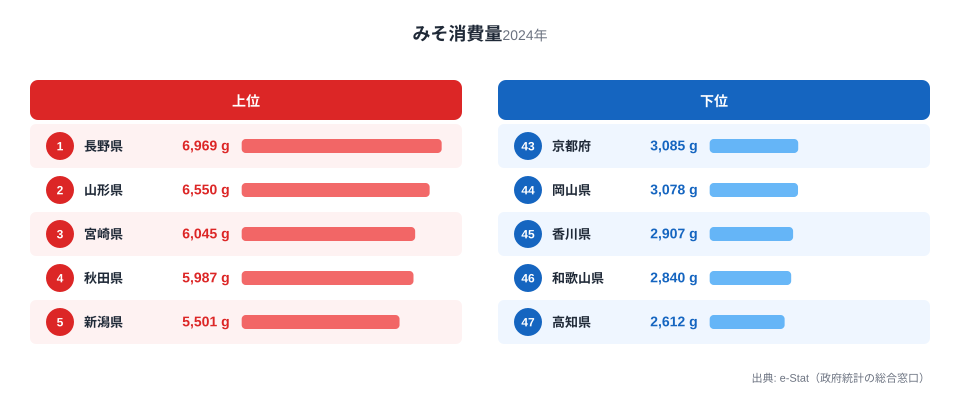
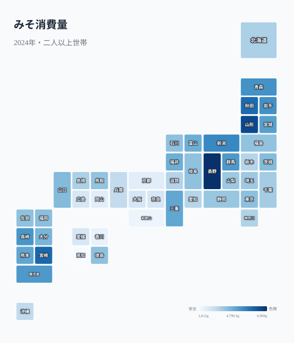

「みそ汁は日本の国民食」とよく言われますが、都道府県別の年間みそ消費量を見ると、その実態は一様ではありません。2024年の家計調査データでは、1位の長野県（6,969g）と最下位の高知県（2,612g）の差は2.7倍にのぼります。しかも上位10県のうち4県を東北勢が占める一方、近畿・四国は軒並み下位に沈むという、はっきりした東西の分断が見えてきます。

この記事では、みそ消費量の都道府県ランキングを2024年の最新データで確認しながら、なぜ長野が突出して多いのか、なぜ近畿・四国で消費が少ないのかを、気候・産地・食文化の違いから読み解きます。

## 2024年ランキング——上位5県と下位5県

**上位5県**は長野（1位・6,969g）、山形（2位・6,550g）、宮崎（3位・6,045g）、秋田（4位・5,987g）、新潟（5位・5,501g）の順です。長野は2位の山形と比べても400g以上の差をつけており、全国平均を大きく引き離す突出ぶりが目立ちます。

**下位5県**は京都（43位・3,085g）、岡山（44位・3,078g）、香川（45位・2,907g）、和歌山（46位・2,840g）、高知（47位・2,612g）と、近畿・瀬戸内・四国が並びます。最下位の高知は1位の長野の37%程度の消費量しかなく、同じ国内でここまで差が開くこと自体が驚きです。

> [!NOTE]
> データは総務省「家計調査」（2024年）による、**都道府県庁所在市の二人以上世帯**の年間みそ消費量（g）です。県内でも農村部と都市部で食生活が異なるため、県庁所在市（例: 高知市・長野市）の傾向であり、県全体を代表する値ではない点に注意してください。

<source-link href="/ranking/miso-consumption-quantity">みそ消費量ランキングの全47都道府県を見る</source-link>

上位を見ると、長野・新潟という中部山岳・日本海側の県に加え、山形・秋田・宮崎という東北+南九州の組み合わせが並びます。単純に「寒い地域が多い」わけではなく、産地であることと食文化が両方効いている構造が見えてきます。

## 地図で見る地域分布——東北・信越が濃く、近畿・四国が薄い

地図にすると、東北6県のうち山形・秋田・岩手・青森・宮城の5県が上位半分（24位以内）に入り、東日本全体が濃い色でまとまっているのがわかります。対照的に、近畿（大阪39位・奈良40位・京都43位・和歌山46位）、中国地方（広島41位）、四国（徳島21位を除き愛媛42位・香川45位・高知47位）は薄い色が連続し、西日本の中でも太平洋側・瀬戸内側にはっきりした「みそ消費が少ない帯」が広がっています。

この東西差は偶然ではなく、後述する信州みそ・東北の発酵食文化と、関西のだし文化・醤油優位の食習慣という、根の異なる食のアイデンティティの違いを反映していると考えられます。

## なぜ長野が圧倒的1位なのか——信州みそという「地場産業×食習慣」

長野県が1位である最大の理由は、**信州みそが全国のみそ生産量の過半数を占める一大産地**であることです。味噌の醸造業者数・生産量ともに全国トップクラスで、地元では味噌が日常の調味料として深く根付いています。長野県内では「みそ蔵見学」や味噌を使った郷土料理（おやきの具や信州そばの薬味など）も多く、味噌が食卓の中心にある食文化が形成されてきました。[長野県の地域特性](/areas/20000)を見ても、農業・食品加工業が地域経済の柱になっていることがわかります。

もう一つの要因が気候です。長野は内陸性の盆地気候で寒暖差が大きく、冬は厳しい寒さになります。かつてみそは保存食・発酵食品として、寒冷地の長い冬を越すための貴重なたんぱく源・塩分補給源でした。現代でも味噌汁を毎日の食卓に欠かさない習慣が、他県より濃く残っていると考えられます。

> [!TIP]
> 味噌には米みそ（信州みそ・仙台みそ）、豆みそ（愛知の八丁みそ）、麦みそ（九州・四国の一部）など地域ごとに種類が異なります。消費「量」だけを見ると気づきにくいですが、原料や色・塩分濃度の違いで一食あたりの使用量にも差が出るため、量の格差がそのまま「みそ汁を食べる頻度の格差」と一致するとは限りません。

## なぜ東北勢が上位に集中するのか——寒冷地の発酵食文化

上位10県のうち山形（2位）・秋田（4位）・岩手（6位）・青森（7位）の4県を東北が占めています（宮城も11位で僅差）。東北は日本でも有数の豪雪・寒冷地帯であり、長野と同様に**冬の保存食・発酵食品文化**が根強く残ってきた地域です。

東北の伝統的な食卓では、みそ汁に加えて「三五八漬け」や「なめこ汁」などみそを使う郷土料理が多く、朝食にみそ汁が欠かせない家庭が多いとされています。また、東北は稲作地帯であると同時に大豆の産地でもあり、地元産の大豆を使った自家製みそ（手前みそ）の文化が農村部を中心に残っていることも、消費量を押し上げる一因と考えられます。

一方で同じ東北でも福島（25位・4,371g）は中位にとどまっており、東北全体が一様に高いわけではない点には注意が必要です。県境を越えると生活圏が関東に近くなることや、都市化の進み方の違いが影響している可能性があります。

## なぜ近畿・四国が下位に沈むのか——だし文化と醤油優位の食習慣

下位県を見ると、近畿（大阪・奈良・京都・和歌山）・中国地方（広島）・四国（愛媛・香川・高知）に集中しています。この地域は**昆布だし・かつおだしを基本とする「だし文化」**が強く、うどん・そば・煮物などの味付けの主役がみそではなく醤油とだしになっている食習慣が背景にあると考えられます。[しょうゆ消費量ランキング](/ranking/soy-sauce-consumption-quantity)と合わせて見ると、みそが少ない県で醤油の消費が多いのかどうか、調味料同士のトレードオフを確認できます。

特に香川（45位）はうどん県として知られ、かつおだしと薄口醤油の味付けが食文化の中心にあります。高知（47位）も同様にかつおのたたきなど魚食文化が濃く、みそよりも醤油・塩・薬味を使う味付けが優勢です。[高知県の地域特性](/areas/39000)を見ると、カツオ漁業が地域産業の象徴であることがよくわかります。和歌山（46位）も梅干しや醤油（湯浅は醤油発祥の地とされます）の産地であり、みそ以外の発酵調味料が食卓の主役になっていることが、みそ消費の少なさにつながっていると考えられます。

> [!WARNING]
> この記事の「なぜ」の説明は、気候・産地・食文化からの合理的な推測であり、家計調査データそのものが原因を証明しているわけではありません。個別県の因果関係を厳密に特定するには、より詳細な食生活調査との突き合わせが必要です。

大阪（39位）・京都（43位）といった近畿の都市部が下位に沈んでいるのも特徴的です。外食・中食比率が高い都市部では、家庭でみそ汁を作る頻度自体が下がりやすく、地方の食文化に加えて都市化の影響も重なっている可能性があります。

## まとめ

- **1位は長野県（6,969g）**：全国みそ生産量の過半数を占める信州みその産地であり、寒冷な内陸気候と発酵食文化が消費量を押し上げています。
- **最下位は高知県（2,612g）**：1位の長野との差は2.7倍。かつおだし・醤油中心の食文化が背景にあると考えられます。
- **東北勢（山形・秋田・岩手・青森）が上位10県のうち4県を占める**：寒冷地の保存食文化と大豆産地としての伝統が共通の背景です。
- **近畿・四国は軒並み下位**：昆布・かつおの「だし文化」が強く、みそよりも醤油・塩ベースの味付けが優勢な地域が多く並びます。
- **同じ東北・近畿の中でも県によって差がある**（東北の福島は中位、四国の徳島は上位側）ため、地方全体で一括りにできない食文化の細かな違いも読み取れます。

みそ消費量の地域差は、単なる好みではなく、産地・気候・郷土料理・都市化度合いが折り重なった結果です。[経済カテゴリの指標一覧](/category/economy)では、他の食品消費に関する地域差も確認できます。

## データ出典

総務省「家計調査」（2024年）をもとに、都道府県庁所在市の二人以上世帯における年間みそ消費量（g）を集計。e-Stat 経由で整備。調査対象は各都道府県庁所在市の世帯であり、県全体の消費傾向を保証するものではありません。
