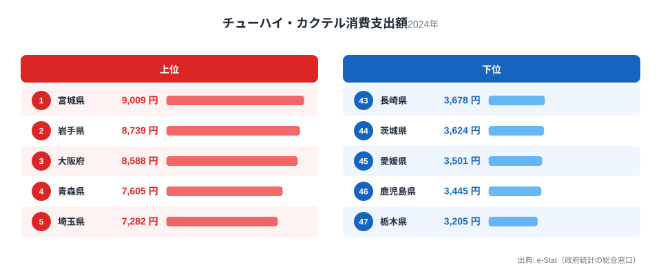
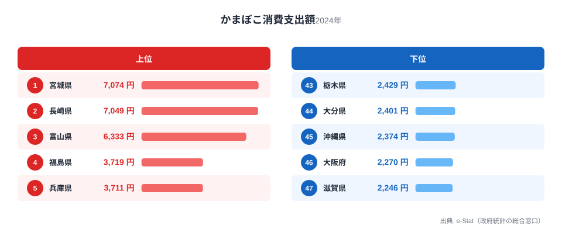
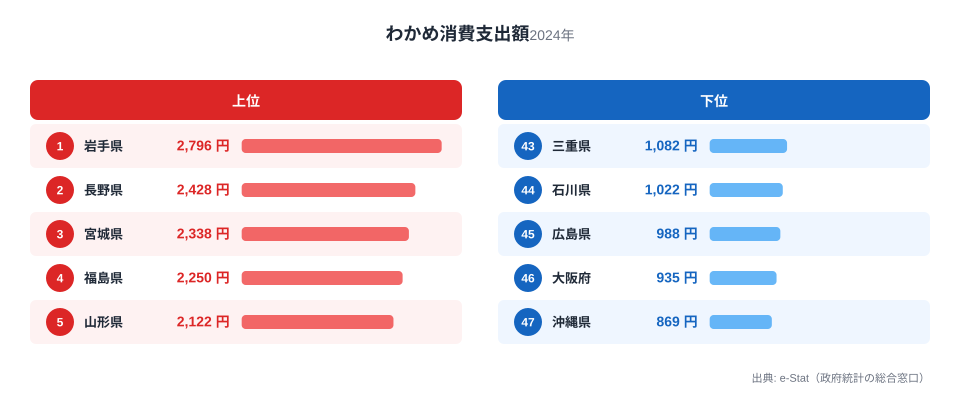
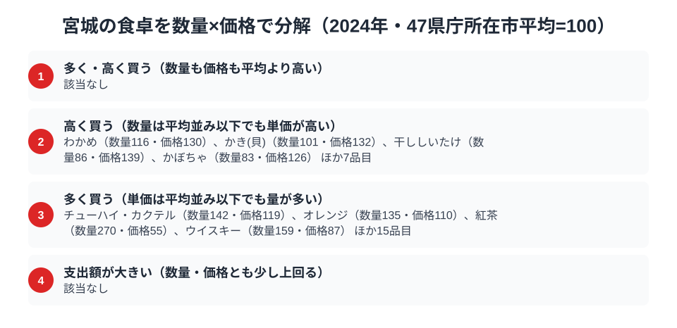

海に面した宮城県仙台市の食卓には、加工された海の幸と、それに合わせる酒が並びます。家計調査を見ると、2024年のチューハイ・カクテル消費支出額は9,009円で全国1位、かまぼこの消費支出額も7,074円で全国1位でした。2品目そろって全国トップという県はそう多くありません。

さらにわかめの消費支出額は2,338円で全国3位です。1位は隣の岩手県で2,796円、三陸の海を共有する両県が上位を占めています。酒と海産加工品がなぜここまで強いのか、宮城県民の食卓を家計調査のデータから読み解きます。

> [!NOTE]
> 家計調査の都道府県データは、県庁所在市（宮城県は仙台市）の二人以上世帯を対象にした年間支出額です。県全体ではなく仙台市在住世帯の家計簿から見た傾向であり、支出「金額」であって消費「量」そのものではない点にご注意ください。

## チューハイ・カクテル — 全国1位9,009円、東北の酒文化

<source-link href="/ranking/chuhai-consumption-expenditure">チューハイ・カクテル消費支出額ランキングをもっと見る</source-link>

宮城県のチューハイ・カクテル消費支出額は9,009円で全国1位です。2位は岩手県で8,739円、3位は大阪府で8,588円と続き、最下位の栃木県は3,205円で、宮城とは2.8倍の差があります。上位に東北勢が並ぶ一方、最下位が同じ東日本の栃木県という点は興味深い偏りです。

仙台は牛たん・海鮮などつまみの選択肢が豊富な外食文化を持ち、家庭でも缶チューハイを気軽な晩酌の定番として選ぶ層が厚いと考えられます。日本酒どころとしての土地柄がありながら、実際の支出は手頃な缶チューハイに向かっているという構図は、東北の酒消費の中でも独特の位置づけです。

## かまぼこ — 全国1位7,074円、笹かまの本場

<source-link href="/ranking/fish-paste-consumption-expenditure">かまぼこ消費支出額ランキングをもっと見る</source-link>

かまぼこの消費支出額も宮城県が7,074円で全国1位です。2位は長崎県で7,049円とわずか25円差の大接戦、3位は富山県で6,333円でした。かまぼこの名産地として知られる複数の県が上位に並ぶ、産地色の強いランキングです。

宮城1位の背景には、仙台名物「笹かまぼこ」の存在があります。白身魚のすり身を笹の葉形に焼き上げた笹かまぼこは、土産物としてだけでなく、地元の食卓でもおかずやおつまみとして日常的に食べられています。長崎の魚肉練り製品文化、富山のかまぼこ文化とはそれぞれ由来が異なりますが、いずれも豊かな漁場を背景に練り物加工が発達した土地という共通点があります。

## わかめ — 全国3位2,338円、1位は隣の岩手県

<source-link href="/ranking/wakame-consumption-expenditure">わかめ消費支出額ランキングをもっと見る</source-link>

わかめの消費支出額は宮城県が2,338円で全国3位です。1位は岩手県で2,796円、2位は長野県で2,428円で、宮城はそのすぐ後ろにつけています。最下位の沖縄県は869円で、宮城とは2.7倍の開きです。

三陸海岸は日本有数のわかめ養殖地で、宮城・岩手の両県にまたがって漁場が広がっています。隣県の岩手が1位を占めているのは、三陸わかめの主産地が岩手県側の海域に厚く分布していることの裏返しでもあり、宮城が3位につけているのは同じ三陸ブランドの恩恵を受けているためと見られます。海を挟んで隣り合う2県が仲良く上位に並ぶのは、単一の漁場文化圏がそのまま消費データに反映された結果です。

> [!WARNING]
> 家計調査は支出金額の調査であり、消費量そのものではありません。笹かまぼこのように土産物として県外へ出荷される分は、宮城県内の家計簿には計上されない点にも注意が必要です。支出額はあくまで「仙台市の世帯が自分の財布から払った金額」であり、宮城の水産加工品全体の生産・消費規模を直接示すものではありません。

## 宮城の食卓を貫くもの

宮城県民の食卓を貫くのは、「三陸の海の幸と、それに合わせる酒」です。かまぼこは海の恵みを加工品として日常に取り込み、わかめは三陸ブランドの一角として食卓に上り、チューハイはそれらのつまみを引き立てる晩酌の主役になっています。海産加工品と酒という異なるジャンルが、同じ「仙台の食卓」の中でどちらも全国トップ級という点が宮城の特徴です。

かつお1本に支出が集中する高知の「特化型」や、カップ麺・ほたて・りんごと品目ごとに背景の異なる青森の「多面型」と比べると、宮城は「海の幸→加工→晩酌」という一連の生活動線が3品目に一貫して表れている点が異なります。品目は3つでも、そこに宿るストーリーは1本の線でつながっているのが宮城型の食卓です。

> [!TIP]
> かまぼこの1位（宮城）とわかめの3位（宮城、1位は岩手）を見比べると、同じ三陸の海産物でも品目によって主産地が微妙にずれていることがわかります。「三陸=一枚岩」ではなく、わかめは岩手側、かまぼこ加工は宮城側という役割分担が支出データからも読み取れる点は、単純な地域括りでは見えにくい発見です。

## 数量×価格で分解する仙台市の食卓

<source-link href="/ranking/chuhai-consumption-quantity">チューハイ・カクテル消費量ランキングをもっと見る</source-link>

家計調査の支出額は、突き詰めると「数量×価格」に分解できます。同じ支出額1位でも、たくさん買っているから金額が大きいのか、それとも単価の高いものを選んでいるから金額が大きいのかでは、食卓の姿がまったく異なります。ここでは家計調査で数量と支出額の両方が公表されている品目について、47都道府県庁所在市の平均を100とした数量指数と価格指数を作り、仙台市の食卓がどちらの理由で支出額を押し上げているのかを品目ごとに分けて見ていきます。宮城県では対象124品目のうち、価格指数が高い品目が11、数量指数が高い品目が19あり、数量・価格とも高い品目は1つもありませんでした。

まず冒頭で紹介したチューハイ・カクテルです。支出額では全国1位でしたが、数量指数は142で全国的にも上位に入るのに対し、価格指数は119にとどまり、「高く」買う品目とみなす目安の120には届きません。つまり宮城の世帯は単価の高い商品を選んでいるわけではなく、缶チューハイを人より多く飲んでいるために支出額が押し上げられているということです。チューハイ・カクテル消費量ランキングでも宮城は数量そのものが全国上位に入っており、「牛たんや海鮮のつまみに合わせて手頃な缶チューハイを気軽に飲む」という先の解説を、数量の物差しからも裏づける結果になっています。

逆に「高く」買う側に回るのが、わかめやかき（貝）、干ししいたけ、かぼちゃといった品目です。わかめの数量指数は116とほぼ平均並みですが、価格指数は130で仕入れ単価が3割ほど高く、支出額指数は150を超えます。全国3位という支出額の順位は、たくさん食べているというより「良いわかめを選んで買っている」ことの表れといえます。同様にかき（貝）は数量指数101・価格指数132、干ししいたけは数量指数86・価格指数139、かぼちゃは数量指数83・価格指数126と、いずれも量は平均並みかそれ以下でありながら価格指数だけが目立って高くなっています。三陸の魚介と地場の野菜を、量よりも質にこだわって選ぶ食卓の姿が、数量と価格を切り分けることで見えてきます。

> [!TIP]
> 支出額のランキングだけを見ていると、「たくさん食べている」のか「高いものを選んでいる」のかを取り違えがちです。宮城の場合、酒は数量で、海産物・野菜は価格で支出額を押し上げており、同じ「支出額1位」でも中身の理由はまったく逆でした。

> [!NOTE]
> この指数の基準は家計調査の全国値ではなく、47都道府県庁所在市（二人以上世帯）の単純平均を100としたものです。価格指数は「支出額÷数量」から求めた相対値のため、同じ品目内でも買っている品種やブランド、グレードの違いを含み、純粋な市場価格の高低とは異なります。対象は2024年の仙台市（二人以上世帯）の年間データです。

## まとめ

- チューハイ・カクテル消費支出額は宮城県が全国1位（9,009円）、東北の酒消費を牽引
- かまぼこも全国1位（7,074円）、仙台名物「笹かまぼこ」の日常消費が反映
- わかめは全国3位（2,338円）、1位は隣県の岩手県で2,796円、三陸ブランドを共有
- チューハイ最下位は栃木県が3,205円、わかめ最下位は沖縄県が869円
- 「海の幸→加工→晩酌」という一貫した生活動線が3品目に表れる宮城型の食卓

宮城県の他の統計は[宮城県の地域プロフィール](/areas/04000)、食品・家計消費の地域差は[経済カテゴリ一覧](/category/economy)から、東北の食文化の比較は[青森の食卓の記事](/blog/aomori-food-culture)からもご覧いただけます。

## データ出典

総務省統計局「家計調査（品目別）」（2024年、都道府県庁所在市 二人以上世帯）をもとに、e-Stat（政府統計の総合窓口）経由で整備したデータを使用しています。
