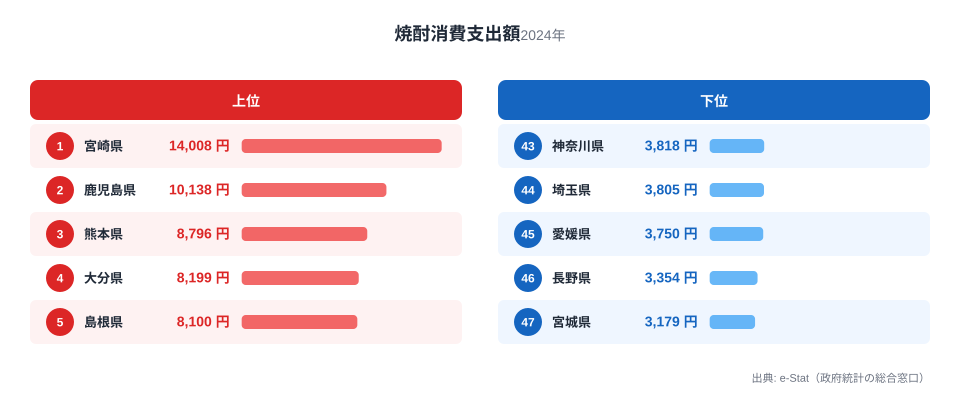
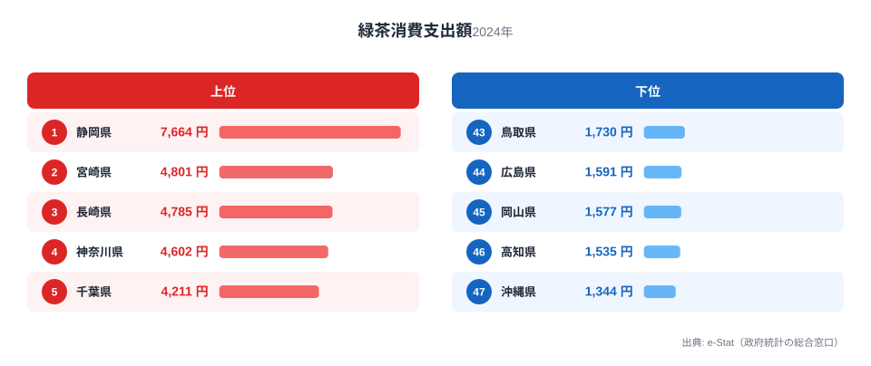
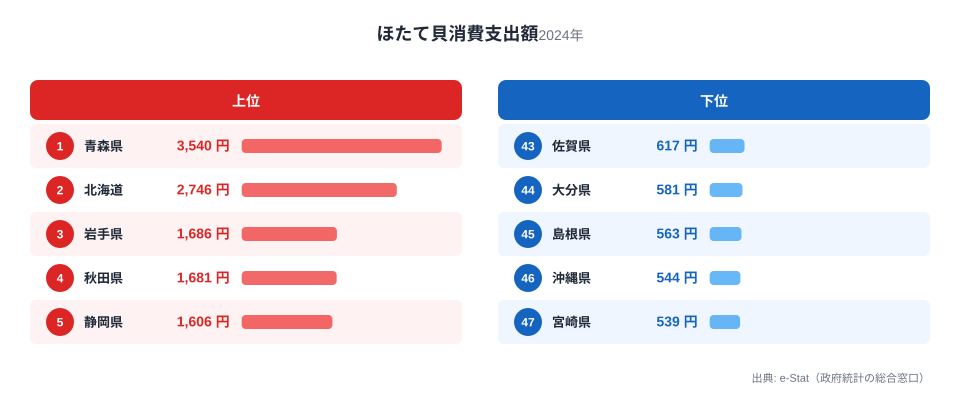
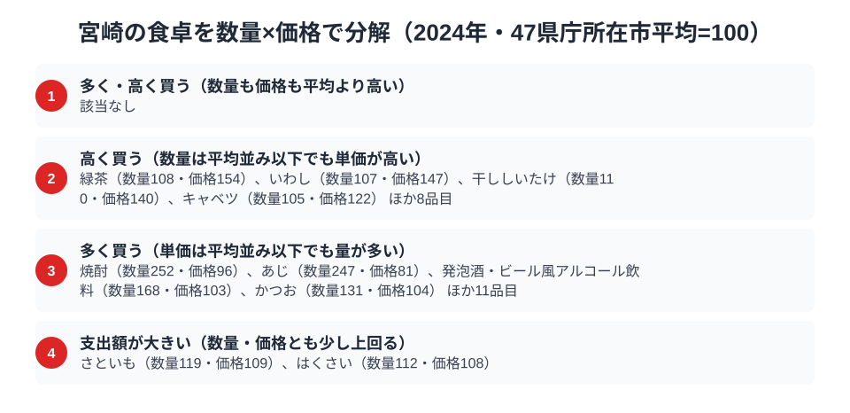

宮崎県の食卓には、南国ならではのはっきりした個性があります。総務省の家計調査（品目別）で宮崎市の二人以上世帯を見ると、焼酎の消費支出額は14,008円で全国1位。全国屈指の焼酎どころであることが、数字にも明快に表れています。

さらに緑茶も全国2位と、宮崎は南九州の「飲みもの文化」で全国トップクラスに並びます。ところが同じ宮崎が、ほたて貝では全国最下位に沈みます。この記事では、焼酎・緑茶・ほたてという3つの品目を横断しながら、南国・宮崎の食卓の輪郭を「何を飲み、何を食べないか」の両面から読み解きます。

> [!NOTE]
> 家計調査の都道府県データは、県庁所在市（宮崎県は宮崎市）の二人以上世帯を対象にした年間支出額です。県全体ではなく宮崎市在住世帯の家計簿から見た傾向であり、支出「金額」であって消費「量」そのものではない点にご注意ください。

## 焼酎 — 全国1位14,008円、南九州の芋焼酎文化

<source-link href="/ranking/shochu-consumption-expenditure">焼酎消費支出額ランキングをもっと見る</source-link>

宮崎県の焼酎消費支出額は14,008円で全国1位です。2位の鹿児島県10,138円を上回り、最下位の宮城県3,179円と比べると4.4倍もの開きがあります。宮崎・鹿児島を中心とする南九州は、芋焼酎をはじめとする本格焼酎の一大産地であり、消費額でも全国を圧倒しています。

宮崎では、晩酌といえば焼酎という家庭が多く、お湯割り・水割り・ロックと季節や好みに応じて楽しむ文化が深く根づいています。地元の蔵元が造る多彩な焼酎が身近にあり、日常の食卓に欠かせない存在です。清酒（日本酒）が寒冷地の米どころで強いのとは対照的に、温暖な南九州では蒸留酒である焼酎が晩酌の主役を担ってきた歴史があります。

## 緑茶 — 全国2位4,801円、知られざる茶どころ

<source-link href="/ranking/green-tea-consumption-expenditure">緑茶消費支出額ランキングをもっと見る</source-link>

意外に思われるかもしれませんが、宮崎は緑茶の消費支出額でも全国2位（4,801円）です。首位の静岡県は7,664円ですが、宮崎はそれに次ぐ位置につけています。宮崎は「日向茶」「都城茶」など知られざる茶産地であり、隣の鹿児島とともに南九州は静岡に次ぐお茶の一大生産地です。

温暖な気候と豊かな日照が茶の栽培に適しており、地元で良質な茶葉が手に入る環境が家庭での消費を支えています。焼酎という「酒の飲みもの」と緑茶という「茶の飲みもの」、その両方で全国トップクラスに立つのが宮崎の特徴で、南九州が「飲みもの文化の豊かな土地」であることがうかがえます。

## ほたて貝 — 全国最下位539円、南国と寒流の距離

<source-link href="/ranking/scallop-consumption-expenditure">ほたて貝消費支出額ランキングをもっと見る</source-link>

飲みものでは全国トップの宮崎ですが、ほたて貝の消費支出額は539円で全国最下位です。1位の青森県は3,540円で、宮崎の539円はそのおよそ15%にとどまります。ほたては青森・北海道といった寒流域が主産地で（[青森県の食卓](/blog/aomori-food-culture)ではほたてが全国1位）、暖かい日向灘に面した宮崎はほたての産地から遠く、食文化としても縁が薄いのです。

宮崎の海の幸といえば、かつおや伊勢海老など黒潮・暖流の魚介が中心のイメージです。実際にかつおは「多く買う」品目（支出指数136.7）として、近海の魚を安く多く食べる宮崎の食卓を裏付けています。寒流の貝であるほたてが最下位に沈むのは、「地元でとれる・手に入りやすい食材が食卓の中心を占める」という県民の食卓の基本原則が、ここでも働いているためと考えられます。飲みものでは全国一でも、寒流の魚介では最下位という凸凹こそが、南国・宮崎の食卓の個性です。

> [!WARNING]
> 家計調査は支出金額の調査であり、消費量そのものではありません。物価や単価の違いも金額に影響します。「ほたてが最下位＝まったく食べない」ではなく、暖流の魚介など別の食材に支出が向かっている結果として読み解く必要があります。

## 宮崎の食卓を貫くもの

宮崎県民の食卓を貫くのは、「南九州の温暖な気候が育んだ飲みもの文化」と「暖流の恵みへの特化」です。芋焼酎と緑茶という2つの飲みもので全国トップクラスに立ち、魚介は黒潮・暖流のものに偏っています。温暖な気候という一つの条件が、上位品目（焼酎・緑茶）と下位品目（ほたて）の両方を決めています。

北海道の「海と大地の豊穣型」、静岡の「山の茶と海のまぐろ」と並べると、宮崎は「南九州の飲みもの文化＋暖流特化型」。同じ「茶どころ」でも静岡と宮崎では気候の背景が異なり、同じ「海に面した県」でも寒流の北海道と暖流の宮崎では食卓がまったく違うことが、地域比較から見えてきます。

> [!TIP]
> 県の食文化を読むときは、「酒類」と「茶類」という飲みものの傾向にも注目すると発見があります。宮崎のように焼酎（蒸留酒）と緑茶がともに強い県は温暖な西日本・南九州に多く、清酒（日本酒）が強い県は寒冷な米どころに多い、という飲みものの地理も食卓の個性を映し出します。

## 数量×価格で分解する宮崎市の食卓

<source-link href="/ranking/taro-consumption-quantity">さといも消費量ランキングをもっと見る</source-link>

「支出額 = 数量 × 価格」に分解すると、宮崎市の食卓はさらにくっきり見えてきます。家計調査で数量と価格の両方が分かる食料124品目を、47県庁所在市の平均を100とした指数で確かめると、数量・価格ともに平均を上回る「多く・高く買う」品目は0でした。焼酎はすでに見たとおり数量指数252・価格指数96で、量は圧倒的に多いのに単価は平均並み以下という「多く買う」型です。緑茶は数量指数108・価格指数154で、量は平均並みでも単価が高い「高く買う」型にあたります。同じ「飲みもの全国トップ」でも、焼酎は量で、緑茶は単価で稼いでいることになります。

高く買う品目は緑茶のほかにいわし（数量107・価格147）、干ししいたけ（数量110・価格140）、キャベツ（数量105・価格122）ほか8品目、計12品目です（「他の柑きつ類」など『他の〜』の集計項目を除く）。多く買う品目は焼酎のほかにあじ（数量247・価格81）、発泡酒・ビール風アルコール飲料（数量168・価格103）、かつお（数量131・価格104）ほか11品目、計15品目で（同じく『他の〜』の集計項目を除く）、黒潮に面した宮崎らしく、近海の魚を安く多く食べる傾向が並びます。

数量・価格ともにわずかに平均を上回り、支出額指数だけが120を超える「支出額が大きい」品目は、さといもとはくさいの2つだけでした。さといも消費量の指数は119、価格指数は109、支出額指数は130です。はくさいは数量112・価格108・支出額122でした。反対にほたて貝は数量指数52・価格指数95で、量そのものが平均の半分程度まで落ち込んでいます。宮崎の食卓は、焼酎や近海魚のように「量で伸びる品目」と、ほたてのように「量が細る品目」の差が大きい構成だと言えます。

> [!NOTE]
> ここでの指数は47都道府県庁所在市の単純平均を100とした値で、記事冒頭の「全国」順位とは基準が異なります。価格指数は「支出額÷数量」から求めた見かけの単価で、品種・銘柄・パック単位の違いも含みます。対象は宮崎市の二人以上世帯・2024年の年間データです。

> [!TIP]
> さといもは数量・価格のどちらも平均よりわずかに高いだけですが、支出額指数は130まで積み上がります。数量と価格が「そろって少し高い」品目は、支出額で見ると一気に目立つ、という読み方の一例です。

## まとめ

- 焼酎消費支出額は宮崎県が全国1位（14,008円）、南九州の芋焼酎文化
- 緑茶も全国2位（4,801円）、日向茶など知られざる茶どころ
- ほたて貝は全国最下位（539円）、暖流の宮崎は寒流の貝と縁が薄い
- 温暖な気候が「飲みもの全国トップ」と「寒流魚介最下位」の両方を生む南国型の食卓

宮崎県の他の統計は[宮崎県の地域プロフィール](/areas/45000)、食品・家計消費の地域差は[経済カテゴリ一覧](/category/economy)からご覧いただけます。

## データ出典

総務省統計局「家計調査（品目別）」（2024年、都道府県庁所在市 二人以上世帯）をもとに、e-Stat（政府統計の総合窓口）経由で整備したデータを使用しています。
