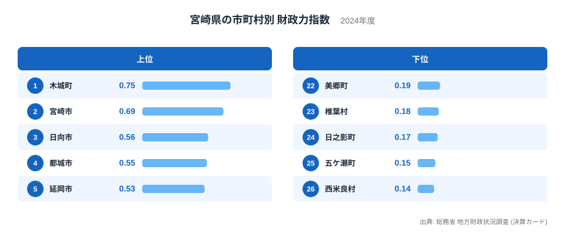
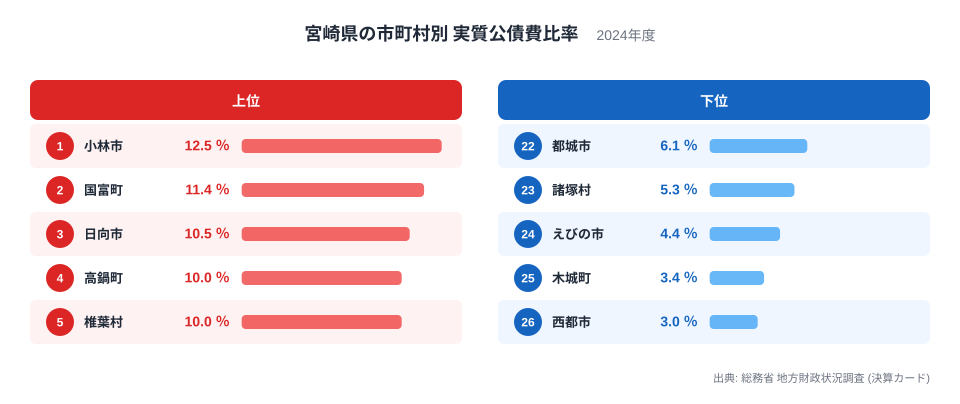
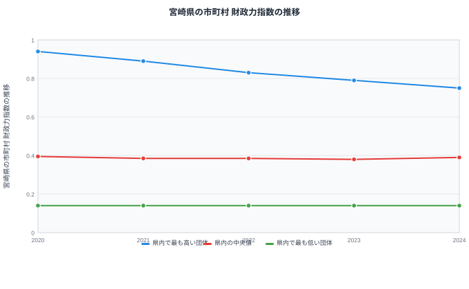

## 宮崎県26市町村を財政の面から見る

宮崎県には26の市町村があります。太平洋に面した平野部の市と、九州山地に連なる山間部の町村が同じ県内に共存しており、それぞれの財政の姿もさまざまです。ここでは総務省の地方財政状況調査から、財政力指数と実質公債費比率という2つの指標を使い、県内26市町村のあいだにある財政の差を見ていきます。

財政力指数は、自分の力でどれだけの行政需要をまかなえるかを示す指標です。実質公債費比率は、借入金の返済がどれだけ財政の重荷になっているかを示す指標です。宮崎県のデータでは、財政力指数の1位が県庁所在地の宮崎市ではないという、県庁所在地が最上位になるとは限らない例が見られます。

26の市町村を並べると、平野部と山間部という地形の違いが、財政の姿にもはっきりと表れています。以下では、財政力指数と実質公債費比率の両方を確認しながら、県内の自治体ごとの位置づけを見ていきます。

## 財政力指数で見る木城町と宮崎市の関係

財政力指数の1位は木城町で、0.75です。2位は宮崎市で0.69、3位は日向市で0.56と続きます。県庁所在地の宮崎市は行政機能や商業施設が集まる県内最大の都市ですが、財政力指数で見ると木城町のほうがわずかに上回っています。

一方、下位に目を向けると、西米良村が0.14でもっとも低く、五ケ瀬町が0.15、日之影町が0.17と続きます。これらはいずれも九州山地に近い山間部の小さな自治体で、人口が少なく税収の基盤となる産業や事業所も限られているため、自分の力でまかなえる財政需要の割合がどうしても小さくなります。財政力指数は基準財政収入額を基準財政需要額で割って算出する指数のため、人口規模が小さく税源が乏しい自治体ほど数値が低く出やすい仕組みになっています。

## 実質公債費比率で見る借金返済の重さと木城町の身軽さ

実質公債費比率がもっとも高いのは小林市で、12.5％です。次いで国富町が11.4％、日向市が10.5％と続きます。小林市の財政力指数は0.39で13位と、県内のちょうど中位に位置しており、財政力が突出して強いわけでも弱いわけでもない自治体が、借金返済の負担では県内でもっとも重い位置にあることになります。日向市も財政力指数で3位に入っており、財政力が比較的強い一方で借金返済の負担も重いという組み合わせになっています。

もっとも低いのは西都市で、3％です。次いで木城町が3.4％、えびの市が4.4％と続きます。ここで注目したいのは木城町です。財政力指数で県内1位に立つ木城町は、実質公債費比率でも県内で2番目に低く、財政力の強さと借金返済の軽さの両方を兼ね備えた自治体になっています。

宮崎市についても見ておくと、財政力指数は2位でありながら、実質公債費比率は7.9％で13位と、県内の中位に位置しています。財政力指数が県内トップクラスであっても、実質公債費比率まで軽いほうの上位に入るとは限らないことが、宮崎市と木城町を比べることで見えてきます。

## 財政力指数の推移から見える緩やかな低下

2020年から2024年までの5年間で、県内でもっとも高い団体の財政力指数は0.94から0.75へと下がってきました。中央値は0.38から0.395のあいだでほぼ横ばいに推移し、もっとも低い団体は0.14のまま5年間変わっていません。

もっとも高い団体の値がこの5年で大きく下がっている点は、中央値やもっとも低い団体の動きと比べても目立っています。中央値と下位の団体がほとんど動いていない一方で、上位の団体だけが下がってきたということは、県内でもっとも財政力の強い自治体とそれ以外の自治体との差が、この5年で縮まってきたことを示しています。財政力指数は基準財政収入額と基準財政需要額から算出される指数で、人口や産業構造といった長期的な要因に左右されるため、こうした緩やかな変化が積み重なって現れます。急な制度変更などがない限り、こうした差の縮小や拡大は数年単位でゆっくりと進みます。

## 宮崎県の財政をさらに見るには

この記事で見てきたように、財政力指数の1位が県庁所在地の宮崎市ではなく木城町であること、そして木城町が実質公債費比率でも県内で身軽な部類に入ることは、単純に「都市部が有利」という見方だけでは説明できない組み合わせです。宮崎県の26市町村を見るときは、財政力指数と実質公債費比率をあわせて確認することをおすすめします。

一方で、財政力指数で下位に並ぶ町村が、実質公債費比率でも軽い側にまとまっているわけではありません。日之影町は財政力指数で24位と下位ですが、実質公債費比率は8.8％で7位と、県内でも借金返済の負担が重い側に入っています。財政力の弱い自治体が、借金返済の負担まで軽いとは限らないことが、財政力指数と実質公債費比率の両方で良い位置にある木城町とは対照的な例として見えてきます。

宮崎県の26市町村を財政力指数と実質公債費比率で並べると、両方の面で良い位置にある木城町、両方の面で厳しい位置にある町村、そして小林市や日向市のように財政力は中位から上位でも借金返済の負担が重い自治体まで、組み合わせのパターンはさまざまです。県庁所在地かどうか、都市部か山間部かといった見た目の分かりやすい区分だけでは、実際の財政の姿を言い当てられないことが、このデータからは読み取れます。

宮崎県全体の財政や他の指標については[宮崎県のデータ](/areas/45000)で確認できます。市町村を横断した地方財政のテーマは[地方財政のテーマ](/themes/local-finance)にまとまっており、行財政に関する他の統計は[行財政の統計一覧](/category/administrativefinancial)から探せます。都道府県単位での財政力の違いを見たい場合は[都道府県別の財政力指数](/ranking/fiscal-strength-index-prefecture)も参考になります。

> [!NOTE]
> 財政力指数は、自分の力でまかなえる行政需要の割合を示す指数で、1に近いほど独自の財源が豊かなことを意味します。1を下回っても財政が破綻しているわけではなく、地方交付税によって不足分が補われる仕組みが前提になっています。

> [!WARNING]
> 財政力指数がもっとも高い自治体は、必ずしも県庁所在地とは限りません。宮崎県では木城町が宮崎市を上回っており、都市部の自治体ほど財政力指数が高いと決めつけて読むと、順位を見誤ります。

> [!TIP]
> 26市町村を比べるときは、宮崎市のような都市部の自治体と、木城町のような比較的小規模な自治体を同じ物差しで単純比較しないことが大切です。財政力指数と実質公債費比率をあわせて見ることで、それぞれの市町村の立ち位置がより具体的に見えてきます。

## データ出典

総務省 地方財政状況調査（決算カード）、2024年度
