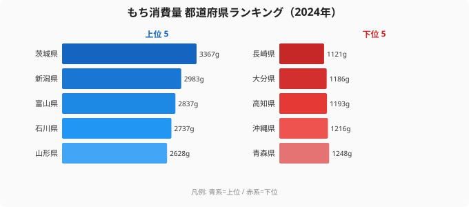

「餅といえば、雪深い北陸や米どころ新潟」――そんなイメージを持つ人は多いはずです。ところが2024年の家計調査でもち消費量の都道府県ランキングを見ると、トップに立ったのは餅の本場とは言いにくい**[茨城県](/areas/08000)**でした。

もち消費量とは、都道府県庁所在市の二人以上世帯が1年間に購入したもち（包装餅など）の量で、ここでは1世帯あたりの年間グラム数で比べます。2024年の1位は茨城県の3,367g、最下位は[長崎県](/areas/42000)の1,121gで、その差は実に**3.0倍**にのぼります。同じ日本でも、住む場所で餅の食卓登場回数がここまで変わるのです。

なぜ「餅どころ」の新潟や北陸ではなく茨城がトップなのでしょうか。そして、なぜ九州勢が軒並み下位に沈むのでしょうか。この記事では2024年の47都道府県データから、餅消費に潜む地域の食文化構造を読み解きます。

> [!NOTE]
> このランキングは家計調査（総務省）に基づく、都道府県庁所在市の二人以上世帯の年間もち購入量です。自宅でついた餅や贈答品は含まれにくく、店頭で購入する「包装餅」の消費傾向を映している点に注意してください。

## もち消費量ランキング2024：上位は東日本が席巻

まず2024年の上位5県と最下位5県を見てみましょう。

トップに立った茨城県は3,367gで、2位の[新潟県](/areas/15000)（2,983g）を400g近く引き離しました。続く富山県（2,837g）、石川県（2,737g）と、北陸の「餅どころ」がしっかり上位に並びます。5位には山形県（2,628g）が入り、東北の米どころも健在です。

注目すべきは、上位10のうち茨城・栃木（9位、2,414g）という北関東勢と、新潟（2位）・富山（3位）・石川（4位）の北陸3県が同居している点です。福井県は12位（2,367g）と惜しくも10位圏には届きませんでしたが、北陸全体として上位に厚く分布しています。東日本、とりわけ「冬が長く米の生産が盛んな地域」が餅をよく食べる、という大きな傾向が見て取れます。

なぜ上位が東日本に偏るのでしょうか。雪国では正月に向けて餅を多めに用意し、雑煮や焼き餅として日常的に食べる習慣が残っています。北陸・東北は米の生産が盛んで、餅米を使った餅づくりが暮らしに根づいてきた地域です。さらに北関東の茨城・栃木は、米どころでありながら正月行事を厚く残す県でもあり、米の産地効果と行事食文化の両方が重なって上位に押し上げられたと読めます。1位の茨城が餅の「本場」イメージのない県だからこそ、この重なりの強さが際立ちます。

<source-link href="/ranking/mochi-consumption-quantity">もち消費量ランキングの全47都道府県を見る</source-link>

> [!TIP]
> 上位に北陸・東北の米どころが並ぶのは予想どおりですが、北関東の茨城・栃木が食い込むのは見落としがちなポイントです。餅は「米の産地」と「正月行事を厚く残す地域」の重なりで多くなる傾向があると読むと、茨城首位の意外さが腑に落ちます。

## 最下位グループ：九州・四国が沈む西日本の低調

下位5県を切り出すと、地域の偏りがさらにはっきりします。青森県（1,248g・43位）・沖縄県（1,216g・44位）・高知県（1,193g・45位）・大分県（1,186g・46位）・長崎県（1,121g・47位）が最下位グループです。

最下位は長崎県の1,121gでした。大分県（1,186g）、高知県（1,193g）と、九州・四国の県が下位に固まっています。山口県（42位、1,281g）、宮崎県（41位、1,289g）、岡山県（40位、1,426g）も加えると、西日本、とりわけ九州・四国・中国地方の西側が「餅をあまり食べない地域」として浮かび上がります。

なぜ西日本が下位に沈むのでしょうか。亜熱帯気候で雑煮文化が本州とは異なる沖縄県（44位、1,216g）が下位なのは想像しやすいところです。九州・四国では正月の雑煮に丸餅を用いる地域が多く、角餅を何枚も焼いて食べる東日本ほど餅の出番が多くないと考えられます。温暖で雪も少ない地域では、餅を蓄えて冬を越すという必然性も薄れます。こうした食習慣と気候の違いが積み重なって、西日本の低調につながっているのでしょう。

一方で、米どころのイメージもある東北の青森県（43位、1,248g）が下位グループに入っているのは意外です。「東北＝餅をよく食べる」と一括りにはできず、同じ東北でも山形（5位、2,628g）と青森（43位）で大きく分かれています。地域ブロックの大ざっぱな印象だけで餅消費を語ると、こうした例外を見落としてしまうのです。

<source-link href="/ranking/mochi-consumption-quantity">下位県を含む全順位をランキングで確認する</source-link>

> [!WARNING]
> 家計調査は調査対象世帯が毎年入れ替わり、サンプル規模も都道府県庁所在市の一部世帯に限られます。単年の順位は変動が大きく、たとえば茨城が常に1位とは限りません。また自家製の餅は購入量に表れないため、餅づくりが盛んな地域ほど順位が実態より低く出る可能性があります。長期傾向を見るときは複数年の平均で捉えるのが安全です。

## 餅は「米どころ」より「正月文化の濃さ」に効くのか

上位を「米の生産量が多い地域」だけで説明しようとすると、うまくいきません。米どころの代表格である秋田県（35位、1,670g）が中位以下に沈み、逆に北関東の茨城・栃木が上位に入っているからです。

ここから読み取れるのは、餅消費が単なる「米の産地効果」ではなく、**正月の雑煮や鏡餅、行事食として餅を多用する食習慣の濃さ**に左右されている可能性です。東日本では角餅・焼き餅を雑煮に入れる文化が根強く、家庭での餅の出番が多くなります。一方、西日本では雑煮の餅が丸餅でも量が控えめだったり、餅以外の正月料理の比重が高かったりする地域があると考えられます。秋田が下位に沈む一方で茨城が首位に立つというねじれは、「米があるから餅を食べる」という単純な図式では説明しきれないことを物語っています。

> [!NOTE]
> **[仮説]** 「米の産地」より「正月行事で餅を使う頻度・量」のほうがもち消費量を強く説明する、という見立てです。これを確かめるには、雑煮の餅使用量や正月の餅料理の品目数といった食文化データとの突合が必要で、本データだけでは断定できません。

## 大都市の東京10位が示す「買う餅」の存在

もう一つ見逃せないのが、東京都が10位（2,405g）、大阪府が20位（2,017g）と、大都市でも餅消費が決して低くない点です。大都市は自宅で餅をつく機会が少ないはずなのに、上位から中位に入っています。

これは、家計調査が捉えているのが主に**店頭で買う包装餅**であることを示唆します。餅つきをしない都市世帯ほど、むしろスーパーで包装餅を購入してデータに乗りやすいのです。そう考えると、東京の高さも説明がつきます。逆に、自家製餅が多い地域では「購入量」に表れにくく、実際の餅消費を過小評価している可能性もあります。

つまりこのランキングは「餅をたくさん食べる県」というより、「店で餅をよく買う県」を映した指標として読むのが正確です。茨城の首位や東京の健闘も、自家製ではなく市販の包装餅という土俵で測った結果だと捉えると、数字の意味がよりはっきりします。

## まとめ

- 2024年のもち消費量1位は**茨城県（3,367g）**で、餅の本場とされる新潟（2位、2,983g）・富山（3位、2,837g）を抑えました。
- 最下位は**長崎県（1,121g）**で、1位茨城との差は**3.0倍**になります。
- 上位は北関東・北陸・東北（山形）など東日本の米どころが席巻し、下位は長崎・大分・高知など九州・四国に集中しました。
- 同じ東北でも山形（5位）と青森（43位）で大きく分かれ、「東北＝餅好き」とは一括りにできません。
- 東京10位・大阪20位と大都市も高めです。家計調査が映すのは「店で買う包装餅」であり、餅消費そのものとは少しズレる点に注意してください。

## データ出典

総務省「家計調査」（2024年）。都道府県庁所在市の二人以上世帯の年間もち購入量を、e-Stat 経由で整備・集計したものです。
