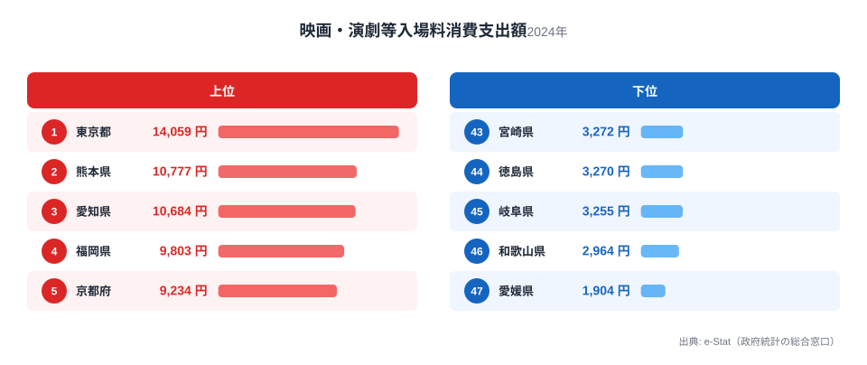
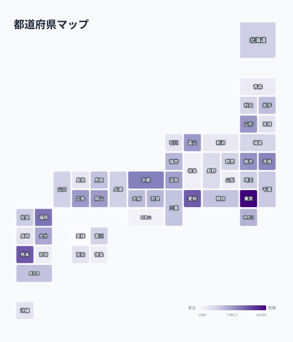

映画館や劇場のチケット代に、私たちは年間どれくらいのお金を使っているのでしょうか。総務省「家計調査」の「映画・演劇等入場料」の消費支出額を都道府県別に見ると、1位の東京都と47位の愛媛県では約7.4倍もの開きがあります。

しかも、この差は単純に「都会だから多い、地方だから少ない」では説明がつきません。2位に入ったのは大都市圏ではなく熊本県です。人口の多さや大都市かどうかだけでは、映画・演劇への支出額は決まらないのです。この記事では、上位・下位の顔ぶれから、映画館という「施設」へのアクセスのしやすさと、家計の可処分所得、そして地域の余暇文化がどう絡み合っているのかを探ります。

> [!NOTE]
> この指標は総務省「家計調査」の「映画・演劇等入場料」の消費支出額です。映画館の入場料だけでなく、劇場・音楽ホールでの観劇・コンサート等の入場料も含む合算値のため、映画館の集客力だけを表す数値ではありません。世帯単位の平均支出額であり、鑑賞回数そのものを直接示すものでもない点にご注意ください。

## 上位と下位

<source-link href="/ranking/movie-theater-consumption-expenditure">映画・演劇等入場料ランキングをもっと見る</source-link>

1位は東京都の14,059円で、2位の熊本県10,777円を3割以上も引き離しています。東京には大型シネマコンプレックスやミニシアター、劇場が集積しており、選択肢の多さがそのまま支出機会の多さにつながっていると考えられます。演劇・コンサートの公演も東京に一極集中する傾向があり、映画館の入場料に加えて舞台・音楽のチケット代も上乗せされやすい構造です。

注目したいのは2位の熊本県です。大都市圏ではないにもかかわらず上位に食い込んでいる点は、家計調査のサンプルの特性や地域独自の消費傾向が影響している可能性があります。3位以降には愛知県、福岡県、京都府といった政令指定都市を抱える県が続き、ここまでは「都市部に映画館・劇場が集積している」という説明が成り立ちます。ただし6位茨城県、7位栃木県、8位山形県のように、必ずしも大都市とは言えない県が上位に混じっている点は、可処分所得や娯楽費への配分意識といった別の要因が働いていることを示唆します。

下位を見ると、46位和歌山県2,964円、47位愛媛県1,904円と、四国・近畿の一部の県が並びます。これらの地域では都市部に比べてシネマコンプレックスの数が少なく、車で長時間移動しないと映画館にたどり着けない地域も珍しくありません。「観たい映画がある」という需要があっても、「近くに映画館がない」という供給側の制約が支出額を押し下げている可能性が高いと考えられます。

> [!WARNING]
> この支出額はあくまで「入場料としてお金を使った金額」であり、実際の映画館の店舗数や上映本数、鑑賞回数を直接示す指標ではありません。同じ1回の鑑賞でも都市部は座席のグレードやIMAX等の上乗せ料金が発生しやすく、単価の違いが支出額に反映されている可能性があります。施設立地の偏りを論じる際は、この点を踏まえた上で解釈する必要があります。

## 発見:支出額と施設アクセスの地理的な結びつき

<source-link href="/ranking/movie-theater-consumption-expenditure">映画・演劇等入場料の全47都道府県を見る</source-link>

地図で全47都道府県を俯瞰すると、濃い色（支出額が高い県）は関東・東海・近畿・九州の県庁所在地を含むエリアに点在し、薄い色（支出額が低い県)は四国や紀伊半島南部に集中していることが見て取れます。四国4県のうち3県が下位10位以内に入っており、瀬戸内海を挟んで本州側とは対照的な分布になっています。地方部でシネマコンプレックスが撤退・縮小した地域では、映画を観るために隣県まで移動する必要がある世帯も少なくなく、これが支出額の低さに直結していると考えられます。

一方で、この地図が示すのは「都市か地方か」という単純な二分法だけではありません。先述の通り、山形県や富山県、鳥取県のように人口規模が大きくない県でも上位に入っている例があり、地域の余暇文化や娯楽費への家計配分の考え方が、都市規模とは独立して支出額に影響している可能性があります。可処分所得に余裕がある世帯が多い地域や、映画・演劇を娯楽の中心に据える文化が根付いている地域では、施設数が少なくても一定の支出が維持されているのかもしれません。逆に施設が豊富でも他の娯楽（アウトドアレジャーなど)に予算が向かえば、映画・演劇への支出は伸び悩みます。

> [!TIP]
> 娯楽費全体に占める割合や、他の余暇関連支出（外食費・スポーツ観戦費等）と合わせて見ると、「その地域がどんな娯楽にお金を使っているか」という消費文化の輪郭がより鮮明になります。映画・演劇への支出が低い地域が娯楽費自体を切り詰めているのか、それとも別の娯楽に振り替えているのかは、関連ランキングと突き合わせることで見えてきます。

## まとめ

- 1位は東京都で14,059円、47位は愛媛県で1,904円と、都道府県間で約7.4倍の差がある
- 2位は大都市圏ではない熊本県10,777円で、人口規模だけでは説明できない地域差がある
- 3位愛知県、4位福岡県、5位京都府と、政令指定都市を抱える県が上位に多い
- 下位には四国4県のうち3県を含み、都市部からのアクセスの制約が支出額を押し下げている可能性がある
- 支出額の高低は施設の立地だけでなく、地域の可処分所得や余暇文化の違いも反映していると考えられる

映画・演劇への支出は家計の消費行動の一部です。あわせて[外食費](/ranking/dining-out-consumption-expenditure)の地域差を見ると、その地域がどんな娯楽・消費にお金を配分しているのかがより立体的に見えてきます。都道府県ごとの経済指標をまとめて確認したい場合は[経済カテゴリ一覧](/category/economy)、地域の暮らし全体を知りたい場合は[東京都の特徴ページ](/areas/13000)もあわせてご覧ください。

## データ出典

総務省統計局「家計調査」の品目別消費支出額（映画・演劇等入場料、2024年）をもとに、都道府県別の1世帯あたり平均支出額を集計しています。e-Stat（政府統計の総合窓口）経由でデータを取得・整備しました。
