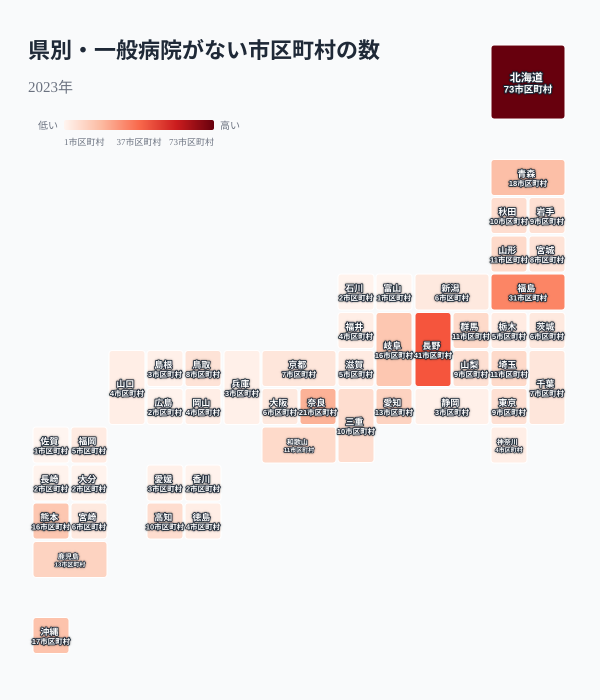
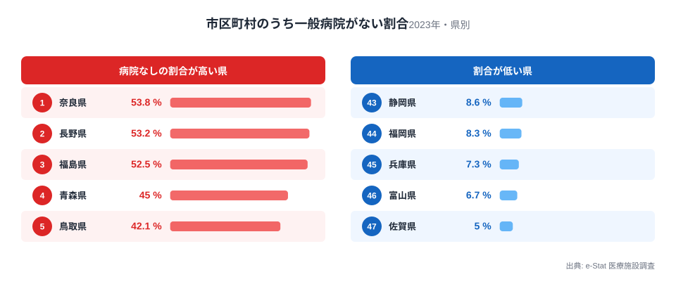
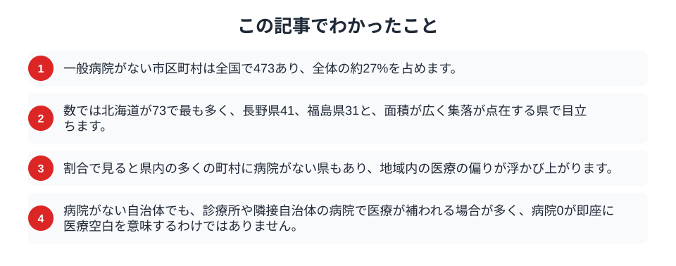

体調を崩したとき、近くに病院があるかどうかは暮らしの安心に直結します。ところが2023年の医療施設調査を市区町村ごとに見ると、一般病院が1つもない自治体が全国で473ありました。市区町村全体のおよそ27%、4分の1を超える計算です。もちろん病院がなくても診療所で日常の医療は受けられますが、入院や専門的な治療が必要になったとき、その街の外へ向かうことになります。病院のない街は、日本のどこに偏っているのでしょうか。

## 数では北海道が突出する

まず、一般病院がない市区町村が各県にいくつあるかを地図で見ます。

<data-source label="e-Stat 医療施設調査" note="一般病院の施設数がゼロの市区町村を集計（2023年）"></data-source>

最も多いのは北海道の73市区町村です。広大な面積に小さな町村が点在する北海道では、病院を置けない自治体が数多く残ります。続いて長野県が41、福島県が31、奈良県が21と、山地が多く集落が分散する県が上位に並びます。反対に、病院がない市区町村が少ないのは、面積が小さく都市が密集した県です。数だけを見れば北海道の問題に見えますが、それは北海道が広く、抱える市町村の数も多いことの裏返しでもあります。

<source-link href="/ranking/general-hospital-count">都道府県別の一般病院数ランキングを見る</source-link>

## 割合で見ると奈良・長野で過半に達する

数の多さは市町村の総数にも左右されます。そこで、県内の市区町村のうち何割に病院がないのかを計算し直します。

<data-source label="e-Stat 医療施設調査" note="一般病院の施設数がゼロの市区町村の割合（2023年）"></data-source>

割合で見ると、最も高いのは奈良県で53.8%、次いで長野県53.2%、福島県52.5%と、県内の市区町村の過半に一般病院がない県が並びます。青森県45.0%、鳥取県42.1%も高い水準です。奈良や長野は、県北部や中心都市には病院が集まる一方、南部や山間の町村には病院がなく、県のなかで医療機関の分布が大きく偏っています。反対に、割合が低いのは佐賀県5.0%、富山県6.7%、兵庫県7.3%で、県内のほとんどの市町村に病院があります。数の多い北海道よりも、県土に広く病院の空白が及ぶ奈良や長野のほうが、地域内の偏りという意味では深刻とも言えます。

<source-link href="/ranking/general-hospital-count">一般病院数の都道府県ランキングを見る</source-link>

## なぜ病院のない街が生まれるのか

一般病院がない自治体に共通するのは、人口の少なさと地理的な条件です。

> [!NOTE]
> 病院は一定数の患者と医療スタッフがいて初めて成り立ちます。人口が数千人の町村では、病院を維持するだけの需要も人材も確保しにくく、医療は診療所が担うことになります。山地や離島など、隣の市街地まで距離がある地域ほど、この空白が生じやすくなります。

つまり病院のない街は、医療から見放されたわけではなく、人口規模と地理の条件が病院の立地を許さなかった地域です。[医療機関の多くが過疎地域に置かれている](/blog/depopulation-area-medical-facilities)という事実の裏側で、より小さな町村では病院そのものを持てない現実があります。高齢化が進む地域ほど医療の必要は高まりますが、その地域ほど病院を維持する条件は厳しくなります。需要が最も高い場所で供給が最も細るという、医療の地理が抱える難しさが、この空白の地図には表れています。近年は医師の巡回診療やオンライン診療、隣接自治体との連携によって、病院のない地域の医療を支える取り組みも各地で進んでいます。

## 数字を読むときの注意

「病院がない」を「医療が受けられない」と即断するのは誤りです。

> [!WARNING]
> 一般病院がない自治体でも、診療所や、隣接する自治体の病院で医療が補われている場合が大半です。病院ゼロは「入院や専門治療のために自治体外へ向かう必要がある」ことを示すのであって、日常の医療が受けられないことを意味するわけではありません。

> [!TIP]
> 医療へのアクセスを本当に測るには、施設の有無だけでなく、隣接する病院までの所要時間や交通手段、診療科の種類まで見る必要があります。[医療6指標で高知が上位](/blog/medical-access-regional-gap)になるように、病院数だけでは地域の医療の充実度は測れません。

病院のない街の分布は、日本の医療がどこで手薄になりやすいかを示す一つの手がかりです。ただしその数字は、医療の総合的な受けやすさそのものではないことを踏まえて読む必要があります。

## まとめ

この記事でわかったことを整理します。

一般病院がない市区町村は全国で473、4分の1を超えます。数では北海道が突出し、割合では奈良・長野・福島で過半に達しました。病院の空白は人口の少なさと地理条件から生まれ、多くは診療所や隣接自治体で補われています。地域の医療の姿は[病床は埋まっているか](/blog/hospital-bed-utilization-map)や[医療のテーマページ](/themes/healthcare)からも確かめられます。病院のない街の地図は、医療をどう支えるかという問いの出発点になります。

## データ出典

- e-Stat（政府統計の総合窓口）医療施設調査「市区町村別 一般病院数」（2023年）
- 一般病院の施設数がゼロの市区町村を集計。市区町村（県名を除いた市・町・村・特別区）単位で数え、政令指定都市の行政区は市に含めています。
