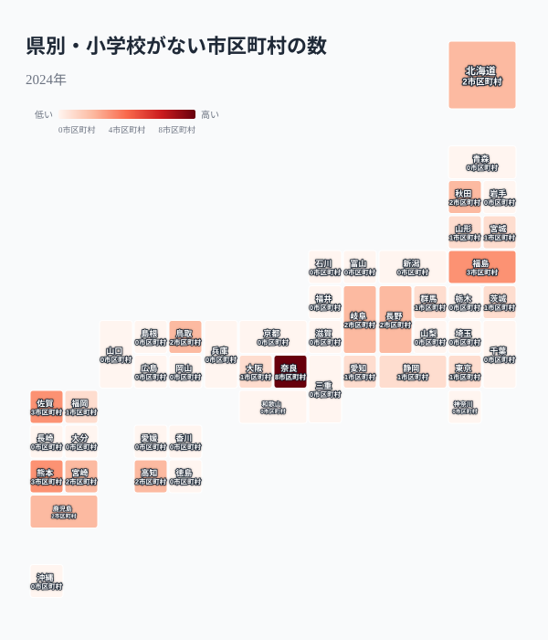
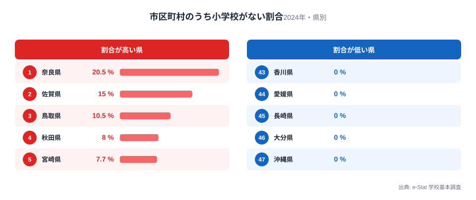
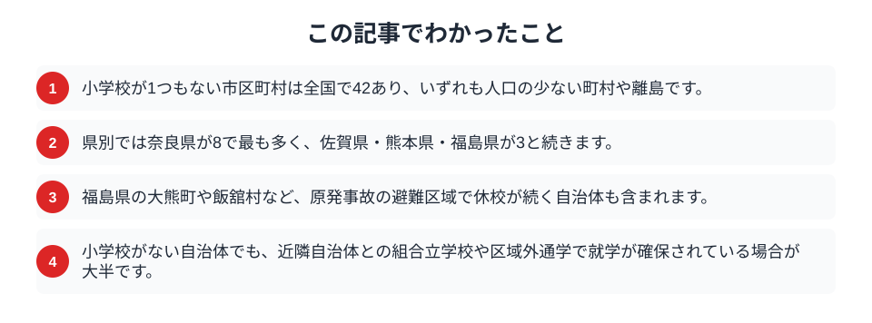

学校は、地域に子どもがいる限り必要とされる施設です。ところが2024年の学校基本調査を市区町村ごとに見ると、小学校が1つもない自治体が全国で42ありました。数としては多くありませんが、そこには人口が数百人の山村や離島、そして原発事故で避難が続く町が含まれます。学校がない街で、子どもたちはどこへ通っているのでしょうか。そして、なぜ学校は消えたのでしょうか。

## 小学校がない自治体は42

まず、小学校がない市区町村が各県にいくつあるかを地図で見ます。

<data-source label="e-Stat 学校基本調査" note="小学校数がゼロの市区町村を集計（2024年）"></data-source>

県別に見ると、最も多いのは奈良県で8市町村。次いで福島県、佐賀県、熊本県が3と続きます。奈良県は県南部に人口の少ない山村が多く、野迫川村や上北山村のように、住民が数百人規模の村が並びます。北海道の歌志内市や、東京都の利島村のような離島も、小学校がない自治体に含まれます。全国42という数字は、多くの都道府県に1つか2つずつ、こうした自治体が点在していることを示しています。学校を維持できるだけの子どもの数を保てなくなった地域が、日本各地に生まれているのです。

<source-link href="/ranking/elementary-school-count">都道府県別の小学校数ランキングを見る</source-link>

## 割合で見ると奈良が突出する

県内の市区町村のうち、何割に小学校がないのかを計算し直すと、偏りがさらにはっきりします。

<data-source label="e-Stat 学校基本調査" note="小学校数がゼロの市区町村の割合（2024年）"></data-source>

割合で見ると、最も高いのは奈良県で20.5%。県内39市町村のうち8つ、およそ5つに1つに小学校がありません。次いで佐賀県15.0%、鳥取県10.5%、秋田県8.0%と続きます。奈良県南部のように、山あいの小さな村が連なる地域では、村ごとに学校を置くだけの児童数を確保できず、複数の村で1つの学校を共同運営したり、隣の自治体へ通ったりする形が広がっています。子どもの数の減少が、学校という地域の拠点の統廃合を進めてきた結果です。

<source-link href="/ranking/elementary-school-count">小学校数の都道府県ランキングを見る</source-link>

## なぜ学校が消えたのか

小学校がない自治体が生まれる理由は、一つではありません。

> [!NOTE]
> 最も多いのは、児童数の減少による統廃合です。子どもが数人にまで減ると、学校の維持は難しくなり、近隣の学校へ統合されます。加えて、複数の自治体が共同で1つの学校を運営する「組合立学校」の仕組みもあり、この場合は自治体内に学校がなくても、隣の自治体にある共同運営の学校へ通えます。

一方で、福島県の大熊町や飯舘村、川内村のように、原発事故の避難区域に指定され、住民の避難によって学校が休校となった自治体も含まれます。こうした自治体では、子どもの数の減少とは異なる事情で学校が失われました。学校がなくなることは、単に教育の場が減るだけにとどまりません。学校は運動会や地域行事の会場であり、若い世代が地域に残るかどうかの判断材料にもなります。学校が消えた村では、子育て世帯がさらに転出しやすくなり、人口減少に拍車がかかるという循環も指摘されています。[小学生はなぜ東京に集まるのか](/blog/elementary-school-children-count)という都市集中の裏側で、地方の村では学校そのものが姿を消しています。

## 数字を読むときの注意

「学校がない」を「子どもが学べない」と受け取るのは誤りです。

> [!WARNING]
> 小学校がない自治体でも、組合立学校や区域外通学の仕組みによって、子どもたちの就学はほぼ確保されています。学校ゼロは「自治体の外の学校へ通っている」ことを示すのであって、就学の機会がないことを意味するわけではありません。

> [!TIP]
> 学校の有無だけでなく、最寄りの学校までの距離や通学手段、スクールバスの整備状況まで見ると、子育て環境の実像が見えてきます。学校がある自治体でも、遠距離通学が負担になっている地域は少なくありません。

小学校がない街の地図は、子どもの数の減少がどこまで進んでいるかを映す指標の一つです。ただしその数字は、就学の機会そのものではなく、学校をどう配置し直してきたかの結果であることを踏まえて読む必要があります。

## まとめ

この記事でわかったことを整理します。

小学校がない市区町村は全国で42。奈良県南部の山村や離島、原発事故の避難区域に偏っていました。多くは児童数減少による統廃合や組合立学校の結果で、就学は近隣の学校で確保されています。子どもをめぐる地域差は[子育てしやすい県ランキング](/blog/childcare-friendly-prefecture-ranking)や[教育・文化のテーマページ](/themes/education-culture)からも確かめられます。学校のない街を知ることは、人口減少が地域の暮らしをどう変えるかを考える手がかりになります。

## データ出典

- e-Stat（政府統計の総合窓口）学校基本調査「市区町村別 小学校数」（2024年）
- 小学校数がゼロの市区町村を集計。市区町村（県名を除いた市・町・村・特別区）単位で数え、政令指定都市の行政区は市に含めています。
