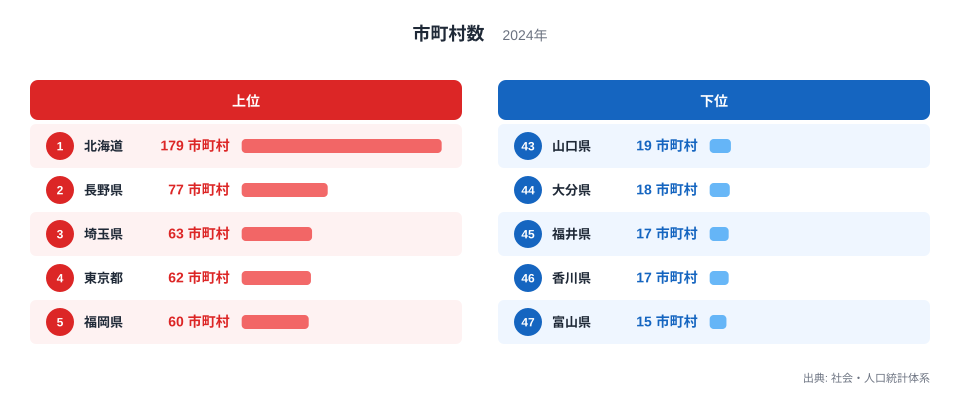

## 都道府県の中にある自治体の数は同じではありません

2024年の市町村数を都道府県別に比べると、北海道が179で最多、富山県が15で最少です。北海道には富山県の約11.9倍の市町村があります。都道府県が47に固定されている一方、その内側を構成する基礎自治体の数には大きな差があります。

この差を見ると、面積の広い県ほど市町村が多いように思えます。実際、北海道の広大さは179という数を考えるうえで重要です。しかし、2位の長野県は77、3位の埼玉県は63、4位の東京都は62です。面積だけでは説明できない県が上位に並びます。

> [!NOTE]
> 市町村数は、住民に身近な行政を担う基礎自治体の数を示します。人口や面積の総量ではなく、都道府県の内部がいくつの自治体に分かれているかを数えた指標です。

東京都の62は、23特別区、26市、5町、8村の合計です。一般の市町村だけでなく特別区を含む集計である点に注意が必要です。

現在の自治体数には、地形や集落の分布に加え、過去の合併や分立の経緯が影響している可能性があります。ただし、この単年ランキングだけでは各県の差が生じた原因を特定できません。原因を論じるには、自治体数の時系列や合併記録を別に確認する必要があります。

## 北海道が突出し、2位以下とは100以上の差があります

<source-link href="/ranking/municipality-count">市町村数ランキングをもっと見る</source-link>

上位5都道県は、北海道179、長野県77、埼玉県63、東京都62、福岡県60です。1位の北海道と2位の長野県の間だけで102の差があり、北海道の突出ぶりが分かります。

北海道は広い範囲に都市や集落が分散し、自治体同士の距離も長くなります。長野県も山地によって生活圏が分かれやすい地域です。一方、埼玉県、東京都、福岡県は人口が集まる都市圏を抱え、多数の市区町村が連続している点が特徴です。同じ「自治体数が多い」県でも、その空間的な姿は異なります。

下位5県は、山口県19、大分県18、福井県17、香川県17、富山県15です。鳥取県、島根県、石川県、滋賀県も19で下位側に並びます。人口が少ない県だけが下位になるわけではなく、これまでの市町村合併の範囲によって現在の数は変わります。

> [!TIP]
> 自治体数を見るときは「一自治体あたりの人口や面積」も併せて考えると、細かく分かれている地域と、広域化した地域の違いを捉えやすくなります。

北海道の179と富山県の15を比べると、差は164です。ただし、この差は行政サービスの良し悪しを表しません。自治体が多ければ住民に近い行政単位が多い一方、組織や施設をそれぞれ維持する必要があります。少なければ広域的な運営がしやすい一方、庁舎までの距離や地域ごとの細かな対応が課題になる場合があります。

## 合併の影響は時系列で確かめます

市町村数は固定された自然条件ではなく、制度上の合併や分立によって変わります。複数の市町村が合併すれば、同じ地域・人口でも自治体数は減ります。合併しなかった地域や、合併の範囲が小さかった地域では、自治体数が比較的多く残ります。

合併の判断には、行政運営の効率化、財政基盤、公共施設の配置、地域名や自治の継承などが関係します。現在のランキングはその結果を含むスナップショットですが、どの要因がどれだけ効いたかは、この表だけからは判断できません。

> [!WARNING]
> 市町村数が多いことを「行政が非効率」、少ないことを「効率的」と単純に評価することはできません。移動距離、人口密度、支所配置、デジタル化、地域コミュニティなどを含めて判断する必要があります。

自治体数の変化を詳しく見るなら、2024年の順位だけでなく、合併前後の時系列が必要です。数が減った時期と地域を確認し、その後に行政コストや住民サービスがどう変化したかを検証して初めて、合併の影響を評価できます。

もう一つ注意したいのは、自治体数と行政窓口の数が一致しないことです。一つの市が複数の支所を置く場合もあれば、複数の自治体が消防やごみ処理を共同で運営する場合もあります。住民が実際に受けるサービスへの近さは、自治体の境界だけでなく、支所・広域連合・オンライン手続きまで含めて確かめる必要があります。

## 防災や公共サービスの設計にも関わる指標です

自治体は、住民票や福祉、ごみ処理、学校、防災など身近な行政サービスを担います。市町村数が多い県では、自治体間の連携や共通システムの整備が重要になります。少ない県では、一つの自治体が広い区域や多様な地域をカバーするため、支所やオンライン手続きの設計が重要です。

災害対応でも、自治体の境界と生活圏が一致しないことがあります。河川流域、医療圏、通勤圏など、課題に応じて広域連携の単位を変える必要があります。市町村数は連携相手の数を考える材料にはなりますが、連携の質そのものを示すわけではありません。

最多の[北海道のデータブック](/areas/01000)と最少の[富山県のデータブック](/areas/16000)では、面積や人口など別の指標も比較できます。全47都道府県の順位は[市町村数ランキング](/ranking/municipality-count)、行政・財政の関連統計は[行財政カテゴリ](/category/administrativefinancial)から確認できます。

> [!NOTE]
> 自治体の適正な規模には一つの正解がありません。人口密度や地形、交通、住民参加の方法に応じて、必要な行政単位と広域連携の形は変わります。

## 約12倍の差に地域の地理と選択が重なっています

2024年の市町村数は、北海道179から富山県15まで約11.9倍の差がありました。北海道は2位の長野県を100以上上回る一方、都市圏を抱える埼玉県や東京都、福岡県も上位に入っています。

この並びは、面積や人口のどちらか一つでは説明できません。集落の分布、山地や島しょなどの地理、都市化の過程、市町村合併の歴史が重なり、現在の自治体数を形づくっています。

ランキングから読み取れるのは、都道府県内部の行政区域がどれほど細かく分かれているかです。その違いが住民サービスや財政にどう影響するかを考えるには、一自治体あたり人口・面積、職員数、財政、移動時間などを重ねて見ることが大切です。

## データ出典

- 総務省統計局「社会・人口統計体系」（2024年）
- 東京都「都内区市町村マップ」（23特別区・26市・5町・8村の内訳）
