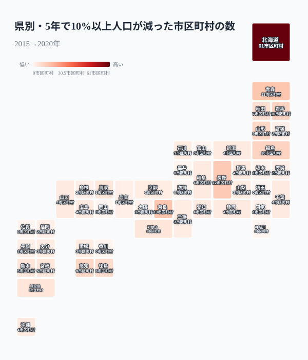
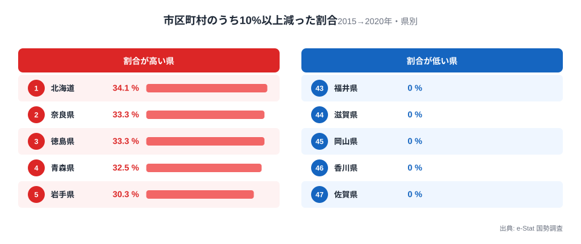
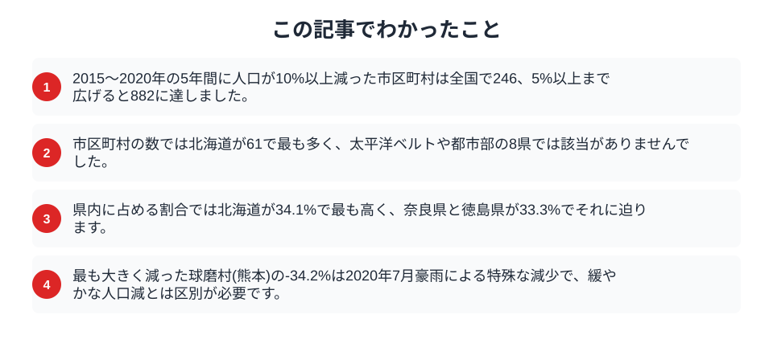

「人口減少」と一口に言っても、緩やかに減る街と、5年で1割が消える街とでは意味がまったく違います。国勢調査の2015年と2020年の人口をもとに市区町村ごとの5年間の増減率を計算すると、減り方には明確な段階がありました。境界が比較できる全国1,738市区町村のうち、5%以上減ったのは882、10%以上は246、15%以上になると28まで絞り込まれます。人口が増えた市区町村は318で、大半の街は緩やかに縮んでいます。では、こうした「大きく減った街」は日本のどこに偏っているのでしょうか。

## 減少には3つの段階がある

まず全体像を押さえます。5年間の増減率で市区町村を並べると、多くは-5%前後の「緩やかな減少」に収まります。そこから-10%を超える「急速な減少」が246市区町村、-15%を超える「極端な減少」が28市区町村と、閾値を上げるほど数は一気に絞られていきます。つまり大半の街はゆるやかに縮んでいて、激しく縮む街は少数に集中している、という構造です。

この246という数字は、5年で人口の1割が失われた計算になります。1割の減少は、学校の統廃合や商店の撤退、公共交通の減便といった生活基盤の変化が現実に起こる水準です。次のセクションからは、この「10%以上減った市区町村」がどの県に多いのかを地図とランキングの両面から見ていきます。

## 数で見ると北海道が突出する

県ごとに「10%以上減った市区町村の数」を数えると、地理的な偏りがはっきりと現れます。

<data-source label="e-Stat 社会・人口統計体系" note="国勢調査（2015→2020年）の市区町村別人口増減率をもとに集計"></data-source>

最も多いのは北海道の61市区町村で、2位以下を大きく引き離します。これは北海道が163もの市町村を抱える広大な自治体であることと、道内の多くの町村で人口流出が続いていることの両方を映しています。続くのは青森県と奈良県がともに13、長野県が12、岩手県と福島県が10と、東北・北陸内陸・近畿南部が上位に並びます。一方で埼玉県・神奈川県・富山県・福井県・滋賀県・岡山県・香川県・佐賀県の8県では、10%以上減った市区町村が1つもありませんでした。都市部と、県全体が比較的コンパクトにまとまった地域では、激しい減少が起きていないことがわかります。

<source-link href="/ranking/population-growth-rate">都道府県別の人口増減率ランキングを見る</source-link>

## 割合で見ると小さな県も肩を並べる

数の多さは、その県が抱える市区町村の総数にも左右されます。北海道の61も、179市町村のうちの割合に直せば34.1%です。そこで、県内の市区町村のうち何割が10%以上減ったのかを計算し直してみます。

<data-source label="e-Stat 国勢調査" note="国勢調査2015→2020年の市区町村別人口増減率をもとに集計"></data-source>

割合で見ても最も高いのは北海道の34.1%です。ただし、それに奈良県と徳島県の33.3%が僅差で続き、青森県32.5%、岩手県30.3%と並びます。ここに注目したいのは、奈良県や徳島県が数ではそれぞれ13前後と北海道の5分の1程度なのに、割合ではほぼ肩を並べている点です。県土の3分の1の市区町村で人口が1割以上減ったということは、一部の町だけでなく県全体に減少が面的に広がっていることを意味します。反対に、割合が0%の県では、大きく減った市区町村が県内に見当たりません。数だけを見れば北海道の問題に見えますが、県のなかでの広がりという意味では、面積の小さな県ほど深刻さが凝縮して現れます。

<source-link href="/ranking/total-population">都道府県別の総人口ランキングを見る</source-link>

## なぜ減少はこの地域に偏るのか

上位に並ぶのは、山間部や半島部の小規模な町村を多く抱える地域です。若い世代が進学や就職で都市部へ移り、残った人口が高齢化して自然減も加わるという二重の縮小が、こうした地域では同時に進みます。[高齢化が進む県ほど子どもが少ない](/blog/aging-rate-akita-vs-okinawa)構造は県単位でも見られますが、市区町村まで細かく見ると、その落差はさらに大きくなります。人口が減った地域では、かえって[人口あたりの店舗が増える](/blog/barber-beauty-salon-regional-gap)といった分母縮小の逆説も起こり、統計の読み方に注意が必要になります。

割合の高い奈良県は、この二極構造がとくにはっきりしています。大阪都市圏に通勤できる北西部の奈良市・生駒市・香芝市などはベッドタウンとして人口を保つ一方、県土の大半を占める南部の吉野・十津川方面は深い山地で、十津川村や野迫川村、東吉野村のように5年で1割以上減った市町村が連なります。県として市区町村数が39と多くないため、南部の減少が県全体の割合を大きく押し上げます。都市近郊のイメージが強い奈良でも、県の内側では平地と山地で人口の動きが正反対に分かれているのです。

> [!NOTE]
> ここでの「市区町村」は、県名を除いた市・町・村・特別区の単位で数えています。政令指定都市の行政区（中央区・北区など）は市の一部として扱い、二重計上を避けています。

逆に減少が起きていない県は、県庁所在地を中心とした都市圏に人口が集まり、周辺の市町も通勤圏として維持されている地域です。同じ人口減少局面でも、都市への集約が進む県と、県全体が薄く縮んでいく県とで、地図の色は大きく分かれます。

## 数字を読むときの注意

この5年間の増減率には、通常の人口移動では説明できない特殊な変動が混じっています。

> [!WARNING]
> 全国で最も大きく減ったのは球磨村の-34.2%でした。これは熊本県南部の村で、2020年7月の豪雨災害による一時的な人口流出が反映されています。災害による特殊な減少と、長期的・構造的な人口減少は区別して読む必要があります。

> [!TIP]
> 5年間という短い窓での増減率は、市町村合併や境界変更の影響も受けます。同じ街を長期で追うときは、増減率だけでなく総人口の推移そのものもあわせて確認すると、減少が加速しているのか底を打ったのかが見えてきます。

また、人口が少ない町村ほど、わずかな人数の増減でも率が大きく振れる点にも注意が必要です。割合の高さだけで「消滅の危機」と即断せず、母数となる人口規模とあわせて見ることが大切です。

## まとめ

この記事でわかったことを整理します。

人口減少は全国一律ではなく、大きく減った市区町村が特定の地域に偏って集まっています。数では北海道が突出する一方、割合で見ると奈良県や徳島県のように面積の小さな県も北海道に迫ります。「数の多い県」と「県土に減少が広く及んでいる県」は必ずしも一致しないという点は、県単位の平均だけを見ていては気づけない偏りです。同じ「人口が減る県」でも、都市に人が集約されて周辺の町も通勤圏として保たれる県と、山間の町村が面的に縮んでいく県とでは、地域の将来像が大きく異なります。より長期的に県がどう縮んでいくのかは[2050年に人口が4割減る県](/blog/future-population-disappearing-prefectures)や、[人口動態のテーマページ](/themes/population-dynamics)からも確認できます。街ごとの減り方の違いを知ることは、これからの地域の姿を考える出発点になります。

## データ出典

- e-Stat（政府統計の総合窓口）国勢調査「市区町村別人口」（2015年・2020年）
- 増減率は2015年と2020年の人口から算出。両年に人口がある1,738市区町村（県名を除いた市・町・村・特別区）を対象とし、政令指定都市の行政区は市に含めています。
