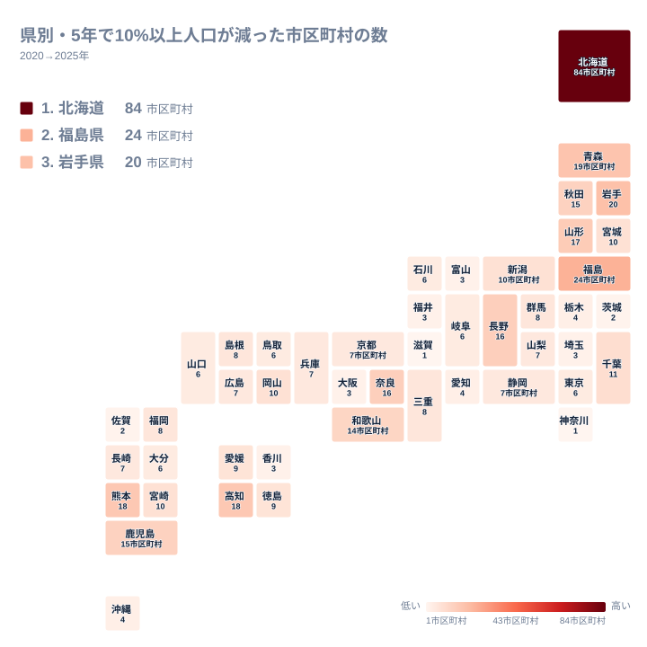
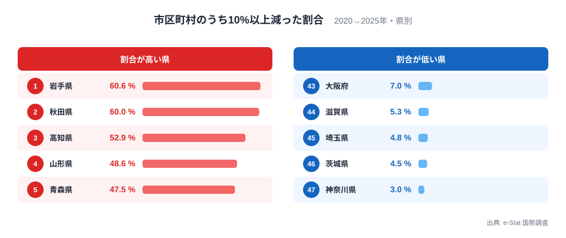
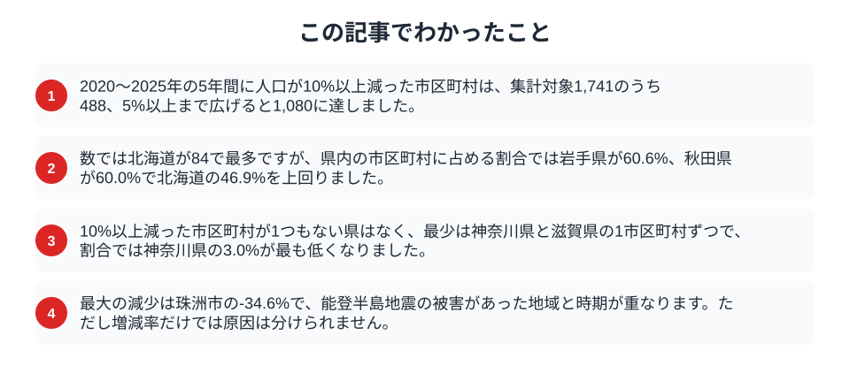

「人口減少」と一口に言っても、緩やかに減る街と、5年で1割が失われる街とでは意味がまったく違います。2025年の国勢調査(2026年9月29日公表)をもとに、2020年から2025年の5年間の増減率を市区町村ごとに見ると、減り方には明確な段階がありました。増減率が算出できた1,741市区町村のうち、5%以上減ったのは1,080、10%以上は488、15%以上は77で、20%以上減った市区町村は5にまで絞られます。人口が増えたのは170にとどまります。この記事の前の版は2015年から2020年を扱い、10%以上減った市区町村は246でした。今回は488と、ほぼ2倍になっています。では、この「大きく減った街」は日本のどこに偏っているのでしょうか。

## 減少には3つの段階がある

まず全体像を押さえます。5年間の増減率で市区町村を並べると、-5%から-10%の間に入る街が多く、そこから閾値を上げるほど数は一気に減ります。-5%以上の減少が1,080、-10%以上が488、-15%以上が77、-20%以上が5です。1,741のうち、およそ6割が5%以上、3割弱が10%以上、減ったことになります。人口が増えた170は全体の1割弱で、大半の街が縮む側にあります。

10%以上という水準は、5年で人口の1割が失われた計算です。学校の統廃合や商店の撤退、公共交通の減便といった生活基盤の変化が現実に起こりやすい規模です。前回の246から488へ増えたことは、減少が一部の町村の話ではなく、より広い範囲に及んできたことを示しています。都道府県単位で見ると、2020年から2025年に人口が増えたのは東京都の+1.3%だけで、最も減ったのは秋田県の-8.1%でした。県の平均では-8%程度でも、市区町村まで下ろすと、その2倍以上の速さで縮む街が数百あることになります。次のセクションからは、この「10%以上減った市区町村」がどの県に多いのかを、数と割合の両面から見ていきます。

## 数で見ると北海道が突出する

県ごとに「10%以上減った市区町村の数」を数えると、地理的な偏りがはっきりと現れます。

<source-link href="/ranking/census-population-change-rate-5y">市区町村別・5年間の人口増減率を見る</source-link>

最も多いのは北海道の84市区町村で、2位の福島県24を大きく引き離します。続くのは岩手県の20、青森県の19、高知県と熊本県の18、山形県の17で、東北と、四国・九州の一部が上位に並びます。北海道は179もの市町村を抱えるため、数が多くなりやすい面があります。それでも、15%以上減った市区町村まで絞って北海道だけを数えると14あり、全国77の2割近くを占めます。単に市町村の数が多いだけでは説明できず、深い減少が集中していることが分かります。

反対に、10%以上減った市区町村が最も少ないのは神奈川県と滋賀県の1で、同数です。茨城県と佐賀県が2、埼玉県・富山県・大阪府・福井県・香川県が3、愛知県が4と続きます。前の版では該当が1つもない県が8ありましたが、今回は全47都道府県に1つ以上あり、「大きく減る街が県内に1つもない」状態は姿を消しました。首都圏や大都市圏でも、県内の一部には1割以上縮む街が出てきているということです。ただし数は依然として少なく、都市部と、県全体が比較的コンパクトにまとまった地域では、激しい減少はまだ限られた範囲にとどまっています。

## 割合で見ると岩手・秋田が北海道を上回る

数の多さは、その県が抱える市区町村の総数にも左右されます。北海道の84も、179市町村のうちの割合に直せば46.9%です。そこで、県内の市区町村のうち何割が10%以上減ったのかを計算し直してみます。

割合で見ると順位は入れ替わり、最も高いのは岩手県の60.6%(33市町村中20)、次いで秋田県の60.0%(25市町村中15)です。3位は高知県の52.9%(34中18)、4位は山形県の48.6%(35中17)、5位は青森県の47.5%(40中19)で、北海道の46.9%はその下の6位に下がります。前の版(2015年から2020年)では北海道が首位でしたから、東北の県が北海道を追い抜いたことになります。

ここに注目したいのは、岩手県や秋田県の該当数が20や15と、北海道の84の4分の1以下なのに、割合ではそれを大きく上回る点です。県内の市町村の6割で人口が1割以上減ったということは、一部の町だけでなく県全体に減少が面的に広がっていることを意味します。数だけを見れば北海道の問題に見えますが、県のなかでの広がりという意味では、市町村の数が少ない県ほど深刻さが凝縮して現れます。一方、割合が低いのは神奈川県の3.0%、茨城県の4.5%、埼玉県の4.8%、滋賀県の5.3%で、東京都でも9.5%(63中6)にとどまります。

## なぜ減少はこの地域に偏るのか

上位に並ぶのは、山間部や半島部、離島の小規模な町村を多く抱える地域です。[仮説]若い世代が進学や就職で都市部へ移り、残った人口が高齢化して自然減も加わる二重の縮小が、こうした地域では同時に進んでいる可能性があります。この記事の増減率は社会増減と自然増減を分けていないため、仮説の検証には別の指標が要ります。[高齢化が進む県ほど子どもが少ない](/blog/aging-rate-akita-vs-okinawa)構造は県単位でも見られますが、市区町村まで細かく見ると、その落差はさらに大きくなります。人口が減った地域では、かえって[人口あたりの店舗が増える](/blog/barber-beauty-salon-regional-gap)といった分母縮小の逆説も起こり、統計の読み方に注意が必要です。

奈良県は、県内の二極構造が数字に出ています。16市町村(39中、41.0%)で10%以上減り、15%以上に絞っても8あります。たとえば野迫川村は-19.0%、十津川村は-15.3%で、いずれも県南部の山間の村です。前の版でも奈良県は割合の上位にありましたが、今回は該当数が13から16へ増えています。都市近郊のイメージが強い奈良でも、県の内側では地域によって人口の動きが大きく分かれています。

> [!NOTE]
> ここでの「市区町村」は、県名と市区町村名の2つで表せる単位(市・町・村・東京の特別区、政令指定都市の本体)で数えています。政令指定都市の行政区171(札幌市中央区など)は市の一部として除き、二重計上を避けています。増減率が算出できなかった福島県双葉町の1件も除いた1,741が対象です。

逆に減少が少ない県は、県庁所在地を中心とした都市圏に人口が集まり、周辺の市町も通勤圏として維持されている地域です。同じ人口減少局面でも、都市への集約が進む県と、県全体が薄く縮んでいく県とで、地図の色は大きく分かれます。

## 数字を読むときの注意

この5年間の増減率には、通常の人口移動では説明できない特殊な変動が混じっている可能性があります。

> [!WARNING]
> 最も大きく減ったのは石川県珠洲市の-34.6%(12,929人から8,459人)で、輪島市が-28.3%(24,608人から17,649人)、能登町が-18.9%で続きます。この5年の間には、2024年1月1日に石川県能登地方で最大震度7を観測したマグニチュード7.6の地震があり、気象庁はこれを「令和6年能登半島地震」と名づけました([気象庁](https://www.jma.go.jp/jma/menu/20240101_noto_jishin.html)、[内閣府 防災白書](https://www.bousai.go.jp/kaigirep/hakusho/r07/honbun/t1_1s_01_00.html))。被害の大きかった地域と大幅減の地域は重なりますが、この増減率だけでは、地震による死亡、避難による転出、もともとの減少傾向を切り分けられません。原因を地震だけに帰すことは避けてください。

減少幅の上位には、災害と関係が見当たらない町村も並びます。渡名喜村は-32.7%(346人から233人)、夕張市は-23.5%、群馬県の南牧村は-21.8%です。これらは人口規模がもともと小さく、数十人の増減でも率が大きく振れます。

> [!TIP]
> 5年間という短い窓での増減率は、市町村合併や境界変更の影響も受けます。同じ街を長期で追うときは、増減率だけでなく総人口の推移そのものもあわせて確認すると、減少が加速しているのか底を打ったのかが見えてきます。

割合の高さだけで「消滅の危機」と即断せず、母数となる人口規模とあわせて見ることが大切です。

## まとめ

この記事でわかったことを整理します。

人口減少は全国一律ではなく、大きく減った市区町村が特定の地域に偏って集まっています。数では北海道が突出する一方、割合で見ると岩手県や秋田県が北海道を上回ります。「数の多い県」と「県土に減少が広く及んでいる県」は必ずしも一致しないという点は、県単位の平均だけを見ていては気づけない偏りです。10%以上減った街が2020年までの5年間の246から488へ増え、全都道府県に1つ以上ある状態になったことも、減少が広がっている表れです。より長期的に県がどう縮んでいくのかは[2050年に人口が4割減る県](/blog/future-population-disappearing-prefectures)や、[人口動態のテーマページ](/themes/population-dynamics)からも確認できます。街ごとの減り方の違いを知ることは、これからの地域の姿を考える出発点になります。

## データについて

- 国勢調査(総務省統計局)の2020年と2025年の人口から算出した5年間の人口増減率(2025年国勢調査は2026年9月29日公表)。
- 本文の都道府県別の増減率(東京都+1.3%、秋田県-8.1%)は、同じ指標(census-population-change-rate-5y)の都道府県別データ(values.json・2025年)の値です。市区町村別データからの集計ではありません。
- 対象は、県名と市区町村名の2つで表せる1,742地域のうち、増減率が算出できなかった福島県双葉町を除く1,741です。政令指定都市の行政区171は市に含め、市は本体を1つと数え、東京の特別区は個別に数えています。「10%以上減少」は増減率が-10%以下の市区町村です。
- 前の版(2015年から2020年、対象1,738、10%以上減少は246)とは対象地域数がわずかに異なります。
