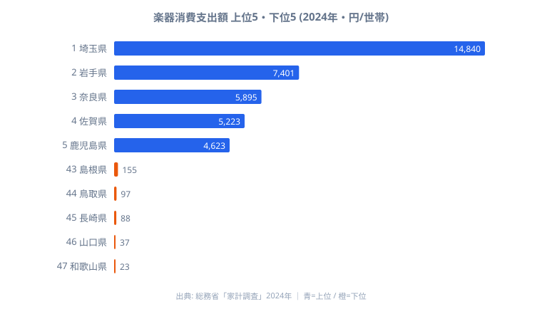

「ピアノやギターにお金を使う家庭は、文化や教育にお金が回りやすい大都市に多い」──そう考えるのが自然かもしれません。ところが総務省「家計調査」2024年のデータを見ると、その直感はあっさり裏切られます。1世帯当たり年間の楽器消費支出額が全国で最も多いのは埼玉県の14,840円で、最も少ない和歌山県はわずか23円。同じ日本の家計とは思えないほど離れた数字が並びます。

さらに不思議なのは、文化消費の代名詞であるはずの東京都が10位の3,169円にとどまり、岩手・奈良・佐賀・鹿児島といった人口規模では中位以下の県が上位に食い込んでいる点です。本記事では上位5県と下位5県を可視化し、「楽器を買う地域・買わない地域」がどんな顔ぶれなのか、そしてなぜこれほど大きな差が生まれるのかを読み解いていきます。

> [!NOTE]
> ここで扱う「楽器消費支出額」は、家計調査で都道府県庁所在市の二人以上世帯が1年間に楽器の購入に支払った金額の平均です。ピアノやギターなど高額な楽器が「買われた年」と「買われなかった年」で世帯平均が大きく動くため、毎年の消費というより不定期に発生する大きな買い物の平均値だと理解しておくと読み違えません。

## 楽器にお金を使う県の顔ぶれ — 埼玉が突出する音楽県

上位5県と下位5県を1枚の図にまとめると、上下の落差の大きさが一目で伝わります。上位は埼玉・岩手・奈良・佐賀・鹿児島、下位は島根・鳥取・長崎・山口・和歌山という顔ぶれです。

何より目を引くのが1位埼玉県の突出ぶりです。14,840円は2位岩手県7,401円の約2倍、10位東京都3,169円の約4.7倍に達します。一般に文化消費は東京・大阪・愛知という三大都市圏が上位を占めやすいのですが、楽器に限っては大阪・愛知がそろって上位10県の外にあり、東京もかろうじて10位という構図になっています。代わりに岩手・佐賀・鹿児島といった、家計調査の他項目では上位に来にくい県が並んでいます。

上位の顔ぶれを地域で見ても、北関東(埼玉)・東北(岩手)・近畿(奈良)・九州(佐賀・鹿児島)と全国に散らばっており、特定の地方に固まっているわけではありません。つまり「都会だから楽器を買う」という説明も、「特定地方の文化だから」という説明も、この上位の並びだけでは成り立たないのです。楽器という買い物が、人口や都市の規模ではない別の要因で動いていることが、この分布からうかがえます。

<source-link href="/ranking/musical-instrument-consumption-expenditure">楽器消費支出額ランキングをもっと見る</source-link>

## お金を使わない県 — 西日本に低位が集中

下位5県は和歌山・山口・長崎・鳥取・島根で、近畿・中国・九州の県が並びます。最下位の和歌山県は23円で、これは1世帯が1年を通してほぼ楽器を購入していない水準だと言えます。47位和歌山の23円に対して1位埼玉は14,840円ですから、上下の開きは645倍にのぼり、家計調査の中でも際立って大きな地域差です。

ここで注意したいのは、同じ西日本・同じ九州の中でも結果が大きく割れている点です。上位には佐賀県(4位5,223円)・鹿児島県(5位4,623円)・宮崎県(8位3,293円)と九州の県が並ぶ一方で、長崎県は88円と下位5県に沈んでいます。九州内の佐賀5,223円と長崎88円を比べるだけでも約59倍もの開きがあり、「九州だから」「西日本だから」という地域のくくりでは、この差をまったく説明できません。

> [!WARNING]
> このランキングは1世帯当たりの平均額なので、順位が低い県を「音楽に縁がない県」と読むのは早計です。たまたまその年に高額楽器を購入した世帯が調査対象に含まれなかっただけで順位は大きく下がります。低位の県でも、別の年には上位に顔を出している可能性があり、単年の順位だけで地域の音楽文化を結論づけないことが大切です。

下位群に共通するのは人口減少が進む地方県という点ですが、同じ条件のはずの岩手県が2位に入っていることを思えば、「地方だから少ない」という二分法も成り立ちません。上位・下位の両方に地方県が混在しているのが、この指標のいちばん厄介で面白いところです。

## なぜこれほど差が開くのか — 文化資本の地理を読む

これほど極端な差が生まれる背景には、いくつかの異なる力が重なっていると考えられます。ここでは確定した結論としてではなく、検証すべき仮説として三つの見方を整理します。

[仮説A] 単年スパイク説。家計調査は1世帯当たりの平均値なので、調査対象世帯の中にピアノなど高額楽器を買った世帯が数件含まれるだけで、県平均が一気に跳ね上がります。埼玉14,840円という突出も、対象世帯内でたまたま高額購入が重なった結果という可能性があります。この見方の妥当性は、複数年の平均をとって埼玉が一貫して上位かどうかを確かめることで検証できます。

[仮説B] 音楽教育インフラ説。上位の埼玉・岩手・奈良・京都などには、ピアノ教室や吹奏楽の部活動、音楽系進学の裾野といった、子どもが楽器に触れる機会が一定数あると考えられます。習い事として楽器を買う家計が地域に根づいていれば、それが消費支出に表れてもおかしくありません。ただしこれも、教室数や部活動の規模といった別データと突き合わせて初めて検証できる仮説です。

[仮説C] 楽器流通アクセス説。楽器専門店や大型楽器チェーンが近くにあるかどうかが、購入のしやすさを左右している可能性です。興味深いのは、ヤマハ・河合といった国内大手メーカーの拠点が集まる静岡県が、消費額の上位には入っていない点です。楽器を「作る地理」と「買う地理」は必ずしも一致せず、製造拠点の有無では消費の偏りを説明できないことがわかります。

> [!TIP]
> 楽器のような不定期かつ高額な買い物の指標は、1年だけの順位ではなく数年分を並べて眺めると正体が見えてきます。上位の県が毎年顔ぶれを変えるなら「単年スパイク」の色が濃く、同じ県が居座り続けるなら「地域の構造」が効いていると読めます。家計支出の他項目と合わせて見ると、その県の暮らしの輪郭がさらに立体的になります。地域全体の家計の姿は[埼玉県のプロフィール](/areas/11000)や[和歌山県のプロフィール](/areas/30000)からも確認できます。

## まとめ

- 楽器消費支出額の1位は埼玉県の14,840円、最下位は和歌山県の23円で、上下の開きは645倍にのぼります
- 2位岩手県7,401円、3位奈良県5,895円と、人口規模では中位以下の地方県が上位に食い込む特異な分布です
- 文化消費の代名詞であるはずの東京都は10位3,169円にとどまり、「大都市=文化消費上位」の通説とは一致しません
- 下位5県は西日本・地方圏に集中する一方、岩手県の2位と矛盾するため、単純な地理パターンでは説明できません
- 1世帯当たり平均値ゆえに単年スパイクの影響を受けやすく、複数年平均での再検証が次の課題として残ります

楽器消費という小さな窓からは、文化資本がどこに厚く、どこに薄いのかという地理が透けて見えます。この指標の続きは[企業・家計・経済カテゴリ](/category/economy)の他の家計支出指標と並べて読むと、各県の暮らしぶりがより鮮明になります。

## データ出典

- 総務省統計局「家計調査」2024年 (e-Stat 政府統計の総合窓口)
- 調査対象: 都道府県庁所在市の二人以上の世帯
- 集計単位: 1世帯当たり年間消費支出額 (円)
- 取得日: 2026-05-17
