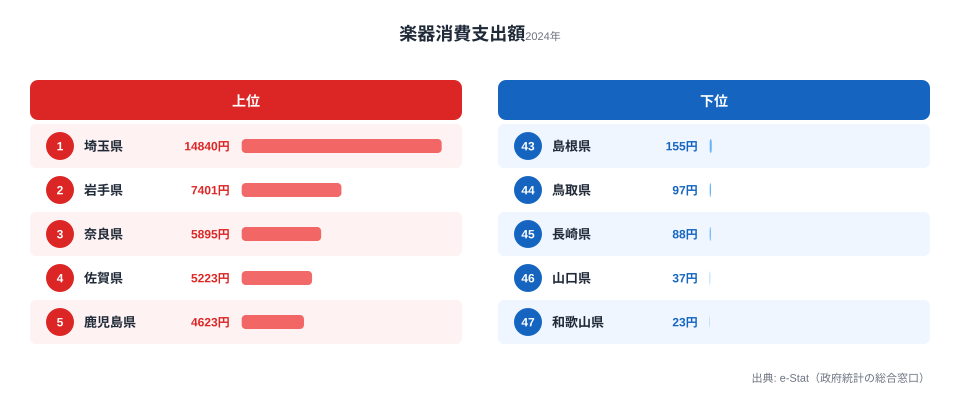

総務省「家計調査」2024年データによると、1世帯当たり年間の楽器消費支出額は埼玉県が14,840円で全国1位、最下位の和歌山県はわずか23円でした。その格差は実に**645倍**に達し、家計調査の数百の支出項目を見渡しても、これほど倍率の大きい地域差はめったにありません。さらに意外なのは、東京都が10位（3,169円）にとどまり、北関東・東北・九州の県が上位に並ぶ点です。一般に「文化消費は大都市が強い」と思われがちですが、楽器に関してはその通説がまったく当てはまりません。本記事ではこの極端な分布を可視化し、「楽器を買う地域・買わない地域」の地理を読み解いていきます。

先に結論の核心をお伝えすると、この645倍という数字は「埼玉県民が和歌山県民の645倍も音楽好き」という意味ではありません。家計調査の楽器支出は、ピアノなど数十万円する高額品を買った世帯がいるかどうかで県平均が大きく跳ねる、**揮発性の高い指標**です。だからこそ単純な「音楽県ランキング」として読むと誤読します。その読み違いを避けながら、データから何が言えるのかを丁寧に追っていきましょう。

> [!NOTE]
> この指標は「世帯が1年間に楽器の購入に使った金額」の平均値で、楽器演奏の頻度や音楽好きの人口比ではありません。対象は都道府県庁所在市の二人以上世帯です。ピアノ・電子オルガン・ギターなど耐久消費財としての楽器が中心で、数年に一度の高額購入が平均を押し上げる構造を持ちます。

## 上位5と下位5 — 埼玉が突出する一方、下位は事実上ゼロ

最も目を引くのは、1位埼玉県の突出ぶりです。14,840円は2位岩手県（7,401円）の約2倍、3位奈良県（5,895円）の約2.5倍に達します。一般に文化消費は大都市圏が上位を占める傾向にありますが、楽器に関しては東京・大阪・愛知といった三大都市圏が上位から外れているのが特徴です。大阪府・愛知県はそもそも上位10にすら入っていません。代わりに岩手・佐賀・鹿児島・宮崎など、人口規模では中位以下の県が上位に食い込む構図は、家計調査の他項目では稀な分布です。

一方、下位5を見ると様相が一変します。最下位の和歌山県は23円、46位の山口県は37円で、これは「1世帯が年間でほぼ楽器を購入していない」水準です。グラフの赤いバーが目視できないほど短いのは、上位との桁が違いすぎるためで、この見た目そのものが645倍という格差を物語っています。45位長崎県（88円）、44位鳥取県（97円）、43位島根県（155円）と続きますが、いずれも3桁円台にとどまり、上位の数千円〜1万円台とはまったく別の世界です。中位（11位新潟県2,106円、12位広島県1,950円など）も含めた47都道府県の全順位は、ランキングページで確認できます。

<source-link href="/ranking/musical-instrument-consumption-expenditure">楽器消費支出額ランキングの全47都道府県を見る</source-link>

なぜこれほど上下が開くのか。鍵は「平均値」という集計方法にあります。家計調査は各県で抽出された世帯の平均を取るため、調査対象世帯のなかにピアノなど高額楽器を購入した家庭が数件あるだけで、県全体の平均が一気に跳ね上がります。逆に、たまたま誰も大型楽器を買わなかった年は、消耗品の弦やリードの数百円分しか計上されず、和歌山県のような極端な低値になります。つまりこの指標は、年ごとの「当たり外れ」が大きい揮発性の高いデータなのです。

> [!WARNING]
> 家計調査の楽器支出は単年では大きく振れます。ある県が今年1位でも翌年は中位に沈むことが珍しくありません。「埼玉=音楽県」と固定的に解釈するのは危険で、評価するなら複数年の平均で見る必要があります。本記事の順位は2024年単年のスナップショットである点に注意してください。

## 最下位グループ — 「西日本=低位」では説明しきれない

下位5は和歌山・山口・長崎・鳥取・島根と、近畿・中国・九州の県が並びます。一見すると「西日本＝楽器を買わない」という地理パターンに見えますが、データを丁寧に追うとこの単純化は成り立ちません。

同じ九州内で比べてみましょう。上位には佐賀県（4位5,223円）・鹿児島県（5位4,623円）・宮崎県（8位3,293円）が並ぶ一方、長崎県は88円で45位です。同じ九州の佐賀県（5,223円）と長崎県（88円）では約59倍の差が開いており、「九州だから低い／高い」という説明はまったく機能しません。同様に中国地方でも、6位岡山県（4,186円）と43位島根県（155円）・44位鳥取県（97円）・46位山口県（37円）が同居しています。地方ブロック単位では低位群を括れないのです。

下位群に共通するのは「人口減少が進む地方県」という点ですが、これも決定打にはなりません。なぜなら2位の岩手県も人口減少が進む地方県であり、同じ条件で正反対の結果になっているからです。地方／都市の二分法でも、地方ブロックの東西でも、楽器支出の上下は説明できません。残るのは「平均値が高額購入の有無で乱高下する」という集計上の事情であり、これが地理パターンを撹乱している最大の要因だと考えられます。

<source-link href="/ranking/musical-instrument-consumption-expenditure">下位県を含む全順位をランキングで確認する</source-link>

## なぜ揺れるのか — 3つの仮説で読み解く

単年の順位を額面どおりに受け取らないために、この分布を生む要因を3つの仮説として整理します。いずれも本記事のデータだけでは確定できず、検証が必要な仮説である点を明記します。

- **[仮説A] 単年スパイク説**：家計調査は1世帯当たりの平均値のため、特定世帯がピアノなど高額楽器を購入すると県平均が大きく跳ねます。埼玉14,840円の突出は、調査対象世帯内で複数の高額購入が偶然集中した結果である可能性があります。検証には複数年データでの再計算（同県が連年で上位を維持するか）が必要です。
- **[仮説B] 音楽教育インフラ説**：上位の埼玉・奈良・京都には、ピアノ教室・吹奏楽部活動・音大進学率など音楽教育インフラの厚みがある可能性があります。子どもの習い事として楽器を購入する家計が一定数存在する地域構造が、消費支出に反映されているという解釈です。検証には音楽教室数や吹奏楽部加盟校数との相関分析が必要です。
- **[仮説C] 楽器流通アクセス説**：大型楽器店へのアクセス性が購入機会を規定している可能性です。ただしヤマハ・河合といった国内大手メーカーの本社・工場が集中する静岡県は上位に入っておらず、製造拠点と消費の地理は一致しません。この点は仮説Cに不利な観察事実です。

> [!TIP]
> 揮発性の高い家計支出項目を読むときは、「単年の1位」より「複数年で安定して上位／下位にいるか」を見るのがコツです。1年だけ突出した県は高額購入のスパイク、毎年下位の県は構造的に楽器需要が薄い可能性が高い、と切り分けられます。本記事の順位も、来年は顔ぶれが入れ替わる前提で眺めてください。

楽器という消費は、住宅・教育・趣味が交差する文化資本の指標です。埼玉県という首都圏のベッドタウンが1位に立ち、和歌山県が最下位に沈むこの構図は、単純な「都会＝文化的」という図式では捉えられません。家計調査の各支出項目を横断して眺めると、こうした地域ごとの暮らしの輪郭が見えてきます。

## まとめ

- 楽器消費支出額1位は埼玉県14,840円、47位は和歌山県23円で**645倍の開き**がありました
- 2位岩手県7,401円、3位奈良県5,895円と、人口中位以下の地方県が上位に食い込む特異な分布です
- 東京都は10位3,169円にとどまり、「大都市＝文化消費上位」の通説とは一致しません
- 下位5は西日本・地方圏に集中しますが、岩手県の2位と矛盾し、単純な地理パターンでは説明できません
- 1世帯当たり平均値ゆえ高額購入による単年スパイクの影響が大きく、複数年平均での再検証が次の課題です

楽器支出のような暮らしの細部に注目すると、都道府県ごとの家計の個性が見えてきます。ほかの家計支出の地域差は、企業・家計・経済カテゴリのランキング群もあわせてご覧ください。

- [企業・家計・経済カテゴリのランキング一覧](https://stats47.jp/category/economy)
- [埼玉県のプロフィール（1位の県の家計全体像）](https://stats47.jp/areas/11000)
- [和歌山県のプロフィール（47位の県の家計全体像）](https://stats47.jp/areas/30000)

## データ出典

- 総務省統計局「家計調査」2024年（e-Stat 政府統計の総合窓口）
- 調査対象: 都道府県庁所在市の二人以上の世帯
- 集計単位: 1世帯当たり年間消費支出額（円）
- 取得日: 2026-06-13
