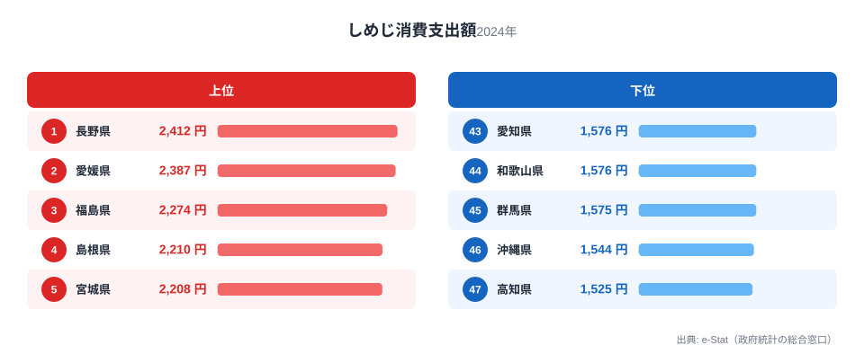
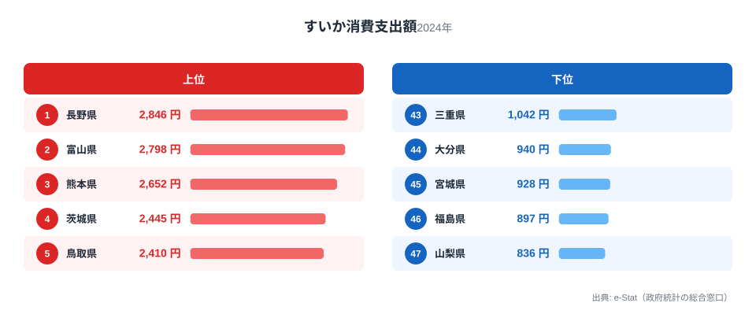
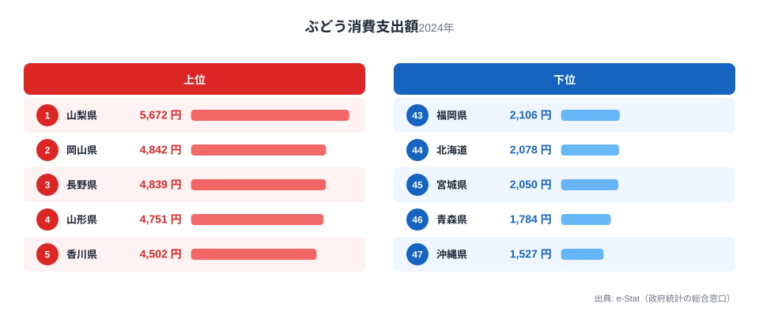
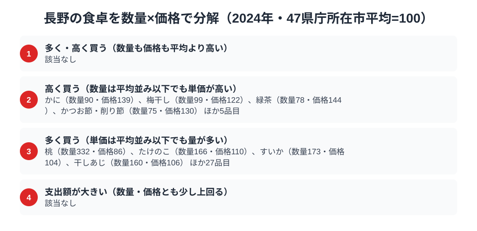

日本の屋根とも呼ばれる山岳県・長野。海に面しない内陸県ですが、高原の気候が育む農産物で食卓は豊かです。総務省の家計調査（品目別）で長野市の二人以上世帯を見ると、しめじ・すいかで全国1位、ぶどうでも全国3位と、きのこと果物で全国トップクラスに並びます。

きのこ王国のしめじ、高原のすいか、信州のぶどう。標高の高い涼しい気候が、これらの農産物を育て、食卓に厚みを与えています。この記事では、しめじ・すいか・ぶどうという3つの品目を横断しながら、長野県民の食卓を読み解きます。

> [!NOTE]
> 家計調査の都道府県データは、県庁所在市（長野県は長野市）の二人以上世帯を対象にした年間支出額です。県全体ではなく長野市在住世帯の家計簿から見た傾向であり、支出「金額」であって消費「量」そのものではない点にご注意ください。

## しめじ — 全国1位2,412円、きのこ王国

<source-link href="/ranking/shimeji-consumption-expenditure">しめじ消費支出額ランキングをもっと見る</source-link>

長野県のしめじ消費支出額は2,412円で全国1位です。2位の愛媛県2,387円と首位を争っています。長野はえのき・しめじ・なめこなど、栽培きのこの生産量で全国トップを誇る「きのこ王国」です。冷涼な気候と豊かな水がきのこ栽培に適しています。

長野では、きのこ汁やきのこご飯、鍋料理など、きのこを使った家庭料理が数多くあります。地元で新鮮なきのこが手頃に手に入る環境が、しめじの全国一の支出額を支えています。産地であると同時に消費地でもあるという「産地=消費地」の一致が、ここでも成り立っています。

## すいか — 全国1位2,846円、高原の夏

<source-link href="/ranking/watermelon-consumption-expenditure">すいか消費支出額ランキングをもっと見る</source-link>

すいかの消費支出額も長野県が2,846円で全国1位です。2位の富山県2,798円を上回ります。長野は「波田すいか」など高原ですいか栽培が盛んで、昼夜の寒暖差が甘いすいかを育てます。すいかの主要な生産地を抑えて長野が消費で全国トップに立つ点は、[すいか消費支出の記事](/blog/watermelon-expenditure-ranking)でも扱った「産地ではない県が消費で上位に来る」という現象の代表例です。

長野は果物・野菜への支出が全般に高い県として知られ、すいかもその一部として積極的に購入されています。生鮮食品を大切にする食習慣が、すいかの全国一を後押ししていると考えられます。

## ぶどう — 全国3位4,839円、信州の果樹

<source-link href="/ranking/grape-consumption-expenditure">ぶどう消費支出額ランキングをもっと見る</source-link>

果物ではぶどうでも長野は上位です。ぶどうの消費支出額は4,839円で全国3位。1位は山梨県で5,672円、2位は岡山県で4,842円ですが、長野もぶどうの一大産地として消費でも上位に入ります。長野は巨峰やシャインマスカットなど高品質なぶどうの産地で、隣県の山梨とともに日本のぶどう栽培を代表します。

きのこ・すいか・ぶどうと、長野は高原の気候が育む農産物で全国トップクラスに並びます。海の幸に乏しい内陸県だからこそ、大地の恵みへの支出が厚くなるという構図です。

> [!WARNING]
> 家計調査は支出金額の調査であり、消費量そのものではありません。物価や単価の違いも金額に影響します。また長野名産のそばやりんごの一部は品目区分や集計方法により、順位だけでは長野の食文化の全体像は測れない点にご注意ください。

## 長野の食卓を貫くもの

長野県民の食卓を貫くのは、「高原の気候が育む大地の恵み」です。きのこ王国のしめじ、高原のすいか、信州のぶどう。標高が高く冷涼で寒暖差の大きい気候が、きのこ・果物といった農産物を育て、それぞれ全国トップクラスの消費につながっています。

同じ内陸県の山形（こんにゃく・ヨーグルト・たけのこ）と並べると、長野は「高原のきのこ・果物型」、山形は「大地・山・乳製品型」と、内陸県でも食卓の個性が異なります。標高や気候の違いが、それぞれの農産物と食文化を形づくっています。

> [!TIP]
> 長野のすいかのように「産地ではない県が消費で全国1位」の品目は、その県の果物・生鮮食品全般への支出習慣の高さが背景にあります。特定の名産だけでなく、農産物全般の順位を見ると、その県が「食にお金をかける県」かどうかが見えてきます。

## 数量×価格で分解する長野市の食卓

<source-link href="/ranking/crab-consumption-quantity">かに消費量ランキングをもっと見る</source-link>

支出額の順位だけでは、「たくさん食べているから支出額が大きいのか」「単価の高いものを買っているから支出額が大きいのか」を区別できません。家計調査は品目によって数量と価格のデータも別に持っており、支出額を数量×価格に分解して比較できます。47都道府県庁所在市の平均をそれぞれ100として長野市の指数を求めると、しめじ・すいか・ぶどうはいずれも数量指数が132〜173まで平均を大きく上回る一方、価格指数は94〜104とほぼ平均並みでした。数量指数が最も高いのはすいかで平均の1.7倍強、しめじは1.3倍程度、ぶどうも1.5倍近くに達しますが、単価はどれも平均並みの範囲にとどまります。この3品目は単価の高いものを選んでいるのではなく、単価はほぼ平均並みのまま「たくさん買っている」から支出額の上位に来ているのです。

一方で、量ではなく単価の高さで支出額を押し上げている品目もあります。かに消費量は平均の9割ほどとやや控えめですが、単価は平均の1.4倍近くに達し、支出額は全国9位まで上がります。海に面しない内陸県では鮮魚介類を運ぶぶん単価が上がりやすく、量よりも単価の高さで支出が積み上がる品目が出てきます。125品目のうち、長野市が「数量が多い」に分類された品目は31、「単価が高い」に分類された品目は9でした。数量も単価もともに高い「多く・高く買う」品目は今回ゼロで、しめじ・すいか・ぶどうのように量で稼ぐタイプと、かにのように単価で稼ぐタイプに、長野市の食卓ははっきり分かれています。

> [!TIP]
> 同じ「支出額が上位」でも、数量指数と価格指数に分解すると理由が分かれます。数量指数が高ければ「たくさん食べている・使っている」ため、価格指数が高ければ「高いものを選んでいる」ためです。長野市のしめじ・すいか・ぶどうは前者、かには後者に近い形といえます。

> [!NOTE]
> ここでの指数は「47都道府県庁所在市の単純平均」を100とした相対値で、家計調査の全国平均値そのものではありません。価格指数も「支出額÷数量」から求めた相対値のため、単価そのものだけでなく、購入している品種・銘柄・グレードの違いも反映しています。対象は二人以上世帯・長野市の年間データ（2024年）です。

## まとめ

- しめじ消費支出額は長野県が全国1位（2,412円）、えのきなども生産するきのこ王国
- すいかも全国1位（2,846円）、高原の寒暖差が育てる甘いすいか
- ぶどうも全国3位（4,839円）、巨峰・シャインマスカットの信州の果樹
- 高原の気候が育むきのこ・果物への厚い支出が、内陸県・長野の豊かな食卓を支える

長野県の他の統計は[長野県の地域プロフィール](/areas/20000)、食品・家計消費の地域差は[経済カテゴリ一覧](/category/economy)からご覧いただけます。

## データ出典

総務省統計局「家計調査（品目別）」（2024年、都道府県庁所在市 二人以上世帯）をもとに、e-Stat（政府統計の総合窓口）経由で整備したデータを使用しています。
