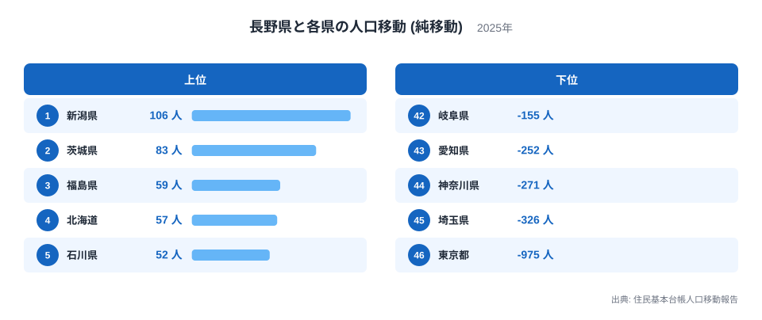
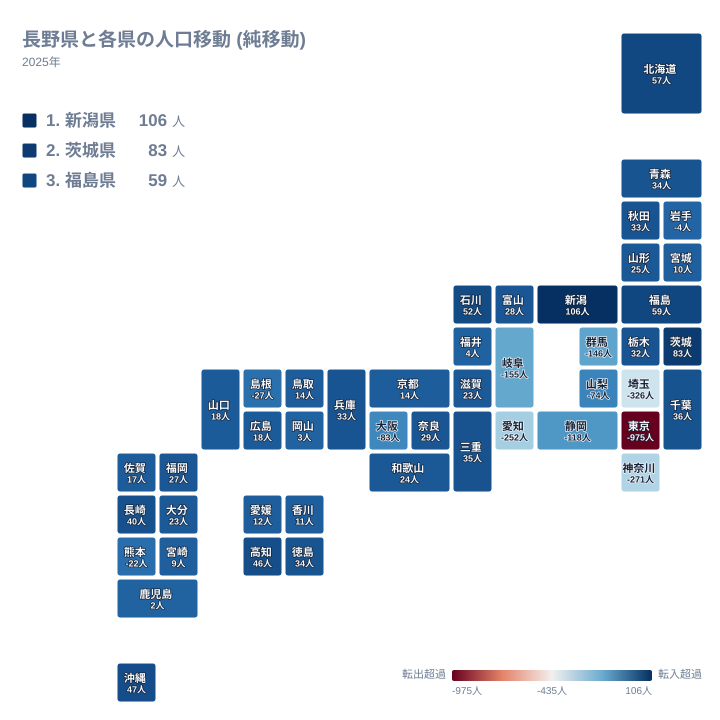
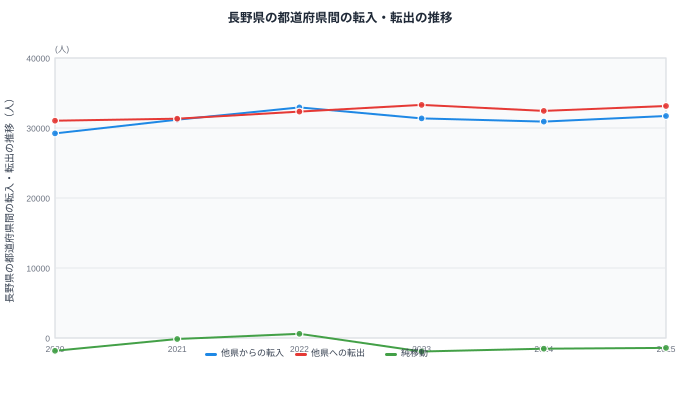

長野県は本州のほぼ中央に位置し、新潟県、群馬県、埼玉県、山梨県、静岡県、愛知県、岐阜県、富山県という8つの県と陸で接しています。都道府県の中でも隣接県の数が特に多い県ですが、住民基本台帳人口移動報告の都道府県間の純移動データを見ると、隣り合う県との関係は一様ではありません。

純移動とは、ある県から見て別の県との間で転入した人数から転出した人数を引いた差のことです。移動した人の総数そのものではなく、あくまで差し引きの値である点に注意が必要です。この記事では長野県と各県の純移動データをもとに、長野県がどの方向から人を集め、どの方向へ人を送り出しているのかを見ていきます。

## 相手県別にみる純移動

<source-link href="/ranking/moving-in-excess-rate">転入超過率ランキング</source-link>

長野県が最も多くの人を得ている相手は新潟県で、純移動は106人です。この値が全46県の中で1位となっています。2位は茨城県で83人、3位は福島県で59人、4位は北海道で57人、5位は石川県で52人と続きます。上位には長野県から離れた県も多く含まれており、単純な距離の近さだけで説明できる並びではありません。全国の転入超過率ランキングと合わせて見ると、長野県が全国のどの位置にあるのかもわかります。

上位を細かく見ると、6位は沖縄県で47人、7位は高知県で46人、8位は長崎県で40人と、長野県から遠く離れた県も含まれています。純移動は距離の近さだけで決まるものではなく、進学や転勤といった個々の事情が積み重なった結果として現れる数字であることがうかがえます。ここから先は具体的な要因を断定できるデータではないため、あくまで観察できる事実として受け止めてください。

一方で最も多くの人を失っている相手は東京都で、純移動はマイナス975人です。46位という順位は46県の中で最もマイナス幅が大きいことを示しています。45位は埼玉県でマイナス326人、44位は神奈川県でマイナス271人、43位は愛知県でマイナス252人、42位は岐阜県でマイナス155人と続き、下位に並ぶ県は首都圏や中京圏に集中しています。

> [!NOTE]
> 長野県が接する8県のうち、プラス圏なのは北にある新潟県と北西にある富山県の2県だけです。残る群馬県・埼玉県・山梨県・静岡県・愛知県・岐阜県はすべてマイナス圏で、隣接しているからといって同じ符号になるとは限りません。

## 地図でみる純移動の広がり

地図の中で長野県自体のマスに色が付いていないのは、長野県から長野県への移動というデータがそもそも存在しないためです。この地図は長野県と、それ以外の46都道府県との関係だけを表しています。

地図全体を見渡すと、青みがかった色で示される純移動プラスの県は新潟県や東北・北海道、四国や九州の一部に散らばっている一方、赤みがかった色で示される純移動マイナスの県は関東南部から東海にかけて連なっていることがわかります。長野県が接する8つの県のうち、純移動がプラスなのは新潟県と富山県の2県だけです。新潟県は106人で1位、富山県は28人で17位となっており、いずれも長野県の北から北西にあたる方向です。

残る6つの隣接県、すなわち群馬県、埼玉県、山梨県、静岡県、愛知県、岐阜県はすべて純移動がマイナスです。群馬県はマイナス146人、埼玉県はマイナス326人、山梨県はマイナス74人、静岡県はマイナス118人、愛知県はマイナス252人、岐阜県はマイナス155人となっており、これらはいずれも長野県の南から南東にかけて位置する県です。同じ「隣接県」という条件でも、方角によって純移動の向きがはっきりと分かれている点が、この地図から読み取れる特徴です。

> [!WARNING]
> この記事の相手県別ランキングには新潟県をはじめプラスの相手が複数含まれますが、2020年から2025年の6年間で長野県全体の純移動がプラスだったのは2022年の1年だけです。個別の相手県との関係だけを見て、長野県が人を集めている県だと判断しないでください。

## 東京圏との関係

長野県から見て東京都はマイナス975人と、全46県の中で最も大きな純移動のマイナス幅を持つ相手です。中央本線や上信越自動車道、北陸新幹線など、[長野県のデータ](/areas/20000)と[東京都のデータ](/areas/13000)を結ぶ交通路は複数ありますが、その利便性の高さが人の流れを東京都側に引き寄せている構図がうかがえます。

東京都だけでなく、埼玉県や神奈川県、千葉県といった首都圏の県との関係も見ておく必要があります。埼玉県は45位でマイナス326人、神奈川県は44位でマイナス271人となっている一方、千葉県は9位でプラス36人です。同じ首都圏の県でも、長野県との関係は一様ではなく、千葉県のように長野県が人を得ている相手も含まれています。

マイナス幅が大きい上位3県は東京都・埼玉県・神奈川県であり、このうち長野県と陸で接しているのは埼玉県だけです。東京都と神奈川県は長野県に隣接していないにもかかわらず、隣接する埼玉県と並んで最も大きなマイナス幅を記録しており、長野県の人口移動が首都圏との結びつきによって、隣接・非隣接を問わず大きく左右されていることを示しています。

## 転入・転出の推移

この図は長野県と全国すべての県との間でやり取りされた転入・転出・純移動の推移を示しています。他県からの転入は2020年が29,222人、2021年が31,189人、2022年が32,942人、2023年が31,372人、2024年が30,918人、2025年が31,721人と推移しています。他県への転出は2020年が31,045人、2021年が31,331人、2022年が32,347人、2023年が33,300人、2024年が32,448人、2025年が33,136人です。

この転入と転出の差である純移動は、2020年がマイナス1,823人、2021年がマイナス142人、2022年がプラス595人、2023年がマイナス1,928人、2024年がマイナス1,530人、2025年がマイナス1,415人となっています。6年間のうち純移動がプラスになったのは2022年のみで、それ以外の年はすべてマイナスです。2022年に転入が32,942人まで増えて転出の32,347人を上回った一方、翌2023年には転出が33,300人まで増加し、純移動は再びマイナス1,928人へと落ち込んでいます。

> [!TIP]
> 純移動がプラスの年でも、それは転入者数が転出者数をわずかに上回っただけであり、長野県から出て行く人がいなくなったわけではありません。実際に2022年も転出は32,347人と、転入と大きく変わらない規模で続いています。差し引きの符号だけでなく、転入と転出の実数の両方を見ることが読み解きのコツです。

## まとめ

- 長野県が最も人を得ている相手は新潟県で、純移動は106人です。
- 長野県が最も人を失っている相手は東京都で、純移動はマイナス975人です。
- 長野県が接する8県のうち、純移動がプラスなのは北から北西にあたる新潟県と富山県の2県だけです。
- 全国合計の純移動は2020年から2025年の間で、2022年を除きすべての年でマイナスとなっています。

長野県の人口移動の全体像は、[人口動態のテーマ](/themes/population-dynamics)や[人口・世帯の統計一覧](/category/population)からも確認できます。

## データ出典

- 出典: 住民基本台帳人口移動報告
- 年: 2025年(相手県別の純移動)、2020年から2025年(転入・転出・純移動の推移)
