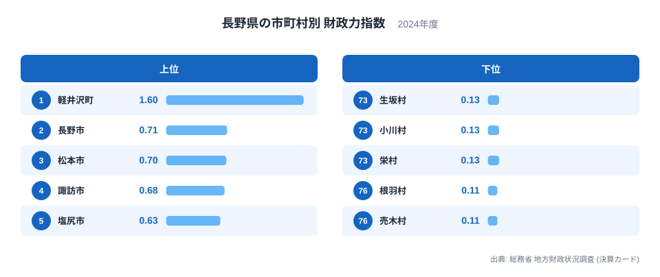
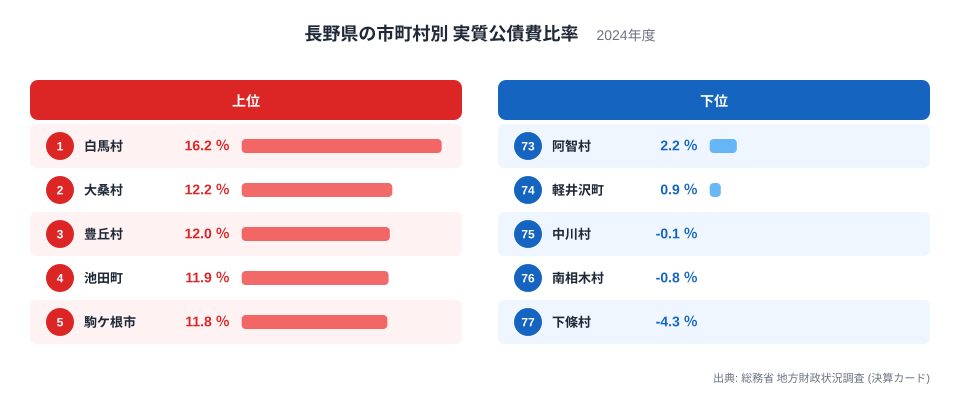
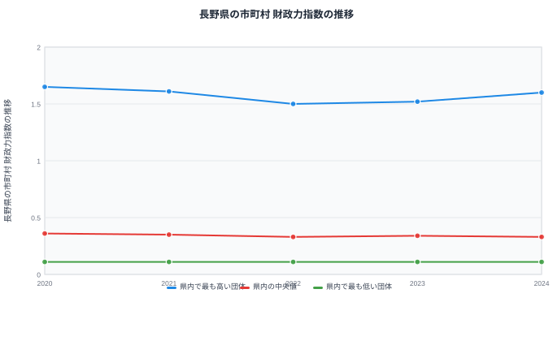

長野県には77の市町村があり、同じ県内でも財政の姿は大きく異なります。総務省の地方財政状況調査、いわゆる決算カードの2024年度データを見ると、自治体の自主財源の豊かさを示す財政力指数は、最も高い軽井沢町が1.6、最も低い売木村と根羽村がそれぞれ0.11となっています。1.6を0.11で割ると、約14.5倍もの開きになります。

この記事では、財政力指数と、借金の返済負担を示す実質公債費比率という2つの指標から、長野県内の77市町村がどれだけ違う財政状況にあるのかを見ていきます。数値の大きさだけでなく、なぜその順位になっているのかという背景まで含めて読み解きます。[長野県のデータ](/areas/20000)を県全体の姿と合わせて確認しながら読み進めてください。

## 財政力指数でみる77市町村の差

> [!NOTE]
> 財政力指数は、自治体が自前の税収でどれだけ標準的な行政サービスの費用をまかなえるかを示す割合です。1に近づくほど、あるいは1を超えるほど、地方交付税に頼らずに運営できていることを意味します。今回のデータで1を超えているのは軽井沢町だけで、他の76市町村はすべて1未満です。

財政力指数は、自治体が自前の税収でどれだけ標準的な行政サービスをまかなえるかを示す指標です。長野県内で1を超えているのは軽井沢町だけで、1.6という数値は、別荘所有者からの固定資産税や観光関連の税収が大きいことをうかがわせます。ただし、税収構造がなぜここまで突出しているかは、財政力指数の数値だけでは確定できません。[仮説] 固定資産税の内訳や観光収入の規模まで確かめる必要があります。

2番目に高いのは長野市の0.71、3番目は松本市の0.7で、県庁所在地と県内最大の都市が続きます。4番目の諏訪市は0.68、5番目の塩尻市は0.63、6番目の坂城町も同じく0.63です。人口や事業所が集まる市部が上位に並ぶ一方で、坂城町のように人口規模が小さくても製造業の集積で税収を確保している町も混じっています。

順位表の下位を見ると、73位の生坂村、74位の小川村、75位の栄村がいずれも0.13です。さらに76位の根羽村と77位の売木村は、ともに0.11という同じ値になっています。上位が観光地や工業集積地であるのに対し、下位に並ぶのは山間部にあり人口の少ない村が中心です。[仮説] 人口が少ないほど自主財源となる税収の絶対額も小さくなりやすいため財政力指数が低くなりやすいと考えられますが、これが長野県だけの傾向なのか、他県の山間部の自治体にも共通するのかは、この記事のデータだけでは判断できません。

## 実質公債費比率でみる77市町村の差

実質公債費比率は、借入金の返済に充てているお金が、標準的な財政規模に対してどれくらいの割合になっているかを示す指標です。数値が高いほど、将来の返済負担が重いことを意味します。長野県内で最も高いのは白馬村の16.2％で、2位の大桑村が12.2％、3位の豊丘村が12％と続きます。4位の池田町は11.9％、5位の駒ケ根市は11.8％、6位の飯綱町も同じく11.8％です。

> [!WARNING]
> 実質公債費比率は単年度の数値ではなく、直近3か年度の平均で算出される仕組みです。2024年度の決算カードに載った数値も、その年だけの借入状況ではなく過去2年分の返済負担を含んでいます。また、財政力指数と実質公債費比率はいずれも市と町村を区別せずに順位付けしているため、人口規模が大きく異なる自治体同士を単純に比較する際は注意が必要です。

反対に最も低いのは77位の下條村でマイナス4.3％、76位の南相木村でマイナス0.8％、75位の中川村でマイナス0.1％です。実質公債費比率がマイナスになるのは、標準的な収入に対して積立金の運用収入などがそれを上回り、実質的な負担がゼロを下回る状態を指します。[仮説] 白馬村のように観光関連の大型施設整備が続いた自治体で数値が高くなり、下條村のように借入を抑えてきた自治体で低くなる傾向がうかがえますが、それぞれの投資の内容や借入の経緯までは、この決算カードの数値だけからは分かりません。

## 財政力指数の推移からわかること

財政力指数を単年度だけでなく、2020年から2024年までの5年間で見ると、県内で最も高い団体は2020年に1.65、2021年に1.61、2022年に1.5と一度下がり、2023年に1.52、2024年に1.6と持ち直しています。2024年の値1.6は、先ほどの順位表で1位だった軽井沢町の値と一致しており、少なくとも2024年についてはこの団体が軽井沢町であると分かります。[仮説] ただし公表されている推移データには自治体名が記載されていないため、2020年から2023年まで同じ町が最上位だったかどうかは断定できません。

県内の中央値は2020年の0.36から、2021年0.35、2022年0.33、2023年0.34と推移し、2024年は0.33です。77市町村の中央値にあたる39番目の順位を見ると、2024年の財政力指数ランキングで39位の飯山市が0.33であり、推移データの中央値と一致します。中央値がこの5年でわずかに下がっていることは、多くの町村で自主財源の割合が徐々に厳しくなっていることを示しています。

一方、県内で最も低い団体は2020年から2024年まで一貫して0.11のままです。2024年の順位表では76位の根羽村と77位の売木村がともに0.11で並んでおり、この5年間、県内で最も財政力指数が低い自治体の座がどちらかに固定されているのか、それとも年によって入れ替わっているのかは、公表データからは判別できません。

## なぜこれほどの差が生まれるのか

ここまで見てきたように、財政力指数でも実質公債費比率でも、上位と下位の顔ぶれには一定の傾向があります。財政力指数が高いのは軽井沢町のような観光地や、長野市・松本市のように人口と事業所が集積する都市部です。反対に財政力指数が低いのは、根羽村や売木村のように人口の少ない山間部の村が中心です。[仮説] これは自主財源となる税収が人口や事業所の規模におおむね比例するためだと考えられますが、この記事で扱った決算カードのデータだけでは、人口や産業構成との相関を直接確かめることはできません。

実質公債費比率については、白馬村のように観光関連のインフラ整備が進んだとみられる自治体で数値が高くなる一方、下條村や中川村のようにマイナスの値を示す自治体もあります。[仮説] 大型の公共施設整備を借入で進めた時期がある自治体ほど比率が高くなりやすいと推測されますが、個々の借入の目的や時期までは、財政力指数と実質公債費比率の数値だけからは特定できません。

同じ長野県内でも、これだけの差があることは、[地方財政のテーマ](/themes/local-finance)で他の指標と合わせて確認すると理解が深まります。県全体の財政状況をより広い視点で見たい場合は、[行政・財政カテゴリの統計一覧](/category/administrativefinancial)から関連するランキングを探すこともできます。

> [!TIP]
> 財政力指数は自主財源の豊かさ、実質公債費比率は借金の返済負担という、まったく別のものを測る指標です。財政力指数が低い自治体が必ずしも実質公債費比率も高いとは限らず、両方の数値を合わせて見ることで、その自治体の財政の実像に近づけます。

## まとめ

- 財政力指数の1位は軽井沢町の1.6、76位は根羽村の0.11、77位は売木村の0.11で、最大と最小の差は約14.5倍です。
- 実質公債費比率の1位は白馬村の16.2％、77位は下條村のマイナス4.3％です。
- 財政力指数の推移では、県内で最も高い団体が2020年の1.65から2024年の1.6とほぼ横ばいですが、中央値は2020年の0.36から2024年の0.33へゆるやかに下がっています。
- 財政力指数が高いのは観光地や都市部、低いのは人口の少ない山間部の村という傾向が見られますが、因果関係の断定にはさらなる検証が必要です。
- 実質公債費比率はマイナスになる自治体もあり、3年平均という算出方法や決算年度に注意して読む必要があります。

## データ出典

- 総務省 地方財政状況調査（決算カード） 2024年度
