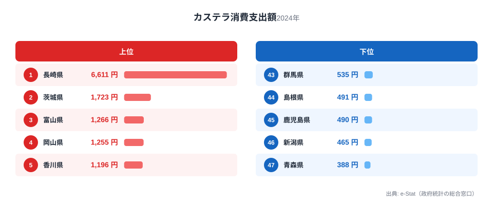
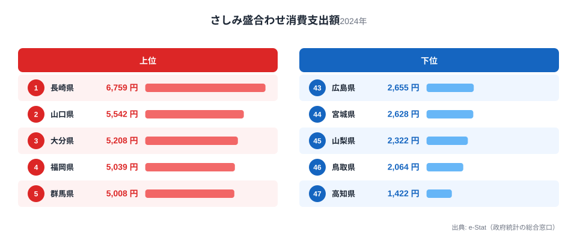
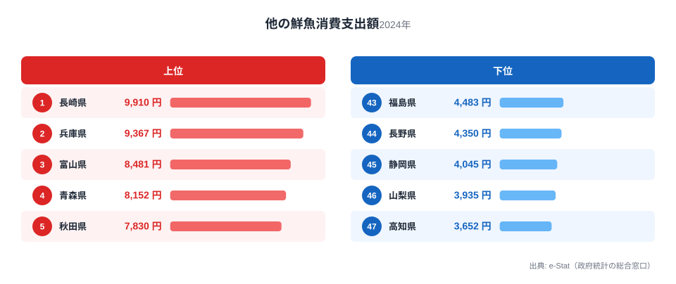
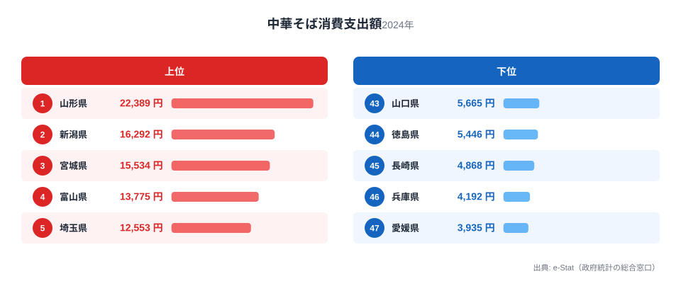
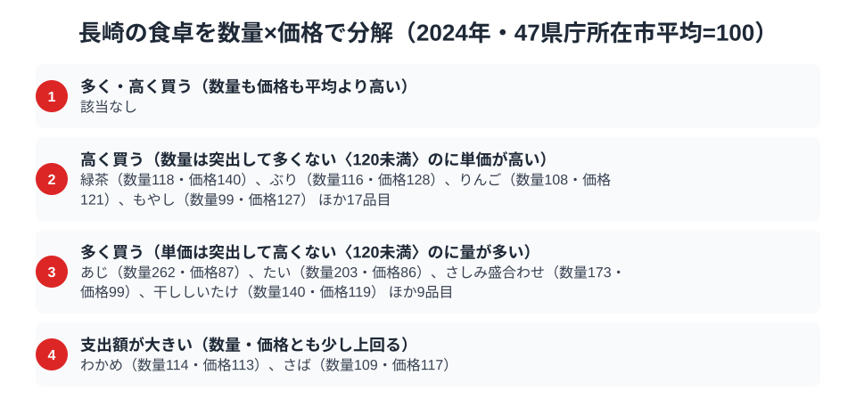

長崎県は、カステラの消費支出額で全国1位、さしみ盛合わせと他の鮮魚の消費支出額でも全国1位という、甘味と魚介の二冠を持つ県です。特にカステラは年間6,611円で、2位の茨城県は1,723円ですから、3.8倍という圧倒的な差をつけています。

一方で、中華そば（ラーメン）の外食支出額は45位と、47都道府県のうち下から3番目にとどまります。魚介と甘味では突出した長崎が、なぜ麺類の外食では控えめなのでしょうか。総務省「家計調査（品目別）」2024年のデータから、長崎県民の食卓を読み解きます。

> [!NOTE]
> このデータは総務省「家計調査」による都道府県庁所在市（長崎県は長崎市）の二人以上世帯を対象とした年間消費支出額です。世帯単位の平均であり、個人の消費量そのものではありません。

## カステラ — 全国1位6,611円、2位の3.8倍

<source-link href="/ranking/castella-consumption-expenditure">カステラ消費支出額ランキングをもっと見る</source-link>

長崎県のカステラ消費支出額は年間6,611円で、全国平均を大きく引き離す1位です。2位の茨城県は1,723円で3.8倍、47位の青森県は388円で17.0倍という、家計調査の全502品目の中でも屈指の地域集中を示しています。

カステラは16世紀にポルトガル人が長崎に伝えたとされる南蛮菓子で、長崎市には今も専門店が軒を連ねます。県民にとってカステラは贈答品や慶弔の手土産として日常的に消費される存在であり、他県のように「観光土産」としてだけ扱われる菓子とは支出構造が異なると考えられます。2位以下がいずれも1,000円台〜2,000円台に収まる中、長崎だけが突出しているのは、地元での日常的な購入習慣が支出額に反映されているためでしょう。

## さしみ盛合わせ・他の鮮魚 — 二つの鮮魚指標で日本一

<source-link href="/ranking/sashimi-platter-consumption-expenditure">さしみ盛合わせ消費支出額ランキングをもっと見る</source-link>

さしみ盛合わせの消費支出額も長崎県が6,759円で全国1位です。2位の山口県は5,542円、3位の大分県は5,208円と、九州・中国地方の日本海側〜西岸の県が上位を占める中での首位です。47位の高知県は1,422円で、4.8倍の差があります。

<source-link href="/ranking/other-fresh-fish-consumption-expenditure">他の鮮魚消費支出額ランキングをもっと見る</source-link>

さらに、個別魚種に分類されない「他の鮮魚」の支出額でも長崎県は9,910円で全国1位です。2位の兵庫県は9,367円、3位の富山県は8,481円に対して差は小さめですが、47位の高知県は3,652円で、2.7倍の開きがあります。長崎県は五島列島や壱岐・対馬など好漁場を抱え、水揚げされる魚種が多岐にわたるため、「その他」に分類される魚の消費が多くなりやすい地理的背景があります。二つの鮮魚系指標で同時に1位を取る県は珍しく、長崎の食卓が魚介中心であることを裏づけています。

## ラーメン外食だけは45位、なぜか

<source-link href="/ranking/ramen-dining-consumption-expenditure">中華そば消費支出額ランキングをもっと見る</source-link>

長崎県の中華そば（ラーメン）外食支出額は4,868円で、全国45位にとどまります。1位の山形県は22,389円ですから4.6分の1、最下位の愛媛県は3,935円、46位の兵庫県は4,192円に次いで低い水準です。

長崎には「ちゃんぽん」や「皿うどん」という独自の中華麺文化がありますが、家計調査の品目分類上、これらは「中華そば」（一般的な醤油・味噌・とんこつ系ラーメン）とは別枠で扱われるため、この45位という順位には反映されません。つまり長崎県民が麺類の外食を避けているのではなく、麺類の外食需要がちゃんぽん・皿うどんという県内独自メニューに向かい、統計上の「中華そば」枠には計上されにくい構造があると考えられます。

中華そば外食の全国1位は山形県で22,389円、2位は新潟県で16,292円と、東北・北陸のラーメン王国が上位を占めています。これらの地域はご当地ラーメンの外食文化が根付いており、家計調査の「中華そば」区分にそのまま支出が反映されます。一方、長崎のように独自の麺料理を持つ地域では、外食需要が地元メニューに流れる分だけ「中華そば」区分の支出が相対的に低く出やすい構造があります。同様の傾向は、うどん文化の地域差を扱った[「うどん本場」福岡が下位に沈む謎](/blog/udon-soba-food-culture-prefecture-map)でも確認できます。

> [!WARNING]
> この「中華そば」は一般的なラーメン店での外食支出を指し、長崎名物のちゃんぽん・皿うどんは家計調査の品目分類では個別に集計されていません。長崎県のラーメン外食順位が低いことは、麺類そのものへの支出が少ないことを意味するわけではない点に注意してください。

## 長崎の食卓を貫くもの

カステラ・さしみ盛合わせ・他の鮮魚という3つの全国1位指標に共通するのは、いずれも「長崎ならではの独自品目」への支出が突出している点です。カステラは南蛮貿易の歴史、鮮魚2種は五島・壱岐・対馬を抱える豊かな漁場という、他県には代替しにくい地域資源に支出が集中しています。逆に中華そばという全国共通の外食品目では順位が上がらず、代わりにちゃんぽん・皿うどんという独自メニューに需要が流れている可能性が高いことも、同じ構図の裏返しといえます。

長崎の食卓を貫くのは「全国共通の品目では平凡、独自の郷土品目では圧倒的」という一貫した傾向です。この型は、[かつお節だけが全国1位という沖縄](/blog/okinawa-food-culture)や、隣県で郷土色の強い品目が上位を占める[熊本の食卓](/blog/kumamoto-food-culture)とも共通する、九州・沖縄圏に見られる食文化のパターンといえるでしょう。

> [!TIP]
> 家計調査の品目分類は全国共通の一般名称（「中華そば」「その他の鮮魚」等）が中心のため、地域固有の料理名（ちゃんぽん・皿うどん等）は個別の統計項目として現れません。ある県の「意外な下位品目」を見つけたときは、その地域独自の呼び名や分類の別枠に需要が流れていないかを疑うと、統計の裏側にある食文化が見えてきます。

## 数量×価格で分解する長崎市の食卓

<source-link href="/ranking/horse-mackerel-consumption-quantity">あじ消費量ランキングをもっと見る</source-link>

さしみ盛合わせ・他の鮮魚が全国1位である理由を、支出額をさらに「消費量×単価」に分解して確かめてみましょう。総務省「家計調査」で消費量と支出額の両方が公表されている124品目について、47都道府県庁所在市の単純平均を100とした指数を作ると、長崎市が「消費量も単価も平均より高い」品目は0件でした。長崎の食卓は、量で稼ぐか、単価で稼ぐかのどちらかにはっきり分かれる構造だとわかります。

最も際立つのは「多く買うが単価は抑える」品目群です。あじ消費量の指数は262と平均の2.6倍に達する一方、単価指数は86.9で平均より安く、たいも消費量202.6・単価85.9とほぼ同じ傾向を示します。既に見たさしみ盛合わせも消費量指数173.1に対し単価指数は99.1とほぼ平均並みで、支出額全国1位は割高な魚を少量買っているのではなく、豊富な水揚げを背景に大量に消費していることが、消費量×単価の分解から裏づけられます。

一方で「高く買うが量は増えない」品目もあります。緑茶は消費量118.1に対し単価指数139.9、ぶりは消費量116.3に対し単価指数127.6、りんごは消費量108.4に対し単価指数120.9と、いずれも量より単価の高さが支出を押し上げています。魚介では「安く多く」、嗜好品では「高くても質を選ぶ」という二つの消費行動が同居しているのが、長崎の食卓の特徴といえます。

> [!TIP]
> 消費量指数が260を超えるのに単価指数は平均以下という「多く買うほど単価が下がる」構造は、水揚げ量が多く地元での流通コストが低い品目に典型的に表れます。ランキングで支出額1位の品目を見つけたら、消費量と単価のどちらが効いているかを確かめると、地域の生産基盤によるものか、嗜好によるものかを切り分けられます。

> [!NOTE]
> この指数は47都道府県庁所在市の二人以上世帯を対象に、品目ごとの消費量・支出額の単純平均を100として算出したもので、家計調査が公表する全国値そのものではありません。単価指数は品種・銘柄・容量の違いを含んだ「支出額÷消費量」の相対値であり、店頭価格の単純比較ではない点にも注意してください。

## まとめ

- カステラ消費支出額は長崎県が6,611円で全国1位、2位の茨城県は1,723円で3.8倍の差
- さしみ盛合わせ消費支出額も長崎県が6,759円で全国1位、47位の高知県は1,422円で4.8倍の差
- 他の鮮魚消費支出額も長崎県が9,910円で全国1位、47位の高知県は3,652円で2.7倍の差
- 中華そば外食支出額は長崎県が4,868円で全国45位。ちゃんぽん・皿うどんという独自麺文化が別枠で存在するためと考えられる

長崎県の統計データは、[長崎県の地域プロフィール](/areas/42000)でも詳しく見られます。他の家計調査データは[経済カテゴリ一覧](/category/economy)からどうぞ。

## データ出典

総務省統計局「家計調査（品目別）」2024年、都道府県庁所在市 二人以上世帯 / e-Stat（政府統計の総合窓口）経由で取得。
