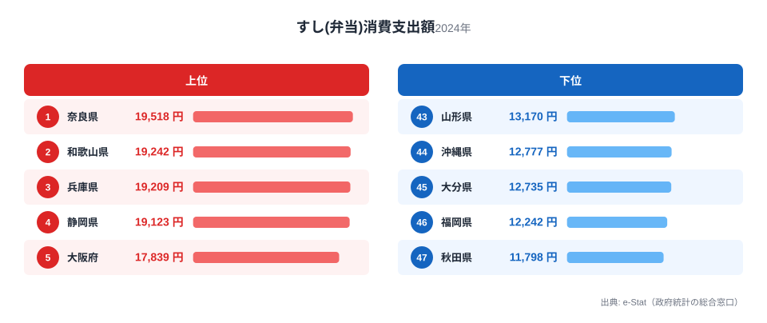
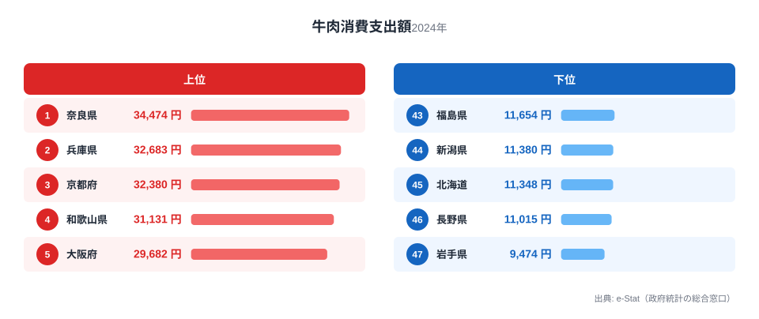
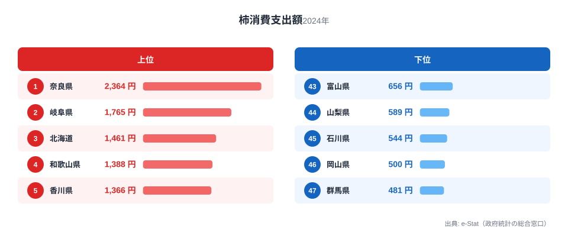

奈良県民の食卓を家計調査のデータで見ると、ひとつの驚きに突き当たります。「すし(弁当)」「牛肉」「柿」という、系統も価格帯もまるで違う3つの品目で、奈良がすべて全国1位を獲得しているのです。

寿司はテイクアウトの惣菜、牛肉は食肉、柿は果物。ふつうならこれらは別々の地域が強みを持つはずです。ところが奈良では3つが同時に1位に並びます。この記事では、[家計調査（品目別）](/category/economy)の実データから奈良の食卓を貫く共通点をたどり、なぜ性格の異なる3品目が同じ県に集まるのかを読み解きます。

> [!NOTE]
> 家計調査は都道府県庁所在市（奈良県は奈良市）の二人以上世帯を対象にした年間消費支出額の調査です。県全体ではなく県庁所在市の世帯が単位になるため、市部の消費傾向が強く反映される点に注意してください。

## すし(弁当) — 全国1位19,518円、テイクアウト文化の中心地

<source-link href="/ranking/sushi-takeout-consumption-expenditure">すし(弁当)消費支出額ランキングをもっと見る</source-link>

すし(弁当)の消費支出額は奈良県が19,518円で全国1位です。2位は和歌山県（全国2位・19,242円）、3位は兵庫県（全国3位・19,209円）と、上位は近畿勢が僅差で並んでいます。最下位は秋田県で11,798円にとどまり、1位との差は1.7倍です。

奈良には柿の葉寿司という郷土食があります。押し寿司を柿の葉で包んで保存する形式で、そもそも「持ち帰って食べる寿司」を日常的に扱う土地柄です。惣菜店や駅の売店で寿司を買って帰る習慣が根付いていれば、テイクアウトの寿司支出が押し上げられるのは自然な流れといえます。海に面していない奈良で、海の幸である寿司が定着した背景には、こうした保存食文化の存在があります。

## 牛肉 — 全国1位34,474円、大和牛のブランド力

<source-link href="/ranking/beef-consumption-expenditure">牛肉消費支出額ランキングをもっと見る</source-link>

牛肉の消費支出額は奈良県が34,474円で全国1位です。2位は兵庫県（全国2位・32,683円）、3位は京都府（全国3位・32,380円）と、ここでも近畿の県が上位を占めています。最下位は岩手県の9,474円で、1位との差は3.6倍に開きます。

隣接する兵庫県は神戸ビーフの本場であり、奈良にも大和牛という地域ブランド牛が存在します。近畿圏全体で高級和牛の流通・消費が根付いていることに加え、奈良県は畜産技術の集積地としての歴史も長く、和牛の飼育・消費文化が地域に定着しています。すし(弁当)とは異なる「高価格帯の食材への支出意欲」という側面が、この結果に表れていると考えられます。

## 柿 — 全国1位2,364円、西吉野・五條の産地力

<source-link href="/ranking/persimmon-consumption-expenditure">柿消費支出額ランキングをもっと見る</source-link>

柿の消費支出額は奈良県が2,364円で全国1位です。2位は岐阜県（全国2位・1,765円）、3位は北海道（全国3位・1,461円）と続きます。最下位は群馬県の481円で、1位との差は4.9倍と、3品目の中でもっとも格差が大きくなっています。

奈良県は柿の生産量が全国トップクラスで、西吉野・五條地域は富有柿の名産地として知られています。産地であることがそのまま地元消費の高さに直結するのは、県産品を地元で消費する構造がはたらいている典型例です。[和歌山の食卓記事](/blog/wakayama-food-culture)ではみかんが全国1位、柿は全国4位という結果でしたが、隣県同士で柿の順位が入れ替わっている点も興味深いところです。奈良は柿の「本場」としての地位を数字で裏づけています。

> [!WARNING]
> ここで扱う数値は家計調査における「消費支出額」であり、消費量そのものではありません。柿の葉寿司のように加工品として消費される柿は、寿司(弁当)の支出に計上され柿単体の支出には含まれない可能性があります。実際の柿消費量はこの数値以上に多い可能性がある点に留意してください。

## 奈良の食卓を貫くもの

すし(弁当)・牛肉・柿という3品目に共通するのは、「地域固有の食文化・産地力が支出額に直結している」という構造です。柿の葉寿司という保存食文化がテイクアウト寿司の需要を底上げし、大和牛のブランド力が高級食材への支出を押し上げ、柿の一大産地であることが地元消費の高さに結びついています。

これは、[経済カテゴリ](/category/economy)の他県の家計調査記事とも共通する傾向です。産地であることや郷土料理の存在が、消費支出という数字に静かに反映されるパターンは、地方の食文化を読み解くうえで重要な手がかりになります。

> [!TIP]
> 3品目のうち牛肉と柿は「奈良県が産地または近接する食材」という共通点がありますが、すし(弁当)は海産物の加工品であり産地とは直接結びつきません。それでも1位になっている背景には、柿の葉寿司という郷土食を通じて「寿司を日常的に持ち帰って食べる」習慣が定着していることが考えられます。産地由来の強みだけでなく、郷土料理由来の消費習慣も加わって3冠が成立していると読み解けます。

## まとめ

- すし(弁当)消費支出額は奈良県が19,518円で全国1位（2位和歌山県19,242円、3位兵庫県19,209円）
- 牛肉消費支出額は奈良県が34,474円で全国1位（2位兵庫県32,683円、3位京都府32,380円、最下位岩手県9,474円）
- 柿消費支出額は奈良県が2,364円で全国1位（2位岐阜県1,765円、3位北海道1,461円、最下位群馬県481円）
- 3品目とも1位という異例の結果は、柿の葉寿司の保存食文化・大和牛のブランド力・柿の産地力という異なる背景が重なったもの
- [奈良県の地域プロフィール](/areas/29000)では、他の指標でも奈良県の特徴を確認できます

## データ出典

総務省統計局「家計調査（品目別）」2024年、都道府県庁所在市 二人以上世帯（e-Stat経由で整備）
