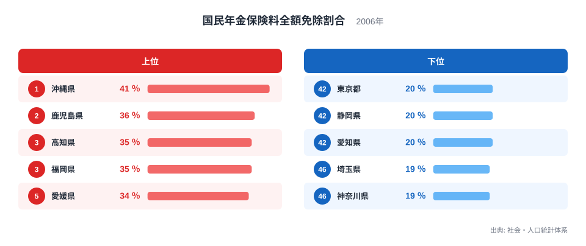
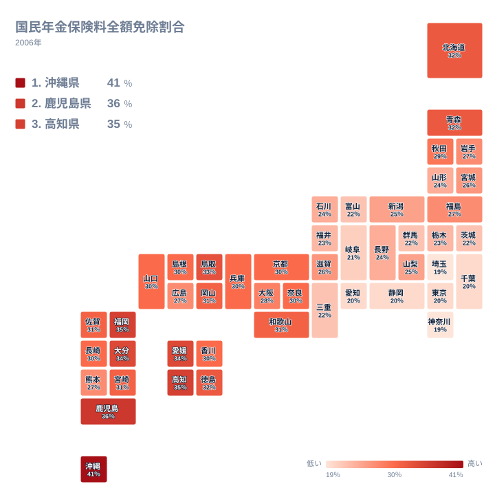

国民年金は、20歳以上60歳未満のすべての人が加入する制度です。ただし所得が少ない人は、申請することで保険料の納付が全額免除されます。この記事で扱う国民年金保険料全額免除割合は、第1号被保険者のうち、保険料の全額免除を受けている人の割合を示す指標です。2006年の社会・人口統計体系のデータをもとに、47都道府県を比較します。

全国で見ると、この割合には大きな地域差があります。1位の沖縄県は41％である一方、最下位の神奈川県は19％にとどまり、その差はおよそ2.2倍にのぼります。同じ制度のもとにありながら、これほどの開きが生まれる背景には、地域ごとの所得水準や産業構造、第1号被保険者の顔ぶれの違いが関係していると考えられます。この記事では、上位と下位それぞれの県の特徴を手がかりに、免除率の地域差がどこから生まれているのかを読み解いていきます。

## 上位と下位はどこか

<source-link href="/ranking/national-pension-full-exemption-rate">国民年金保険料全額免除割合ランキングをもっと見る</source-link>

上位を見ると、沖縄県が41％で1位です。2位は鹿児島県で36％、3位は高知県で35％、4位は福岡県で35％、5位は愛媛県で34％と続きます。上位5県はいずれも西日本、なかでも九州・沖縄・四国に集中しています。

一方、下位を見ると、43位の東京都から47位の神奈川県まで、いずれも20％前後かそれを下回る水準です。47位は神奈川県で19％、46位は埼玉県で19％、45位は愛知県で20％、44位は静岡県で20％、43位は東京都で20％となっています。下位5県は、東京都・神奈川県・埼玉県という首都圏の3都県と、愛知県・静岡県という中京・東海圏の2県で占められています。

上位と下位のこの並びは偶然ではありません。上位の沖縄・鹿児島・高知・福岡・愛媛は、いずれも第1次産業や中小規模の自営業、非正規雇用の比率が相対的に高い地域として知られています。国民年金の第1号被保険者には、自営業者や農林漁業従事者、非正規雇用で厚生年金に加入していない人などが含まれます。こうした働き方の人が多い地域では、所得が国が定める免除基準を下回りやすく、結果として全額免除の申請が増える構造があると考えられます。

対照的に、下位の東京都・神奈川県・埼玉県・愛知県・静岡県は、いずれも大企業の本社や事業所が集積し、会社員として厚生年金に加入する人の割合が高い地域です。厚生年金の加入者は国民年金の第2号被保険者となり、そもそも第1号被保険者としての保険料免除の対象になりません。第1号被保険者に占める割合として計算されるこの指標では、第1号被保険者そのものの所得水準が比較的高い都市部で、免除率が低くなりやすいと言えます。

## 地理的にはどう分布しているか

タイルマップで全国を見渡すと、免除率が高い県は西日本、とりわけ沖縄と九州南部、四国に偏っていることがわかります。逆に、免除率が低い県は関東南部と中京圏に集中しており、東北や北陸、中国地方の多くは全国平均に近い中間的な水準です。

この分布は、都市圏への人口・産業の集積度合いをそのまま映し出しているように見えます。関東南部と中京圏は、日本の中でも特に会社員としての雇用が厚い地域であり、第1号被保険者の中でも比較的所得のある層が多く残る傾向があると考えられます。一方、沖縄や九州南部、四国は、離島や中山間地域を抱え、農林漁業や小規模事業者の比率が高いことが、免除率の高さと結びついている可能性があります。ただし、これは県ごとの産業構造や所得分布から読み取れる関係であり、免除率の高さそのものが地域の貧しさを直接示すものではない点には注意が必要です。

## なぜ免除率だけでは県の実情がわからないのか

免除率が高い県ほど生活が苦しい、と単純に受け取ってしまうのは早計です。この指標は、あくまで「第1号被保険者のうち全額免除を受けている人の割合」であり、第1号被保険者そのものの人数や年齢構成、地域全体の所得水準を直接示すものではありません。たとえば会社員の比率が高い都市部では、第1号被保険者自体の母数が相対的に小さくなるため、免除率という比率だけを見ても、地域全体の経済状況を正確につかむことは難しいのです。

また、免除には全額免除のほかに一部免除や納付猶予といった区分もあります。この記事で扱っているのはあくまで全額免除の割合であり、一部免除や猶予を含めた広い意味での「保険料を満額納めていない人」の割合とは異なります。県ごとの制度利用の実態をより深く理解するには、こうした区分ごとのデータもあわせて見る必要があります。

[仮説] 上位県に共通する高齢化率や第1次産業比率の高さが、免除率の押し上げに寄与している可能性がありますが、この記事のデータだけでは因果関係までは検証できません。年齢構成や産業別就業者数といった別の統計とあわせて確認することが望まれます。

> [!NOTE]
> この指標の分母は全国民ではなく、国民年金の第1号被保険者(自営業者・農林漁業従事者・学生・無職の人など)です。会社員や公務員として厚生年金に加入している人は第2号被保険者となり、そもそも集計の対象に含まれません。

> [!WARNING]
> この記事のデータは2006年時点のものです。国民年金の免除基準や第1号被保険者の構成は年によって変化するため、現在の状況をそのまま反映しているとは限りません。最新の傾向を知りたい場合は、直近年のデータもあわせて確認してください。

> [!TIP]
> 全額免除と「未納」は異なります。全額免除は申請して承認された正式な手続きであり、将来の年金額には一定の割合で反映されます。一方、未納は保険料を納めずに放置している状態で、将来の年金受給資格や年金額に不利に働きます。免除率の高さは、必ずしも制度からの脱落を意味するものではありません。

## まとめ

- 国民年金保険料全額免除割合は、沖縄県が41％で全国1位です。
- 最下位は神奈川県で19％となっており、1位との差はおよそ2.2倍です。
- 上位5県は沖縄・鹿児島・高知・福岡・愛媛と、いずれも西日本の県が占めています。
- 下位5県は東京都・神奈川県・埼玉県・愛知県・静岡県と、首都圏・中京圏の都県が占めています。
- 地理的には、免除率の高い地域が西日本に、低い地域が関東南部と中京圏に偏る傾向が見られます。

さらに詳しく都道府県ごとの数値を確認したい場合は、[同じカテゴリの統計一覧](/category/socialsecurity)から社会保障分野の他の指標もあわせてご覧ください。上位県である[沖縄県のデータ](/areas/47000)や[鹿児島県のデータ](/areas/46000)では、他の統計指標も確認できます。

## データ出典

社会・人口統計体系(2006年)のデータをもとに作成しています。
