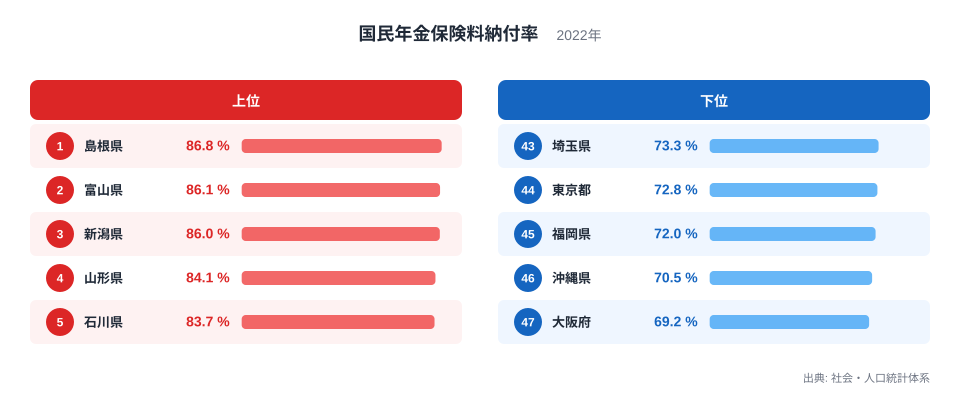
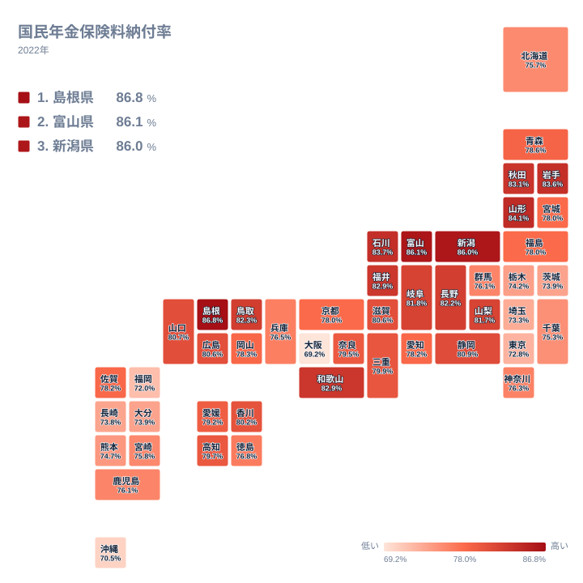

国民年金は全国共通の制度で、保険料の額も居住地によって変わりません。それにもかかわらず、実際に保険料が納められている割合は都道府県で大きく違います。2022年の納付率は、最も高い島根県が86.8%、最も低い大阪府が69.2%でした。その差は17.6ポイントに達します。

この記事では、社会・人口統計体系が公表している2022年の国民年金保険料納付率を都道府県別に見て、どこで高くどこで低いのか、そしてこの差が何を映しているのかを整理します。納付率の高低はそこに住む人の意識の差ではなく、対象となる人の顔ぶれと制度の使われ方の違いを表しています。

> [!NOTE]
> 国民年金の保険料を自分で納めるのは第1号被保険者です。自営業者、農林漁業者、学生、無職の人などが該当します。会社員や公務員は厚生年金の加入者として給与から天引きされるため、この納付率の対象には入りません。つまりこの数字は、県民全体ではなく第1号被保険者の納付状況を表しています。

## 納付率が高い県と低い県

上位と下位を確認します。

<source-link href="/ranking/national-pension-payment-rate">国民年金保険料納付率ランキングをもっと見る</source-link>

上位は島根県が86.8%、富山県が86.1%、新潟県が86%、山形県が84.1%、石川県が83.7%と並びます。山陰・北陸・東北の県が占めています。

下位は大阪府が69.2%、沖縄県が70.5%、福岡県が72%、東京都が72.8%、埼玉県が73.3%です。大都市圏を抱える都府県が並び、その中に沖縄県が入っています。

この上位と下位の並び方には、はっきりした構図があります。人口が集中する都市部で低く、人口規模の小さい地方で高いという傾向です。ただし、これを「都市の人は納めない」と読むのは正確ではありません。第1号被保険者にどんな人が含まれるかが、地域によって違うためです。

## 誰が第1号被保険者なのかが県で違う

地図で分布を見ると、日本海側と大都市圏の対比がはっきりします。

上位に並ぶ北陸・山陰・東北の県では、第1号被保険者の中で自営業者や農業者が占める割合が高いとみられます。事業として一定の収入があり、家族や地域の中で長く同じ場所に住み続ける人が多い層です。所得が安定していれば保険料を納める余力があり、住所の移動が少なければ納付書も確実に届きます。

一方、大都市圏の第1号被保険者には別の顔ぶれが加わります。学生、非正規雇用で厚生年金の適用を受けていない人、転職の合間で一時的に厚生年金から外れている人、そして事業を始めたばかりの人です。これらの層は収入が不安定であるか、そもそも収入がない期間を含みます。

さらに、都市部では住所の移動が頻繁です。転居のたびに納付書の送付先が変わり、手続きが追いつかない期間が生まれます。地方に比べて納付の手続きが途切れやすい条件が重なっています。

沖縄県が下位に入る理由も、この構造から説明できそうです。沖縄県は若年層の割合が全国的に見て高いとされ、第1号被保険者に占める若い世代の比率も上がります。所得がまだ低い時期の人が多く含まれれば、保険料の負担は相対的に重くなります。

> [!WARNING]
> 納付率が低いことは、その県の人が保険料を納める意思を持たないことを意味しません。納付率の計算では、免除や納付猶予の承認を受けた期間は分母から除かれる扱いになります。制度の利用状況が県ごとに違えば、同じ経済状況でも納付率の数字は変わります。

## 免除制度と納付率の関係

国民年金には、所得が一定の基準を下回る人のために保険料の免除と納付猶予の仕組みがあります。学生には在学中の納付を先送りする制度もあります。

これらの制度を利用する人が多い県では、納付を求められる対象そのものが絞り込まれます。制度の周知が行き届き、申請の手続きが利用しやすければ、結果として納付率は上がる方向に働きます。逆に、制度を知らないまま保険料が未納のまま積み上がると、納付率は下がります。

つまり納付率は、その県の経済状況だけでなく、年金事務所や自治体の窓口が制度をどれだけ届けられているかも映しています。ただし、免除の利用が増えて納付率の数字が上がったとしても、それは分母が絞り込まれた結果であって、保険料を負担できる人が増えたことを意味するわけではありません。数字の動きと実態の改善は別のものです。

将来の年金額は納付した期間で決まるため、未納の期間が長引くと本人が受け取る額が減ります。ここで免除と猶予は扱いが違います。免除の承認を受けた期間は、国庫が負担する分に応じて年金額の一部が保障されます。一方、学生納付特例などの猶予は、受給資格を判定する期間には算入されますが、その期間分の年金額は増えません。どちらも未納とは違う扱いになりますが、後から追納するかどうかで受け取る額が変わります。

> [!TIP]
> 収入が減ったときに未納のまま放置するのと、免除や猶予を申請するのとでは、将来の扱いが変わります。免除は年金額の一部が保障され、猶予は受給資格の期間だけが確保されるという違いがあるため、どちらに該当するかを窓口で確認する価値があります。手続きは住んでいる市区町村の窓口か年金事務所で行えます。

## 数字から見えること

国民年金の納付率が都道府県で17ポイント以上開く背景にあるのは、第1号被保険者にどんな働き方の人が含まれるか、その人たちの所得がどれだけ安定しているか、そして免除制度がどれだけ使われているかという、複数の条件の重なりです。

上位に並ぶ県では自営業や農業を営む層が中心となり、下位の都市部では学生や非正規雇用の層が加わります。同じ制度でも、対象となる人の顔ぶれが違えば結果は変わります。

社会保障の全体像を見るなら[同じカテゴリの統計一覧](/category/socialsecurity)が参考になります。上位の[島根県のデータ](/areas/32000)と[富山県のデータ](/areas/16000)では、産業構造と人口構成を確認できます。

## データ出典

- 社会・人口統計体系（2022年）国民年金保険料納付率
