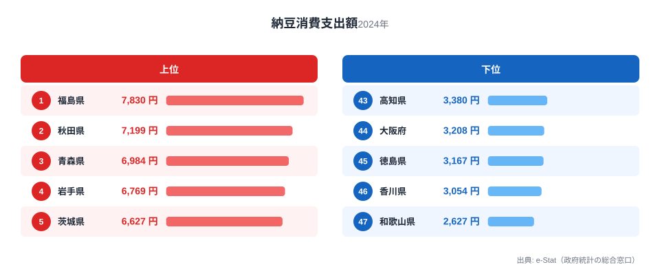
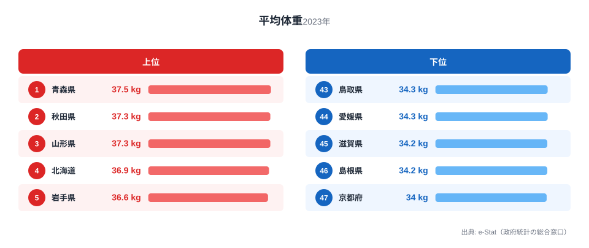

「納豆をよく食べる県ほど、小学生の体重も重い」——そう聞くと、納豆の栄養価が子供の成長を後押ししているように思えます。実際に都道府県別のデータを重ねると、納豆消費支出額と小学5年男子の平均体重には相関係数0.637という、統計的にはっきりとした正の相関が見られます。

ですが、これは「納豆を食べれば体重が増える」という単純な話ではありません。納豆消費ランキングの上位10県と、体重ランキングの上位10県を見比べると、福島・秋田・青森・岩手・山形・宮城・富山・栃木の8県が両方に登場します。これは偶然というより、東北・北陸という地域そのものが両方の数字を押し上げている可能性を強く示しています。この記事では、見かけの相関の裏にある真因を、データに即して丁寧に検証します。

## 納豆消費支出額ランキング

2024年の家計調査（品目別）によると、都道府県庁所在市の二人以上世帯における納豆の年間消費支出額は、1位福島（7,830円）から最下位和歌山（2,627円）まで約3.0倍の開きがあります。上位10県は福島・秋田・青森・岩手・茨城・長野・山形・宮城・富山・栃木と、東北6県すべてと北関東・北陸勢が占めています。

下位に目を移すと、高知・大阪・徳島・香川・和歌山という近畿・四国勢が並びます。納豆消費は「関東以北で多く、関西以西で少ない」という明確な東西格差を持つ食品として知られており、これは西日本で納豆を「くさい・苦手」とする食文化的な忌避感が今も残っていることの表れだと考えられます（詳しくは[納豆を食べる県・食べない県の境界はどこか](/blog/natto-consumption-east-west-divide)でも取り上げています）。東北地方は稲作地帯として大豆・納豆が古くから保存食・郷土食として定着してきた歴史があり、この食文化の継承が消費量の地域差に直結しています。1位の[福島県](/areas/07000)は日本酒や桃と並んで納豆も全国屈指の消費地として知られています。

<source-link href="/ranking/natto-consumption-expenditure">納豆消費支出額ランキングをもっと見る</source-link>

## 小学5年男子の平均体重ランキング

2023年度の学校保健統計調査によると、小学5年男子の平均体重は1位青森（37.5kg）から最下位京都（34.0kg）まで3.5kgの差、倍率にすると約1.10倍です。納豆消費の2.98倍という格差に比べると、体重の地域差ははるかに小さいことがわかります。

それでも上位を見ると、1位青森に続き、秋田と山形が同率2位で並び、北海道・岩手・山梨・宮城・栃木・福島・富山と続きます。下位5県は鳥取・愛媛（同率43位）、滋賀・島根（同率45位）、最下位京都という近畿・中国・四国勢です。納豆ランキングと同じ東北・北陸勢が上位に、近畿・西日本勢が下位に並ぶ構図がほぼそのまま再現されており、この一致が「納豆と体重の相関」の正体に迫る手がかりになります。東北の子供が全国的に大きい傾向は身長でも確認されており、[なぜ東北の子は背が高いのか](/blog/prefectural-height-male-female-gap)という記事でも同様の地域パターンを検証しています。

<source-link href="/ranking/average-weight-primary-school-fifth-grade-male">平均体重ランキングをもっと見る</source-link>

## 散布図で見る相関、そして「見かけの相関」の検証

47都道府県の納豆消費支出額（横軸）と小5男子平均体重（縦軸）を散布図にすると、右肩上がりの傾向が見て取れます。相関係数は r=0.637 で、統計的には「中程度からやや強い正の相関」に分類される値です。

ここで重要なのは、この相関が本当に「納豆を食べるほど体重が増える」という直接的な因果関係を示しているのかという点です。納豆消費ランキングのTOP10と体重ランキングのTOP10を比較すると、福島・秋田・青森・岩手・山形・宮城・富山・栃木の**8県が両方にランクインしています**。TOP10のうち8割が一致するというのは、47都道府県からランダムに選んだ場合には起こりえない、極めて強い地域的な偏りです。

この一致が意味するのは、「納豆消費」と「子供の体重」という一見無関係な2つの指標が、実は**東北・北陸という同じ地理的・食文化的な背景**によって同時に動かされている可能性です。両ランキングの下位県も近畿・四国・中国地方に集中しており、上位・下位とも地理的なまとまりが強いことがわかります。これは「都市化度の違い」のような単一の説明変数だけでは片付かない、複合的な地域性の表れだと考えられます。むしろ、東北・北陸の気候（積雪・寒冷）に適応した高カロリーな伝統食文化全体が、納豆の消費量と子供の体格の両方に影響している可能性のほうが説明力が高いと考えられます。

**[仮説]** 納豆自体の高タンパク・大豆イソフラボンといった栄養価が成長期の体格に一定の寄与をしている可能性はゼロではありませんが、本データだけではこの仮説を検証できません。人口規模や高齢化率など他の県別属性でどこまで相関が説明されるかは、本記事のデータだけでは統制計算ができておらず未検証です。個人単位の食事調査と成長データを紐付けた研究でなければ、納豆単体の効果を地域の食文化全体の効果から切り分けることはできないためです。検証には、同一県内で納豆をよく食べる家庭とそうでない家庭の子供を比較するような、個人レベルの追跡調査が必要になります。

<source-link href="/ranking/natto-consumption-expenditure">納豆消費支出額ランキングと合わせて確認する</source-link>

> [!WARNING]
> **相関係数0.637は「因果関係の証明」ではありません。** 本記事の分析は都道府県という集団単位の平均値同士を比較した「生態学的相関」であり、個人レベルで「納豆をよく食べる子供ほど体重が重い」ことを意味しません（生態学的誤謬）。また n=47という少ないサンプル数では、東北・北陸という特定地域の偏りが相関係数を大きく引き上げている可能性が高く、この地域を除いて再計算すれば相関は大きく弱まると考えられます。

> [!NOTE]
> 納豆消費支出額は総務省「家計調査（品目別）」に基づく、都道府県庁所在市の二人以上世帯における年間消費支出額です。個人の食べる頻度ではなく世帯単位の支出額であるため、世帯人数や納豆の単価差（産地・ブランド）の影響も含まれる点に注意が必要です。

> [!TIP]
> 都道府県別のクロスカテゴリ相関を見るときは、まず「両ランキングの上位県が地理的に偏っていないか」を確認する視点が有効です。東北・北陸・沖縄のように独自の気候や文化を持つ地域が両方の指標に同時に効いている場合、相関係数だけを見ると実際より強い関連があるように錯覚しやすくなります。

## まとめ

- 納豆消費支出額（2024年）は1位福島7,830円〜最下位和歌山2,627円で約3.0倍の格差
- 小5男子平均体重（2023年度）は1位青森37.5kg〜最下位京都34.0kgで3.5kg・約1.10倍の格差
- 両ランキングの相関係数はr=0.637で、統計的には中程度からやや強い正の相関
- 両ランキングのTOP10のうち8県（福島・秋田・青森・岩手・山形・宮城・富山・栃木）が重複する強い地域的偏り
- この一致は納豆の直接効果というより、東北・北陸の食文化・気候という共通要因による「見かけの相関」の可能性が高く、因果関係の証明にはならない

## データ出典

納豆消費支出額は総務省統計局「家計調査（品目別）」（2024年、都道府県庁所在市・二人以上世帯）、小学5年男子平均体重は文部科学省「学校保健統計調査報告書」（2023年度、社会・人口統計体系経由で整備）をもとに作成しています。相関分析はstats47が両指標のR2観測値から独自に算出したものです。
