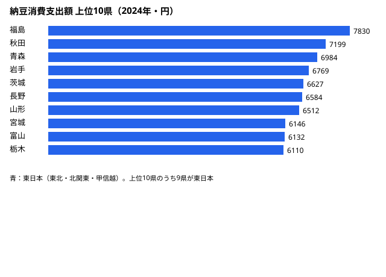

「納豆を食べる県・食べない県の境界は、いったいどこにあるのか」──関西出身者が「納豆は苦手」と言い、東北出身者が「毎朝食べる」と語る。この体感は、家計のデータにくっきり残っている。

総務省「家計調査」(2024年) で、1世帯あたりの納豆への年間支出額を都道府県別に並べると、1位は**[福島県](/areas/07000)の7830円**。対して最下位は**[和歌山県](/areas/30000)の2627円**で、その差は約3.0倍にのぼる。しかも上位と下位は、地図の上で見事に東西に分かれる。本記事では、この「納豆の東西境界」がどこに引かれているのかをデータで可視化する。

> [!NOTE]
> 数値は総務省「家計調査」(2024年、二人以上の世帯) の都道府県庁所在市別「納豆」年間支出額。消費「量」ではなく「支出額」のため、価格差の影響も含む。県全体ではなく県庁所在市の世帯が対象である点に注意。

## 上位・下位の顔ぶれ

上位の顔ぶれは[福島県](/areas/07000)(1位7830円)・[秋田県](/areas/05000)(2位)・青森(3位)・岩手(4位)・茨城(5位)・長野(6位)・山形(7位)・宮城(8位)・富山(9位)・栃木(10位)で、東北6県・北関東・甲信越が独占する。

<source-link href="/ranking/natto-consumption-expenditure">納豆消費支出額の47都道府県ランキングをもっと見る</source-link>

下位6県は兵庫(42位3603円)・高知(43位3380円)・[大阪府](/areas/27000)(44位3208円)・徳島(45位3167円)・香川(46位3054円)・[和歌山県](/areas/30000)(47位2627円)。近畿2府県と四国3県が並ぶ。注目すべきは、同じ西日本でも**熊本（11位6068円）が単独で上位に食い込んでいる**点だ。九州は古くから納豆食の伝統がある地域とされ、四国の低消費とは対照的で「西日本=低消費」が一枚岩でないことを示している。

> [!TIP]
> 東北が強い理由としてよく挙がるのが、寒冷な気候と稲作・大豆生産との相性、そして「わら納豆」に代表される歴史的な保存食文化だ。逆に近畿・四国では、出汁文化や他の発酵食品(なれずし等)が食卓の主役を担ってきた経緯がある。

## 東西の境界はどこに引かれているか

上位・下位の分布を地図的に追うと、境界はおおむね中部地方を縦に走る。東側の長野(6位6584円)・富山(9位6132円)・岐阜(17位5243円)までは比較的高水準を保つが、愛知(30位4222円)・三重(31位4220円)で一気に中位以下に落ち、近畿に入るとさらに下がる。

中部はちょうど「のれん分け」のような遷移帯になっている。同じ中部でも、東寄りの長野・富山は東北型の高消費、西寄りの愛知・三重は近畿型の低消費に近い。境界線は行政区分の「東日本／西日本」よりやや東に寄り、愛知あたりで切り替わると読める。

> [!NOTE]
> 東京(18位5099円)・神奈川(24位4753円)といった首都圏は中位にとどまる。これは人口流入により多様な出身者が混在し、東北ほどの一極的な消費にならないため、と説明されることが多い。

<source-link href="/ranking/natto-consumption-expenditure">境界付近の県の順位を一覧で確認する</source-link>

## 歴史的背景と全国トレンド

納豆の地域差は近年に生まれたものではなく、稲作の副産物としての大豆利用と、わらに棲む納豆菌を使った発酵という、地域ごとの食文化の蓄積に根ざす。一方で全国の納豆支出額そのものは、長期的に増加している。

家計調査の全国平均(二人以上世帯)でみると、納豆支出額は2011年の3257円を底に右肩上がりで、2020年に4677円、2024年には4897円(小数を四捨五入)に達した。健康志向や手軽さから、かつて「東日本の食べ物」とされた納豆が全国的に浸透しつつある。

> [!WARNING]
> 本記事の指標は消費「量」ではなく「支出額」である。価格やパックサイズ、特売頻度の地域差が金額に影響するため、支出額が低い=食べる頻度が低い、と単純化はできない。あくまで家計の支出ベースの傾向として読み解く必要がある。

## 境界線の今後

全国的な増加トレンドのなかでも上位の東北と下位の近畿・四国の構図は崩れていない。食文化の境界は、平準化の波のなかでもしぶとく残っている。では境界はこれからも維持されるのか。

首都圏の中位化（東京18位・神奈川24位）は、多様な出身者が混在することで一極的な食文化が薄まる現象と整合する。同様の論理で、若年世代の人口移動が進めば東北型・近畿型の境界線が徐々に溶けていく可能性はある。一方で、地域食文化は親世代から子世代へ伝わる再生産性が高く、消費パターンの変化は緩やかになりやすい。愛知（30位）・三重（31位）の境界が今後どちらの方向へ動くかが、東西分断の維持と収束を占う指標になる。

## データ出典

- 総務省統計局「家計調査」(2024年、二人以上の世帯、都道府県庁所在市別「納豆」年間支出額)
- 時系列は同調査の全国平均(二人以上世帯)、2007〜2024年
- データは政府統計ポータル e-Stat を通じて整備。出典の利用は政府標準利用規約(CC BY 4.0 互換)に基づく

