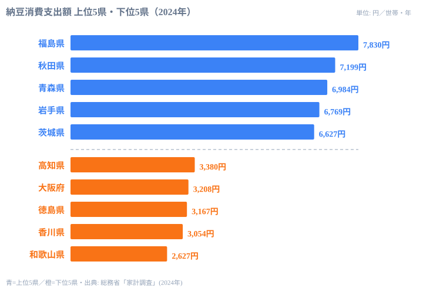

「納豆は全国どこでも食べる」――冷蔵庫を開ければ確かに全国のスーパーに納豆は並んでいる。ところが財布の中身を覗くと、その認識は崩れる。2024年の総務省「家計調査」によると、1世帯が1年間に納豆へ使う金額は、最も多い福島県で7,830円、最も少ない和歌山県では2,627円。同じ日本の食卓でありながら、納豆への出費はおよそ3倍ひらいている。

さらに不思議なのは、その多寡が地図の上できれいに東西へ割れていることだ。上位を占めるのは東北の県ばかりで、西日本の県は軒並み下位に沈む。「納豆=茨城」という産地のイメージとも、実際の消費は必ずしも重ならない。この記事では、東西で食卓が割れる構造を47都道府県のデータから読み解いていく。

> [!NOTE]
> 本データは総務省「家計調査」（都道府県庁所在市の二人以上世帯）における納豆の年間消費支出額（円）。世帯が購入に使った金額であり、個人が食べる頻度や量そのものではない。物価や世帯人数の影響も受ける点に留意してほしい。

## 全体像 — 東日本に厚く、西日本に薄い

2024年の納豆消費支出を高い順に並べると、上位には東北の県が連なる。1位の福島県（7,830円）を筆頭に、秋田県（7,199円）、青森県（6,984円）、岩手県（6,769円）と東北勢が続く。一方、下位には近畿・四国の府県が集まり、最下位は和歌山県（2,627円）だ。

数字で見ると、上位グループと下位グループの間には1世帯あたり年間で4,000円以上の開きがある。納豆は1パック数十円の安価な食品だから、この金額差は「買う頻度」そのものの差を映していると考えてよい。東日本では日常的に食卓へ上がり、西日本では登場回数が少ない――支出額はその習慣の濃淡を映す鏡になっている。

<source-link href="/ranking/natto-consumption-expenditure">47都道府県の納豆消費支出額ランキングを詳しく見る</source-link>

> [!TIP]
> 納豆のように安くて日常的な食品では、支出額の差は「値段の差」よりも「買う回数の差」を強く反映する。高級品のランキングとは読み方が異なる点に注意したい。経済指標としての位置づけは[経済カテゴリの統計一覧](/category/economy)も参考になる。

## 上位は東北が独占 — 福島・秋田・青森

上位5県を並べると、その顔ぶれの偏りがはっきりする。

トップは[福島県](/areas/07000)で、世帯あたり年間7,830円。続く秋田県・青森県・岩手県も東北の県で、上位4県がそろって東北というかたまりになっている。5位には北関東の茨城県（6,627円）が入り、6位は甲信越の長野県（6,584円）、7位は再び東北の山形県（6,512円）と続く。

東北で納豆がよく食べられてきた背景には、寒冷な気候と発酵食の伝統がある。冬の長い東北では、大豆を発酵させて長く保存し、たんぱく源として食べる文化が根づいてきた。藁苞（わらづと）に包んで作る納豆は、まさにその寒冷地の保存食の系譜にある。福島・秋田・青森がそろって上位に並ぶのは、この歴史的な食習慣が現在の消費にまで地続きで残っていることを示している。

> [!TIP]
> 「茨城＝納豆」のイメージは水戸を中心とした生産（工場の集積）に由来する。だが消費支出で見ると、茨城県は5位と確かに高いものの首位ではなく、トップは福島県だ。「たくさん作る県」と「たくさん買う県」は必ずしも一致しない。産地ブランドと家計の実態は別物として読む必要がある。

## 西日本が下位に沈む — 大阪・香川・和歌山

一方、ランキングの底に目を移すと、こちらも地域がきれいに固まっている。

最下位は[和歌山県](/areas/30000)の2,627円。これは1位の福島県のおよそ3分の1にすぎない。下位には大阪府（3,208円）、香川県（3,054円）、徳島県（3,167円）など、近畿と四国の府県が集中している。高知県（3,380円）もこのグループに含まれ、最下位5県はすべて近畿・四国エリアで占められている。

西日本で納豆の支出が伸びない理由については、いくつかの食文化的な説明がなされてきた。関西では古くから昆布だしの文化が強く、独特の香りと粘りを持つ納豆が朝食の定番として定着しにくかったという見方だ。

> [!WARNING]
> 「西日本では納豆を食べない」は言い過ぎである。全国チェーンのスーパーで納豆はどこでも手に入り、消費自体はある。ここで見えているのは「ゼロかどうか」ではなく、あくまで**支出水準の差**だ。和歌山県でも年間2,627円分は購入されている。極端な解釈には注意したい。

## 東西の断層はなぜ続くのか

興味深いのは、この東西の偏りが一過性ではないことだ。家計調査の納豆支出は2007年から2024年まで18年分が記録されているが、その間、上位を東北勢が占め、下位に西日本が並ぶという構図はほぼ動いていない。流通が全国均一に整い、どの店でも同じ商品が買える時代になっても、食卓の習慣はそう簡単には変わらないということだ。

> [!NOTE]
> [仮説] 東西の差が縮まりにくいのは、食習慣が世代を越えて家庭内で受け継がれるためと考えられる。検証するには、同一県内での年代別・世帯主年齢別の支出推移を追う必要がある。本記事のデータ（県単位の年間支出）だけでは因果までは断定できない。

ここで一つの問いが立つ。流通も価格もほぼ全国共通なのに、なぜ「買う回数」だけが東西で分かれ続けるのか。考えられるのは、納豆が「主食に添える定番」として朝食の型に組み込まれているかどうかの違いだ。東日本では「ご飯に納豆」が日常の型として残り、西日本ではその型がそもそも薄い。型として根づいた習慣は、商品の入手しやすさとは別の論理で持続する。

同じ食文化の東西差は、ほかの食品でも見られる。たとえばマヨネーズの消費にも地域の偏りがあり、納豆とは異なる地図を描く。食卓の地域性を横断して眺めると、それぞれの食品が独自の文化的背景を抱えていることが見えてくる。気になる人は[マヨネーズ消費支出ランキング](/ranking/mayonnaise-consumption-expenditure)や、その背景を掘り下げた[マヨネーズ消費の地域差を読み解いた記事](/blog/mayonnaise-consumption-expenditure)も合わせて読んでみてほしい。

## データ出典

- 総務省「家計調査」（二人以上の世帯・都道府県庁所在市）納豆の年間消費支出額 2024年（e-Stat 経由で整備）

数値は調査年・対象世帯の定義に依存する。家計調査は標本調査であり、年ごとに多少の変動がある点に留意してほしい。

## まとめ

- 2024年の納豆消費支出は1位が福島県7,830円、最下位が和歌山県2,627円で、その差はおよそ3倍。
- 上位は福島・秋田・青森・岩手と東北勢が独占し、茨城（5位）・長野（6位）が続く。
- 下位は和歌山・香川・徳島・大阪・高知と近畿・四国に集中する。
- 「茨城＝納豆」の産地イメージと、実際にいちばん買う福島県はずれており、産地と消費は一致しない。
- 東西の偏りは2007年以降ほぼ不変で、流通が均一化しても食習慣の慣性は強く残る。
