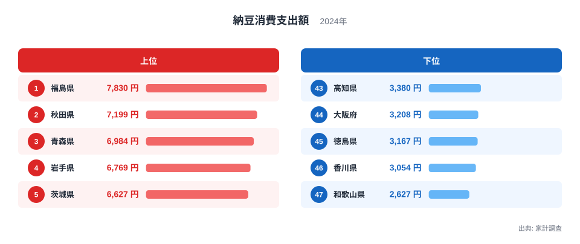
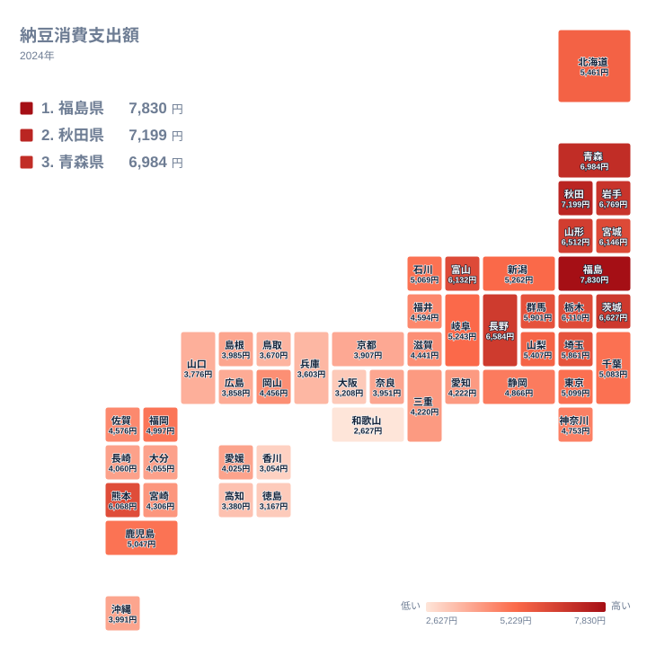
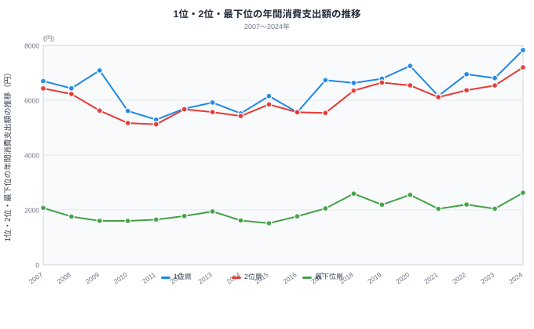

「納豆といえば茨城」――多くの人がそう思い浮かべるはずです。ところが2024年の総務省「家計調査」で1世帯が1年間に納豆へ使った金額を見ると、産地であるはずの茨城県はトップではありません。1位は福島県の7,830円で、最も少ない和歌山県の2,627円とはおよそ3倍の開きがあります。同じ日本の食卓でありながら、納豆への出費には大きな差があるのです。

では、この差は単純に「東日本は多く、西日本は少ない」という東西二分の構図なのでしょうか。結論から言うと、そう単純ではありません。上位に東北・北関東の県が集中し、下位に近畿・四国の府県が集まるのは確かですが、九州・沖縄の消費額は全国平均に近く、下位グループには入りません。この記事では、47都道府県の分布を地図で確認しながら、「産地と消費のズレ」と「地域差の実像」を読み解いていきます。

> [!NOTE]
> 本データは総務省「家計調査」（都道府県庁所在市の二人以上世帯）における納豆の年間消費支出額（円）。世帯が購入に使った金額であり、個人が食べる頻度や量そのものではない。物価や世帯人数の影響も受ける点に留意してほしい。

## 全体像 — 産地の茨城ではなく福島がトップ

2024年の納豆消費支出を高い順に並べると、1位は福島県で7,830円、続く秋田県は7,199円、青森県は6,984円、岩手県は6,769円と東北勢が上位を占めます。「納豆の本場」というイメージの強い茨城県は6,627円で5位にとどまり、トップではありません。一方、最下位は和歌山県の2,627円で、下位には近畿・四国の府県が集まっています。

上位5県（福島・秋田・青森・岩手・茨城）の平均は7,082円、下位5県（和歌山・香川・徳島・大阪・高知）の平均は3,087円で、その差は3,995円です。1位の福島県と最下位の和歌山県だけを比べると、差はさらに開いて5,203円になります。納豆は1パック数十円の安価な食品ですから、この金額差は「買う頻度」そのものの差を映していると考えてよいでしょう。

上位5県はいずれも6,600円を超え、下位5県はいずれも3,400円を下回ります。ここまでは東北・北関東が高く近畿・四国が低いという傾向がはっきり見えますが、これがそのまま「西日本全体が下位」を意味するわけではありません。次の地図で47都道府県すべての分布を確認すると、その理由が見えてきます。

地図を見ると、確かに東北6県と北関東はまとまって濃い色（高い値）に染まり、近畿6府県と四国4県はまとまって薄い色（低い値）になっています。しかし九州・沖縄の8県は、この2つのグループのどちらにも属しません。福岡県は4,997円で22位、鹿児島県は5,047円で21位と中位です。熊本県にいたっては6,068円で11位につけています。上位5位の6,627円とはわずか559円しか離れていません。九州・沖縄8県の平均は4,638円で、全国平均の4,897円に近い水準です。中国地方（鳥取・島根・岡山・広島・山口）の平均も3,949円で、こちらも全国平均に近い中間的な値になっています。つまりこの地図が示しているのは「東日本は高く西日本は低い」という単純な東西二分ではなく、「東北・北関東」対「近畿・四国」という限定的な軸の対比であり、九州・沖縄と中国地方はそのどちらにも属さない中位グループなのです。

<source-link href="/ranking/natto-consumption-expenditure">47都道府県の納豆消費支出額ランキングをもっと見る</source-link>

> [!TIP]
> 納豆のように安くて日常的な食品では、支出額の差は「値段の差」よりも「買う回数の差」を強く反映します。高級品のランキングとは読み方が異なる点に注意してください。経済指標としての位置づけは[経済カテゴリの統計一覧](/category/economy)も参考になります。

## 東北・北関東が上位 — 福島・秋田・青森

上位5県を並べると、その顔ぶれの偏りがはっきりします。

トップは[福島県](/areas/07000)で、世帯あたり年間7,830円です。続く秋田県は7,199円、青森県は6,984円、岩手県は6,769円で、いずれも東北の県です。上位4県がそろって東北というかたまりになっています。5位には北関東の茨城県が6,627円で入り、6位は甲信越の長野県が6,584円、7位は東北の山形県が6,512円と続きます。上位7位以内に東北の6県のうち5県までが入っており、東北勢の厚みは際立っています。残る宮城県も6,146円で8位と、全国でも高い水準にあります。

東北で納豆がよく食べられてきた背景には、寒冷な気候と発酵食の伝統が関係しているという見方があります。冬の長い東北では、大豆を発酵させて長く保存し、たんぱく源として食べる文化が根づいてきたとされ、藁苞（わらづと）に包んで作る納豆はその保存食の系譜にあります。ただしこの説明がすべてを説明するわけではありません。同じく寒冷な北海道は5,461円で14位にとどまり、逆に温暖な熊本県は6,068円で11位と上位に近い位置につけています。気候だけでは割り切れない要因が他にもあると考えるのが妥当です。

> [!WARNING]
> 「茨城＝納豆」のイメージは水戸を中心とした生産（工場の集積）に由来しますが、消費支出で見ると茨城県は5位で、トップは福島県です。「たくさん作る県」と「たくさん買う県」は一致しません。

## 僅差の1位争い — 2007〜2024年の18年間

「1位」の座は、毎年同じ県が独占しているわけではありません。家計調査の納豆支出は2007年から2024年まで18年分が記録されており、その全パーティションを確認すると、1位になった回数は福島県が12回、岩手県が4回、茨城県が2回で、3県の間を行き来してきました。

折れ線を見ると、1位（濃い線）と2位（中間の線）の差は年によって大きく縮み、2016年は茨城県と岩手県の差がわずか1円、2012年は岩手県と福島県の差が22円しか離れていません。一方で最下位（薄い線）は一貫して低い水準で推移しており、18年間で最も少なかった県は和歌山県が13回、大阪府が2回、徳島県・香川県・高知県が各1回で、いずれも近畿・四国の府県です。つまり動いているのは上位グループの内側にある「1位」の順位であって、上位グループと下位グループの境界そのものはほとんど動いていません。

家計調査の消費支出額は、県庁所在市に住む世帯が1年間にいくら払ったかを集計したもので、どこで買った納豆かは問わず、他都市で買った分も住んでいる県庁所在市の支出として計上されます。僅差の年ほど翌年に順位が入れ替わっても不思議ではなく、その年その年の1位だけを見て「◯◯県が納豆の本場」と断定するのは早計です。

## 近畿・四国が下位 — 大阪・香川・和歌山（九州は中位）

一方、ランキングの底に目を移すと、こちらは近畿・四国にはっきり固まっています。

最下位は[和歌山県](/areas/30000)の2,627円です。これは1位の福島県のおよそ3分の1にすぎません。下位には大阪府が3,208円、香川県が3,054円、徳島県が3,167円など、近畿と四国の府県が集中しています。高知県も3,380円でこのグループに含まれ、最下位5県はすべて近畿・四国エリアで占められています。近畿6府県の平均は3,623円、四国4県の平均は3,407円で、いずれも全国平均の4,897円を大きく下回ります。

これに対して、地理的には西日本に含まれる九州・沖縄8県の平均は4,638円で、全国平均とほぼ同水準です。福岡県は4,997円、鹿児島県は5,047円で中位、熊本県は6,068円の11位で上位グループの目前です。「西日本だから低い」わけではなく、低いのはあくまで近畿と四国に限られています。

近畿で納豆の支出が伸びない理由については、いくつかの食文化的な説明がなされてきました。関西では古くから昆布だしの文化が強く、独特の香りと粘りを持つ納豆が朝食の定番として定着しにくかったという見方があります。

> [!WARNING]
> 「近畿・四国では納豆を食べない」は言い過ぎです。全国チェーンのスーパーで納豆はどこでも手に入り、消費自体はあります。ここで見えているのは「ゼロかどうか」ではなく、あくまで**支出水準の差**です。最下位の和歌山県でも年間2,627円分は購入されています。極端な解釈には注意してください。

## この構図はなぜ続くのか

興味深いのは、この地域差が一過性ではないことです。上位に東北・北関東勢が並び、下位に近畿・四国勢が沈むという大枠の構図は2007年以降ほぼ動いていません。前述のとおり上位グループの内側にある「1位」の座は福島・岩手・茨城の間で入れ替わってきましたが、動いているのはそこだけで、上位グループと下位グループの境界そのものは変わっていないのです。

**[仮説]** この地域差が縮まりにくいのは、食習慣が世代を越えて家庭内で受け継がれるためと考えられます。検証するには同一県内での年代別・世帯主年齢別の支出推移を追う必要があり、本記事のデータ（県単位の年間支出）だけでは因果までは断定できません。

ここで一つの問いが立ちます。流通も価格もほぼ全国共通なのに、なぜ「買う回数」だけがこれほど地域で分かれ続けるのでしょうか。考えられるのは、納豆が「主食に添える定番」として朝食の型に組み込まれているかどうかの違いです。東北・北関東では「ご飯に納豆」が日常の型として残り、近畿・四国ではその型がそもそも薄いのです。型として根づいた習慣は、商品の入手しやすさとは別の論理で持続します。

同じような食文化の地域差は、ほかの食品でも見られます。たとえばマヨネーズの消費にも地域の偏りがあり、納豆とは異なる地図を描きます。食卓の地域性を横断して眺めると、それぞれの食品が独自の文化的背景を抱えていることが見えてきます。気になる人は[マヨネーズ消費支出ランキング](/ranking/mayonnaise-consumption-expenditure)や、その背景を掘り下げた[マヨネーズ消費の地域差を読み解いた記事](/blog/mayonnaise-consumption-expenditure)も合わせて読んでみてください。

## データ出典

- 総務省「家計調査」（二人以上の世帯・都道府県庁所在市）納豆の年間消費支出額。ランキングと地図は2024年、年次推移は2007〜2024年の全18パーティション（e-Stat 経由で整備）

数値は調査年・対象世帯の定義に依存します。家計調査は標本調査であり、年ごとに多少の変動がある点に留意してください。

## まとめ

- 2024年の納豆消費支出は福島県が7,830円で最多、和歌山県が2,627円で最少となり、その差はおよそ3倍です。産地のイメージが強い茨城県は5位（6,627円）で、トップではありません。
- 上位は福島・秋田・青森・岩手・茨城の東北・北関東勢が占め、下位は和歌山・香川・徳島・大阪・高知の近畿・四国勢が占めています。
- ただし「西日本は一律に低い」わけではなく、九州・沖縄8県の平均（4,638円）は全国平均（4,897円）に近く、熊本県は6,068円で11位と上位グループの目前です。実際に低いのは近畿6府県（平均3,623円）と四国4県（平均3,407円）に限られます。
- 2007〜2024年の18年間で「1位」の座は福島が12回、岩手が4回、茨城が2回と3県の間で入れ替わり、年によっては1位と2位の差が1円まで縮まっています。家計調査は購入場所を問わない居住地基準の集計であり、僅差の年ほど翌年の順位が動きやすい点に注意が必要です。
- 上位グループと下位グループの境界という大枠は2007年以降ほとんど変わらず、流通が均一化しても食習慣の慣性は強く残ります。
