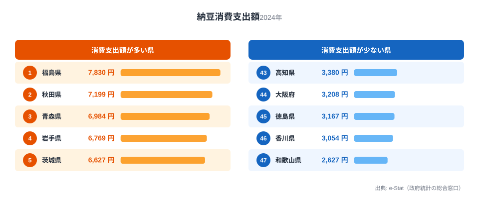
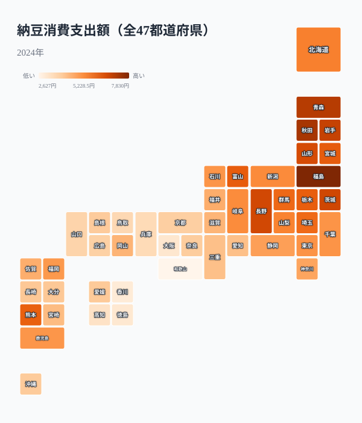
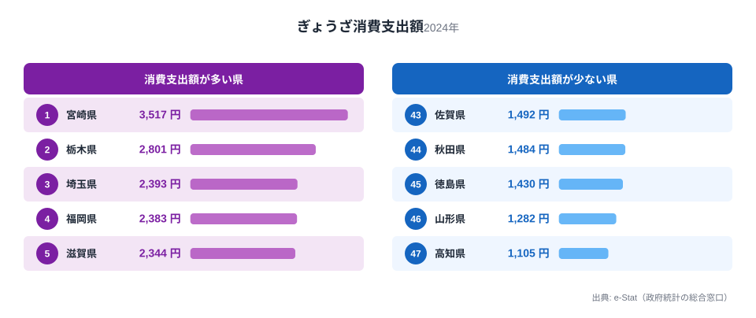

「納豆といえば水戸」というイメージを持っている方は多いのではないでしょうか。水戸(茨城県)は納豆の名産地として全国的に知られていて、駅前には納豆をモチーフにした土産物店が並びます。ところが総務省「家計調査」で都道府県別の納豆消費支出額を見ると、首位は茨城県ではありません。2024年の1位は隣県の福島県(7,830円)で、茨城県は5位(6,627円)にとどまります。

家計調査は都道府県庁所在市の世帯が実際に購入した金額を集計したデータです。「名産地」と「よく買っている県」が一致するとは限らないという事実は、経済アナリストの吉本佳生氏が著書『マーケティングに使える家計調査』で指摘している論点でもあります。同じ構図は冷凍ぎょうざのランキングでも見られ、「宇都宮vs浜松」の餃子日本一論争を横目に、2024年の実際の1位は宮崎県でした。

この記事では、納豆と冷凍ぎょうざという2つの家計調査ランキングを47都道府県データで確認しながら、「産地」と「消費地」がなぜズレるのか、そして家計調査のランキングを読むときにどこに注意すべきかを整理します。

## 都道府県別ランキングで見る納豆消費

<source-link href="/ranking/natto-consumption-expenditure">納豆消費支出額ランキングをもっと見る</source-link>

2024年の家計調査によると、納豆消費支出額の1位は福島県で7,830円でした。2位秋田県7,199円、3位青森県6,984円、4位岩手県6,769円と続き、上位10県のうち6県を東北地方が占めています。最下位は和歌山県の2,627円で、1位福島県との差は約3.0倍です。下位5県は43位高知県、44位大阪府、45位徳島県、46位香川県、47位和歌山県と、四国と近畿の県が並びました。

上位に東北・北関東・甲信越の県が集中し、下位に近畿・四国の県が集中するという分布は、単年のブレではなく毎年同じ傾向で観測される構図です。[仮説] 江戸時代以降に納豆の食文化が東日本を中心に広まり、西日本では糸引き納豆に対する食習慣が根付きにくかった、という歴史的経緯が背景にある可能性がありますが、これは食文化史の観点からの仮説であり、本記事のデータだけで因果関係を断定するものではありません。検証には各地域の伝統食に関する史料や、他の発酵食品の消費データとの比較が必要です。

## 地図で見る東西の断層

<source-link href="/ranking/natto-consumption-expenditure">都道府県別の詳しい数値を見る</source-link>

地図で色の濃淡を見ると、東北から北関東・甲信越にかけて色が濃く(消費支出額が高く)、近畿・四国・九州の一部にかけて色が薄い(消費支出額が低い)ことがはっきり分かります。この東西の境界線は、フォッサマグナ周辺というよりも、近畿地方を境に緩やかに切り替わっているように見えます。

> [!NOTE]
> このランキングの母数は「都道府県庁所在市」の二人以上世帯です。つまり県内の平均ではなく、県庁所在地(福島県なら福島市)という1都市の家計簿を県の代表値として扱っています。県内でも地域差がある可能性があり、県庁所在地以外の都市の消費傾向とは一致しない場合があります。

九州も一様に低いわけではなく、熊本県が11位、鹿児島県が21位と中位につけている一方、九州南部・沖縄は下位寄りです。単純な「東高西低」ではなく、県ごとの食文化の伝わり方に濃淡があることも、この地図からは読み取れます。

## 「納豆の本場」水戸はなぜ1位ではないのか

ここで本題に戻ります。水戸市がある茨城県は、家計調査の納豆消費支出額ランキングで5位(6,627円)でした。1位の福島県(7,830円)とは1,203円の差があり、決して僅差の2位・3位争いというわけではありません。

「名産地=消費量トップ」という思い込みは、実は多くの食品ランキングで裏切られます。水戸が納豆の名産地として知られているのは、水戸藩の時代からの製造・出荷の歴史と、駅弁や土産物としてのブランド化が大きな理由であり、「製造・PRで有名な土地」と「実際によく食べている土地」は本来別の軸です。家計調査は後者、つまり消費の実態だけを映し出すデータなので、名産地のイメージと数字が一致しなくても不思議ではありません。むしろ隣県の秋田県・青森県・岩手県といった東北勢が僅差で上位を占めていることのほうが、この地域全体で納豆を日常的に食べる文化が根付いていることを示しています。

## 冷凍ぎょうざ戦争 — 宇都宮・浜松・宮崎の攻防

<source-link href="/ranking/gyoza-frozen-consumption-expenditure">冷凍ぎょうざ消費支出額ランキングをもっと見る</source-link>

同じ家計調査には、冷凍ぎょうざの消費支出額ランキングもあります。栃木県宇都宮市と静岡県浜松市が「ぎょうざの街」を名乗り合い、市を挙げて広報合戦を繰り広げてきたことは広く知られています。ところが2024年の実際の1位は宮崎県で3,517円、僅差の2位が栃木県2,801円でした。3位以下は埼玉県2,393円、福岡県2,383円、滋賀県2,344円と続き、最下位は高知県1,105円でした。1位と最下位の差は約3.2倍です。

> [!WARNING]
> このランキングにも県庁所在市という制約があります。静岡県の代表都市は静岡市であり、「ぎょうざの街」を名乗る浜松市そのものの数字ではありません。実際、静岡県は2024年のこのランキングで21位(1,952円)でした。宇都宮vs浜松の対決で使われる報道の多くは「県庁所在地+政令指定都市」を含めた広い都市リストの家計調査データを参照しており、本記事のような都道府県別ランキングとは母集団が異なります。同じ「家計調査」という言葉でも、どの都市リストを使っているかで順位が変わる点に注意が必要です。

宮崎県が近年このランキングで上位に入るようになった背景には、地元企業による冷凍ぎょうざの生産・販売拡大や、テレビ番組などでの露出増加が影響していると報じられています。[仮説] 「ぎょうざの街」というブランドを長年育ててきた宇都宮・浜松に対し、宮崎は家計調査の数字だけを見れば新興の実力者という位置づけですが、この背景説明はメディア報道に基づく仮説であり、生産・販売量そのものの統計での検証はしていません。

## 家計調査をマーケティングに使うときの注意点

宇都宮と浜松が家計調査のランキングを使って「ぎょうざの街」を競い合ってきたように、この統計は自治体や企業のPR・マーケティングの材料として頻繁に引用されます。経済アナリストの吉本佳生氏は著書『マーケティングに使える家計調査』で、家計調査のランキングは「1位」という数字だけでなく、集計方法や対象都市を正しく理解して使うべきだと論じています。本記事で見た納豆と冷凍ぎょうざの事例は、まさにその典型といえます。

> [!WARNING]
> 家計調査の品目別支出額は、あくまで世帯が「購入した」金額の集計です。贈答品としてもらった納豆や、飲食店で食べたぎょうざ(外食)は、この統計には含まれません。逆に言えば、外食比率が高い都市や単身世帯が多い都市は、実際の「食べている量」より支出額が低く出る可能性があります。ランキングを地域の食文化の指標として使う際は、この「購入ベース」という前提を忘れないようにしてください。

> [!TIP]
> 1年分のランキングだけで結論を出さず、複数年の推移を見ることをおすすめします。宮崎県の冷凍ぎょうざのように、数年単位で順位が大きく変わる品目もあります。家計調査の観測データは2007年から2024年まで蓄積されているので、単年のスナップショットではなく傾向として捉えることで、マーケティング上の思い込みを避けやすくなります。

なお、水戸を含む茨城県の食文化全体については、メロンや干し芋など他の名産品も含めて[別記事](/blog/ibaraki-food-culture)で詳しく解説しています。福島県の食文化(桃・日本酒も全国トップクラス)については[こちらの記事](/blog/fukushima-food-culture)、福島県の統計プロフィール全体は[福島県のページ](/areas/07000)もあわせてご覧ください。

## まとめ

- 納豆消費支出額(2024年)の1位は福島県7,830円、最下位は和歌山県2,627円で約3.0倍差
- 「納豆の本場」水戸がある茨城県は5位(6,627円)で、1位ではない
- 上位10県のうち6県が東北地方、下位5県は四国・近畿が占め、東西で消費傾向がはっきり分かれる
- 冷凍ぎょうざ消費支出額(2024年)の1位は宮崎県3,517円で、「ぎょうざの街」宇都宮(栃木県)は2位、浜松のある静岡県は21位
- 家計調査は「購入ベース」「県庁所在市限定」という前提を踏まえて読む必要がある

## データ出典

本記事のデータは総務省統計局「家計調査」(都道府県庁所在市、二人以上の世帯、品目別支出額、2024年)を基に、e-Stat(政府統計の総合窓口)経由で整備したものです。集計対象は各都道府県庁所在市の世帯であり、県内の他都市の傾向とは異なる場合があります。
