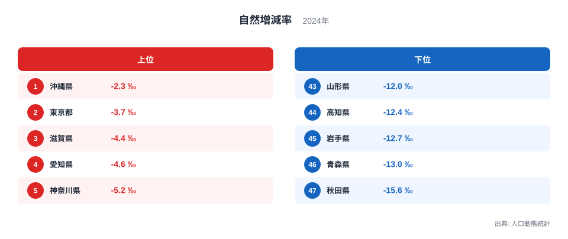

## 1位は「増加」ではなく、減少幅が最も小さい県です

2024年の自然増減率ランキングでは、沖縄県がマイナス2.3‰で1位、東京都がマイナス3.7‰で2位、滋賀県がマイナス4.4‰で3位です。1位という表示だけを見ると人口が自然に増えているように感じますが、上位を含む47都道府県の値がすべてマイナスです。

自然増減率は、一定期間の出生数から死亡数を引いた自然増減数を人口で割り、人口1,000人あたりで示した値です。マイナス2.3‰なら、出生より死亡が多く、人口1,000人あたり2.3人の自然減が生じたことを意味します。

> [!NOTE]
> 「‰」はパーミルと読み、1,000分の1を表します。マイナス10‰は、人口1,000人あたり10人の自然減に相当します。

このランキングで順位が高い県は、自然減の幅が相対的に小さい県です。「人口が増えている県」や「総人口の減少が小さい県」とは限りません。転入・転出や出入国による社会増減が、自然増減とは別に働くためです。

## 沖縄県から秋田県まで、全県がマイナスです

<source-link href="/ranking/natural-increase-rate">自然増減率ランキングをもっと見る</source-link>

上位5都県は、沖縄県マイナス2.3‰、東京都マイナス3.7‰、滋賀県マイナス4.4‰、愛知県マイナス4.6‰、神奈川県マイナス5.2‰です。若い年齢層を比較的多く抱える県や、大都市圏の都県が上位側に並びます。

下位5県は、山形県マイナス12.0‰、高知県マイナス12.4‰、岩手県マイナス12.7‰、青森県マイナス13.0‰、秋田県マイナス15.6‰です。東北の4県が入り、自然減の幅が大きい地域がまとまっています。

1位の沖縄県と47位の秋田県の差は13.3ポイントです。人口1,000人あたりで見ると、自然減のペースに大きな地域差があることが分かります。ただし、負の値どうしを単純な倍率で表すと意味が分かりにくくなるため、ここでは差の大きさで比較します。

> [!TIP]
> マイナスの指標では「何倍」よりも、ゼロからどれだけ離れているか、上位と下位で何ポイント違うかを見ると誤解を避けられます。

上位の沖縄県でも出生数が死亡数を上回ってはいません。ランキングの上位を成功、下位を失敗と捉えるのではなく、全県が自然減という共通状況の中で、減少幅がどれほど違うかを見る指標です。

## 自然減の背景には年齢構成が強く関わります

自然増減は出生と死亡の差なので、地域の年齢構成から大きな影響を受けます。若い世代や出産年齢の人口が多い地域では出生数を確保しやすく、高齢者の割合が高い地域では死亡数が多くなりやすくなります。

このため、出生率だけを見ても自然増減率は説明できません。合計特殊出生率が高くても、出産年齢の女性の人口が少なければ、出生数の総量は小さくなります。反対に出生率が低くても、若い人口が多い都市部では自然減の幅が比較的小さくなる場合があります。

> [!WARNING]
> 自然増減率の低さを、住民の子育て意識だけに結びつけることはできません。若年人口の流出、高齢化、出生数、死亡数という複数の人口構造が重なった結果です。

人口対策を考えるなら、出生数を増やす施策と同時に、若い世代が住み続けられる雇用・住宅・教育環境、高齢者の健康を支える施策を分けて検討する必要があります。自然減は短期間で反転しにくく、年齢構成の変化を含む長い時間軸で見る指標です。

率と実数の役割も異なります。自然増減率は人口規模の違う県を比べやすくしますが、学校、住宅、医療などの需要が実際に何人分変わるかを知るには自然増減数が必要です。小さな県で率が大きくても減少人数は大都市より少ない場合があるため、政策資源を配分するときは率と人数を必ず並べます。

市区町村単位に降りることも有効です。同じ県内でも若い世代が集まる都市部と、高齢化が進む中山間地域では自然減の幅が違います。県平均だけでは地域内の差が隠れるため、医療・子育て・交通の計画では生活圏ごとの年齢構成と出生・死亡を確認します。

単年の順位変化だけを施策の成果とは見なしません。

## 転入超過でも自然減を相殺できるとは限りません

東京都は自然増減率で2位ですが、値はマイナス3.7‰です。東京都の総人口がどう動くかを知るには、進学や就職、外国からの移動を含む社会増減を足す必要があります。自然減でも転入超過によって総人口が増えることがあり、反対に自然減と転出超過が重なる地域もあります。

自治体の将来人口を考えるときは、自然増減と社会増減を分けることが重要です。出生・死亡に働きかける施策と、転入・定着に働きかける施策では、対象も効果が表れる時期も異なります。総人口の増減だけでは、この二つを区別できません。

1位の[沖縄県のデータブック](/areas/47000)と47位の[秋田県のデータブック](/areas/05000)では、人口や生活に関する別の指標も比較できます。全県の値は[自然増減率ランキング](/ranking/natural-increase-rate)、関連する人口統計は[人口カテゴリ](/category/population)から確認できます。

> [!NOTE]
> 自然増減率の改善は、単年の順位だけで判断せず、出生数・死亡数・年齢構成を分解し、数年間の推移で確認する必要があります。

## 順位よりも「全県自然減」という共通点が重要です

2024年の自然増減率は、沖縄県のマイナス2.3‰から秋田県のマイナス15.6‰まで13.3ポイントの差がありました。しかし、最も重要なのは1位と47位の違いだけではなく、47都道府県すべてで死亡数が出生数を上回ったことです。

上位県は自然増に転じているわけではなく、自然減の幅が小さい県です。下位県の値には高齢化だけでなく、過去の若年人口流出によって出産年齢人口が少なくなった影響も重なります。現在の出生数は、長期的な人口移動の結果でもあります。

自然増減率を読むときは、社会増減、年齢構成、出生率、出生数、死亡数を重ねてください。そうすることで、単なる順位表ではなく、地域ごとに異なる人口減少の構造を理解できます。

## データ出典

- 厚生労働省「人口動態統計」（2024年）
