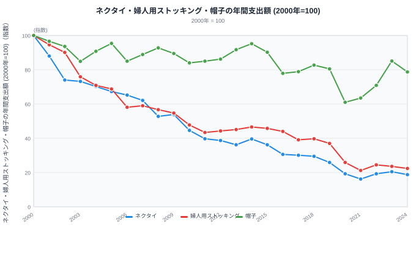
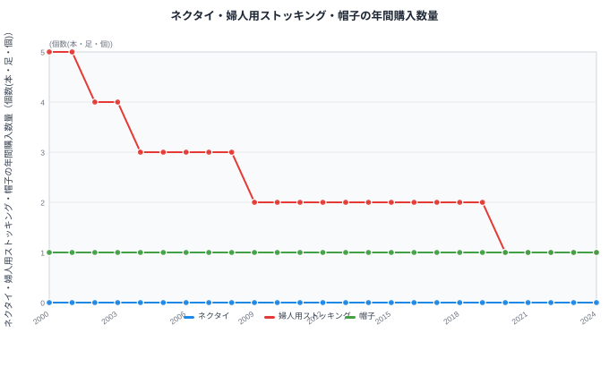
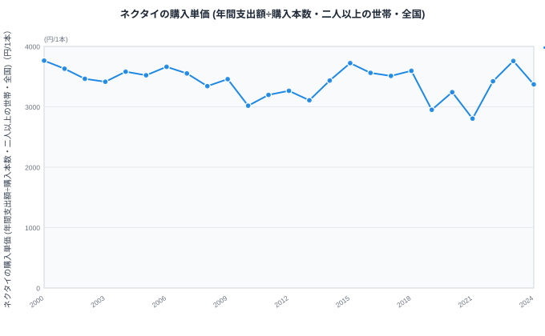
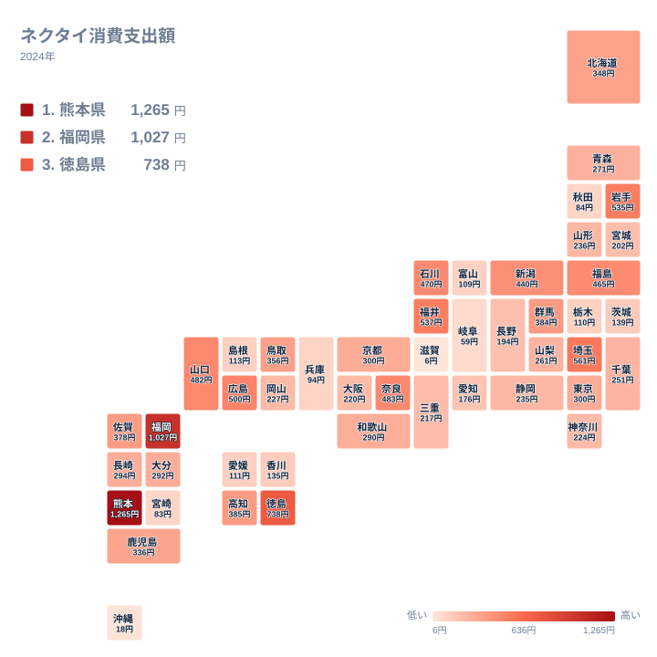

スーツの下にネクタイを締める男性を、街で見かける頻度は確実に減りました。総務省の家計調査（家計収支編・二人以上の世帯・全国）で年間支出額を追うと、ネクタイへの支出は2000年から2024年までの24年間で、指数にしてわずか18.8（2000年=100）まで落ち込んでいます。つまり支出額は当時のおよそ2割弱にまで縮んでいるのです。

同じ期間の婦人用ストッキングも指数22.4まで下がり、ネクタイとほぼ同じ縮み方をしています。ところが同じ「衣料小物」でも帽子は指数78.7と、下げ幅がずっと小さいままです。品目によって縮み方がこれほど違うのはなぜか、そして支出が減ったのは「本数」が減ったからなのか「値段」が下がったからなのか——24年分の月次データを年計にした系列で確かめます。

## 支出はどこまで縮んだのか

<source-link href="/ranking/hat-consumption-expenditure">帽子消費支出額ランキングをもっと見る</source-link>

2000年を100とした指数で見ると、ネクタイは2001年に88、2005年に67.3、2010年に44.6と、右肩下がりの縮小が続きます。下げ止まったように見えた2010年代半ばも回復には至らず、2019年には25.9まで下がりました。もっとも落ち込んだのは2021年の16.2で、直近の2024年は18.8とわずかに戻したところで推移しています。

婦人用ストッキングもほぼ同じ軌道をたどり、2010年に47.8、2019年に37、最安値は2021年の21.2、2024年は22.4です。ネクタイとストッキングは、支出額の水準こそ違いますが、指数で見た縮み方の形はよく似ています。

これに対して帽子は様子が異なります。2000年代は90前後を維持し、2013年には91.7、2014年には95.2まで戻る年もありました。落ち込みが目立つのは2020年の61で、これはネクタイ・ストッキングと同じ年に最大の下げを記録している点で共通しますが、その後の戻りは早く、2023年には85.1まで回復しています。帽子消費支出額の推移を見ても、2020年の落ち込みからの回復が他の2品目より早いことがわかります。あわせて見る: [ネクタイ消費支出額ランキング](/ranking/necktie-consumption-expenditure) / [婦人用ストッキング消費支出額ランキング](/ranking/womens-stockings-consumption-expenditure)

> [!NOTE]
> このデータは総務省「家計調査」（家計収支編・二人以上の世帯・全国）の月次値を暦年で合計したものです。都道府県別の順位ではなく、全国の1世帯当たり年間支出額（またはその指数）を表します。地域差を見たい場合は各ランキングページの都道府県別データをご覧ください。

## そもそも何回買っているのか

<source-link href="/ranking/womens-stockings-consumption-expenditure">婦人用ストッキング消費支出額ランキングをもっと見る</source-link>

支出額だけでなく、実際に何回買っているかを示す購入数量を見ると、品目ごとの違いがさらにはっきりします。婦人用ストッキングは2000年の年間5足から段階的に減り、2009年に2足、2020年以降は1足で推移しています。24年でおよそ5分の1になった計算です。婦人用ストッキング消費支出額の推移とあわせて見ると、数量の減少がそのまま支出額の縮小に直結していることがわかります。帽子は2000年から2024年まで一貫して1個のままで、支出指数が78.7まで下がっているにもかかわらず、購入数量の統計上はほとんど動きが見えません。

ネクタイはさらに極端です。家計調査の年間購入数量（小数点以下四捨五入）を見ると、2000年時点ですでに「0本」で、2024年も同じく0本のままです。これは1世帯あたり1年間に1本のネクタイも買わない年の方が多い、という購入頻度の低さを表しています。

> [!NOTE]
> ネクタイの購入数量が全期間「0本」と表示されるのは、1世帯あたりの年間購入本数がもともと1本を大きく下回っているためです。家計調査の年間購入数量は小数点以下を四捨五入して集計されるため、1本未満の年はすべて「0本」と表示されます。これは「誰も買っていない」という意味ではなく、「1世帯あたりの購入頻度がもともと極めて低い品目である」ことを示しています。

## 値段はほとんど変わっていない

支出額（金額）を購入数量（本数）で割った購入単価を見ると、また違う姿が見えてきます。ネクタイの購入単価は2000年の1本あたり3,764.2円から2024年には3,370.8円まで下がりました。24年間の下落率はおよそ1割にとどまります。年ごとの上下は大きく、もっとも安かったのは2021年の2,804.3円で、上位2年は2000年の3,764.2円と2023年の3,758.6円です。

支出指数が18.8まで落ちたのに対して、単価の下落はこの程度です。支出指数(18.8)を単価の変化率(3,370.8円÷3,764.2円≒0.895)で割ると、購入本数の変化率はおよそ0.21と求められます。つまり2024年の購入本数は2000年のおよそ21%、裏を返せば約8割減っている計算になり、支出が8割超も減った要因のほとんどは「1本あたりの値段が下がったから」ではなく、「そもそもネクタイを買う機会そのものが減ったから」で説明できます。値下げでは説明のつかない縮み方が起きているということです。

なお、単価は支出額を購入数量で割って算出しているため、分母となる購入数量がもともと1本未満と小さい品目では、年による変動が大きくなりやすい点にも注意が必要です。2021年の単価が特に低いのは、コロナ禍で外出・出社機会が大きく減り、購入した数少ないネクタイの価格帯が変わったことに加えて、分母の小ささが変動を増幅した可能性があります。

あわせて見る: [ネクタイ消費支出額ランキング](/ranking/necktie-consumption-expenditure)

## まだネクタイを買っている県はどこか

<source-link href="/ranking/necktie-consumption-expenditure">ネクタイ消費支出額ランキングをもっと見る</source-link>

全国平均で見た支出は指数18.8までしぼんでいますが、都道府県庁所在市ベースで2024年のネクタイ消費支出額を見ると、金額にはまだ大きな開きがあります。もっとも高いのは熊本県の1,265円で、2位の福岡県1,027円、3位の徳島県738円が続きます。一方でもっとも低いのは滋賀県の6円、次いで沖縄県の18円で、最も高い熊本県と最も低い滋賀県のあいだにはおよそ211倍の差があります。

このばらつきは、全国的な「ネクタイ離れ」が地域ごとに一様に進んでいるわけではないことを示しています。九州・四国の一部の県が上位に集まる一方で、近畿・中部の一部の県は下位に偏っており、地域ごとの業種構成や冠婚葬祭の慣習の違いが影響している可能性があります。ただしこの数値は2024年単年の断面であり、上で見てきた「2000年から24年間で8割減った」という全国の縮小トレンドとは別の視点です。各県の順位が24年間でどう動いたかまでは、このデータだけでは確認できません。

## なぜ品目によって縮み方が違うのか

ネクタイとストッキングの縮小が始まった時期を振り返ると、実際にはクールビズが広がるより前の2001年からすでに大きく下げ幅が出ています。ネクタイの指数は2000年の100から2001年に88、2002年には74まで落ち、この2年間だけで26ポイント下がりました。婦人用ストッキングも2002年の90.1から2003年には75.9まで下がっており、同様に2005年より前に大きな落ち込みを経験しています。2005年は環境省が推進した「クールビズ」が全国に広がった年で、夏場のノーネクタイが官公庁・企業に定着していった時期にあたりますが、縮小自体はそれ以前からすでに進んでおり、クールビズ以降も下げ止まっていません。ネクタイの指数は2005年の67.3から2010年の44.6へと、この間もさらに20ポイント以上下がっています。

その後、2020年にはネクタイ・婦人用ストッキング・帽子のいずれも前年より大きく落ち込んでいます。ネクタイは2019年の25.9から2020年に19.3、婦人用ストッキングも37から25.9まで下がりました。帽子はこの年に指数61まで下がり、2000年以降でもっとも低い水準を記録しています。それでもネクタイ19.3・婦人用ストッキング25.9と比べれば高い水準にとどまりました。ネクタイと婦人用ストッキングはその後さらに下がり、もっとも低かったのは2021年（ネクタイ16.2、婦人用ストッキング21.2）でした。在宅勤務が急速に広がり、通勤・出社という「ネクタイやストッキングを着用する機会」自体が失われた時期と重なります。

一方で帽子は2020年の落ち込み（指数61）から2023年に85.1まで戻しており、他の2品目より回復が速いのが特徴です。帽子は通勤・出社に限らず、日差し対策やレジャー、屋外での服装として使われる場面が広く、旅行や外出が再開すれば需要が戻りやすい品目だと考えられます。ネクタイやストッキングのように「オフィスに行く」という単一の用途に強く結びついた品目ほど、在宅勤務が定着した後も需要が戻りにくいという見方ができます。

> [!WARNING]
> ここで挙げた「クールビズ」や「在宅勤務の広がり」は、支出が落ち込んだ時期と重なる要因の候補であり、家計調査の集計値だけから因果関係を証明するものではありません。実際には価格帯の変化・世帯構成の変化・全体的な衣料費への支出配分の変化なども同時に影響している可能性があり、相関関係を示すデータであって因果を断定するデータではない点にご留意ください。

家計調査は全国平均の値であり、世帯の年収による違いまでは今回のデータでは分かりません。所得層による衣料費の違いに関心がある方は、[年収階級別に衣料品支出を比べた記事](/blog/income-quintile-clothing)もあわせてご覧ください。

> [!TIP]
> 支出額の推移だけを見ていると「市場が縮んでいる」という結論で終わりがちですが、購入数量と単価に分解すると、縮小の中身（本数が減ったのか、値段が下がったのか）まで読み取れます。他の衣料品でも、支出指数だけでなく数量・単価に分けて確認すると、見えてくる縮み方の理由が変わってくることがあります。

## まとめ

- ネクタイの年間支出額は2000年を100とした指数で2024年は18.8まで縮小（最安値は2021年の16.2）
- 婦人用ストッキングも同様に指数22.4まで縮小、購入数量は年間5足から1足へ（およそ5分の1）
- 帽子は指数78.7にとどまり、2020年の落ち込み（指数61）からの回復も他の2品目より速い
- ネクタイの購入単価は2000年の3,764.2円から2024年の3,370.8円へ、下落率は約1割にとどまる
- 支出額の大幅な減少は、値段の下落ではなく購入機会そのものの減少で説明できる部分が大きい

## データ出典

- 総務省統計局「家計調査 家計収支編 二人以上の世帯 品目分類（2020年改定）」月次・金額（統計表ID: 0003343671）
- 総務省統計局「家計調査 家計収支編 二人以上の世帯 品目分類（2020年改定）」月次・数量（統計表ID: 0003343670）
- 総務省統計局「家計調査 家計収支編 都道府県庁所在市 品目分類（2020年改定）」ネクタイ消費支出額（統計表ID: 0003348239、2024年）
- 購入単価は上記2表の金額と数量から、年計の金額合計÷数量合計として算出。e-Stat（政府統計の総合窓口）経由で取得・加工。集計期間は2000年〜2024年、対象は全国・二人以上の世帯です。都道府県別のネクタイ消費支出額は都道府県庁所在市の値です。
