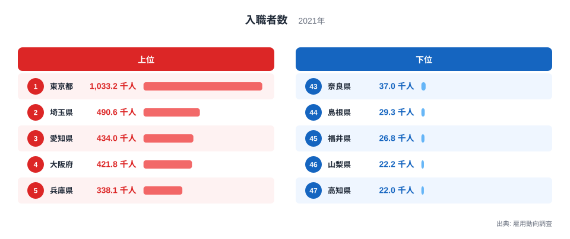
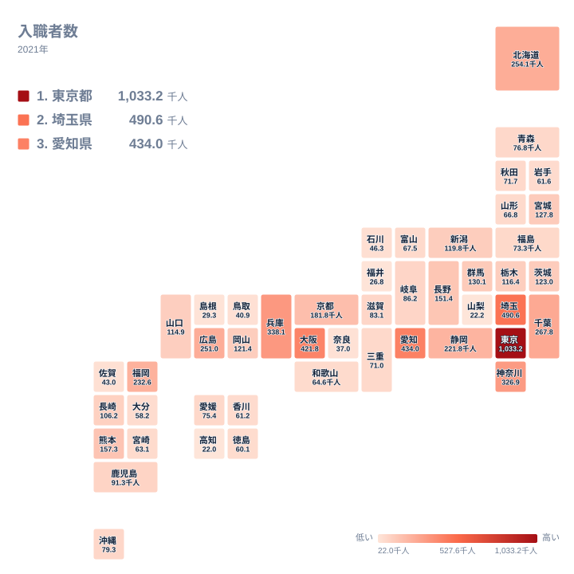

新しく職に就いた人の数を都道府県別に集計すると、同じ日本の中でもこれほど差があるのかと驚かされます。厚生労働省の雇用動向調査による入職者数は、事業所が新たに雇い入れた人の合計を示す指標です。2021年のデータをみると、最も多い都道府県と最も少ない都道府県の間にはおよそ47倍の開きがあります。

この記事では、入職者数の上位と下位を都道府県別に整理し、なぜこれほど大きな地域差が生まれるのかを、人口規模や産業構造の観点から読み解いていきます。

## 入職者数の上位と下位

<source-link href="/ranking/new-hire-count">入職者数ランキングをもっと見る</source-link>

入職者数が最も多いのは東京都で、1,033.2千人にのぼり全国1位です。2位は埼玉県で490.6千人、3位は愛知県で434千人、4位は大阪府で421.8千人、5位は兵庫県で338.1千人となっており、上位5都府県はいずれも300千人を超えています。

一方で下位をみると、43位は奈良県で37千人、44位は島根県で29.3千人、45位は福井県で26.8千人、46位は山梨県で22.2千人、そして最も少ないのは高知県で22千人です。1位の東京都と47位の高知県を比べると、その差はおよそ47倍にもなります。

上位に並ぶ都府県は、いずれも人口が多く、企業の本社や事業所が集中している地域です。事業所の数が多ければ、それだけ新規採用の件数も積み上がっていきますので、入職者数という絶対数の指標では、人口規模の大きい都府県が上位に来やすい構造になっていると考えられます。[仮説] これは入職者数が率ではなく実数であることに起因する可能性が高く、検証には事業所数や就業者数との突き合わせが必要です。

## 地理的にみる入職者数の分布

タイルマップで全国の分布をみると、入職者数の多い地域は関東や東海、近畿といった三大都市圏に集中していることがわかります。東京都を中心とした首都圏では、2位の埼玉県、6位の神奈川県、7位の千葉県もいずれも上位に入っており、通勤圏を広くとらえた労働市場が形成されていることがうかがえます。

対照的に、入職者数の少ない都道府県は、四国や山陰、北陸、甲信の一部に多くみられます。高知県、島根県、福井県、山梨県はいずれも人口規模が比較的小さく、事業所の絶対数も限られているため、新規採用の総量そのものが小さくなりやすい地域です。[仮説] 地理的な要因としては、大都市圏への人口流出が続いてきたことも、これらの県で入職者数が伸びにくい一因になっている可能性があります。この点は人口移動のデータと合わせて検証する必要があります。

## なぜ入職者数にこれほどの差が生まれるのか

入職者数の地域差を生む最大の要因は、単純な人口規模と事業所数の違いです。東京都や大阪府のように多くの企業が集積する地域では、退職や異動に伴う欠員補充だけでも相当な数の新規採用が発生します。[仮説] 加えて、成長産業や新設事業所が集中しやすいことも、入職者数を押し上げる方向に働いている可能性があります。

一方、産業構造の違いも見逃せません。第一次産業や小規模事業者の比率が高い地域では、そもそも従業員を新規に雇い入れる事業所の数自体が少なく、季節的な雇用の入れ替わりも限定的です。奈良県のように、大阪府に隣接しながら入職者数が下位にとどまっている県もあり、[仮説] 近隣の大都市圏へ通勤する人が多く、県内での新規雇用が相対的に少なくなっている可能性が考えられます。

こうした背景を踏まえると、入職者数という絶対数のランキングは、その地域の労働市場の大きさを映し出している面が強く、必ずしも雇用の活発さそのものを直接示すわけではないという点に注意が必要です。単純な順位の高低だけで、その地域の景気の良し悪しを判断しないようにしましょう。

## まとめ

- 入職者数の全国1位は東京都で1,033.2千人、最下位は高知県で22千人です
- 1位と47位の差はおよそ47倍にのぼります
- 上位5都府県は東京都、埼玉県、愛知県、大阪府、兵庫県で、いずれも300千人を超えています
- 下位5県は奈良県、島根県、福井県、山梨県、高知県で、人口規模の小さい地域に多くみられます
- 地域差の背景には、人口規模や事業所数の違い、産業構造の違いがあると考えられます

同じカテゴリの統計をあわせて確認したい場合は、[同じカテゴリの統計一覧](/category/laborwage)もご覧ください。1位の[東京都のデータ](/areas/13000)や、2位の[埼玉県のデータ](/areas/11000)もあわせてご確認いただけます。

> [!NOTE]
> 入職者数は率ではなく実数(人数の合計)です。人口や事業所数が多い都道府県ほど数値が大きくなりやすいため、単純な大小比較だけで雇用が活発かどうかを判断しないよう注意してください。

> [!WARNING]
> この調査はパートタイム労働者を含むあらゆる雇用形態の入職者を合算した数値です。正社員だけの転職動向や、特定の業種に限った採用の勢いを示すものではありません。

> [!TIP]
> 都道府県間の差をより公平に比べたい場合は、人口や就業者数で割った入職率でみると、絶対数のランキングとは異なる順位になることがあります。あわせて確認すると理解が深まります。

## データ出典

出典: 雇用動向調査(厚生労働省)
集計年: 2021年
