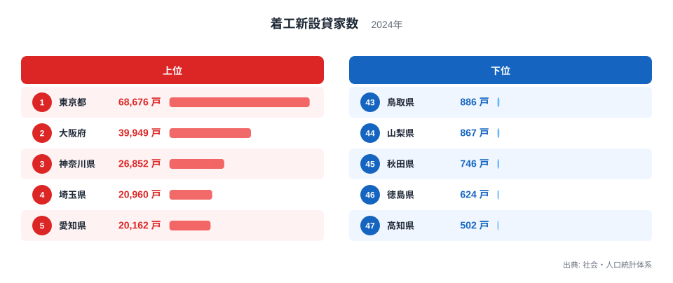
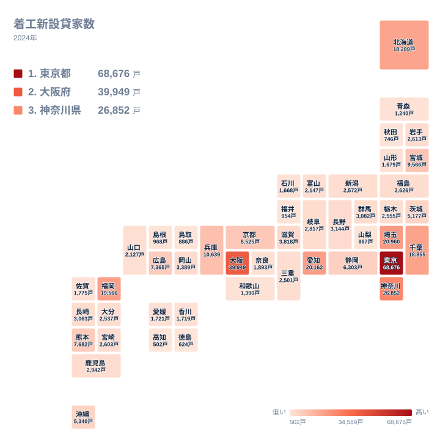

新しく建てられる賃貸住宅、いわゆる貸家の着工戸数は、住む場所によって大きく異なります。2024年の着工新設貸家数を都道府県別に見ると、全国で最も多い東京都は68,676戸にのぼり、最も少ない高知県は502戸にとどまります。この差はおよそ137倍で、住宅市場の規模が都道府県ごとにいかに異なるかを示しています。

貸家着工の多さは、単に人口が多いことだけでなく、賃貸住宅を必要とする単身世帯の多さや転入者の動き、地価の水準など、その地域の暮らし方や経済活動を映し出す指標でもあります。この記事では、着工新設貸家数の上位県と下位県を比較しながら、なぜこれほど大きな地域差が生まれているのかを、地理的な視点から読み解いていきます。

> [!NOTE]
> 着工新設貸家数の「貸家」とは、賃貸に出すことを目的として新しく建てられた住宅を指します。自分で住むために建てる持家や、購入者に販売する分譲住宅とは区別して集計されている点が特徴です。単位の「戸」は建物の棟数ではなく住戸の数を表しており、1棟のアパートに複数の住戸があれば、その戸数分がまとめて計上されます。

## 着工新設貸家数の全国順位

まず、2024年の全国順位を確認しましょう。

<source-link href="/ranking/new-rental-starts">着工新設貸家数ランキングをもっと見る</source-link>

東京都は68,676戸で1位、大阪府は39,949戸で2位、神奈川県は26,852戸で3位、埼玉県は20,960戸で4位、愛知県は20,162戸で5位となっています。上位5都府県のうち東京都・神奈川県・埼玉県は首都圏に位置し、大阪府は近畿地方、愛知県は中部地方でそれぞれ最も人口の多い県です。いずれも大規模な都市圏を抱えており、賃貸住宅への需要そのものが大きい地域といえます。

一方、下位を見ると、鳥取県は886戸で43位、山梨県は867戸で44位、秋田県は746戸で45位、徳島県は624戸で46位、高知県は502戸で47位です。下位5県は中国地方、中部地方、東北地方、四国地方とさまざまな地方に散らばっており、特定の一地方だけに偏っているわけではありません。ただし46位の徳島県と47位の高知県はどちらも四国地方に位置しており、この2県に限れば同じ地方の隣県どうしが最下位を分け合う形になっています。

[仮説] 上位県と下位県のこの差は、賃貸住宅を必要とする単身世帯や進学・転勤による転入者の多さと関係している可能性があります。人口の多い都市圏では住み替えの動きが活発で賃貸需要が高まりやすいため、貸家の新築も増えやすいと考えられますが、この関係を確かめるには人口動態や世帯構成のデータと合わせた検証が必要です。

> [!WARNING]
> このデータは2024年単年の値であり、大規模な集合住宅の着工が特定の年に集中すると、その年だけ数値が大きく変動することがあります。また、これは都道府県ごとの実数であり、人口一人当たりの水準に換算したものではありません。人口の多い都道府県ほど戸数が大きくなりやすい点に注意してください。

## 地理的な広がりを地図で見る

タイルマップで全国の分布を確認すると、着工新設貸家数の多さがどのように地理的に広がっているかがより分かりやすくなります。

地図を見ると、着工戸数の多い県は関東、近畿、中部といった大都市圏に集中する一方で、北海道、福岡県、宮城県のように各地方で最も人口の多い拠点県も濃い色で表示されています。つまり、貸家の着工が多い地域は一つの帯状のエリアに限られているわけではなく、それぞれの地方の中心的な都市を抱える県で共通して活発になっていることが読み取れます。

[仮説] 8位の北海道は18,289戸と、東北や四国の各県と比べて際立って多くなっています。一般的に北海道は面積に対する人口密度が低い地域とされますが、道庁所在地である札幌市に人口や経済活動が集中していることが、貸家着工数を押し上げている一因と考えられます。これに対して、東北地方や四国地方、山陰地方(鳥取県・島根県)の多くの県では、地図上でも薄い色として表示されており、人口規模の小さい県ほど貸家の新築件数も少なくなる傾向がうかがえます。

> [!TIP]
> 都道府県ごとの規模の違いを踏まえて比較したい場合は、その都道府県の人口や世帯数と合わせて確認すると、その地域で賃貸住宅の供給がどれだけ活発かをより正確につかむことができます。実数のランキングだけを見ると、人口の多い都道府県が上位を占めやすい点を念頭に置いて読むとよいでしょう。

## なぜ大都市圏に着工が集中するのか

[仮説] 貸家の着工数が大都市圏に集中する背景には、いくつかの要因が考えられます。第一に、進学や就職による転入者が多い地域では単身向け賃貸住宅の需要が高く、新築の貸家が供給されやすいという事情があります。第二に、地価が高い都市部ほど、土地を効率的に活用できる賃貸経営を目的とした建築が、持家の新築よりも選ばれやすい傾向があります。第三に、都市部の地主が相続税対策として貸家を新築するケースが多いという指摘もありますが、これらはいずれも仮説であり、着工新設貸家数のデータだけから因果関係を断定することはできません。

なお、6位の福岡県、7位の千葉県、9位の兵庫県、10位の宮城県も上位10位以内に入っており、いずれも各地方の拠点となる大きな都市を抱える県です。福岡県は九州地方、宮城県は東北地方でそれぞれ最も人口の多い県であり、地方の中心都市であっても、その都市圏に人口や経済活動が集積していれば、貸家着工数は上位に入りやすいことが、この結果から読み取れます。逆に11位の京都府や12位の熊本県のように、大都市圏に属していても上位5県には及ばない県もあり、着工戸数は都道府県の人口規模だけで単純に決まるわけではないこともうかがえます。

## まとめ

- 2024年の着工新設貸家数は、1位東京都68,676戸、2位大阪府39,949戸、3位神奈川県26,852戸でした。
- 4位は埼玉県20,960戸、5位は愛知県20,162戸で、上位5県はいずれも大都市圏に位置しています。
- 最下位は47位高知県502戸、46位徳島県624戸、45位秋田県746戸でした。
- 東京都と高知県の差はおよそ137倍にのぼります。
- 下位県は特定の地方に偏っているわけではありませんが、46位と47位はどちらも四国地方の県です。

貸家着工数の地域差は、単なる人口の多寡だけでなく、その地域の都市構造や賃貸需要の大きさを反映しています。[同じカテゴリの統計一覧](/category/construction)では、住宅や建設に関する他の統計もあわせて確認できます。上位県の詳しいデータは[東京都のデータ](/areas/13000)や[大阪府のデータ](/areas/27000)からご覧いただけます。

## データ出典

出典は社会・人口統計体系(2024年)です。都道府県別の建築着工統計に基づき、貸家として新設された住宅の着工戸数を集計したものです。
