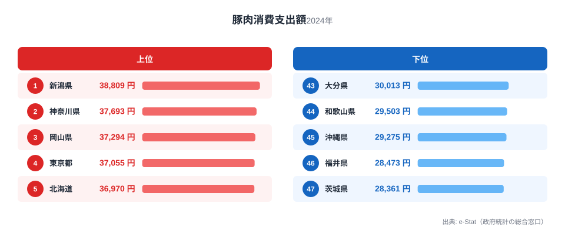
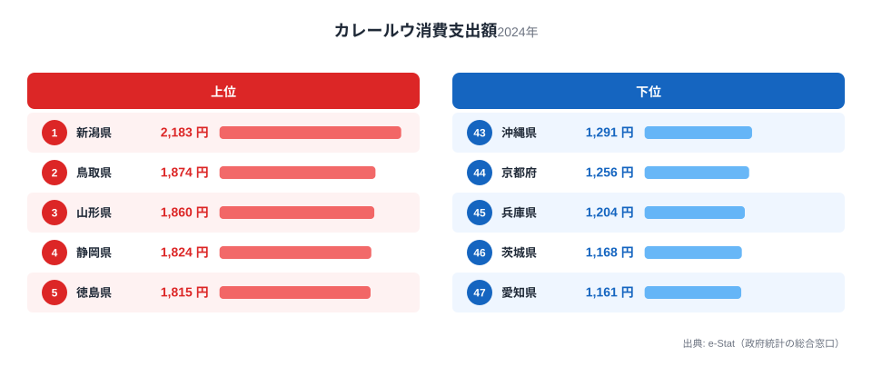
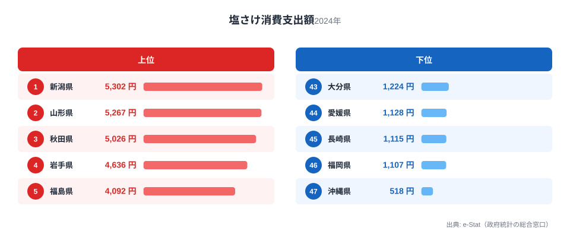

新潟県といえば米どころのイメージが強い県ですが、家計調査の品目別データを見ると、実は「ご飯のお供」を支出額で日本一買っている県でもあります。総務省統計局の家計調査（2024年、都道府県庁所在市・二人以上世帯）によると、新潟市の豚肉消費支出額は年間38,809円で全国1位、カレールウは2,183円で全国1位、塩さけは5,302円で全国1位という、3冠を達成しています。

なぜこの3品目がそろって新潟に集まったのでしょうか。答えの鍵は、どれも「白いご飯を大量に、おいしく食べるための脇役」だという共通点にあります。米の生産量日本一の県で、米に合わせる食材への支出も自然と積み上がった、という構図が見えてきます。この記事では3つのランキングを1つずつ確認しながら、新潟の食卓を貫く軸を探ります。

> [!NOTE]
> この記事の数値はすべて総務省統計局「家計調査（品目別支出）」2024年、都道府県庁所在市（新潟県は新潟市）・二人以上世帯の年間支出額です。県内全域の平均ではなく県庁所在市のデータである点にご注意ください。

## 豚肉 — 全国1位38,809円、とんかつ文化の土台

<source-link href="/ranking/pork-consumption-expenditure">豚肉消費支出額ランキングをもっと見る</source-link>

新潟市の豚肉消費支出額は38,809円で全国1位でした。2位の神奈川県（37,693円）、3位の岡山県（37,294円）と僅差ではありますが、全国平均を大きく上回る水準です。最下位は茨城県（28,361円）で、新潟との差は約1.4倍にとどまり、豚肉自体は全国的に消費される食材であることがうかがえます。

新潟で豚肉の支出が伸びる背景には、県内で親しまれる「タレかつ丼」に代表される、とんかつ・フライ文化の存在があります。新潟市周辺では醤油ベースの甘辛いタレをかけたかつ丼が学校給食にも登場するほどの定番料理で、外食だけでなく家庭でも豚肉を揚げ物にして食べる習慣が根づいています。米どころだからこそ「ご飯が進むおかず」として豚肉料理が食卓に定着した、と読み取れます。

## カレールウ — 全国1位2,183円、雪国の定番おかず

<source-link href="/ranking/curry-roux-consumption-expenditure">カレールウ消費支出額ランキングをもっと見る</source-link>

カレールウの消費支出額でも新潟市は2,183円で全国1位です。2位の鳥取県（1,874円）、3位の山形県（1,860円）と、いずれも日本海側・豪雪地帯の県が上位に並んでいるのが特徴的です。最下位の愛知県（1,161円）とは1.9倍の差があり、豚肉に比べて地域差がはっきり出る品目といえます。

カレーは大量に作り置きできて日持ちがし、家族分をまとめて用意しやすい料理です。冬場に積雪で買い物が制限されやすい雪国では、こうした「作り置きしやすいご飯のお供」への需要が自然と高まります。しかも新潟は前述のとおり豚肉の消費量も日本一で、「ご飯に合う具だくさんのポークカレー」という組み合わせが、家庭の定番として根づいている可能性がうかがえます。

## 塩さけ — 全国1位5,302円、鮭のまち村上の影響

<source-link href="/ranking/salted-salmon-consumption-expenditure">塩さけ消費支出額ランキングをもっと見る</source-link>

塩さけの消費支出額は新潟市が5,302円で全国1位でした。2位の山形県（5,267円）、3位の秋田県（5,026円）と日本海側の県が上位を占める一方、最下位の沖縄県（518円）とは約10.2倍もの開きがあり、3品目の中で最も地域差が大きい結果となっています。

新潟県には、江戸時代から鮭の伝統的な加工技術で知られる村上市があります。三面川に遡上する鮭を「塩引き鮭」として軒先に吊るして熟成させる文化が今も残り、正月のご馳走として塩さけを食べる習慣が県内に広く定着しています。塩気の強い焼き魚は、まさに白いご飯を何杯もおかわりするための一品であり、米どころ新潟らしい取り合わせといえるでしょう。

> [!WARNING]
> ここでの数値は世帯の「支出額」であり、購入量（グラム・尾数）そのものではありません。塩さけの単価は加工度によって差があるため、支出額の差が必ずしも消費量の差と一致するとは限らない点にご留意ください。また村上市の「塩引き鮭」のような贈答・特産品としての消費は、家計調査の品目別集計では個別に区分されず塩さけ全体に含まれます。

## 新潟の食卓を貫くもの

豚肉・カレールウ・塩さけという3つの全国1位に共通するのは、いずれも「白いご飯を大量に食べるための脇役」だという点です。とんかつも、ポークカレーも、焼いた塩さけも、それ単体ではなく茶碗のご飯とセットで完成する料理ばかりです。米の収穫量が全国トップクラスの新潟県だからこそ、ご飯を主役にした献立を支える食材への支出が、結果として全国トップに積み上がったと考えられます。

同じように県境を接する[富山の食卓](/blog/toyama-food-culture)では、ぶりや昆布など「海の幸」を軸にした全国1位が並び、日本海側でも県ごとに個性が分かれます。一方、山を挟んで隣接する[山形の食卓](/blog/yamagata-food-culture)は、こんにゃくや筍など「山の幸」が中心で、新潟の「ご飯に合うおかず」路線とは異なる系統です。同じ雪国でも何を主役に据えるかで、家計の使い道は大きく変わってくることがわかります。

> [!TIP]
> 3品目のうち、カレールウと塩さけは日本海側・豪雪地帯の県が上位を占める一方、豚肉は全国的な地域差が小さいという違いがあります。「新潟らしさ」を測るなら、地域差が大きい品目（塩さけ・カレールウ）のほうが県民性を強く映し出している可能性があります。豚肉のように全国で満遍なく消費される品目は、単独では地域色を判断しにくい点に注意が必要です。

## まとめ

- 豚肉消費支出額は新潟市が38,809円で全国1位（2位神奈川県37,693円、3位岡山県37,294円）
- カレールウ消費支出額は新潟市が2,183円で全国1位（2位鳥取県1,874円、3位山形県1,860円）
- 塩さけ消費支出額は新潟市が5,302円で全国1位（2位山形県5,267円、3位秋田県5,026円）、最下位の沖縄県518円とは10.2倍差
- 3品目に共通するのは「白いご飯を大量に食べるための脇役」という役割で、米どころ新潟らしい食卓の構図が浮かび上がる
- 塩さけとカレールウは日本海側の豪雪地帯で上位を占める一方、豚肉は全国的な地域差が小さい

[新潟県の地域プロフィール](/areas/15000)では、こうした食文化データ以外の経済・人口指標も確認できます。家計調査の品目別データをさらに広く見たい方は[経済カテゴリ一覧](/category/economy)からどうぞ。

## データ出典

総務省統計局「家計調査（品目別）」2024年、都道府県庁所在市・二人以上世帯（e-Stat 経由で整備）。
