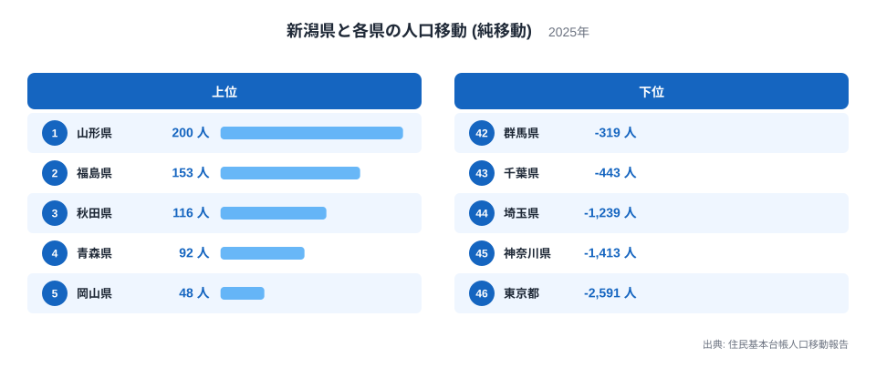
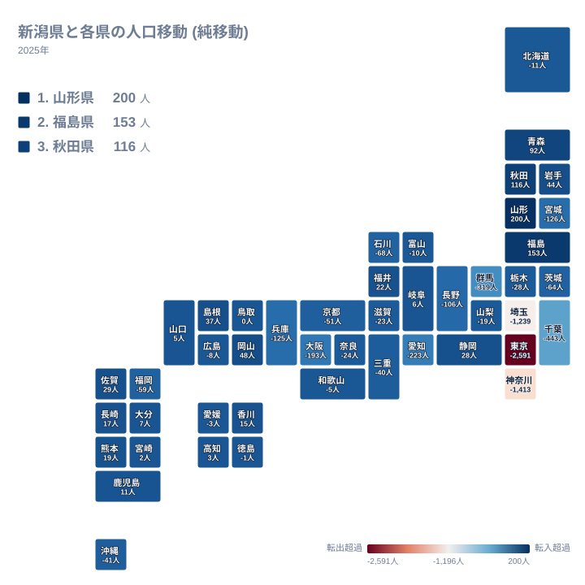
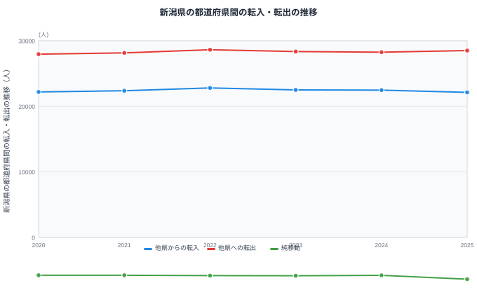

新潟県は日本海側に位置し、山形県、福島県、群馬県、長野県、富山県という5つの県と陸で接しています。住民基本台帳人口移動報告の都道府県間の純移動データを見ると、新潟県は東北方面の隣県からは人を得ている一方、関東・中部方面との関係では一貫してマイナスが続いています。

純移動とは、ある県から見て別の県との間で転入した人数から転出した人数を引いた差のことです。移動した人の総数そのものではなく、あくまで差し引きの値である点に注意が必要です。この記事では新潟県と各県の純移動データをもとに、新潟県がどの方向とつながり、どの方向へ人を明け渡しているのかを見ていきます。

## 相手県別にみる純移動

<source-link href="/ranking/moving-in-excess-rate">転入超過率ランキング</source-link>

新潟県が最も多くの人を得ている相手は山形県で、純移動は200人です。2位は福島県で153人、3位は秋田県で116人、4位は青森県で92人と、上位4県はいずれも東北地方の県が占めています。全国の転入超過率ランキングと照らし合わせると、新潟県の位置づけがより立体的に見えてきます。

5位以下を見ると、5位は岡山県で48人、6位は岩手県で44人、7位は島根県で37人、8位は佐賀県で29人、9位は静岡県で28人、10位は福井県で22人と続きます。上位10県が東北から中国・四国・九州まで広く分散している点は、新潟県が東北の隣県だけでなく、離れた地域からも一定の人を集めていることを示しています。

20位の鳥取県は純移動がちょうど0人となっており、新潟県との間で転入と転出がぴったり釣り合っています。21位以降はマイナスに転じ、22位の愛媛県はマイナス3人、23位の和歌山県はマイナス5人と、緩やかにマイナス幅が広がっていきます。

一方で最も多くの人を失っている相手は東京都で、純移動はマイナス2,591人です。45位は神奈川県でマイナス1,413人、44位は埼玉県でマイナス1,239人、43位は千葉県でマイナス443人と続き、下位には首都圏の4県がそろって並んでいます。42位の群馬県もマイナス319人と、新潟県が接する県の中では最も大きなマイナス幅を記録しています。

> [!NOTE]
> この図の各県別の値は、新潟県とその1県だけの間で成立した純移動です。後段で紹介する転入・転出の推移グラフは、新潟県が全国のすべての県との間でやり取りした合計であり、規模がまったく異なります。1県あたりの値と全国合計の値を混同しないよう注意してください。

## 地図でみる純移動の広がり

地図の中で新潟県自体のマスに色が付いていないのは、新潟県から新潟県への移動というデータがそもそも存在しないためです。この地図は新潟県と、それ以外の46都道府県との関係だけを表しています。

地図全体を見渡すと、青みがかった色で示される純移動プラスの県は東北地方に集中しており、赤みがかった色で示される純移動マイナスの県は関東地方から中部地方にかけて連なっています。新潟県が接する5つの県のうち、純移動がプラスなのは山形県と福島県の2県だけで、いずれも新潟県の北から北東にあたる方向です。

残る3つの隣接県、すなわち群馬県、長野県、富山県はすべて純移動がマイナスです。群馬県はマイナス319人で42位、長野県はマイナス106人で37位、富山県はマイナス10人で25位となっており、いずれも新潟県の南に位置する県です。長野県のデータでは逆に新潟県からの純移動がプラス106人として現れており、2つの県の間の関係が数値の符号を挟んで対称になっている点も特徴的です。

> [!WARNING]
> このデータは都道府県間の移動だけを対象としており、新潟県内の市町村間の移動や、海外との出入国は含まれていません。新潟県内での引っ越しがどれだけ多くても、この統計には一切反映されない点に注意してください。

## 首都圏との関係

新潟県から見て、下位4県はいずれも首都圏の県が占めています。46位の東京都はマイナス2,591人、45位の神奈川県はマイナス1,413人、44位の埼玉県はマイナス1,239人、43位の千葉県はマイナス443人です。上越新幹線や関越自動車道で首都圏と直結している地理的な近さが、これほど大きなマイナス幅につながっている構図がうかがえます。

隣接する群馬県を含めれば、新潟県から見て人を最も多く失っている上位5県のうち4県が首都圏の県、残る1県が首都圏に隣接する群馬県という結果になっており、新潟県の人口移動が首都圏方向への一方的な流れに強く規定されていることがわかります。[新潟県のデータ](/areas/15000)と[東京都のデータ](/areas/13000)を見比べると、この非対称な関係がより明確になります。

## 転入・転出の推移

この図は新潟県と全国すべての県との間でやり取りされた転入・転出・純移動の推移を示しています。他県からの転入は2020年が22,186人、2021年が22,369人、2022年が22,796人、2023年が22,504人、2024年が22,467人、2025年が22,120人と、6年間を通じて22,000人台で推移しています。他県への転出は2020年が27,957人、2021年が28,143人、2022年が28,626人、2023年が28,354人、2024年が28,249人、2025年が28,499人と、こちらは6年間を通じて28,000人前後で高止まりしています。

この結果、純移動は2020年がマイナス5,771人、2021年がマイナス5,774人、2022年がマイナス5,830人、2023年がマイナス5,850人、2024年がマイナス5,782人、2025年がマイナス6,379人と、6年間すべてでマイナスが続いています。2025年のマイナス6,379人は、この6年間で最も大きなマイナス幅です。転入がほぼ横ばいで推移する一方、転出はやや増加傾向にあり、両者の差が2025年に入って広がったことがこの数字に表れています。

> [!TIP]
> 純移動の推移を見るときは、マイナス幅の大きさだけでなく、転入と転出のどちらが動いているかを確認することが読み解きのコツです。新潟県の場合、転入は22,000人台でほぼ一定なのに対し、転出が28,000人台へとやや増えたことが2025年のマイナス幅拡大につながっています。

## まとめ

- 新潟県が最も人を得ている相手は山形県で、純移動は200人です。
- 新潟県が最も人を失っている相手は東京都で、純移動はマイナス2,591人です。
- 新潟県が接する5県のうち、純移動がプラスなのは北にあたる山形県と福島県の2県だけです。
- 全国合計の純移動は2020年から2025年まで6年連続でマイナスで、2025年が最も大きなマイナス幅です。
- 20位の鳥取県は純移動がちょうど0人で、転入と転出が釣り合っています。

新潟県の人口移動の全体像は、[人口動態のテーマ](/themes/population-dynamics)や[人口・世帯の統計一覧](/category/population)からも確認できます。

## データ出典

- 出典: 住民基本台帳人口移動報告
- 年: 2025年(相手県別の純移動)、2020年から2025年(転入・転出・純移動の推移)
