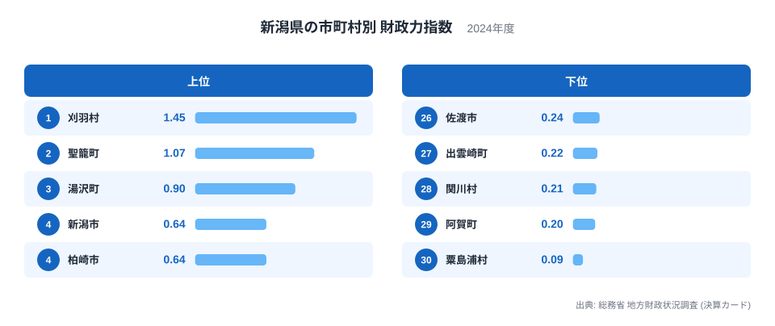
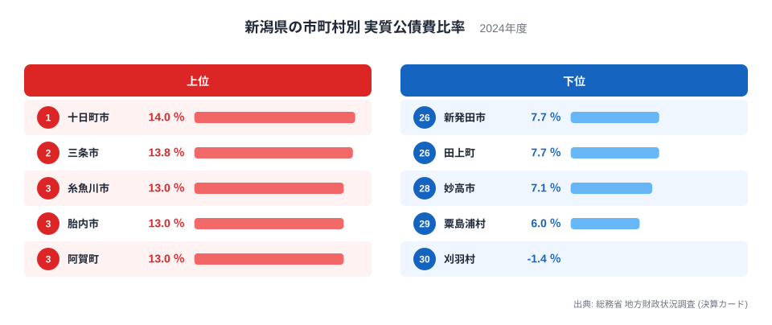
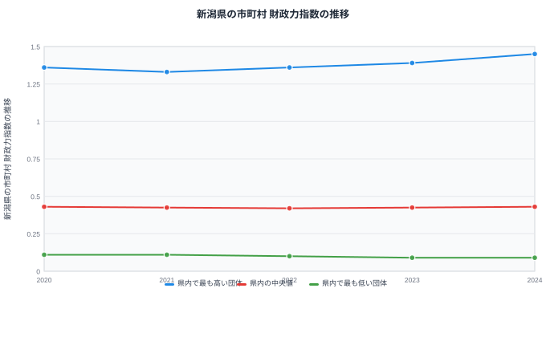

新潟県には30の市町村があります。同じ県の中に住んでいても、それぞれの自治体が向き合っている財政の現実は大きく異なります。もっとも自立した財政基盤を持つ団体と、もっとも厳しい団体を比べると、財政力指数には大きな開きがあります。なぜ同じ県内でここまで差が生まれるのでしょうか。この記事では、財政力指数と実質公債費比率という二つの指標から、新潟県内の市町村がそれぞれどんな事情を抱えているのかを読み解いていきます。

## 財政力指数でみる格差

> [!NOTE]
> 財政力指数は、標準的な行政サービスに必要な費用のうち、自前の税収でどれだけまかなえているかを示す指数です。基準財政収入額を基準財政需要額で割った値の過去3年間の平均で、数値が1に近い、または1を超えるほど、地方交付税に頼らずに運営できていることを意味します。単位のない指数として扱われます。

財政力指数で最も高いのは刈羽村で、1.45となっています。1を超えているということは、地方交付税に頼らなくても自前の税収だけで標準的な行政サービスをまかなえる水準にあることを示します。[仮説] 刈羽村は原子力発電所が立地する自治体として知られており、発電施設に関わる固定資産税や交付金が、人口の小さな村の財政力指数を押し上げている可能性があります。

2位は聖籠町で1.07、3位は湯沢町で0.9となっており、上位には人口規模の小さな町村が並んでいます。[仮説] 聖籠町は臨海部に大規模な発電施設や工業地帯を抱えており、湯沢町はスキーリゾートと高層マンションの税収が大きな支えになっていると考えられます。一方で県庁所在地であり最大の人口を抱える新潟市は0.64で4位にとどまり、柏崎市も同じ0.64で並んでいます。人口や産業の規模がそのまま財政力の高さに結びつくわけではないことがうかがえます。

順位の下位に目を移すと、粟島浦村が0.09で最も低く、阿賀町が0.2で29位、関川村が0.21で28位と続きます。[仮説] これらの自治体は人口が少なく、粟島浦村は日本海に浮かぶ島の村、阿賀町は山間部に広がる自治体で、いずれも税収の基盤となる産業や事業所が限られていることが背景にあると考えられます。妙高市は0.43で15位、五泉市も同じく0.43で16位、阿賀野市も0.43で17位と、同じ値でも順位は分かれています。

## 実質公債費比率でみる負担の重さ

実質公債費比率が最も高いのは十日町市で14%です。[仮説] 十日町市は平成の大合併で複数の町村が統合してできた自治体で、統合後のインフラ整備や過去の大規模事業に伴う借入金の返済が、比率を押し上げている可能性があります。2位の三条市は13.8%、3位の糸魚川市・4位の胎内市・5位の阿賀町はいずれも13%で並びます。[仮説] 糸魚川市は2016年の大規模な火災からの市街地再建に伴う投資が、比率の高さに影響しているとも考えられます。

一方で最も低いのは刈羽村で、実質公債費比率はマイナス1.4%です。財政力指数で1位だった刈羽村が、この指標でも最も負担が軽い団体になっています。29位の粟島浦村は6%、28位の妙高市は7.1%と続きます。

> [!WARNING]
> 実質公債費比率がマイナスになるのは異常な数値ではありません。公債費に充てるために確保していた財源が、実際の借入金の返済額を上回った場合などに起こります。この指標は数値が低いほど財政の負担が軽いことを示すため、財政力指数とは逆に「低いほど良い」指標である点に注意してください。2024年度単年の決算に基づく数値であり、大きな事業の実施年によって前後の年度と比べて変動する場合もあります。

## 同じ規模の自治体と比べてどうか

新潟県内の30市町村を財政力指数の高い順に並べたとき、ちょうど真ん中に位置する中央値は0.43です。刈羽村の1.45はこの中央値の3倍以上、粟島浦村の0.09は中央値の5分の1をわずかに上回る水準にとどまります。中央値そのものは、総務省が財政比較のために用いる「類似団体平均」とは異なる指標で、あくまで県内30団体を単純に並べたときの中間値です。

[仮説] それでも、上位と下位の開きがこれほど大きいことから、新潟県だけの特殊な事情というより、原子力発電所や大規模なリゾート施設が立地するかどうか、人口が少ない山間部や離島かどうかといった、全国の同規模自治体にも共通しやすい要因が働いていると考えられます。ただし、これを裏づけるには全国の類似団体平均との比較が必要で、今回のデータだけでは断定できません。

## 財政力指数はこの5年でどう動いたか

県内で最も高い団体の財政力指数は、2020年の1.36から2021年に1.33へ一度下がったものの、2022年に1.36、2023年に1.39、2024年に1.45と上昇を続けています。2024年の最高値は刈羽村の数値と一致しており、この5年間で最上位の水準がさらに切り上がったことがわかります。

これに対して県内の中央値は、2020年の0.43から2021年に0.425、2022年に0.42とわずかに下がり、2023年に0.425、2024年に0.43とほぼ横ばいで推移しています。県内で最も低い団体は、2020年と2021年が0.11、2022年が0.1、2023年が0.09、2024年も0.09と、5年間でじわじわと下がっています。2024年の最低値は粟島浦村の数値と一致しています。

[仮説] 最上位がさらに伸び、最下位がじわじわと下がっているということは、県内の財政力の開きが縮まるどころか、この5年間でむしろ広がってきた可能性を示しています。中央値がほぼ動いていないことから、真ん中に位置する多くの自治体は安定している一方、両端に位置する自治体だけが動いている構図が見えてきます。

> [!TIP]
> 財政力指数と実質公債費比率は逆方向の性質を持つ指標なので、片方だけを見ると自治体の状態を見誤ります。新潟市のように財政力指数では上位に入らなくても、実質公債費比率が極端に高いわけではない団体もあれば、刈羽村のように両方の指標で良好な団体もあります。二つのランキングをあわせて見ることで、それぞれの自治体の実像に近づけます。新潟県のほかの指標は[新潟県のデータ](/areas/15000)、地方財政のしくみ全体は[地方財政のテーマ](/themes/local-finance)で確認できます。

## まとめ

- 財政力指数が最も高いのは刈羽村の1.45で、最も低いのは粟島浦村の0.09です
- 財政力指数の県内中央値は0.43で、刈羽村はその3倍以上、粟島浦村はその5分の1をわずかに上回る水準です
- 実質公債費比率が最も高いのは十日町市の14%で、最も低いのは刈羽村のマイナス1.4%です
- 財政力指数の上位には原子力発電所やリゾート施設が立地するとみられる小規模な町村が並び、下位には離島や山間部の自治体が並びます
- 2020年から2024年にかけて、最上位の指数は1.36から1.45へ上がり、最下位は0.11から0.09へ下がっており、県内の開きは縮まっていません

行政・財政カテゴリの他の指標は[行政・財政カテゴリの統計一覧](/category/administrativefinancial)でまとめて確認できます。

## データ出典

- 総務省 地方財政状況調査（決算カード） 2024年度
