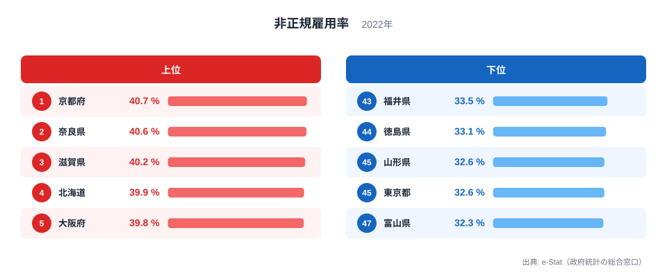
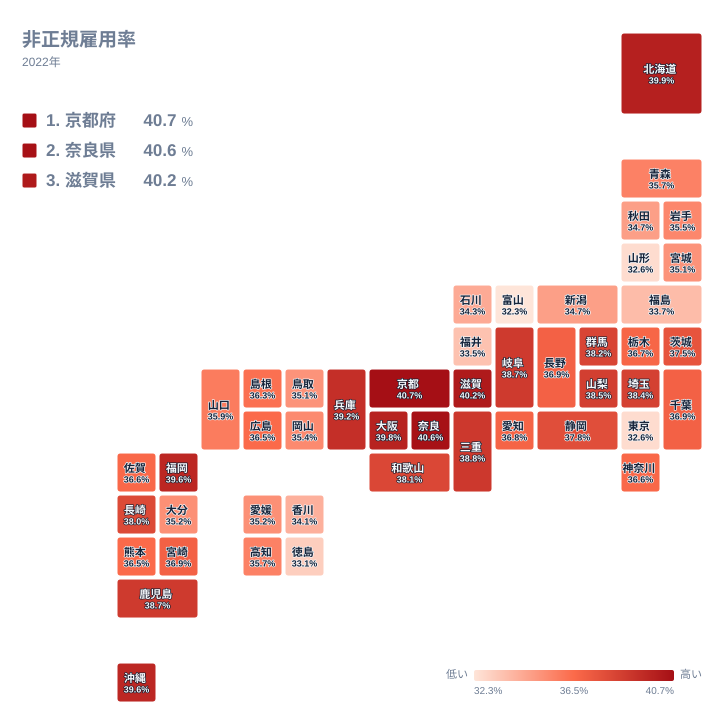

非正規雇用率は、パートやアルバイト、契約社員、派遣社員など、正社員以外の形で働く人が雇用者全体に占める割合を示す指標です。同じ日本でも、この割合は都道府県によって大きく異なります。2022年のデータでは、最も高い京都府が40.7%であるのに対し、最も低い富山県は32.3%にとどまっています。

上位には近畿地方の府県と北海道が並び、下位には製造業が盛んな北陸の県や、人口が集中する東京都が並びます。この記事では、なぜ近畿と北海道で非正規雇用率が高くなり、なぜ北陸や東京都では低くなるのかを、産業構造や地域の特徴から読み解いていきます。

> [!NOTE]
> 非正規雇用率の分母は雇用者数であり、自営業者や家族従業者は含みません。パート・アルバイト・契約社員・派遣社員などが正社員以外に区分され、この合計が雇用者全体に占める割合として集計されています。分子と分母のどちらも「働いている人」に限られている点に注意してください。

## 非正規雇用率の上位と下位

<source-link href="/ranking/non-regular-employment-rate">非正規雇用率ランキングをもっと見る</source-link>

上位5県を見ると、1位の京都府が40.7%、2位の奈良県が40.6%、3位の滋賀県が40.2%、4位の北海道が39.9%、5位の大阪府が39.8%となっています。このうち京都府、奈良県、滋賀県、大阪府の4府県は近畿地方に属しており、8位の兵庫県、9位の三重県も同じく近畿地方です。近畿地方の複数の府県がそろって上位に入っていることから、地域全体で非正規雇用率が高い傾向にあるとうかがえます。

一方、下位を見ると、47位の富山県が32.3%、46位の東京都が32.6%、45位の山形県も32.6%、44位の徳島県が33.1%、43位の福井県が33.5%となっています。上位の近畿地方のようなまとまりはなく、北陸、東北、四国、そして首都圏である東京都と、地域的な共通点は見当たりません。上位は特定の地方に集中する一方で、下位は複数の地方に分散しているのが対照的な特徴です。

## 地理でみる非正規雇用率の分布

タイルマップで全国を見渡すと、近畿地方が濃い色で連なっている様子が確認できます。京都府、奈良県、滋賀県、大阪府、兵庫県が隣接しながらそろって高い水準にあることがわかります。北海道も単独で高い値を示しており、近畿地方から離れた場所にもう一つの高い地域があることが見て取れます。

反対に、北陸の富山県と福井県は隣り合って低い水準にあります。東北の山形県、四国の徳島県は、それぞれの地方の中で際立って低いわけではなく、単独で低い値を示しています。東京都は首都圏の中でも唯一の下位にあたる県で、周辺の県とは異なる傾向を示しています。地図全体を見ると、非正規雇用率の高低は「地方」という大きな単位よりも、都道府県ごとの産業構成や都市の性格に左右されている様子がうかがえます。

## なぜ近畿と北海道で高いのか

近畿地方で非正規雇用率が高い背景には、大阪府や京都府に商業やサービス業が集積していることが関係していると考えられます。[仮説] 小売業や飲食業、宿泊業といった業種は、繁忙期や時間帯に応じてパートやアルバイトを活用する場面が多く、こうした産業の比重が大きい地域ほど非正規雇用率が高くなりやすいと考えられます。ただし、この関係を直接示すデータはこの記事の範囲にはないため、仮説として提示するにとどめます。

京都府と奈良県は、観光や商業の集積が大きい地域でもあります。宿泊業や飲食サービス業は季節や曜日によって必要な人手が変動しやすく、こうした産業の特性が非正規雇用率を押し上げている可能性があります。北海道も同様に、農業や漁業、観光業といった季節性の強い産業を抱えており、[仮説] これらの産業構造が近畿地方とは異なる形で非正規雇用率を高めていると考えられます。近畿地方と北海道は地理的には離れていますが、季節や時間帯によって働く人の数を調整しやすい産業の比重が大きいという点で共通していると読み取れます。

## なぜ北陸や東京都で低いのか

富山県と福井県は、いずれも製造業が経済の中心を占める県として知られています。[仮説] 製造業は工場での継続的な生産体制を必要とすることが多く、パートやアルバイトよりも正社員を中心とした雇用形態がとられやすい産業だと考えられます。こうした産業構造の違いが、非正規雇用率を全国でも低い水準に抑えている一因になっている可能性があります。山形県や徳島県についても、地域の主要産業が製造業や農業を中心とした継続的な雇用形態を伴いやすい産業であることが、低い水準につながっているとみられます。

東京都が下位に入っている点は、意外に映るかもしれません。東京都には大企業の本社や専門職の職場が集積しており、こうした職場では正社員としての採用が中心になりやすいと考えられます。[仮説] 一方で、東京都は雇用者の絶対数が非常に多いため、非正規で働く人の実数自体は少なくない可能性があります。率としては低くても、実数としての規模感は別途確認する必要があります。

> [!WARNING]
> このデータは2022年時点の1回の調査に基づく値です。調査年によって対象となる年齢層や集計方法が変わる可能性があるため、他の年の数値と単純に比較する際は注意してください。また、都道府県別の値は産業構成や年齢構成の違いを反映したものであり、雇用環境の良し悪しを直接示すものではありません。

> [!TIP]
> 非正規雇用率が高いことは、必ずしも雇用環境が悪いことを意味しません。学生や家庭の事情で短時間勤務を選んでいる人が多い場合や、観光業のように季節性の高い産業が集積している場合にも率は高くなります。この指標だけで地域の働きやすさを判断せず、産業構成や年齢構成など他の指標とあわせて読むことをおすすめします。

## まとめ

- 非正規雇用率の全国トップは京都府の40.7%、最下位は富山県の32.3%です。
- 上位5位のうち京都府、奈良県、滋賀県、大阪府の4府県は近畿地方に属しています。
- 4位の北海道は近畿地方から離れた場所にありながら、上位5位に入っています。
- 下位5県の富山県、東京都、山形県、徳島県、福井県は特定の地方に偏らず分散しています。
- 富山県と福井県はいずれも製造業が盛んな県で、非正規雇用率は全国でも低い水準となっています。

非正規雇用率に関する統計をさらに詳しく確認したい方は、[同じカテゴリの統計一覧](/category/laborwage)から関連する指標をご覧いただけます。上位に入った[京都府のデータ](/areas/26000)や[奈良県のデータ](/areas/29000)では、他の労働・産業に関する指標も確認できます。

## データ出典

本記事のデータは、e-Stat（政府統計の総合窓口）の2022年調査に基づいています。
