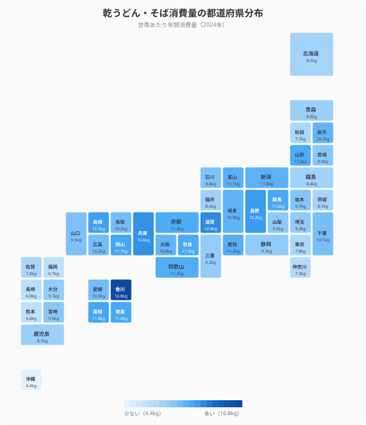
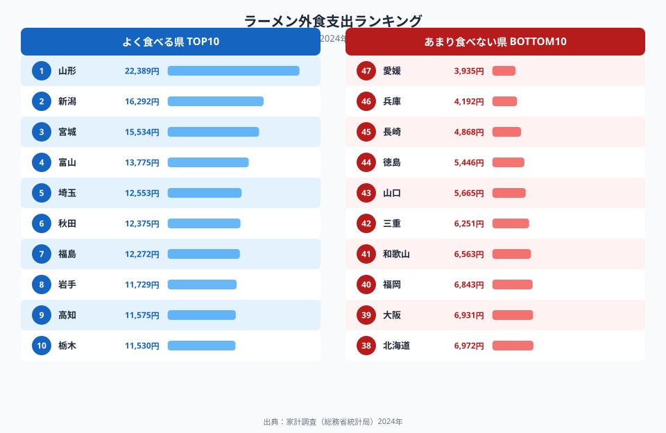
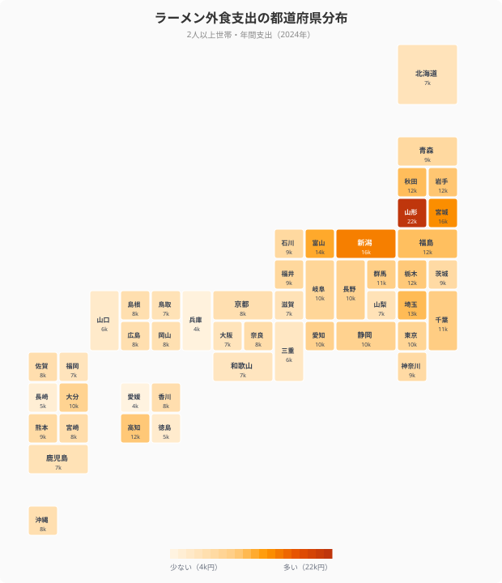
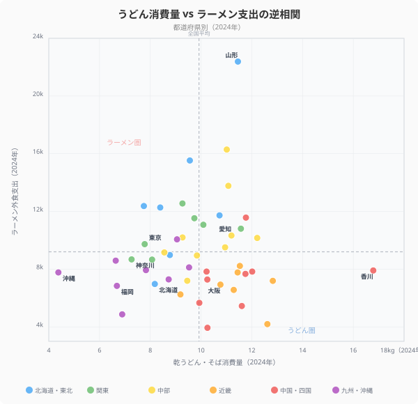
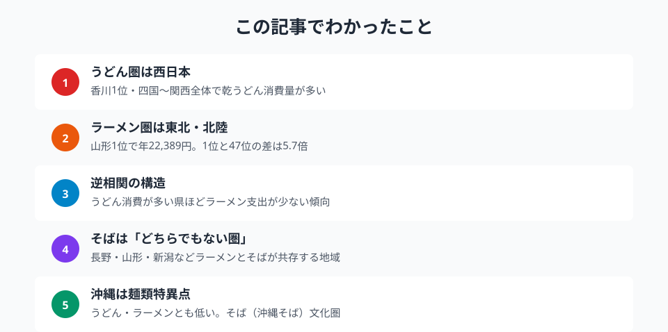

「うどん県といえば香川」は有名ですが、家計調査のデータを見ると、麺類の消費は日本列島を**3つの文化圏**に分割しています。

**西日本のうどん圏**、**東北・北陸のラーメン圏**、そしてその間に広がる**そば圏**。うどんをよく食べる県ほどラーメン支出が少ない──この逆相関を2024年のデータから検証します。

## うどん圏は香川だけではない

乾うどん・そば消費量で47都道府県を比較すると、**1位は[香川県](/areas/37000)**（16,788g）。全国平均（9,918g）の約1.7倍です。

しかし、上位に入るのは香川だけではありません。**2位は滋賀県**（12,827g）、**3位は兵庫県**（12,615g）、**4位は長野県**（12,213g）と続きます。四国・関西・中部にかけた西日本全体でうどん消費が多い傾向が見えます。

一方、最下位は**[沖縄県](/areas/47000)**（4,378g）。沖縄そばは「乾めん」に分類されないため、データには反映されていません。最下位近くには**熊本県**（46位・6,638g）、**福岡県**（45位・6,686g）と九州の県が並びます。

<data-source url="https://www.e-stat.go.jp/dbview?sid=0003084609" label="e-Stat 家計調査（2024年）"></data-source>

> [!NOTE]
> 「乾うどん・そば消費量」は2人以上世帯における乾めん（袋入りうどん・そば）の年間購入量（g）。外食や生うどんは含まない。

<source-link href="/ranking/fresh-udon-soba-consumption-quantity">乾うどん・そば消費量ランキング</source-link>

## ラーメン圏は東北・北陸が席巻する

ラーメン外食支出でみると、**1位は[山形県](/areas/06000)**（22,389円）。**2位は新潟県**（16,292円）、**3位は宮城県**（15,534円）、**4位は富山県**（13,775円）と、東北・北陸が上位を独占します。

最下位は**愛媛県**（3,935円）。1位山形と47位愛媛の差は**5.7倍**にのぼります。

<data-source url="https://www.e-stat.go.jp/dbview?sid=0003084609" label="e-Stat 家計調査（2024年）"></data-source>

東北でラーメンが根付いた背景には、冬の厳しい寒さのなかで体が温まる汁物文化が発達したことが挙げられます。山形の「山形ラーメン」（鶏ガラ醤油）、喜多方・仙台・燕三条など、東日本には独自のラーメン文化が根付いています。

> [!NOTE]
> ラーメン外食支出（家計調査）は1世帯当たり年間金額。山形県22,389円は全国平均（約9,400円）の約2.4倍。最下位の愛媛県3,935円と比べると5.7倍差になる。外食支出のため「ラーメン屋の多さ・通う頻度」を反映する指標だ。

下位には**愛媛**（47位）、**兵庫**（46位・4,192円）、**長崎**（45位・4,868円）と西日本の県が並びます。うどん圏と鏡のように逆転しています。

<source-link href="/ranking/ramen-dining-consumption-expenditure">ラーメン外食支出ランキング</source-link>

<ad-slot></ad-slot>

## そば圏はうどんとラーメンが「共存」する

うどん・そば外食支出を見ると興味深い構造が浮かびます。**1位は香川県**（16,156円）ですが、**2位はなんと山形県**（12,795円）です。

山形県はラーメン支出1位でありながら、うどん・そば外食支出でも2位。**ラーメンとそばが両立するハイブリッド県**です。長野県もそば消費が多く、ラーメン支出も中位と、麺類全般への高い需要を持ちます。

| 指標 | 山形県 | 香川県 |
|---|---|---|
| ラーメン外食支出 | **1位**（22,389円） | 39位（4,986円） |
| うどん・そば外食支出 | **2位**（12,795円） | **1位**（16,156円） |
| 乾うどん・そば消費支出 | 3位（3,752円） | 1位（4,182円） |

<data-source url="https://www.e-stat.go.jp/dbview?sid=0003084609" label="e-Stat 家計調査（2024年）"></data-source>

<source-link href="/ranking/soba-udon-dining-consumption-expenditure">うどん・そば外食支出ランキング</source-link>

## うどん圏とラーメン圏は逆相関する

各都道府県の「乾うどん消費量」と「ラーメン外食支出」を散布図で比較すると、**右下がりの逆相関**が明確に現れます。

<data-source url="https://www.e-stat.go.jp/dbview?sid=0003084609" label="e-Stat 家計調査（2024年）"></data-source>

散布図を4象限に分けると：

- **左上（ラーメン高・うどん低）**: 山形・宮城など東北。ラーメン消費が突出して多い
- **右下（うどん高・ラーメン低）**: 香川・兵庫など西日本。うどん消費が多く、ラーメンは少ない
- **右上（両方多い）**: ほぼ空の象限。どちらかが圧倒的に多い傾向
- **左下（両方少ない）**: 沖縄・長崎など。どちらの麺文化も強くない地域

東北の「ラーメン圏」と関西・四国の「うどん圏」は、食文化が対極に位置していることが数字で裏付けられます。

<ad-slot></ad-slot>

## なぜ麺文化は分かれるのか

この地域差の背景には、いくつかの要因があります。

**うどん圏（西日本）**: 瀬戸内〜近畿は古くから小麦の産地で、製粉・製麺業が発達しました。特に讃岐（香川）は江戸時代から製麺業が盛んで、「讃岐うどん」として全国に広まりました。関西では「うどんだし文化」が根付き、昆布・薄口醤油を使ったあっさりした汁が日常食に溶け込んでいます。

**ラーメン圏（東北・北陸）**: 厳しい冬と高いカロリー需要が、濃厚な汁麺文化を育てました。山形・喜多方（福島）・燕三条（新潟）など、東日本には独自の「ご当地ラーメン」が多く、外食文化として根付いています。

**沖縄の特異性**: 沖縄はうどんもラーメンも少ないですが、「沖縄そば」という独自の麺文化があります。豚骨・かつおだしの沖縄そばは家計調査の「乾めん」に含まれないため、今回のデータには反映されていません。

## まとめ

2024年の家計調査から、日本の麺類消費は地域ごとに大きく異なります。

うどん消費量は香川県が全国平均の1.7倍で圧倒的1位ですが、近畿・四国全体でも高い水準が続きます。対照的に、ラーメン外食支出は山形県が22,389円と全国平均の2.4倍に達し、東北・北陸が上位を独占します。

この2つの指標が逆相関する構造は、日本列島の麺文化が「うどん圏（西）」と「ラーメン圏（東北・北陸）」に分かれていることを示しています。山形県はラーメン1位でありながらそば外食2位という麺類大国。地域の食文化は単純な東西対立ではなく、重層的な構造を持っています。

<source-link href="/ranking/fresh-udon-soba-consumption-quantity">乾うどん・そば消費量ランキング</source-link>
<source-link href="/ranking/ramen-dining-consumption-expenditure">ラーメン外食支出ランキング</source-link>

<site-link category="economy"></site-link>

## データ出典

本記事のデータはe-Stat（政府統計の総合窓口）を基に作成しています。
