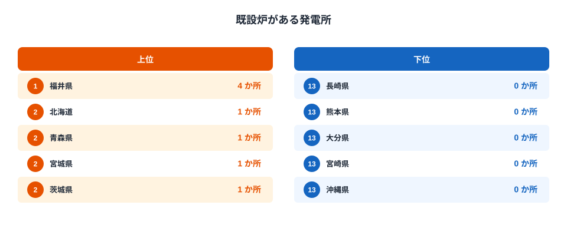
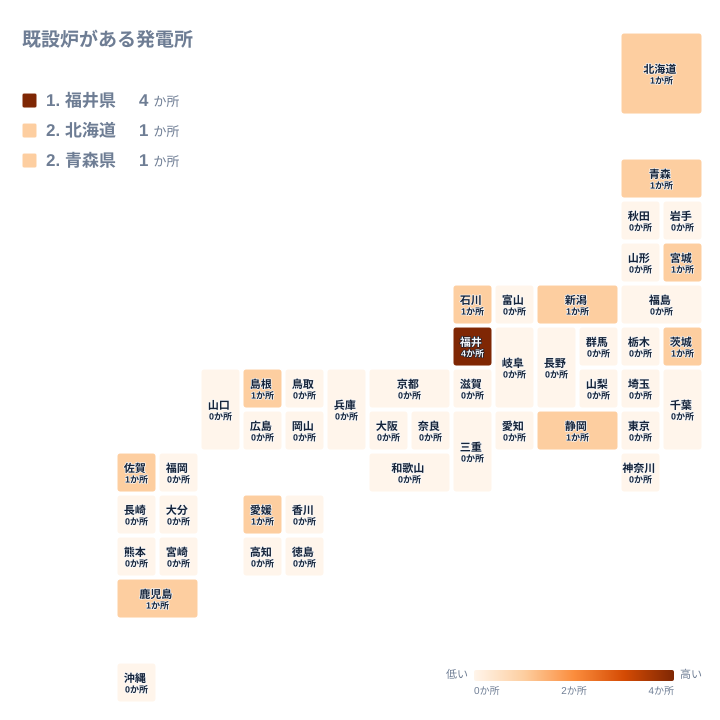

原子力発電所は、日本のどこにでも建てられているわけではありません。国土数値情報の2013年データによると、原子力発電所が立地する都道府県はわずか14で、残る33の都道府県には1か所も立地していません。全体の7割にあたる都道府県が0か所という、極端に偏った分布になっています。

1位は福井県で、4か所の原子力発電所が立地しています。2位は青森県、3位は福島県で、いずれも3か所です。この上位3県だけで全国の原子力発電所の3割以上を占めています。一方で、東京都や大阪府、愛知県といった大都市を抱える都道府県は、いずれも0か所です。この記事では、なぜ立地がこれほど偏るのか、そして0か所という結果がどのような意味を持つのかを、地理と歴史の両面から見ていきます。

## 上位県はどこに集中しているのか

<source-link href="/ranking/nuclear-power-plant-count">原子力発電所数ランキングをもっと見る</source-link>

上位を見ると、福井県が4か所で最も多く、青森県と福島県がともに3か所で続きます。4位以下は北海道、宮城県、茨城県、新潟県、石川県、静岡県、島根県、山口県、愛媛県、佐賀県、鹿児島県がそれぞれ1か所ずつという構成です。上位14県はすべて海に面した県であり、原子力発電所が内陸に建てられた例は1つもありません。原子炉を冷却するために大量の海水を安定して取り込める立地が、選定の前提条件になっていたことがうかがえます。

さらに注目したいのは、上位14県の中に近畿・中部・九州の大都市圏を抱える県が1つも入っていない点です。[仮説] 大消費地から離れた沿岸部に立地させ、送電線で電力を運ぶという発想が、1960年代から1980年代にかけての立地選定を貫いていた可能性があります。福井県の若狭湾沿岸や青森県の下北半島、福島県の浜通りは、いずれも大都市圏から離れた海沿いの地域であり、この傾向と符合します。ただしこの記事のデータだけでは立地決定の経緯そのものは分からないため、断定はできません。

## 立地条件から見る偏りの背景

原子力発電所の立地には、冷却水の確保に加えて、地盤の安定性や活断層からの距離といった地質条件も関わってきます。上位県の多くは、リアス式海岸や砂丘海岸など、比較的まとまった平坦地を沿岸部に確保しやすい地形を持っています。福井県の若狭湾は日本海側でも有数の入り江が連なる地域で、静岡県の御前崎や島根県の島根半島も同様に、発電所の建屋や冷却設備を設置しやすい沿岸の地形を持っています。

一方で、同じ沿岸県であっても、和歌山県や高知県、宮崎県のように太平洋に面していながら0か所の県も多く存在します。[仮説] これらの県では、活断層の分布や台風・高波への曝露、既存の漁業権との調整など、地形以外の要因が立地を難しくした可能性がありますが、この記事の元データだけでは特定できません。海に面していることは立地の必要条件ではあっても、十分条件ではなかったと考えるのが妥当です。

[福井県のデータ](/areas/18000)を見ると、若狭湾沿岸に複数の発電所が集積してきた経緯がうかがえます。同様に[青森県のデータ](/areas/02000)では、下北半島の先端部という本州最北の立地が、大消費地からの距離を保ちながら海水を確保できる条件を満たしていたことが読み取れます。

## 地理分布で見る空白地帯

タイルマップで全国を見渡すと、原子力発電所が立地する県は日本海側の北陸から山陰にかけての帯と、東北から九州にかけての太平洋・瀬戸内海沿岸に点在していることが分かります。特に目立つのは、近畿地方の2府4県、四国の4県のうち愛媛県を除く3県、九州7県のうち佐賀県と鹿児島県を除く5県がすべて0か所である点です。関東地方でも、茨城県以外の6都県はすべて0か所です。

近畿・四国・九州の多くの県が0か所である背景には、[仮説] 人口密度の高さや、既存の火力発電所・水力発電所への依存度の高さが影響した可能性があります。大阪府や兵庫県のように工業地帯を抱える県では、避難計画の観点から人口集中地域への近接立地が避けられたと考えられますが、この点も本データからは検証できません。もう1つ目立つのは沖縄県です。沖縄県は本州・四国・九州の電力系統から独立した孤立系統を長く維持してきた歴史があり、他県と送電線でつながっていない特殊な事情が、原子力発電所の立地対象から外れてきた一因になっている可能性があります。

内陸県がすべて0か所である点は、冷却水を大量に確保しにくいという地理的制約から見て自然な結果です。栃木県、群馬県、埼玉県、山梨県、長野県、岐阜県、滋賀県、奈良県はいずれも海に面しておらず、そもそも原子力発電所の立地候補になりにくい条件を持っています。

## まとめ

- 原子力発電所が立地する都道府県は14にとどまり、33の都道府県は0か所です。
- 1位は福井県で4か所、2位は青森県、3位は福島県でともに3か所です。
- 立地する14県はすべて沿岸県で、内陸県への立地は1件もありません。
- 東京都や大阪府、愛知県など大都市を抱える都道府県はすべて0か所です。
- 沿岸県であっても和歌山県や高知県のように0か所の県が多く、海に面していることだけでは立地条件を説明できません。

## データ出典

原子力発電所数の出典は国土数値情報（国土交通省）で、集計年は2013年です。

> [!NOTE]
> ここでの「か所」は原子力発電所の敷地(サイト)の数を数えたものです。1つのサイトの中に複数の原子炉(号機)がある場合でも、まとめて1か所として数えています。福井県の4か所には、敦賀・美浜・大飯・高浜といった複数の発電所が含まれており、号機の合計数とは一致しません。

> [!WARNING]
> このデータは2013年時点で存在した施設の敷地数を示すもので、その時点で稼働していたかどうかは表していません。2011年の東京電力福島第一原子力発電所の事故後も、福島県は敷地としては3か所のまま集計されており、稼働状況の変化はこのランキングには反映されていません。

> [!TIP]
> 0か所の県が33にのぼるのは、危険性が低いからではなく、冷却水の確保や送電距離、地質条件といった立地条件が満たされなかった、あるいは立地計画自体が持ち上がらなかった結果です。「多い=リスクが高い」「0=安全」という単純な読み方はせず、地理的な立地条件の違いとして捉えることをおすすめします。

同じカテゴリの統計を横断して比較したい場合は、[同じカテゴリの統計一覧](/category/energy)もあわせてご覧ください。
