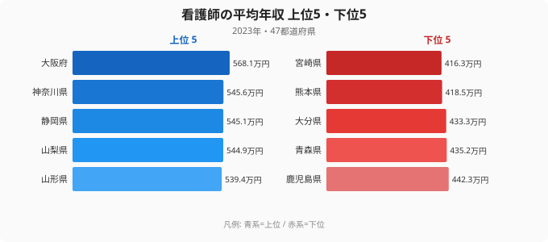
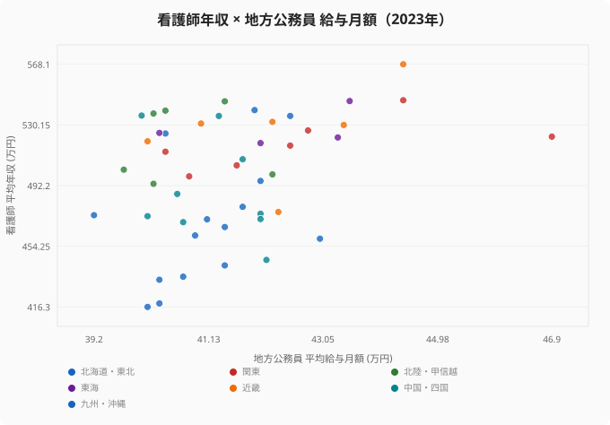
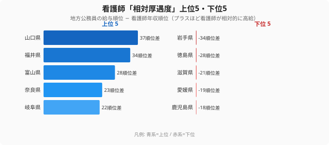

「年収の高い県で働けば、看護師の給料も高いはず」──転職や移住を年収軸で考えるとき、多くの人がまずこう考えます。ところが47都道府県のデータを並べると、その直感はあっさり裏切られます。

2023年の賃金構造基本統計調査によると、看護師の平均年収が最も高いのは**大阪府の568.1万円**。最も低い**宮崎県の416.3万円**との差は151.8万円、倍率にして約1.4倍（1.36倍）にのぼります。同じ国家資格で同じ仕事をしても、働く県が違うだけで年収が150万円変わる──これだけでも転職先選びの判断材料になります。

しかし本当に意外なのは順位の中身です。一般に「給料の高い都市」と聞いて真っ先に浮かぶ**東京は、看護師年収では17位**。県全体の賃金水準では全国トップなのに、看護師に限ると平均以下に沈みます。逆に**山口・福井・富山**のように、県の賃金水準は下位なのに看護師年収は上位という県が並びます。この記事では「看護師の年収はどの県で高いのか」「なぜ県全体の賃金水準とずれるのか」を、データで分解していきます。

## 看護師年収は大阪が1位、九州の県が下位に沈む

まず2023年の看護師平均年収を、上位5県と下位5県で見てみましょう。

上位は**大阪府（568.1万円）・神奈川県（545.6万円）・静岡県（545.1万円）・山梨県（544.9万円）・山形県（539.4万円）**と続きます。大都市圏の大阪・神奈川が並ぶのは想像どおりですが、3位の静岡、4位の山梨、5位の山形と、必ずしも「大都市＝上位」ではない顔ぶれが早くも顔を出しています。47県の中央値は504.9万円、平均は499.3万円なので、上位県はそこから40〜70万円ほど上振れしている水準です。

一方、下位5県は**宮崎県（416.3万円）・熊本県（418.5万円）・大分県（433.3万円）・青森県（435.2万円）・鹿児島県（442.3万円）**。九州・東北の県が目立ちます。最下位の宮崎と中央値の差は約90万円、トップの大阪との差は前述のとおり150万円超です。転職で年収を上げたいなら、この上下の地図がそのまま「狙い目」と「避けたい水準」を示しています。1位の[大阪府の地域プロフィール](/areas/27000)や、最下位[宮崎県の地域プロフィール](/areas/45000)で、賃金以外の暮らしの指標も合わせて確認しておくと、転職先の解像度が上がります。

<source-link href="/ranking/nurse-annual-income">看護師の平均年収ランキング（47都道府県・全件）を見る</source-link>

> [!NOTE]
> ここでの「年収」は賃金構造基本統計調査の「きまって支給する現金給与額（月額）×12＋年間賞与」で算出した推計値です。実際の手取りではなく、税・社会保険料を引く前の額面ベースです。施設の種類（大病院・クリニック・訪問看護）や夜勤回数の違いは平均にならされているため、個人の実年収はこの数字から上下に振れます。

## なぜ県全体の賃金水準と一致しないのか

ここからが本題です。「看護師年収が高い県」は「県全体の給料が高い県」と同じなのでしょうか。比較対象として、各県の**地方公務員の平均給与月額**（地方公務員給与実態調査）を横軸に取り、看護師年収を縦軸に取った散布図を見てください。地方公務員の給与は、その地域の標準的な賃金水準を映す指標としてよく使われます。

もし両者が完全に連動するなら、点はきれいに右肩上がりの一直線に乗るはずです。ところが実際の相関係数は **r = 0.355** と、弱いプラスにとどまります。ゆるやかに「賃金水準が高い県ほど看護師も高め」の傾向はあるものの、点はかなりばらついています。つまり**看護師の年収は、県全体の賃金水準だけでは説明できない**のです。

象徴的なのが東京です。地方公務員の給与月額は東京が全国1位（47県を高い順に並べたときの順位、以下同じ）ですが、看護師年収は17位（522.8万円）。県の賃金水準のトップが、看護師に限ると平均並みまで落ちます。逆に山口県は地方公務員給与が45位と下位なのに、看護師年収は8位（536万円）。**県の一般的な賃金が高いことと、看護師が高給であることは別の話**だとデータが告げています。

> [!WARNING]
> 散布図の横軸（地方公務員の給与月額）と縦軸（看護師年収）は、調査も対象も異なる別系列の指標です。横軸は地方公務員給与実態調査、縦軸は賃金構造基本統計調査で、片や月額・片や年額を換算しています。ここで読み取れるのは「順位の傾向がどれだけずれるか」であって、両者を足し引きした金額には意味がありません。相関が弱い＝**因果ではなく、別々の要因で決まっている**という解釈にとどめてください。

看護師年収が県の賃金水準とずれる主な理由は、看護師の給与の作られ方にあります。看護師の給料は基本給だけでなく、**夜勤手当・地域手当・需給バランスによる上乗せ**で大きく動きます。夜勤の多い急性期病院が多い地域、看護師が慢性的に不足していて病院が高い手当で奪い合う地域では、県全体の賃金水準とは無関係に年収が押し上げられます。だからこそ、県の平均年収ランキングとは別の地図が描かれるのです。

## 「看護師が相対的に厚遇される県」はどこか

この「ずれ」を1枚で見えるようにしたのが次の図です。各県について**地方公務員給与の順位から看護師年収の順位を引いた差**（プラスほど、県の賃金水準のわりに看護師が高給）を計算し、上位5県と下位5県を並べました。

「看護師が相対的に厚遇される」上位は**山口県（+37）・福井県（+34）・富山県（+28）・奈良県（+23）・岐阜県（+22）**。たとえば山口県は地方公務員給与が45位なのに看護師年収は8位で、順位差は実に37。県の賃金水準は全国でも低いほうなのに、看護師に限れば全国トップクラスという、転職者にとっては見逃せない「お得」な県です。北陸の富山・福井が並ぶのも、看護師の手当水準や需給が効いている可能性を示します。

逆に下位は**岩手県（−34）・徳島県（−28）・滋賀県（−21）・愛媛県（−19）・鹿児島県（−18）**。岩手県は地方公務員給与が7位と高めなのに、看護師年収は41位。県全体は決して低賃金ではないのに、看護師に限ると下位に沈みます。これらの県では「県の平均年収は悪くないのに、看護師の取り分は薄い」という構図が起きています。

<source-link href="/ranking/nurse-annual-income">看護師の平均年収ランキング（47都道府県・全件）を見る</source-link>

> [!TIP]
> 転職先を年収だけで選ぶなら、「看護師年収そのものが高い県」（大阪・神奈川・静岡）と、「県の物価・家賃が安いのに看護師年収は上位の県」（山口・福井・富山）は意味が違います。前者は額面が大きく、後者は手取りの実質価値（可処分所得）で得をしやすい県です。額面ランキングと、物価・家賃を考えた実質の両方で見ると、狙い目が変わってきます。

## 額面の差は、生活コストを引いて初めて「実質」になる

ここまで見たのはすべて額面の年収です。実際の暮らしやすさは、そこから家賃・物価を引いた「手元に残る額」で決まります。大阪が額面1位でも、家賃や生活費が高ければ実質の余裕は目減りします。逆に山口・富山のように看護師年収が上位で生活コストが相対的に低い県は、同じ額面でも手取りの実質価値が高くなりやすい組み合わせです。

つまり看護師の転職・移住を年収軸で考えるなら、見るべきは2つあります。ひとつは**この記事の額面ランキング**（どの県で給料が高いか）、もうひとつは**その県の生活コスト**（その給料がどれだけ残るか）。両者を重ねて初めて、「年収で得をする県」が浮かび上がります。賃金まわりの他の指標は[労働・賃金カテゴリの一覧](/category/laborwage)から、職種ごとの年収差を横断的に見比べられます。

> [!NOTE]
> 本記事の年収は2023年時点の推計値で、各県とも年によって順位が入れ替わります。賃金構造基本統計調査はサンプル調査のため、都道府県によっては看護師の標本数が少なく、単年の数字は振れやすい点に注意してください。傾向を見るときは複数年の動きと合わせて読むのが安全です。

## まとめ

- 2023年の看護師平均年収は**1位 大阪府（568.1万円）**、最下位 宮崎県（416.3万円）で**約1.4倍（1.36倍）の差**。上位は大阪・神奈川・静岡・山梨・山形。
- 下位は**宮崎・熊本・大分・青森・鹿児島**と九州・東北に集中。47県の中央値は504.9万円。
- 看護師年収と県全体の賃金水準（地方公務員給与）の相関は **r = 0.355** と弱く、両者は別々の要因で決まる。**給与水準1位の東京は看護師では17位**。
- 「看護師が相対的に厚遇される県」は**山口・福井・富山・奈良・岐阜**。逆に岩手・徳島・滋賀は県の賃金は高めでも看護師の取り分が薄い。
- 看護師年収は夜勤手当・地域手当・需給で決まるため、県の平均年収ランキングとは別の地図になる。転職は額面ランキングと生活コストの両面で見るのが得策。

## データ出典

- 看護師の平均年収: 厚生労働省「賃金構造基本統計調査」（2023年）。e-Stat 経由で整備（きまって支給する現金給与額×12＋年間賞与で算出した推計値）。
- 地方公務員の平均給与月額: 総務省「地方公務員給与実態調査」（2023年）。
