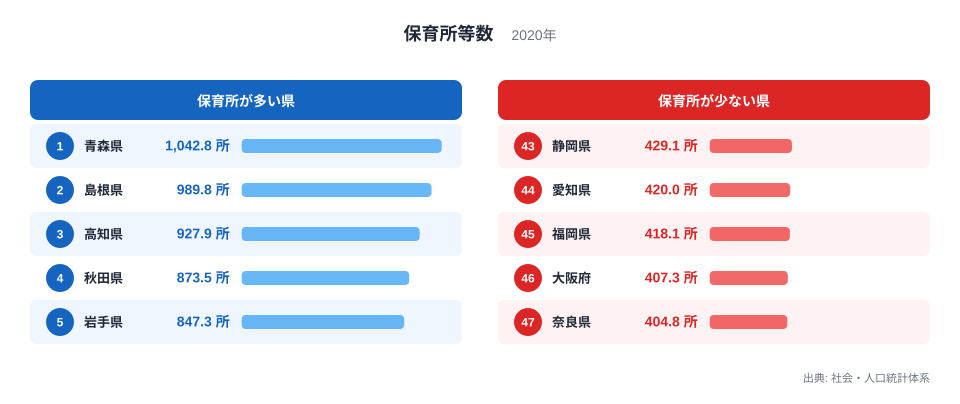
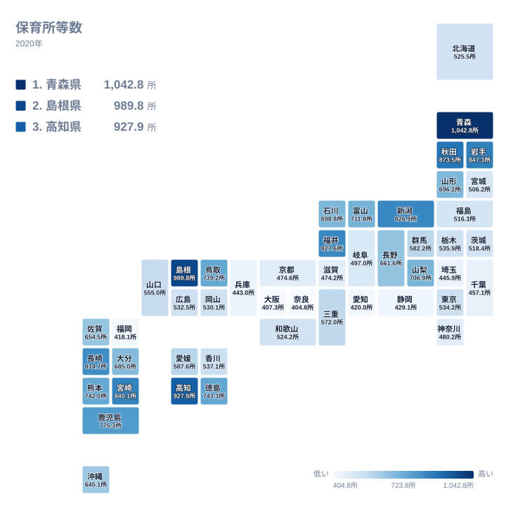

保育園を考えるとき、多くの保護者がまず気になるのが「本当に入れるのか」という不安です。2024年の全国の待機児童数は2,567人と過去最少を更新し、16県が待機児童ゼロを達成しました。この結果だけを見ると「保育園問題はもう解決した」ように思えるかもしれません。

しかし「待機児童ゼロ」という数字は、保育園そのものの数が地域によってどれだけ違うのかまでは教えてくれません。人口10万人（0〜5歳）あたりの保育所等数で都道府県を比べると、1位の青森県と最下位の奈良県の間には2.6倍の開きがあります。しかも下位に並ぶのは大阪・奈良・福岡・愛知といった大都市圏で、待機児童数が全国最多の東京都は意外にも中位にとどまっています。この記事では「保育所がどれだけあるか」という供給密度の切り口から、地域によってどれだけ差があるのかを見ていきます。ただし供給密度と実際の入園しやすさはイコールではないため、両者の違いも合わせて確認します。

## 保育所の数は青森が1位、都市部ほど少ない

人口10万人（0〜5歳）あたりの保育所等数は、1位が青森県の1,042.8所、2位が島根県の989.8所、3位が高知県の927.9所でした。上位10県のうち3県が東北、3県が九州で、人口減少が進む地方圏ほど子どもの数に対する保育所の数が多いという傾向が読み取れます。

一方で最も少ないのは奈良県の404.8所で、46位の大阪府407.3所、45位の福岡県418.1所、44位の愛知県420所、43位の静岡県429.1所と続きます。1位の青森県と比べると2.6倍の差です。下位に共通するのは、いずれも人口が多く都市化が進んだ府県だという点です。子どもの数そのものが多いぶん、人口当たりの保育所数では地方圏に届かない構図になっています。

> [!NOTE]
> このランキングの数値は「人口10万人（0〜5歳）あたりの保育所等数」であり、実際の施設数そのものではありません。青森県の1,042.8所は人口当たりに換算した密度であって、県内に保育所が1,000カ所以上あるという意味ではない点にご注意ください。

<source-link href="/ranking/nursery-count-per-100k-0-5">保育所等数ランキングをもっと見る</source-link>

## 地図で見る保育所密度、近畿・南関東・東海に集中する「少ない県」

地図で見ると、保育所密度が低い下位10県のうち5県が近畿地方（奈良・大阪・兵庫・京都・滋賀）に集中していることがわかります。残りは南関東2県（千葉・埼玉）、東海2県（愛知・静岡）、九州1県（福岡）で、いずれも人口密集地を抱える都市圏です。次の節では、この分布が人口密度とどこまで対応しているのかをデータで確認します。

> [!WARNING]
> 保育所密度は施設の「供給量」を示す指標であり、実際に入所できるかどうかを示す待機児童数とは別の指標です。たとえば東京都は保育所密度こそ28位で中位ですが、2024年の待機児童数は361人と全国最多でした。密度が低くても待機児童ゼロの県があり、密度が高くても待機児童が出る県もあります。両方を合わせて見ることで実態に近づけます（[待機児童数ランキングの記事](/blog/waiting-children-progress)もあわせてご覧ください）。

## なぜ大阪・奈良は東京より保育所が少ないのか

東京都の保育所等数は534.2所で47県中28位です。大阪府は407.3所で46位、奈良県は404.8所で47位にとどまり、東京は大阪・奈良より1.3倍ほど保育所等数が多いことになります。待機児童数では東京が全国で最も多いにもかかわらず、人口当たりの保育所の数では大阪・奈良の方が少ないという、直感とは逆の結果です。

この差を[人口密度ランキング](/ranking/population-density-per-km2-total-area)と突き合わせると、単純な「人口密度が高いほど保育所が少ない」という説明では足りないことがわかります。愛知県は人口密度5位・保育所等数44位、福岡県は人口密度7位・保育所等数45位と、人口密度の高さと保育所の少なさが対応しています。一方で奈良県は人口密度15位で348.1人/km²、静岡県は人口密度13位で453.5人/km²と、人口密度そのものは東京・大阪ほど突出していないにもかかわらず、保育所等数はそれぞれ47位・43位と全国最下位クラスです。人口密度だけでは説明しきれない要因があることになります。

> [!TIP]
> [仮説] 奈良県や静岡県のように人口密度が突出していない県で保育所等数が少ないのは、大阪・東京への通勤者が多いベッドタウン構造や、保育所用地の確保しやすさが影響している可能性があります。この点は人口密度データだけでは検証できておらず、今後の検証課題です。

[奈良県](/areas/29000)や[大阪府](/areas/27000)に住む、またはこれから住もうとしている子育て世帯にとっては、待機児童数だけでなく保育所の絶対的な少なさも念頭に置いておく価値があります。逆に[青森県](/areas/02000)のように保育所密度が高い地域では、人口減少により子どもの数自体が少なく、施設の維持や保育士確保という別の課題を抱えている場合もあります。

> [!TIP]
> 自分が住む、あるいは移住を検討している県の実際の「入りやすさ」を知りたい場合は、保育所等利用率（定員に対する充足度）や待機児童数もあわせて確認するのがおすすめです。あわせて見る: [保育所等利用率ランキング](/ranking/nursery-utilization-rate) / [待機児童数の記事](/blog/waiting-children-progress)

## まとめ

- 保育所等数（人口10万人・0〜5歳あたり）は青森県が1,042.8所で全国1位
- 最下位は奈良県の404.8所で、1位との差は2.6倍
- 下位10県のうち5県が近畿地方に集中し、南関東・東海・九州の都市圏が続く
- 待機児童数が全国最多の東京都は、保育所密度では28位と中位にとどまる
- 保育所密度と待機児童数は別の指標であり、両方を確認することで地域の実態がより正確に見える

## データ出典

本記事のデータは総務省統計局「社会・人口統計体系」（e-Stat）の保育所等数（2020年度）を基に作成しています。出典: https://www.stat.go.jp/data/ssds/index.htm
